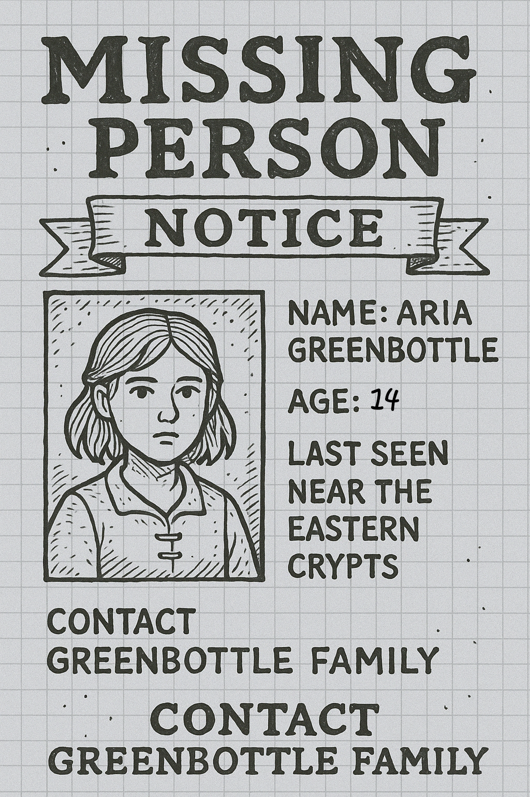
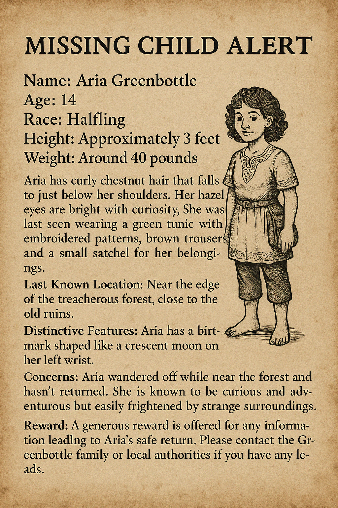
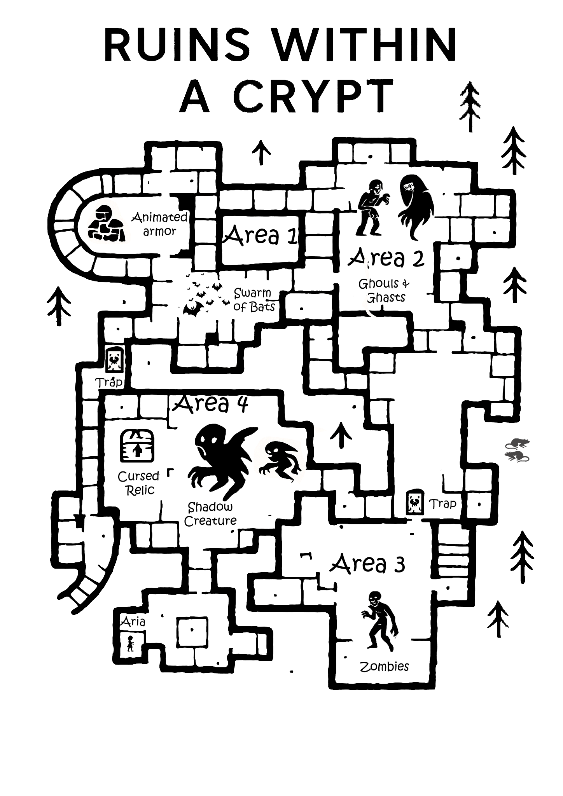

# A Criança Perdida

| Português (PT-PT) | English (EN-US) |
|-------------------|-----------------|
| **📅 Data:** 2025-04-24 **📠Localização:** Cidade Livre de Greyhawk e Ruínas das Sombras a norte (perto das terras de Iuz) | **📅 Date:** 2025-04-24 **📠Location:** Free City of Greyhawk and Shadow Ruins to the north (near the lands of Iuz) |
| **📝 Descrição:** O grupo é contratado para investigar o desaparecimento de Aria Greenbottle. Após recolher pistas da família e do diário secreto, seguem pelas ruínas ao norte de Greyhawk. A aventura envolve evitar armadilhas, derrotar mortos-vivos e solucionar enigmas. Confrontam bosses na cripta, resgatam Aria abalada e recuperam a Gema das Cinco Vozes, objeto misterioso entregue ao taberneiro. | **📝 Description:** The group is hired to investigate the disappearance of Aria Greenbottle. After gathering clues from her family and secret diary, they head to the northern ruins of Greyhawk. The adventure involves avoiding traps, defeating undead, and solving puzzles. They confront bosses in the crypt, rescue a shaken Aria, and recover the mysterious Gem of Five Voices, which is delivered to the barkeeper. |
| **🎲 Jogadores:** Daniel, Fábio Oliveira, Vasco Almeida, Luís Henriques, Rafael Mesquita | **🎲 Players:** Daniel, Fábio Oliveira, Vasco Almeida, Luís Henriques, Rafael Mesquita |
| **🧙‍♂️ PCs:** Markus Grimm, Raylahn, Bok Thunderfist, Drayl Bharash, Wagner | **🧙‍♂️ PCs:** Markus Grimm, Raylahn, Bok Thunderfist, Drayl Bharash, Wagner |
| **👥 NPCs:** Aria, Tobias, Eliza, Finn Greenbottle, guarda da cidade, taberneiro | **👥 NPCs:** Aria, Tobias, Eliza, Finn Greenbottle, city guard, barkeeper |
| **👥 NPCs Importantes:** - Aria Greenbottle: Halfling de 14 anos, curiosa, desaparecida; foco da missão. - Tobias Greenbottle: Pai, comerciante, visivelmente esgotado. - Eliza Greenbottle: Mãe, herbalista, incansável na busca. - Finn Greenbottle: Irmão gémeo, olhar determinado, fornece pistas cruciais. - Guarda da Cidade: Confirma a saída de Aria pelo portão norte. - O Taberneiro: Fonte de rumores e contacto. - Inimigos nas ruínas: Armadura Animada, Ghast, Ghoul, Zombie, [Enxame de Morcegos](swarm_of_bats.md), Criatura das Sombras, Espectro, [Enxame de Ratos](swarm_of_rats.md). | **👥 Key NPCs:** - Aria Greenbottle: 14-year-old halfling, curious, missing; mission focus. - Tobias Greenbottle: Father, merchant, visibly exhausted. - Eliza Greenbottle: Mother, herbalist, tireless in her search. - Finn Greenbottle: Twin brother, determined look, provides crucial clues. - City Guard: Confirms Aria’s exit through the north gate. - The Innkeeper: Rumor source and contact. - Ruins enemies: Animated Armor, Ghast, Ghoul, Zombie, [Swarm of Bats](swarm_of_bats.md), Shadow Creature, Specter, [Swarm of Rats](swarm_of_rats.md). |
| **🯠Missão:** - Encontrar e resgatar Aria Greenbottle. - Decifrar pistas (cartaz, alerta, diário/mapa). - Sobreviver aos perigos das ruínas. - Descobrir a natureza da porta escondida e da Gema das Cinco Vozes. | **🯠Mission:** - Find and rescue Aria Greenbottle. - Decipher clues (poster, alert, diary/map). - Survive the dangers of the ruins. - Uncover the nature of the hidden door and the Gem of Five Voices. |
| **📌 Locais & Pistas:** **Casa dos Greenbottle (Mercado de Greyhawk):** Conversa com Tobias e Eliza, interrogatório a Finn, descoberta do diário com mapa. **Ruínas das Sombras (a norte):** Entrada armadilhada (explosão). **Cripta das Sombras:** - Área 1: Armadura Animada, Enxame de Morcegos, armadilha de dardos. - Área 2: Ghast, Ghouls. - Área 3: Zombies, Criatura das Sombras, Enxame de Ratos. - Área 4: Espectro (boss), Criatura das Sombras (boss), relíquia amaldiçoada. | **📌 Locations & Clues:** **Greenbottle House (Greyhawk Market):** Talk with Tobias and Eliza, question Finn, discover diary with map. **Shadow Ruins (north):** Trapped entrance (explosion). **Shadow Crypt:** - Area 1: Animated Armor, Swarm of Bats, dart trap. - Area 2: Ghast, Ghouls. - Area 3: Zombies, Shadow Creature, Swarm of Rats. - Area 4: Specter (boss), Shadow Creature (boss), cursed relic. |
| **📜 Desenrolar da Sessão:** - Aventureiros encontram o cartaz e investigam. - Recolhem pistas da família e diário. - Mantêm-se na estrada principal. - Acionam armadilha na entrada das ruínas. - Usam magia e táticas para avançar. - Confrontam e derrotam bosses finais. - Resgatam Aria. - Entregam a Gema das Cinco Vozes ao Taberneiro. | **📜 Session Summary:** - Adventurers find the poster and investigate. - Gather clues from family and diary. - Stay on main road. - Trigger trap at ruins entrance. - Use magic and tactics to advance. - Face and defeat final bosses. - Rescue Aria. - Hand the Gem of Five Voices to the Innkeeper. |
| **🆠Recompensas & Consequências:** - 100 PO, poções, gratidão da família Greenbottle. - Gema das Cinco Vozes permanece por identificar. - Aria regressa mas abalada. - Rumores crescem sobre os perigos a norte. | **🆠Rewards & Consequences:** - 100 GP, potions, gratitude of the Greenbottle family. - Gem of Five Voices remains unidentified. - Aria returns but shaken. - Growing rumors about dangers to the north. |
| **💰 Loot:** 100 PO, poções, Gema das Cinco Vozes (misteriosa), diário | **💰 Loot:** 100 GP, potions, Gem of Five Voices (mysterious), diary |
| **📂 Ficheiros de origem:** s16_a_crianca_perdida.md, s16_a_crianca_perdida.txt | **📂 Source files:** s16_a_crianca_perdida.md, s16_a_crianca_perdida.txt |

---

### 📷 Imagens & Mapas / Images & Maps

- 
- 
- 
- 
- 

