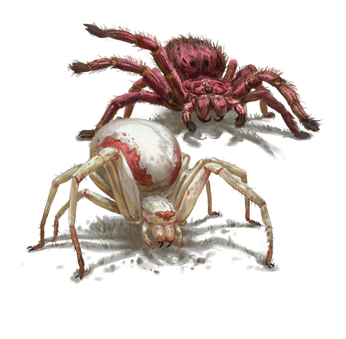

## 🕷️ Aranha Gigante | Giant Spider

Sessão: 2 | Data: (data não especificada) | Fonte: s02.txt | Tags: monstro, aracnídeo

| **Português (PT-PT)** | **English (EN-US)** |
|-----------------------|---------------------|
| **Descrição:** Criatura aracnídea de tamanho descomunal, predadora silenciosa que caça a partir de teias escondidas em locais escuros e húmidos. O seu veneno é potente, capaz de paralisar ou matar presas menores. | **Description:** An enormous arachnid predator that hunts silently from webs hidden in dark, damp places. Its venom is potent, capable of paralyzing or killing smaller prey. |
| **Perigo:** Alta — ataques rápidos, veneno perigoso e mobilidade em superfícies verticais. | **Danger:** High — fast strikes, dangerous venom, and mobility on vertical surfaces. |
| **Comportamento:** Embosca vítimas, usando teias para restringir movimentos antes de atacar. | **Behavior:** Ambushes victims, using webs to restrain movement before attacking. |

