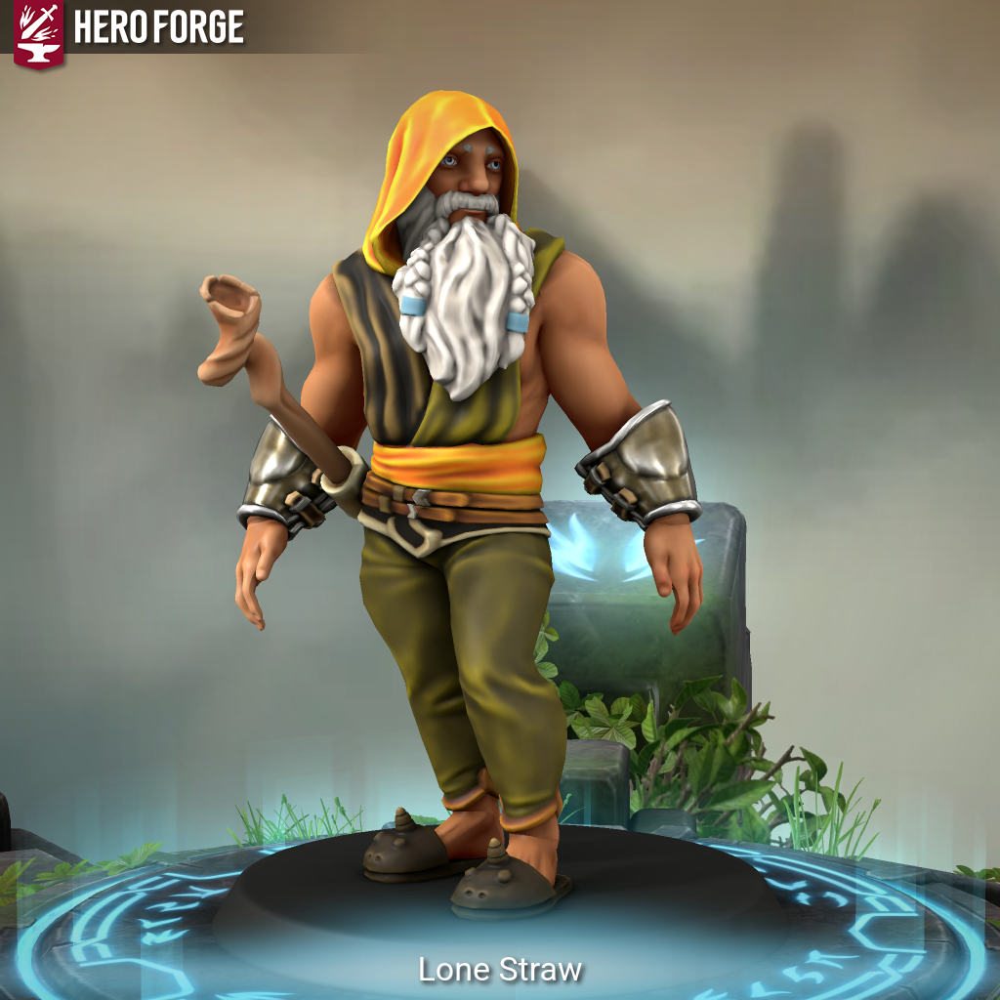

# Lone Straw

| Português (PT-PT) | English (EN-US) |
|-------------------|-----------------|
| **Jogador:** Francisco Pronto **Raça:** Humano **Classe:** Monk **Antecedente:** Nobre **Alinhamento:** Lawful Good **Género:** Masculino **Olhos:** Brancos **Tamanho:** Médio **Altura:** 1,79 m **Cabelo:** Careca **Barba:** Branca e longa, com duas tranças **Pele:** Caucasiano **Idade:** 72 **Nível:** 4 **Sessões:** 1 **Contacto:** +351 916 024 593  **Traços de Personalidade:** Carismático, sente-se como representante legítimo de qualquer cargo que ocupe. Procura sempre retirar o melhor das pessoas com quem interage. As suas palavras são frequentemente ouvidas e apreciadas por serem sábias.  **Ideais:** Justiça e lealdade inabalável para com os seus soberanos.  **Vínculos:** Extremamente leal, nada o fará questionar a autoridade que serve.  **Defeitos:** Perde facilmente a compostura perante injustiças ou quando se sente incompreendido. Vingativo se o seu nome ou corpo forem atacados.  **História:** Descendente de uma linhagem nobre, Lone Straw é respeitado pela sua postura e pelo seu carisma. Sempre trajado com as melhores sedas, mantém o capuz para proteger os pensamentos e nunca sai sem as suas peculiares chinelas de unicórnio. Apesar da sua prática constante de meditação, a sua calma desmorona quando confrontado com injustiça, respondendo com determinação e, por vezes, vingança. | **Player:** Francisco Pronto **Race:** Human **Class:** Monk **Background:** Noble **Alignment:** Lawful Good **Gender:** Male **Eyes:** White **Size:** Medium **Height:** 1.79 m **Hair:** Bald **Beard:** White and long, with two braids **Skin:** Caucasian **Age:** 72 **Level:** 4 **Sessions:** 1 **Contact:** +351 916 024 593  **Personality Traits:** Charismatic, feels fit to represent any position he holds. Always seeks to bring out the best in those he meets. His words are often heard and valued for their wisdom.  **Ideals:** Justice and unshakable loyalty to his sovereigns.  **Bonds:** Deeply loyal, nothing will make him question the authority he serves.  **Flaws:** Easily loses composure in the face of injustice or when feeling misunderstood. Vengeful if his name or body are attacked.  **Backstory:** Descendant of a noble lineage, Lone Straw is respected for his demeanor and charisma. Always dressed in the finest silks, he keeps his hood on to protect his thoughts and never leaves home without his peculiar unicorn slippers. Though he practices meditation to maintain balance, his calm quickly crumbles when confronted with injustice, responding with determination and, at times, vengeance. |

