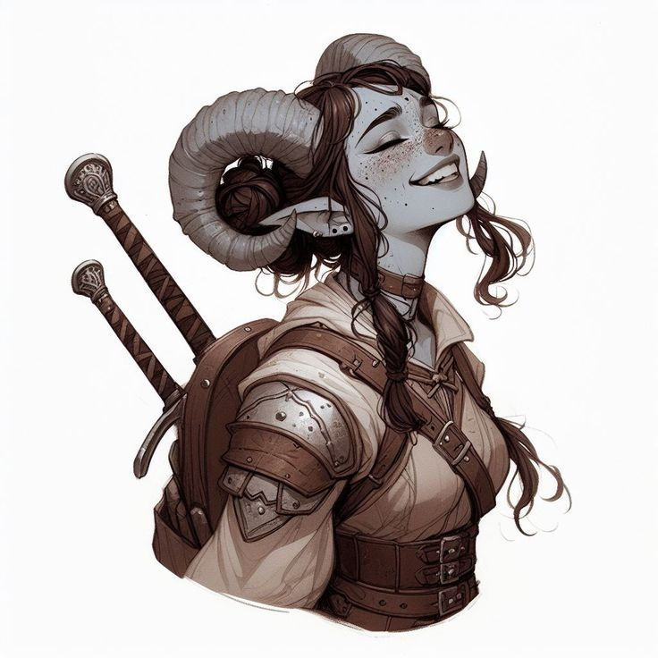

# Orianna

| Português | English |
|-----------|---------|
| **Jogadora:** Rita Baptista | **Player:** Rita Baptista |
| **Espécie:** Tiefling | **Species:** Tiefling |
| **Classe:** Bárbara | **Class:** Barbarian |
| **Alinhamento:** Caótica Boa | **Alignment:** Chaotic Good |
| **Ficha D&D Beyond:** [Link](https://www.dndbeyond.com/characters/139775283) | **D&D Beyond Sheet:** [Link](https://www.dndbeyond.com/characters/139775283) |
| **Sessões jogadas:** 2 | **Sessions played:** 2 |
| **Sessões DM:** 1 | **DM Sessions:** 1 |
| **Contacto:** +351 967 962 294 | **Contact:** +351 967 962 294 |
| **Traços:** Inquieta, energética, distraída, hilariante (ou pensa que é), sempre que vê um gato tem de lhe dar comida, não gosta de orcs (caçam as galinhas) | **Traits:** Restless, energetic, absent-minded, hilarious (or thinks she is), always feeds any cat she sees, dislikes orcs (they hunt chickens) |
| **Ideais:** Deixar o mundo melhor do que o encontrou, proteger a natureza | **Ideals:** Leave the world better than she found it, protect nature |
| **Defeitos:** Tendência para ignorar regras e planos, nada atenta ao detalhe | **Flaws:** Tendency to ignore rules and plans, not detail-oriented |
| **Ligações:** Arkos (amigo de infância), pais na aldeia, galinhas e gatos | **Bonds:** Arkos (childhood friend), parents in the village, chickens and cats |

| Português | English |
|-----------|---------|
| **Resumo rápido:** Bárbara tiefling caótica boa, aventureira por necessidade e curiosidade, determinada a proteger a natureza e ajudar a família. | **Quick synopsis:** Chaotic good tiefling barbarian, adventurer out of necessity and curiosity, determined to protect nature and help her family. |
| **História cuidadosamente fabricada (o que Orianna conta aos outros):** Orianna cresceu numa aldeia agrícola, filha de agricultores, sempre animada e protetora. Usa o seu passado humilde como força para ajudar outros e explorar o mundo. | **Carefully Crafted Story (what Orianna tells others):** Orianna grew up in a farming village, daughter of farmers, always lively and protective. She uses her humble past as motivation to help others and explore the world. |
| **Verdadeira história — Origens:** Um incêndio destruiu a madeira da família antes do inverno, criando dívidas. Aproveitou a oportunidade para partir com o amigo de infância Arkos em busca de dinheiro, aventuras e novas aprendizagens. Adora cortar madeira, alimentar galinhas e gatos, e odeia orcs por caçarem as galinhas. | **True Backstory — Origins:** A fire destroyed the family’s wood supply before winter, creating debt. She seized the chance to leave with childhood friend Arkos in search of money, adventures, and new learning. Loves chopping wood, feeding chickens and cats, and hates orcs for hunting the chickens. |

