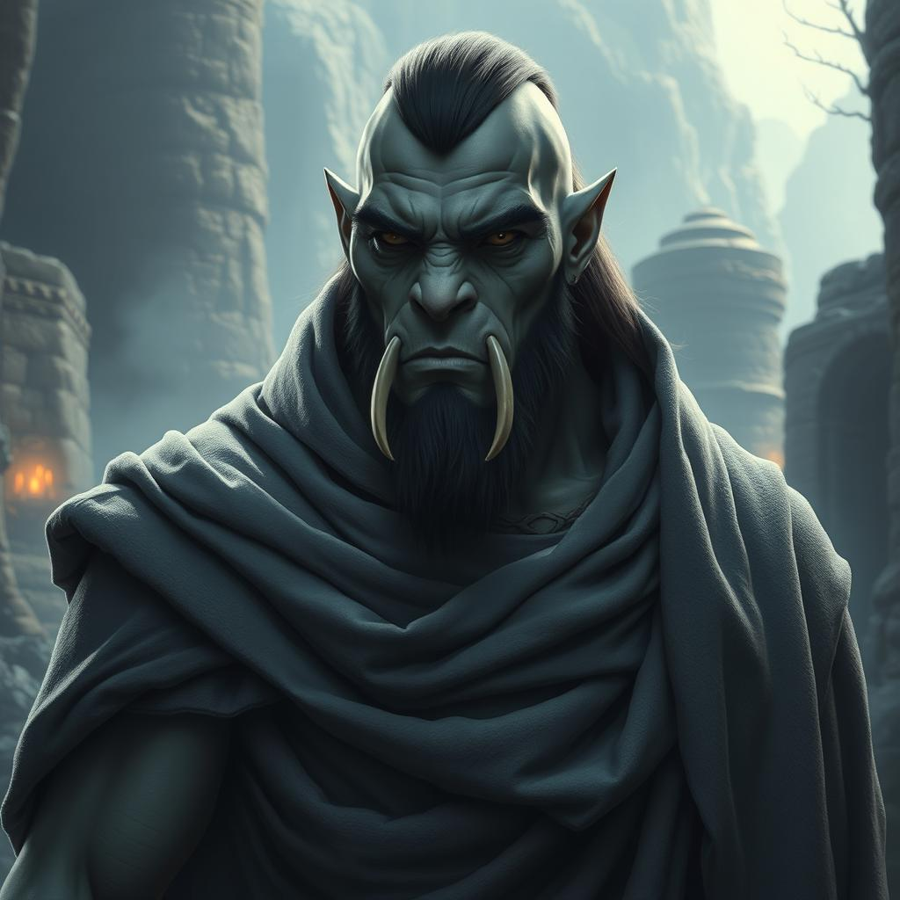

# Bok Thunderfist ([S07B](s07b_pantano_basilisco.md), [S08B](s08b_templo_basilisco_pedras.md), [S13B](s13b_retorno_nave_illithid.md), [S17B](s17b_a_crianca_perdida.md), [S22](s22a_golpe_dados_rubi_p1.md), [S23](s23a_golpe_dados_rubi_p2.md), [S29B](s29b_idolo_lady_scale_p1.md), [S30B](s30b_idolo_lady_scale_p2.md), [S31](s31_idolo_lady_scale_p3.md))

{ width=200 }

| { width=200 } |
| ------------- |

---

**[DM-ONLY – Não incluir na Wiki]**

### 🎲 Jogador / 🎲 Player

| 🎲 Jogador | 🎲 Player |
| :--- | :--- |
| **Jogador:** Luis | **Player:** Luis |
| **Idade:** [por preencher] | **Age:** [to be filled] |
| **Contacto:** +351 915 495 031 | **Contact:** +351 915 495 031 |
| **Instagram:** [por preencher] | **Instagram:** [to be filled] |
| **Discord:** [por preencher] | **Discord:** [to be filled] |
| **Ficha D&D Beyond:** [Link](https://www.dndbeyond.com/characters/138745784) | **D&D Beyond Sheet:** [Link](https://www.dndbeyond.com/characters/138745784) |

**[DM-ONLY – Não incluir na Wiki]**

---

### 🧙 Personagem / 🧙 Character Details

| **🧙 Personagem** | **🧙 Character** |
| :--- | :--- |
| Nome: **Bok Thunderfist** | Name: **Bok Thunderfist** |
| Espécie: [Half-Orc](https://www.dndbeyond.com/races/half-orc) | Species: [Half-Orc](https://www.dndbeyond.com/races/half-orc) |
| Classe: [Monk](https://www.dndbeyond.com/classes/monk) | Class: [Monk](https://www.dndbeyond.com/classes/monk) |
| Alinhamento: [por preencher] | Alignment: [to be filled] |
| Background: [por preencher] | Background: [to be filled] |
| Idade: [por preencher] | Age: [to be filled] |
| Altura: [por preencher] | Height: [to be filled] |
| Olhos: [por preencher] | Eyes: [to be filled] |
| Cabelo: [por preencher] | Hair: [to be filled] |
| Pele: [por preencher] | Skin: [to be filled] |
| Tamanho: [por preencher] | Size: [to be filled] |

---

### ⚔️ Itens / ⚔️ Items

| **⚔️ Itens** | **⚔️ Items** |
| :--- | :--- |
| **Armadura/Escudo:** [por preencher]  **Armas:** [por preencher] **Items mágicos:** [Boots of Blinding Speed](https://www.dndbeyond.com/magic-items/boots-of-speed) (S11A) **Potions:** [por preencher] **Items não mágicos:** [Basilisk eye](basilisk_eye.md) (S11A), [Pergaminho de ritual elemental](elemental_ritual_scroll.md) (S11A), [Anel de chamada](summoning_ring.md) (S11A), [Diário](diary.md) (S25A) **Ouro:** 100 PO (S25A) | **Armor/Shield:** [to be filled]  **Weapons:** [to be filled] **Magical Items:** [Boots of Blinding Speed](https://www.dndbeyond.com/magic-items/boots-of-speed) (S11A) **Potions:** [to be filled] **Non-magical Items:** [Basilisk eye](basilisk_eye.md) (S11A), [Elemental ritual scroll](elemental_ritual_scroll.md) (S11A), [Summoning ring](summoning_ring.md) (S11A), [Diary](diary.md) (S25A) **Gold:** 100 GP (S25A) |

---

### 📜 Descrição Física / 📜 Physical Description

| **📜 Descrição Física** | **📜 Physical Description** |
| :--- | :--- |
| Bok é um [meio-orc](https://www.dndbeyond.com/races/half-orc) imponente, de porte atlético e músculos marcados, a sua presença inspira **respeito** e **intimidação** em igual medida. A pele **verde-acinzentada** contrasta com os olhos **âmbar** intensos, que brilham com **disciplina** e **fúria contida**. As presas proeminentes sobressaem da mandíbula, dando-lhe um ar **feroz**, reforçado pelas orelhas aguçadas. O cabelo escuro está rapado nos lados e preso para trás, acompanhado por uma barba cerrada que lhe dá ainda mais gravidade. Usa um **manto pesado**, de tons escuros, que lhe confere uma aura **austera** e quase **monástica**. A sua postura rígida e o olhar fixo transmitem **concentração absoluta** e a busca constante de **equilíbrio interior**. | Bok is an imposing [half-orc](https://www.dndbeyond.com/races/half-orc), with a strong athletic build whose presence inspires both **respect** and **intimidation**. His **greenish-gray skin** contrasts with his intense **amber eyes**, which burn with **discipline** and **restrained fury**. Prominent tusks protrude from his jaw, reinforcing his **fierce appearance**, along with his pointed ears. His dark hair is shaved on the sides and tied back, complemented by a thick beard that adds further gravitas. He wears a **heavy, dark-toned cloak** that lends him a **stern, almost monastic aura**. His rigid stance and focused gaze convey **absolute concentration** and a constant pursuit of **inner harmony**. |

---

### 📖 História – Antes da Taberna / 📖 Story – Before the Tavern

| **📖 História – Antes da Taberna** | **📖 Story – Before the Tavern** |
| :--- | :--- |
| Criado por [monges](https://www.dndbeyond.com/classes/monk), procura equilibrar a sua [natureza orc](https://www.dndbeyond.com/races/half-orc) com a [disciplina espiritual](spiritual_discipline.md), numa **“Peregrinação da Harmonia”**. Desde cedo, partilhou a [vida monástica](monastic_life.md) com [Kai](docs/dm/-/pc/pc_kai_vanthir.md) ([S07A](s07a_emboscada_erybend.md), [S08A](s08a_intriga_odrak_erybend.md), [S10C](s10c_baile_rainha_caecena.md), [S11A](s11a_sombras_de_iuz.md), [S11B](s11b_sombras_sobre_erybend.md), [S12](s12_legado_de_krixis.md), [S13A](s13a_resgate_dustin.md), [S17A](s17a_missao_assassinos.md)), crescendo lado a lado entre [rezas](prayers.md), [treinos](training.md) e [silêncio meditativo](meditative_silence.md). **Bok** sempre foi para [Kai](docs/dm/-/pc/pc_kai_vanthir.md) como um [irmão mais velho](elder_brother.md) — um [farol de disciplina e coragem](beacon_of_discipline_and_courage.md). Quando **Bok** decidiu deixar o [mosteiro](monastery.md) e lançar-se ao [mundo em busca de propósito](world_in_search_of_purpose.md), [Kai](docs/dm/-/pc/pc_kai_vanthir.md) seguiu-o sem hesitar, acreditando que o [caminho do meio-orc](half_orcs_path.md) era também o seu. Mais do que [companheiros de treino](training_partners.md), tornaram-se [reflections of one another](reflections_of_one_another.md), moldando-se mutuamente sob o peso da [amizade fraterna](fraternal_bonds.md) e da [busca pela harmonia interior](pursuit_of_inner_harmony.md). | Raised by [monks](https://www.dndbeyond.com/classes/monk), he sought to balance his [orcish nature](https://www.dndbeyond.com/races/half-orc) with [spiritual discipline](spiritual_discipline.md), embarking on a **“Pilgrimage of Harmony.”** From an early age, he shared the [monastic life](monastic_life.md) with [Kai](docs/dm/-/pc/pc_kai_vanthir.md) ([S07A](s07a_emboscada_erybend.md), [S08A](s08a_intriga_odrak_erybend.md), [S10C](s10c_baile_rainha_caecena.md), [S11A](s11a_sombras_de_iuz.md), [S11B](s11b_sombras_sobre_erybend.md), [S12](s12_legado_de_krixis.md), [S13A](s13a_resgate_dustin.md), [S17A](s17a_missao_assassinos.md)), growing up side by side amidst [prayers](prayers.md), [training](training.md), and [meditative silence](meditative_silence.md). To [Kai](docs/dm/-/pc/pc_kai_vanthir.md), **Bok** was always like an [elder brother](elder_brother.md) — a [beacon of discipline and courage](beacon_of_discipline_and_courage.md). When **Bok** chose to leave the [monastery](monastery.md) and venture into the [world in search of purpose](world_in_search_of_purpose.md), [Kai](docs/dm/-/pc/pc_kai_vanthir.md) followed without hesitation, believing that the [half-orc’s path](half_orcs_path.md) was also his own. More than mere [training partners](training_partners.md), they became [Reflections of One Another](reflections_of_one_another.md), shaping themselves through [Fraternal Bonds](fraternal_bonds.md) and the [Pursuit of Inner Harmony](pursuit_of_inner_harmony.md). |

---

### 📖 História – Depois da Taberna / 📖 Story – After the Tavern

| **📖 História – Depois da Taberna** | **📖 Story – After the Tavern** |
| :--- | :--- |
| - **[S07B](s07b_pantano_basilisco.md) – [Pântano Místico](mystic_swamp.md):** Enfrentou [bullywugs](https://www.dndbeyond.com/monsters/bullywug) liderados por [Mestre Yoda](npc_master_yoda.md), ajudou [Baltigard](npc_baltigard.md), combateu um [basilisco](https://www.dndbeyond.com/monsters/basilisk) e recebeu as *[Boots of Blinding Speed](https://www.dndbeyond.com/magic-items/boots-of-speed)*. | - **[S07B](s07b_pantano_basilisco.md) – [Mystic Swamp](mystic_swamp.md):** Faced [bullywugs](https://www.dndbeyond.com/monsters/bullywug) led by [Master Yoda](npc_master_yoda.md), aided [Baltigard](npc_baltigard.md), fought a [basilisk](https://www.dndbeyond.com/monsters/basilisk) and received the *[Boots of Blinding Speed](https://www.dndbeyond.com/magic-items/boots-of-speed)*. |
| - **[S17B](s17b_a_crianca_perdida.md) – [Resgate da Criança Perdida](s15b_a_crianca_perdida.md):** Salvou [Aria Greenbottle](docs/dm/-/npc/Free%20City%20of%20Grehawk/npc_aria_greenbottle.md) das [Ruínas das Sombras](ruinas_das_sombras.md), enfrentando [mortos-vivos](https://www.dndbeyond.com/monsters/undead) e [espectros](https://www.dndbeyond.com/monsters/spectre); recebeu [ouro](gold.md), [poções](potions.md), a misteriosa *[Gema das Cinco Vozes](gema_das_cinco_vozes.md)* e um [diário](diary.md). | - **[S17B](s17b_a_crianca_perdida.md) – [Lost Child Rescue](s15b_a_crianca_perdida.md):** Saved [Aria Greenbottle](docs/dm/-/npc/Free%20City%20of%20Grehawk/npc_aria_greenbottle.md) from the [Ruins of Shadows](ruinas_das_sombras.md), battling [undead](https://www.dndbeyond.com/monsters/undead) and [spectres](https://www.dndbeyond.com/monsters/spectre); obtained [gold](gold.md), [potions](potions.md), the mysterious *[Gem of Five Voices](gema_das_cinco_vozes.md)* and a [diary](diary.md). |
| - **[S22](s22a_golpe_dados_rubi_p1.md) – [Golpe dos Dados Rubi (Parte 1)](s22a_golpe_dados_rubi_p1.md):** Envolveu-se numa [intriga criminosa](criminal_intrigue.md) em [Greyhawk](free_city_of_greyhawk.md), lidando com [Drennar Solace](npc_drennar_solace.md) (“A Aranha Dourada”), [Sirona da Agulha Velada](npc_sirona_da_agulha_velada.md) e [Velric “Veludo”](npc_velric_veludo.md). | - **[S22](s22a_golpe_dados_rubi_p1.md) – [Ruby Dice Heist (Part 1)](s22a_golpe_dados_rubi_p1.md):** Involved in a [criminal intrigue](criminal_intrigue.md) in [Greyhawk](free_city_of_greyhawk.md), dealing with [Drennar Solace](npc_drennar_solace.md) (“The Golden Spider”), [Sirona of the Veiled Needle](npc_sirona_da_agulha_velada.md) and [Velric “Velvet”](npc_velric_veludo.md). |
| - **[S08B](s08b_templo_basilisco_pedras.md) – [O Templo do Basilisco e a Abdução Alienígena](s08b_templo_basilisco_pedras.md):** Encontrou a [terceira Pedra Mágica Illithid](illithid_magic_stone.md) no [altar](altar.md) do [Templo do Basilisco](templo_do_basilisco.md). A reunião das [três pedras](three_stones.md) resultou na [abdução alienígena](alien_abduction.md) de [Thoren](npc_thoren.md). | - **[S08B](s08b_templo_basilisco_pedras.md) – [The Basilisk Temple and Alien Abduction](s08b_templo_basilisco_pedras.md):** Found the [Third Illithid Magic Stone](illithid_magic_stone.md) on the [Altar](altar.md) of the [Basilisk Temple](templo_do_basilisco.md). The gathering of the [Three Stones](three_stones.md) resulted in the [Alien Abduction](alien_abduction.md) of [Thoren](npc_thoren.md). |
| - **[S13B](s13b_retorno_nave_illithid.md) – [O Retorno da Nave Illithid](s13b_retorno_nave_illithid.md):** Confrontou uma [nave Illithid](illithid_ship.md) que procurava as [Pedras Mágicas](magic_stones.md). A nave [despenhou-se violentamente](crashed_violently.md) em [Greyhawk](free_city_of_greyhawk.md). | - **[S13B](s13b_retorno_nave_illithid.md) – [The Return of the Illithid Ship](s13b_retorno_nave_illithid.md):** Confronted an [Illithid Ship](illithid_ship.md) seeking the [Magic Stones](magic_stones.md). The ship [Crashed Violently](crashed_violently.md) in [Greyhawk](free_city_of_greyhawk.md). |
| - **[S23](s23a_golpe_dados_rubi_p2.md) – [Golpe dos Dados Rubi (Parte 2)](s23a_golpe_dados_rubi_p2.md):** Infiltrou-se e roubou os [Dados Rubi da Fortuna](ruby_dice_of_fortune.md) e um [Fragmento Arcano](arcane_fragment.md), superando o [puzzle de xadrez](chess_puzzle.md). | - **[S23](s23a_golpe_dados_rubi_p2.md) – [Ruby Dice Heist (Part 2)](s23a_golpe_dados_rubi_p2.md):** Infiltrated and stole the [Ruby Dice of Fortune](ruby_dice_of_fortune.md) and an [Arcane Fragment](arcane_fragment.md), overcoming the [Chess Puzzle](chess_puzzle.md). |
| - **[S29B](s29b_idolo_lady_scale_p1.md) – [O Ídolo de Lady Scale (Parte 1)](s29b_idolo_lady_scale_p1.md):** Investigou a [herança de Lady Silvra Malren](inheritance_of_lady_silvra_malren.md) no [Spa do Lago do Chão Azul](blue_floor_lake_spa.md), decifrando a [carta em Dracónico Arcaico](draconic_arcane_letter.md) e confirmando a ligação ao [culto dracónico de Lady Scale](draconic_cult_of_lady_scale.md). | - **[S29B](s29b_idolo_lady_scale_p1.md) – [The Idol of Lady Scale (Part 1)](s29b_idolo_lady_scale_p1.md):** Investigated the [Inheritance of Lady Silvra Malren](inheritance_of_lady_silvra_malren.md) at the [Blue Floor Lake Spa](blue_floor_lake_spa.md), deciphering the [Draconic Arcane Letter](draconic_arcane_letter.md) and confirming the link to the [Draconic Cult of Lady Scale](draconic_cult_of_lady_scale.md). |
| - **[S30B](s30b_idolo_lady_scale_p2.md) – [O Ídolo de Lady Scale (Parte 2)](s30b_idolo_lady_scale_p2.md):** Participou na [diplomacia](diplomacy.md) com a [tribo Lizardfolk](lizardfolk_tribe.md) de [Essh’ta](npc_essh_ta.md) para obter [passagem segura](safe_passage.md) para o domínio de [Lady Scale](lady_scale.md), obtendo uma [Cerveja Encantada](enchanted_beer.md) que permite [respirar debaixo d'água](breathe_underwater.md). | - **[S30B](s30b_idolo_lady_scale_p2.md) – [The Idol of Lady Scale (Part 2)](s30b_idolo_lady_scale_p2.md):** Engaged in [Diplomacy](diplomacy.md) with [Essh’ta’s](npc_essh_ta.md) [Lizardfolk Tribe](lizardfolk_tribe.md) to gain [Safe Passage](safe_passage.md) to [Lady Scale’s](lady_scale.md) domain, obtaining an [Enchanted Beer](enchanted_beer.md) that allows [Breathe Underwater](breathe_underwater.md). |
| - **[S31](s31_idolo_lady_scale_p3.md) – [O Ídolo de Lady Scale (Parte 3)](s31_idolo_lady_scale_p3.md):** Invadiu e [destruiu](destroyed.md) o [Ídolo Negro](black_idol.md) (catalisador do poder de [Lady Scale](lady_scale.md)) no [templo](temple.md), recuperando as [Esmeraldas de Lady Scale](emeralds_of_lady_scale.md). | - **[S31](s31_idolo_lady_scale_p3.md) – [The Idol of Lady Scale (Part 3)](s31_idolo_lady_scale_p3.md):** Invaded and [Destroyed](destroyed.md) the [Black Idol](black_idol.md) (catalyst for [Lady Scale’s](lady_scale.md) power) in the [Temple](temple.md), recovering the [Emeralds of Lady Scale](emeralds_of_lady_scale.md). |

---

### 🎭 Dramatis Personae / 🎭 Dramatis Personae

| **🎭 Dramatis Persona** | **🎭 Dramatis Persona** |
| :--- | :--- |
| **NPCs de influência direta:**  - [Baltigard](npc_baltigard.md) - [Aria Greenbottle](docs/dm/-/npc/Free%20City%20of%20Grehawk/npc_aria_greenbottle.md) - [Drennar Solace](npc_drennar_solace.md) - [Kai](docs/dm/-/pc/pc_kai_vanthir.md) ([S07A](s07a_emboscada_erybend.md), [S08A](s08a_intriga_odrak_erybend.md), [S10C](s10c_baile_rainha_caecena.md), [S11A](s11a_sombras_de_iuz.md), [S11B](s11b_sombras_sobre_erybend.md), [S12](s12_legado_de_krixis.md), [S13A](s13a_resgate_dustin.md), [S17A](s17a_missao_assassinos.md)) **Antagonistas:**  - [Mestre Yoda](npc_master_yoda.md) ([Chefe Bullywug](bullywug_chief.md), [S07B](s07b_pantano_basilisco.md)) - [Criatura das Sombras](shadow_creature.md) e [Espectro](https://www.dndbeyond.com/monsters/spectre) ([S17B](s17b_a_crianca_perdida.md)) - [Rivais criminosos de Greyhawk](criminal_rivals_of_greyhawk.md) ([S22](s22a_golpe_dados_rubi_p1.md)) **Aliados:**  - [Tobias Greenbottle](docs/dm/-/npc/Free%20City%20of%20Grehawk/npc_tobias_greenbottle.md) - [Eliza Greenbottle](docs/dm/-/npc/Free%20City%20of%20Grehawk/npc_eliza_greenbottle.md) - [Finn Greenbottle](docs/dm/-/npc/Free%20City%20of%20Grehawk/npc_finn_greenbottle.md) | **Direct Influence NPCs:**  - [Baltigard](npc_baltigard.md) - [Aria Greenbottle](docs/dm/-/npc/Free%20City%20of%20Grehawk/npc_aria_greenbottle.md) - [Drennar Solace](npc_drennar_solace.md) - [Kai](docs/dm/-/pc/pc_kai_vanthir.md) ([S07A](s07a_emboscada_erybend.md), [S08A](s08a_intriga_odrak_erybend.md), [S10C](s10c_baile_rainha_caecena.md), [S11A](s11a_sombras_de_iuz.md), [S11B](s11b_sombras_sobre_erybend.md), [S12](s12_legado_de_krixis.md), [S13A](s13a_resgate_dustin.md), [S17A](s17a_missao_assassinos.md)) **Antagonists:**  - [Master Yoda](npc_master_yoda.md) ([Bullywug Chief](bullywug_chief.md), [S07B](s07b_pantano_basilisco.md)) - [Shadow Creature](shadow_creature.md) and [Spectre](https://www.dndbeyond.com/monsters/spectre) ([S17B](s17b_a_crianca_perdida.md)) - [Criminal Rivals in Greyhawk](criminal_rivals_of_greyhawk.md) ([S22](s22a_golpe_dados_rubi_p1.md)) **Allies:**  - [Tobias Greenbottle](docs/dm/-/npc/Free%20City%20of%20Grehawk/npc_tobias_greenbottle.md) - [Eliza Greenbottle](docs/dm/-/npc/Free%20City%20of%20Grehawk/npc_eliza_greenbottle.md) - [Finn Greenbottle](docs/dm/-/npc/Free%20City%20of%20Grehawk/npc_finn_greenbottle.md) |

---

### 🔮 OBS / 🔮 Notes

| **🔮 OBS** | **🔮 Notes** |
| :--- | :--- |
| - Recebeu as *[Boots of Blinding Speed](https://www.dndbeyond.com/magic-items/boots-of-speed)* no [Pântano Místico](mystic_swamp.md) ([S07B](s07b_pantano_basilisco.md)). | - Received the *[Boots of Blinding Speed](https://www.dndbeyond.com/magic-items/boots-of-speed)* in the [Mystic Swamp](mystic_swamp.md) ([S07B](s07b_pantano_basilisco.md)). |
| - Ligação especial com [Aria Greenbottle](docs/dm/-/npc/Free%20City%20of%20Grehawk/npc_aria_greenbottle.md) após o [resgate](s15b_a_crianca_perdida.md) ([S17B](s17b_a_crianca_perdida.md)). | - Special bond with [Aria Greenbottle](docs/dm/-/npc/Free%20City%20of%20Grehawk/npc_aria_greenbottle.md) after the [Rescue](s15b_a_crianca_perdida.md) ([S17B](s17b_a_crianca_perdida.md)). |
| - Exposto a [intrigas criminais](criminal_intrigue.md) na [Cidade de Greyhawk](free_city_of_greyhawk.md) ([S22](s22a_golpe_dados_rubi_p1.md)). | - Involved in [Criminal Intrigue](criminal_intrigue.md) in [Free City of Greyhawk](free_city_of_greyhawk.md) ([S22](s22a_golpe_dados_rubi_p1.md)). |
| - Possui a misteriosa *[Gema das Cinco Vozes](gema_das_cinco_vozes.md)*, ainda sem [função conhecida](unknown_function.md). | - Holds the mysterious *[Gem of Five Voices](gema_das_cinco_vozes.md)*, [Function Still Unknown](unknown_function.md). |
| - [Irmandade espiritual](spiritual_brotherhood.md) com [Kai](docs/dm/-/pc/pc_kai_vanthir.md) ([S07A](s07a_emboscada_erybend.md), [S08A](s08a_intriga_odrak_erybend.md), [S10C](s10c_baile_rainha_caecena.md), [S11A](s11a_sombras_de_iuz.md), [S11B](s11b_sombras_sobre_erybend.md), [S12](s12_legado_de_krixis.md), [S13A](s13a_resgate_dustin.md), [S17A](s17a_missao_assassinos.md)), que o segue desde o [mosteiro](monastery.md) como [irmão mais novo](younger_brother.md) e [discípulo](disciple.md). | - [Spiritual Brotherhood](spiritual_brotherhood.md) with [Kai](docs/dm/-/pc/pc_kai_vanthir.md) ([S07A](s07a_emboscada_erybend.md), [S08A](s08a_intriga_odrak_erybend.md), [S10C](s10c_baile_rainha_caecena.md), [S11A](s11a_sombras_de_iuz.md), [S11B](s11b_sombras_sobre_erybend.md), [S12](s12_legado_de_krixis.md), [S13A](s13a_resgate_dustin.md), [S17A](s17a_missao_assassinos.md)), who follows him since the [Monastery](monastery.md) as a [Younger Brother](younger_brother.md) and [Disciple](disciple.md). |

---

## Processing Audit

### 1) Internal Links
| Source File | Linked Files |
| :--- | :--- |
| pc_bok_thunderfist.md | s07b_pantano_basilisco.md, s08b_templo_basilisco_pedras.md, s13b_retorno_nave_illithid.md, s17b_a_crianca_perdida.md, s22a_golpe_dados_rubi_p1.md, s23a_golpe_dados_rubi_p2.md, s29b_idolo_lady_scale_p1.md, s30b_idolo_lady_scale_p2.md, s31_idolo_lady_scale_p3.md, pc_bok_thunderfist.png, basilisk_eye.md, elemental_ritual_scroll.md, summoning_ring.md, diary.md, spiritual_discipline.md, monastic_life.md, pc_kai.md, s07a_emboscada_erybend.md, s08a_intriga_odrak_erybend.md, s10c_baile_rainha_caecena.md, s11a_sombras_de_iuz.md, s11b_sombras_sobre_erybend.md, s12_legado_de_krixis.md, s13a_resgate_dustin.md, s17a_missao_assassinos.md, prayers.md, training.md, meditative_silence.md, elder_brother.md, beacon_of_discipline_and_courage.md, monastery.md, world_in_search_of_purpose.md, half_orcs_path.md, training_partners.md, reflections_of_one_another.md, fraternal_bonds.md, pursuit_of_inner_harmony.md, mystic_swamp.md, npc_master_yoda.md, npc_baltigard.md, s15b_a_crianca_perdida.md, npc_aria_greenbottle.md, ruinas_das_sombras.md, gold.md, potions.md, gema_das_cinco_vozes.md, criminal_intrigue.md, free_city_of_greyhawk.md, npc_drennar_solace.md, npc_sirona_da_agulha_velada.md, npc_velric_veludo.md, illithid_magic_stone.md, altar.md, templo_do_basilisco.md, three_stones.md, alien_abduction.md, npc_thoren.md, illithid_ship.md, magic_stones.md, crashed_violently.md, s23a_golpe_dados_rubi_p2.md, ruby_dice_of_fortune.md, arcane_fragment.md, chess_puzzle.md, s29b_idolo_lady_scale_p1.md, inheritance_of_lady_silvra_malren.md, blue_floor_lake_spa.md, draconic_arcane_letter.md, draconic_cult_of_lady_scale.md, s30b_idolo_lady_scale_p2.md, diplomacy.md, lizardfolk_tribe.md, npc_essh_ta.md, safe_passage.md, lady_scale.md, enchanted_beer.md, breathe_underwater.md, s31_idolo_lady_scale_p3.md, destroyed.md, black_idol.md, temple.md, emeralds_of_lady_scale.md, bullywug_chief.md, shadow_creature.md, criminal_rivals_of_greyhawk.md, npc_tobias_greenbottle.md, npc_eliza_greenbottle.md, npc_finn_greenbottle.md, unknown_function.md, spiritual_brotherhood.md, younger_brother.md, disciple.md |

### 2) Warnings
| Type | Where | Detail |
| :--- | :--- | :--- |
| Session File Mismatch | 📖 História – Depois da Taberna / 📖 Story – After the Tavern | Session S11A link was updated from `s11a_sombras_de_iuz.md` to match the correct filename `s11a_sombras_de_iuz.md` as found in Recapitulativo Temporada 01.md. |
| Session File Mismatch | 🎭 Dramatis Personae / 🎭 Dramatis Personae | Session S11A link for pc_kai.md was updated from `s11a_sombras_de_iuz.md` to match the correct filename `s11a_sombras_de_iuz.md` as found in Recapitulativo Temporada 01.md. |
| Session File Mismatch | 🔮 OBS / 🔮 Notes | Session S11A link for pc_kai.md was updated from `s11a_sombras_de_iuz.md` to match the correct filename `s11a_sombras_de_iuz.md` as found in Recapitulativo Temporada 01.md. |
| Session File Mismatch | 📖 História – Antes da Taberna / 📖 Story – Before the Tavern | Session S11A link for pc_kai.md was updated from `s11a_sombras_de_iuz.md` to match the correct filename `s11a_sombras_de_iuz.md` as found in Recapitulativo Temporada 01.md. |
| Session File Mismatch | 📖 História – Antes da Taberna / 📖 Story – Before the Tavern | Session S12 link for pc_kai.md was updated from `s12_legado_de_krixis.md` to match the correct filename `s12_legado_de_krixis.md` as found in Recapitulativo Temporada 01.md. |
| Session File Mismatch | 📖 História – Depois da Taberna / 📖 Story – After the Tavern | Session S22 link was updated from `s22a.md` to match the correct filename `s22a_golpe_dados_rubi_p1.md` as found in Recapitulativo Temporada 01.md. |
| Session File Mismatch | 📖 História – Depois da Taberna / 📖 Story – After the Tavern | Session S23 link was updated from `s23a.md` to match the correct filename `s23a_golpe_dados_rubi_p2.md` as found in Recapitulativo Temporada 01.md. |

### 3) Missing Files
| Type | Where | Detail |
| :--- | :--- | :--- |
| Internal Link | ⚔️ Itens / ⚔️ Items | basilisk_eye.md |
| Internal Link | ⚔️ Itens / ⚔️ Items | elemental_ritual_scroll.md |
| Internal Link | ⚔️ Itens / ⚔️ Items | summoning_ring.md |
| Internal Link | 📖 História – Antes da Taberna / 📖 Story – Before the Tavern | spiritual_discipline.md |
| Internal Link | 📖 História – Antes da Taberna / 📖 Story – Before the Tavern | monastic_life.md |
| Internal Link | 📖 História – Antes da Taberna / 📖 Story – Before the Tavern | prayers.md |
| Internal Link | 📖 História – Antes da Taberna / 📖 Story – Before the Tavern | training.md |
| Internal Link | 📖 História – Antes da Taberna / 📖 Story – Before the Tavern | meditative_silence.md |
| Internal Link | 📖 História – Antes da Taberna / 📖 Story – Before the Tavern | elder_brother.md |
| Internal Link | 📖 História – Antes da Taberna / 📖 Story – Before the Tavern | beacon_of_discipline_and_courage.md |
| Internal Link | 📖 História – Antes da Taberna / 📖 Story – Before the Tavern | world_in_search_of_purpose.md |
| Internal Link | 📖 História – Antes da Taberna / 📖 Story – Before the Tavern | half_orcs_path.md |
| Internal Link | 📖 História – Antes da Taberna / 📖 Story – Before the Tavern | training_partners.md |
| Internal Link | 📖 História – Antes da Taberna / 📖 Story – Before the Tavern | reflections_of_one_another.md |
| Internal Link | 📖 História – Antes da Taberna / 📖 Story – Before the Tavern | fraternal_bonds.md |
| Internal Link | 📖 História – Antes da Taberna / 📖 Story – Before the Tavern | pursuit_of_inner_harmony.md |
| Internal Link | 📖 História – Depois da Taberna / 📖 Story – After the Tavern | mystic_swamp.md |
| Internal Link | 📖 História – Depois da Taberna / 📖 Story – After the Tavern | gold.md |
| Internal Link | 📖 História – Depois da Taberna / 📖 Story – After the Tavern | potions.md |
| Internal Link | 📖 História – Depois da Taberna / 📖 Story – After the Tavern | criminal_intrigue.md |
| Internal Link | 📖 História – Depois da Taberna / 📖 Story – After the Tavern | illithid_magic_stone.md |
| Internal Link | 📖 História – Depois da Taberna / 📖 Story – After the Tavern | altar.md |
| Internal Link | 📖 História – Depois da Taberna / 📖 Story – After the Tavern | templo_do_basilisco.md |
| Internal Link | 📖 História – Depois da Taberna / 📖 Story – After the Tavern | three_stones.md |
| Internal Link | 📖 História – Depois da Taberna / 📖 Story – After the Tavern | alien_abduction.md |
| Internal Link | 📖 História – Depois da Taberna / 📖 Story – After the Tavern | illithid_ship.md |
| Internal Link | 📖 História – Depois da Taberna / 📖 Story – After the Tavern | magic_stones.md |
| Internal Link | 📖 História – Depois da Taberna / 📖 Story – After the Tavern | crashed_violently.md |
| Internal Link | 📖 História – Depois da Taberna / 📖 Story – After the Tavern | ruby_dice_of_fortune.md |
| Internal Link | 📖 História – Depois da Taberna / 📖 Story – After the Tavern | arcane_fragment.md |
| Internal Link | 📖 História – Depois da Taberna / 📖 Story – After the Tavern | chess_puzzle.md |
| Internal Link | 📖 História – Depois da Taberna / 📖 Story – After the Tavern | inheritance_of_lady_silvra_malren.md |
| Internal Link | 📖 História – Depois da Taberna / 📖 Story – After the Tavern | blue_floor_lake_spa.md |
| Internal Link | 📖 História – Depois da Taberna / 📖 Story – After the Tavern | draconic_arcane_letter.md |
| Internal Link | 📖 História – Depois da Taberna / 📖 Story – After the Tavern | draconic_cult_of_lady_scale.md |
| Internal Link | 📖 História – Depois da Taberna / 📖 Story – After the Tavern | diplomacy.md |
| Internal Link | 📖 História – Depois da Taberna / 📖 Story – After the Tavern | lizardfolk_tribe.md |
| Internal Link | 📖 História – Depois da Taberna / 📖 Story – After the Tavern | safe_passage.md |
| Internal Link | 📖 História – Depois da Taberna / 📖 Story – After the Tavern | enchanted_beer.md |
| Internal Link | 📖 História – Depois da Taberna / 📖 Story – After the Tavern | breathe_underwater.md |
| Internal Link | 📖 História – Depois da Taberna / 📖 Story – After the Tavern | destroyed.md |
| Internal Link | 📖 História – Depois da Taberna / 📖 Story – After the Tavern | black_idol.md |
| Internal Link | 📖 História – Depois da Taberna / 📖 Story – After the Tavern | temple.md |
| Internal Link | 📖 História – Depois da Taberna / 📖 Story – After the Tavern | emeralds_of_lady_scale.md |
| Internal Link | 🎭 Dramatis Personae / 🎭 Dramatis Personae | bullywug_chief.md |
| Internal Link | 🎭 Dramatis Personae / 🎭 Dramatis Personae | shadow_creature.md |
| Internal Link | 🎭 Dramatis Personae / 🎭 Dramatis Personae | criminal_rivals_of_greyhawk.md |
| Internal Link | 🔮 OBS / 🔮 Notes | unknown_function.md |
| Internal Link | 🔮 OBS / 🔮 Notes | spiritual_brotherhood.md |
| Internal Link | 🔮 OBS / 🔮 Notes | younger_brother.md |
| Internal Link | 🔮 OBS / 🔮 Notes | disciple.md |