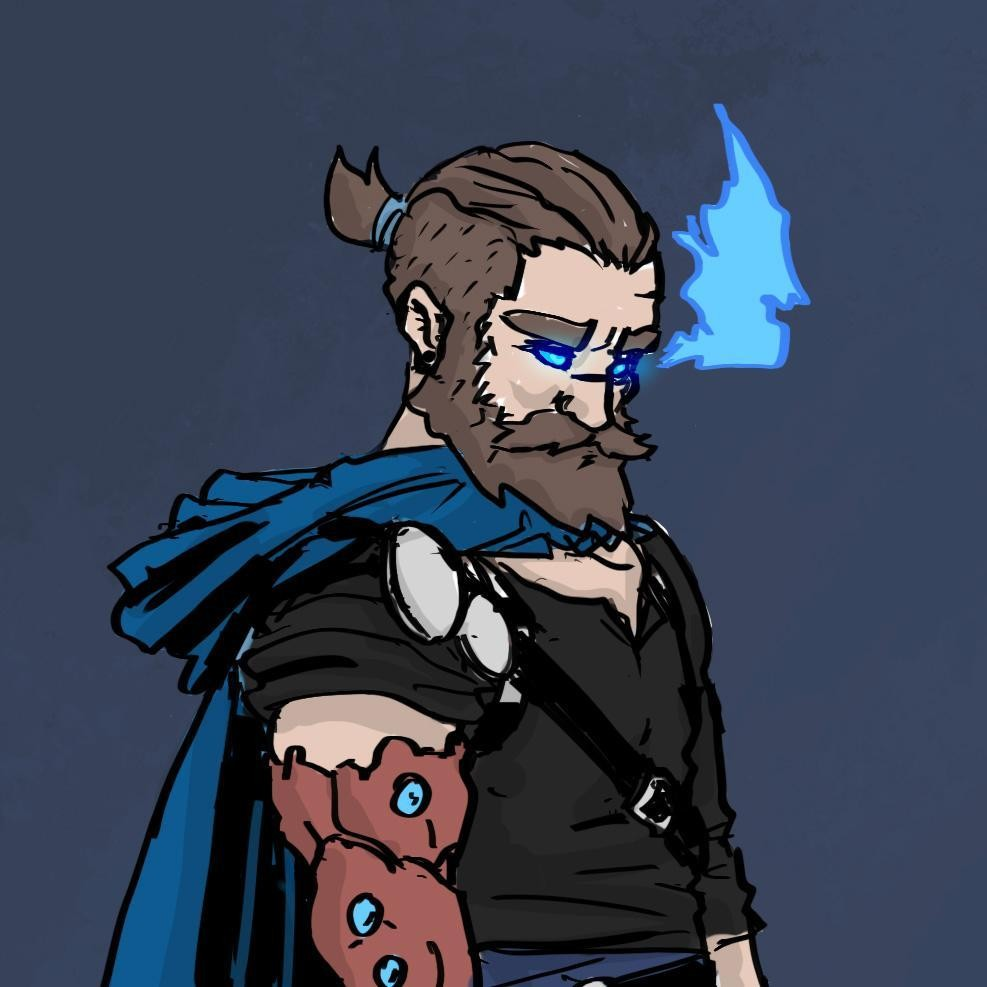

# Dustin Thorne ([S01](s01_purificacao_riacho.md), [S02](s02_miner_difficulties.md), [S04B](s04b_vale_sombrio_culto_alado.md), [S10C](s10c_baile_rainha_caecena.md), [S11A](s11a_sombras_de_iuz.md), [S12](s12b_legado_de_krixis.md), [S13A](s13a_resgate_dustin.md), [S15A](s15a_ceptro_de_zan.md))

| { width=200 } | { width=300 } | { width=200 } |
| ------------------------------------------------------------------------------- | :-----------------------------------------------------------------------------: | :-----------------------------------------------------------------------------: |

---
**[DM-ONLY – Não incluir na Wiki]**

### 🎲 Jogador / 🎲 Player

| 🎲 Jogador | 🎲 Player |
| ---------------------------------------------------------------------------- | ---------------------------------------------------------------------------- |
| **Jogador:** Paulo Costa | **Player:** Paulo Costa |
| **Idade:** 30 | **Age:** 30 |
| **Contacto:** +351 910 358 406 | **Contact:** +351 910 358 406 |
| **Instagram:** [por preencher] | **Instagram:** [to be filled] |
| **Discord:** [por preencher] | **Discord:** [to be filled] |
| **Ficha D&D Beyond:** [Link](https://www.dndbeyond.com/characters/138363817) | **D&D Beyond Sheet:** [Link](https://www.dndbeyond.com/characters/138363817) |

**[DM-ONLY – Não incluir na Wiki]**

---

### 🧙 Personagem / 🧙 Character Details

| **🧙 Personagem** | **🧙 Character** |
| ---------------------------- | -------------------------- |
| Nome: [Dustin Thorne](pc_dustin_thorne.md) | Name: [Dustin Thorne](pc_dustin_thorne.md) |
| Espécie: [Aasimar](https://www.dndbeyond.com/races/aasimar) | Species: [Aasimar](https://www.dndbeyond.com/races/aasimar) |
| Classe: [Paladin](https://www.dndbeyond.com/classes/paladin) | Class: [Paladin](https://www.dndbeyond.com/classes/paladin) |
| Alinhamento: [por preencher] | Alignment: [to be filled] |
| Background: [por preencher] | Background: [to be filled] |
| Idade: [por preencher] | Age: [to be filled] |
| Altura: [por preencher] | Height: [to be filled] |
| Olhos: [por preencher] | Eyes: [to be filled] |
| Cabelo: [por preencher] | Hair: [to be filled] |
| Pele: [por preencher] | Skin: [to be filled] |
| Tamanho: [por preencher] | Size: [to be filled] |

---

### 📜 Descrição Física / 📜 Physical Description

| **📜 Descrição Física** | **📜 Physical Description** |
| ----------------------- | --------------------------- |
| [Dustin](pc_dustin_thorne.md) é um striking [aasimar](https://www.dndbeyond.com/races/aasimar), alto e de porte atlético. A sua pele clara contrasta com os olhos intensos, que brilham com uma chama azul sobrenatural, reflexo da sua herança celestial. O cabelo castanho é mantido comprido e preso para trás, reforçando a sua figura disciplinada de [paladino](https://www.dndbeyond.com/classes/paladin). Usa frequentemente capa azul esvoaçante, associada ao seu símbolo de proteção e ao juramento que carrega. As imagens revelam-no em poses de combate, empunhando [espadas longas](https://www.dndbeyond.com/equipment/longsword) que emanam energia sagrada, ou em retratos mais serenos, onde a aura celestial se destaca. As runas e cicatrizes no braço denunciam tanto sacrifício como poder adquirido em batalhas passadas. A sua postura é confiante, transmitindo ao mesmo tempo fardo e determinação. | [Dustin](pc_dustin_thorne.md) is a striking [aasimar](https://www.dndbeyond.com/races/aasimar), tall and athletically built. His fair skin contrasts with his intense eyes, which glow with a supernatural blue flame — a reflection of his celestial heritage. His brown hair is kept long and tied back, reinforcing his disciplined [paladin](https://www.dndbeyond.com/classes/paladin) figure. He often wears a flowing blue cloak, tied to his symbol of protection and the oath he bears. The images depict him in combat poses, wielding [longswords](https://www.dndbeyond.com/equipment/longsword) imbued with holy energy, or in calmer portraits where his celestial aura is evident. The runes and scars on his arm reveal both sacrifice and the power earned through past battles. His stance is confident, conveying both burden and resolve. |

---

### ⚔️ Itens / ⚔️ Items

| **⚔️ Itens** | **⚔️ Items** |
| ------------------------------------------------------------------------------------------------------------------------------------------------------------------- | -------------------------------------------------------------------------------------------------------------------------------------------------------- |
| **Armadura/Escudo:** [Splint Armor](https://www.dndbeyond.com/equipment/splint-armor), [Shield](https://www.dndbeyond.com/equipment/shield) +1  **Armas:** Dawn’s Edge [Longsword](https://www.dndbeyond.com/equipment/longsword) (especial); [Longsword](https://www.dndbeyond.com/equipment/longsword) +1; [Whip](https://www.dndbeyond.com/equipment/whip); (para vender: [Javelins](https://www.dndbeyond.com/equipment/javelin), [Longsword](https://www.dndbeyond.com/equipment/longsword), [Shortbow](https://www.dndbeyond.com/equipment/shortbow)) **Items mágicos:** [Cloak of Protection](https://www.dndbeyond.com/magic-items/cloak-of-protection); Quicksilver Clay; Basilisk tooth/poison dagger; Guiding Ring; Illithid Ring; Ring of Cantrips; Eternal Lily; Vial of pixie dust; Unicorn horn (Feywild); Gloves for unicorn ritual **Poções:** Firebreath; [Invisibility](https://www.dndbeyond.com/spells/invisibility); [Potion of Healing](https://www.dndbeyond.com/magic-items/potion-of-healing) (×10); [Antitoxin](https://www.dndbeyond.com/equipment/antitoxin) (×8) **Items não mágicos:** Blanket; [Holy Water](https://www.dndbeyond.com/equipment/holy-water); Lamp; Playing Cards; [Tinderbox](https://www.dndbeyond.com/equipment/tinderbox); Amulet; [Healer’s Kit](https://www.dndbeyond.com/equipment/healers-kit); [Cook’s Utensils](https://www.dndbeyond.com/equipment/cooks-utensils); [Woodcarver’s Tools](https://www.dndbeyond.com/equipment/woodcarvers-tools); Distintivo Polícia Greyhawk; Licenças (poções e vendas); [Carta Pryssana](carta_pryssana.md); spectator eye belt keychain; cloak do [Culto do Mal Elemental](cult_of_elemental_evil.md); [colar dente Hook Horror](hook_horror_teeth.md); crânio lobo; peruca **Ouro:** 897 (varia) | **Armor/Shield:** [Splint Armor](https://www.dndbeyond.com/equipment/splint-armor), [Shield](https://www.dndbeyond.com/equipment/shield) +1  **Weapons:** Dawn’s Edge [Longsword](https://www.dndbeyond.com/equipment/longsword) (special); [Longsword](https://www.dndbeyond.com/equipment/longsword) +1; [Whip](https://www.dndbeyond.com/equipment/whip); (to sell: [Javelins](https://www.dndbeyond.com/equipment/javelin), [Longsword](https://www.dndbeyond.com/equipment/longsword), [Shortbow](https://www.dndbeyond.com/equipment/shortbow)) **Magical Items:** [Cloak of Protection](https://www.dndbeyond.com/magic-items/cloak-of-protection); Quicksilver Clay; Basilisk tooth/poison dagger; Guiding Ring; Illithid Ring; Ring of Cantrips; Eternal Lily; Vial of pixie dust; Unicorn horn (Feywild); Gloves for unicorn ritual **Potions:** Firebreath; [Invisibility](https://www.dndbeyond.com/spells/invisibility); [Potion of Healing](https://www.dndbeyond.com/magic-items/potion-of-healing) (×10); [Antitoxin](https://www.dndbeyond.com/equipment/antitoxin) (×8) **Non-magical Items:** Blanket; [Holy Water](https://www.dndbeyond.com/equipment/holy-water); Lamp; Playing Cards; [Tinderbox](https://www.dndbeyond.com/equipment/tinderbox); Amulet; [Healer’s Kit](https://www.dndbeyond.com/equipment/healers-kit); [Cook’s Utensils](https://www.dndbeyond.com/equipment/cooks-utensils); [Woodcarver’s Tools](https://www.dndbeyond.com/equipment/woodcarvers-tools); Greyhawk Police Badge; Licenses (potions and trade); [Prysanna’s Letter](carta_pryssana.md); spectator eye belt keychain; [Cult of Elemental Evil](cult_of_elemental_evil.md) cloak; [Hook Horror tooth necklace](hook_horror_teeth.md); wolf skull; wig **Gold:** 897 (varies) |

---

### 📖 História – Antes da Taberna / 📖 Story – Before the Tavern

| **📖 História – Antes da Taberna** | **📖 Story – Before the Tavern** |
| ---------------------------------- | -------------------------------- |
| - Cresceu como soldado dos **Lobos Radiantes**, guerreiros criados sob a bênção da deusa [Beltar](order_of_beltar.md). - Era considerado o mais fraco, por questionar a autoridade da sua mãe/deusa. - Descobriu os planos sombrios da ordem e sabotou uma missão, causando a morte de muitos camaradas e a dissolução do grupo. - Vagueia em busca de expiação e propósito. - Amizade marcada com **Puck Silvertongue**, gnomo criminoso de coração de ouro e grande ganância. - Eventualmente foi ressuscitado pela magia da [Grande Taberna](great_tavern.md), com [memórias incompletas](fragmented_memories.md) da sua vida passada (**Inferido com base nas sessões**). | - Raised as a soldier of the **Radiant Wolves**, warriors born under the blessing of the goddess [Beltar](order_of_beltar.md). - Considered the weakest for questioning the authority of his mother/goddess. - Discovered the order’s dark plans and sabotaged a mission, causing the death of many comrades and the group’s dissolution. - Wanders in search of atonement and purpose. - Bonded friendship with **Puck Silvertongue**, a criminal gnome with a heart of gold and great greed. - Eventually resurrected by the magic of the [Great Tavern](great_tavern.md), with [fragmented memories](fragmented_memories.md) of his past life (**Inferred from sessions**). |

---

### 📖 História – Depois da Taberna / 📖 Story – After the Tavern

| **📖 História – Depois da Taberna** | **📖 Story – After the Tavern** |
| ----------------------------------- | -------------------------------- |
| [Dustin](pc_dustin_thorne.md) esteve presente desde a **primeira missão da Taberna** (998 CY, 15 Patchwall / 2025-01-02), investigando o [riacho poluído](polluted_stream.md) perto de [High Ery](high_ery.md), onde conheceu [Borogrove](npc_borogrove.md) e enfrentou os horrores do [Culto do Mal Elemental](cult_of_elemental_evil.md).    Acompanhou o resgate de [Kristryd Splitanvil](docs/npc/-/Blackstone/npc_kristryd_splitanvil.md) em [Blackstone](blackstone.md), enfrentando um [Hook Horror](https://www.dndbeyond.com/monsters/hook-horror) e devolvendo a [carta de Thargrin](thargrin_letter.md).    Participou nas expedições ao [Vale do Vento Sombrio](vale_do_vento_sombrio.md), onde testemunhou os rituais de [Vaelkor Ashbrand](docs/dm/-/npc/Abandoned%20Village/npc_vaelkor_ashbrand.md).    Teve papel destacado no **Baile dos High Fae**, onde dançou com [Pryssana](docs/dm/-/npc/Fey/npc_pryssana.md), com quem partilha um elo especial de destino.    Durante 999 CY, foi **capturado por paladinos de [Beltar](order_of_beltar.md)**, acusado de ser uma ameaça, mas acabou resgatado pelos companheiros.    Seguiram-se eventos caóticos: [teleporte da Taberna](tavern_teleportation.md), [contacto com os Illithid](illithid_contact.md), e [batalhas contra guildas e cultos em Greyhawk](battles_in_greyhawk.md). | [Dustin](pc_dustin_thorne.md) was present since the **Tavern’s first mission** (998 CY, 15 Patchwall / 2025-01-02), investigating the [polluted stream](polluted_stream.md) near [High Ery](high_ery.md), where he met [Borogrove](npc_borogrove.md) and faced the horrors of the [Cult of Elemental Evil](cult_of_elemental_evil.md).    He accompanied the rescue of [Kristryd Splitanvil](docs/npc/-/Blackstone/npc_kristryd_splitanvil.md) in [Blackstone](blackstone.md), facing a [Hook Horror](https://www.dndbeyond.com/monsters/hook-horror) and returning [Thargrin’s farewell letter](thargrin_letter.md).    He joined expeditions to the [Shadowwind Vale](vale_do_vento_sombrio.md), where he witnessed the rituals of [Vaelkor Ashbrand](docs/dm/-/npc/Abandoned%20Village/npc_vaelkor_ashbrand.md).    He played a central role in the **High Fae Ball**, where he danced with [Pryssana](docs/dm/-/npc/Fey/npc_pryssana.md), with whom he shares a fated bond.    During 999 CY, he was **captured by paladins of [Beltar](order_of_beltar.md)**, accused of being a threat, but was later rescued by his companions.    Chaotic events followed: the [Tavern’s teleportation](tavern_teleportation.md), [Illithid abduction](illithid_contact.md), and [battles against guilds and cults in Greyhawk](battles_in_greyhawk.md). |

---

### 🎭 Dramatis Personae / 🎭 Dramatis Personae

| **🎭 Dramatis Persona** | **🎭 Dramatis Personae** |
| --------------------------------------------------------------------------------------------------------------------------------------- | --------------------------------------------------------------------------------------------------------------------------------- |
| **NPCs de influência direta:** - [Borogrove](npc_borogrove.md) – Treant que lhe deu a primeira missão. - [Pryssana](docs/dm/-/npc/Fey/npc_pryssana.md) – ligação romântica e destino comum. - [Kristryd Splitanvil](docs/npc/-/Blackstone/npc_kristryd_splitanvil.md) – anão resgatado na mina de obsidiana. - [Aria Greenbottle](docs/dm/-/npc/Free%20City%20of%20Grehawk/npc_aria_greenbottle.md) – criança resgatada nas [Ruínas das Sombras](ruinas_das_sombras.md). - **Puck Silvertongue** – gnomo ladrão e seu antigo amigo. **Antagonistas:** - Paladinos de [Beltar](order_of_beltar.md) – caçadores implacáveis que o perseguiram. - [Vaelkor Ashbrand](docs/dm/-/npc/Abandoned%20Village/npc_vaelkor_ashbrand.md) – cultista líder no [Vale do Vento Sombrio](vale_do_vento_sombrio.md). - [Guilda dos Assassinos](assassins_guild.md). **Aliados:** - [Triss](pc_triss_merril.md), [Vaunia](pc_vaunia_kolakiala.md), [Conan](pc_conan_barbaro_ra.md), [Markus Grimm](pc_markus_grimm.md), [Kai](pc_kai.md), [Usopp](pc_usopp.md), [Orianna](pc_orianna.md), [Grix’Molah](pc_grix_molah.md), [Lone Straw](pc_lone_straw.md). | **Direct Influence NPCs:** - [Borogrove](npc_borogrove.md) – Treant who gave him his first mission. - [Pryssana](docs/dm/-/npc/Fey/npc_pryssana.md) – romantic link and fated bond. - [Kristryd Splitanvil](docs/npc/-/Blackstone/npc_kristryd_splitanvil.md) – dwarf rescued from the obsidian mine. - [Aria Greenbottle](docs/dm/-/npc/Free%20City%20of%20Grehawk/npc_aria_greenbottle.md) – child rescued in the [Shadow Ruins](ruinas_das_sombras.md). - **Puck Silvertongue** – gnome thief and his former friend. **Antagonists:** - Paladins of [Beltar](order_of_beltar.md) – relentless hunters who pursued him. - [Vaelkor Ashbrand](docs/dm/-/npc/Abandoned%20Village/npc_vaelkor_ashbrand.md) – cult leader in the [Shadowwind Vale](vale_do_vento_sombrio.md). - [Assassins Guild](assassins_guild.md). **Allies:** - [Triss](pc_triss_merril.md), [Vaunia](pc_vaunia_kolakiala.md), [Conan](pc_conan_barbaro_ra.md), [Markus Grimm](pc_markus_grimm.md), [Kai](pc_kai.md), [Usopp](pc_usopp.md), [Orianna](pc_orianna.md), [Grix’Molah](pc_grix_molah.md), [Lone Straw](pc_lone_straw.md). |

---

### 🔮 OBS / 🔮 Notes

| **🔮 OBS** | **🔮 Notes** |
| ---------- | ------------ |
| [Dustin](pc_dustin_thorne.md) é uma das figuras centrais da campanha: esteve desde a primeira sessão, criou ligação romântica com [Pryssana](docs/dm/-/npc/Fey/npc_pryssana.md), foi perseguido pelos paladinos de [Beltar](order_of_beltar.md) e [raptado por Illithid](illithid_abduction.md). Possui múltiplos itens mágicos únicos e licenças oficiais em [Greyhawk](free_city_of_greyhawk.md). | [Dustin](pc_dustin_thorne.md) is one of the central figures of the campaign: present since the first session, forged a romantic bond with [Pryssana](docs/dm/-/npc/Fey/npc_pryssana.md), was hunted by [Beltar’s paladins](order_of_beltar.md), and [abducted by Illithid](illithid_abduction.md). He carries multiple unique magical items and official licenses in [Greyhawk](free_city_of_greyhawk.md). |

---

## Processing Audit

### Internal Links

| Source File | Linked Files |
| :--- | :--- |
| pc_dustin_thorne.md | s01_purificacao_riacho.md, s02_miner_difficulties.md, s04b_vale_sombrio_culto_alado.md, s10c_baile_rainha_caecena.md, s11a_sombras_de_iuz.md, s12b_legado_de_krixis.md, s13a_resgate_dustin.md, s15a_ceptro_de_zan.md, pc_dustin_thorne.md, carta_pryssana.md, cult_of_elemental_evil.md, hook_horror_teeth.md, order_of_beltar.md, great_tavern.md, fragmented_memories.md, polluted_stream.md, high_ery.md, npc_borogrove.md, kristryd_splitanvil.md, blackstone.md, thargrin_letter.md, vale_do_vento_sombrio.md, npc_vaelkor_ashbrand.md, npc_pryssana.md, tavern_teleportation.md, illithid_contact.md, battles_in_greyhawk.md, npc_aria_greenbottle.md, ruinas_das_sombras.md, assassins_guild.md, pc_triss_merril.md, pc_vaunia_kolakiala.md, pc_conan_barbaro_ra.md, pc_markus_grimm.md, pc_kai.md, pc_usopp.md, pc_orianna.md, pc_grix_molah.md, pc_lone_straw.md, illithid_abduction.md, free_city_of_greyhawk.md |

### Warnings

| Type | Where | Detail |
| :--- | :--- | :--- |
| Session Filepath | `## Dustin Thorne` | Changed `docs/adventures/-/T01/s02_miner_difficulties.md` to basename `s02_miner_difficulties.md` |
| Missing File - No DDB Link | `⚔️ Itens / ⚔️ Items` | Magical Item `Dawn’s Edge Longsword` is not a known DDB item; kept as plain text. |
| Missing File - No DDB Link | `⚔️ Itens / ⚔️ Items` | Magical Item `Quicksilver Clay` is not a known DDB item; kept as plain text. |
| Missing File - No DDB Link | `⚔️ Itens / ⚔️ Items` | Magical Item `Basilisk tooth/poison dagger` is not a known DDB item; kept as plain text. |
| Missing File - No DDB Link | `⚔️ Itens / ⚔️ Items` | Magical Item `Guiding Ring` is not a known DDB item; kept as plain text. |
| Missing File - No DDB Link | `⚔️ Itens / ⚔️ Items` | Magical Item `Illithid Ring` is not a known DDB item; kept as plain text. |
| Missing File - No DDB Link | `⚔️ Itens / ⚔️ Items` | Magical Item `Ring of Cantrips` is not a known DDB item; kept as plain text. |
| Missing File - No DDB Link | `⚔️ Itens / ⚔️ Items` | Magical Item `Eternal Lily` is not a known DDB item; kept as plain text. |
| Missing File - No DDB Link | `⚔️ Itens / ⚔️ Items` | Magical Item `Vial of pixie dust` is not a known DDB item; kept as plain text. |
| Missing File - No DDB Link | `⚔️ Itens / ⚔️ Items` | Magical Item `Unicorn horn (Feywild)` is not a known DDB item; kept as plain text. |
| Missing File - No DDB Link | `⚔️ Itens / ⚔️ Items` | Magical Item `Gloves for unicorn ritual` is not a known DDB item; kept as plain text. |
| Missing File - No DDB Link | `⚔️ Itens / ⚔️ Items` | Potion `Firebreath` is not a known DDB item; kept as plain text. |
| Missing File - No DDB Link | `⚔️ Itens / ⚔️ Items` | Non-Magical Item `Blanket` is not a known DDB equipment; kept as plain text. |
| Missing File - No DDB Link | `⚔️ Itens / ⚔️ Items` | Non-Magical Item `Lamp` is not a known DDB equipment; kept as plain text. |
| Missing File - No DDB Link | `⚔️ Itens / ⚔️ Items` | Non-Magical Item `Playing Cards` is not a known DDB equipment; kept as plain text. |
| Missing File - No DDB Link | `⚔️ Itens / ⚔️ Items` | Non-Magical Item `Amulet` is not a known DDB equipment; kept as plain text. |
| Missing File - No DDB Link | `⚔️ Itens / ⚔️ Items` | Non-Magical Item `Distintivo Polícia Greyhawk` is not a known DDB equipment; kept as plain text. |
| Missing File - No DDB Link | `⚔️ Itens / ⚔️ Items` | Non-Magical Item `spectator eye belt keychain` is not a known DDB equipment; kept as plain text. |
| Missing File - No DDB Link | `⚔️ Itens / ⚔️ Items` | Non-Magical Item `wolf skull` is not a known DDB equipment; kept as plain text. |
| Missing File - No DDB Link | `⚔️ Itens / ⚔️ Items` | Non-Magical Item `wig` is not a known DDB equipment; kept as plain text. |

### Missing Files

| Type | Where | Detail |
| :--- | :--- | :--- |
| Entity File | `⚔️ Itens / ⚔️ Items` | `carta_pryssana.md` |
| Entity File | `⚔️ Itens / ⚔️ Items` | `cult_of_elemental_evil.md` |
| Entity File | `⚔️ Itens / ⚔️ Items` | `hook_horror_teeth.md` |
| Entity File | `📖 História – Antes da Taberna` | `order_of_beltar.md` |
| Entity File | `📖 História – Antes da Taberna` | `great_tavern.md` |
| Entity File | `📖 História – Antes da Taberna` | `fragmented_memories.md` |
| Entity File | `📖 História – Depois da Taberna` | `polluted_stream.md` |
| Entity File | `📖 História – Depois da Taberna` | `high_ery.md` |
| Entity File | `📖 História – Depois da Taberna` | `npc_borogrove.md` |
| Entity File | `📖 História – Depois da Taberna` | `kristryd_splitanvil.md` |
| Entity File | `📖 História – Depois da Taberna` | `blackstone.md` |
| Entity File | `📖 História – Depois da Taberna` | `thargrin_letter.md` |
| Entity File | `📖 História – Depois da Taberna` | `vale_do_vento_sombrio.md` |
| Entity File | `📖 História – Depois da Taberna` | `npc_vaelkor_ashbrand.md` |
| Entity File | `📖 História – Depois da Taberna` | `npc_pryssana.md` |
| Entity File | `📖 História – Depois da Taberna` | `tavern_teleportation.md` |
| Entity File | `📖 História – Depois da Taberna` | `illithid_contact.md` |
| Entity File | `📖 História – Depois da Taberna` | `battles_in_greyhawk.md` |
| Entity File | `🎭 Dramatis Personae / 🎭 Dramatis Personae` | `npc_aria_greenbottle.md` |
| Entity File | `🎭 Dramatis Personae / 🎭 Dramatis Personae` | `ruinas_das_sombras.md` |
| Entity File | `🎭 Dramatis Personae / 🎭 Dramatis Personae` | `assassins_guild.md` |
| Entity File | `🎭 Dramatis Personae / 🎭 Dramatis Personae` | `pc_triss_merril.md` |
| Entity File | `🎭 Dramatis Personae / 🎭 Dramatis Personae` | `pc_vaunia_kolakiala.md` |
| Entity File | `🎭 Dramatis Personae / 🎭 Dramatis Personae` | `pc_conan_barbaro_ra.md` |
| Entity File | `🎭 Dramatis Personae / 🎭 Dramatis Personae` | `pc_markus_grimm.md` |
| Entity File | `🎭 Dramatis Personae / 🎭 Dramatis Personae` | `pc_kai.md` |
| Entity File | `🎭 Dramatis Personae / 🎭 Dramatis Personae` | `pc_usopp.md` |
| Entity File | `🎭 Dramatis Personae / 🎭 Dramatis Personae` | `pc_orianna.md` |
| Entity File | `🎭 Dramatis Personae / 🎭 Dramatis Personae` | `pc_grix_molah.md` |
| Entity File | `🎭 Dramatis Personae / 🎭 Dramatis Personae` | `pc_lone_straw.md` |
| Entity File | `🔮 OBS / 🔮 Notes` | `illithid_abduction.md` |
| Entity File | `🔮 OBS / 🔮 Notes` | `free_city_of_greyhawk.md` |
