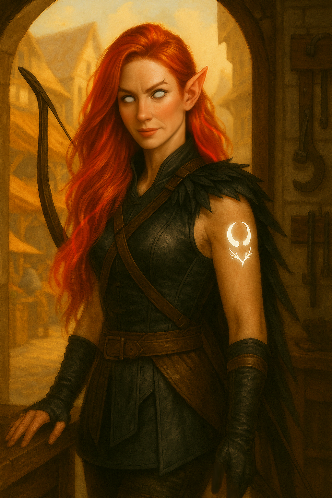

# [Eirwen](pc_eirwen.md) ([S29A](s29a_museu_sombras_p2.md), [S30A](s30a_polimorfismo_sea_hag.md) , [S31](s31_idolo_lady_scale_p3.md))

|  |  |  |
| -------------------------------------------- | -------------------------------------------- | ---------------------------------------------------------- |
| arte por Élavar 💙 | - | ***Ninguém se lembra do eclipse. Ninguém exceto ela.*** |

---

**[DM-ONLY – Não incluir na Wiki]**

### 🎲 Jogador / Player 🎲

| 🎲 Jogador | 🎲 Player |
| :--- | :--- |
| **Jogadora:** Aylin Mendes | **Player:** Aylin Mendes |
| **Idade:** 26 | **Age:** 26 |
| **Contacto:** +351 961 762 194 | **Contact:** +351 961 762 194 |
| **Instagram:** @aylins_memories | **Instagram:** @aylins_memories |
| **Discord:** moonblisspt | **Discord:** moonblisspt |
| **Ficha D&D Beyond:** [Link](https://www.dndbeyond.com/characters/147371208) | **D&D Beyond Sheet:** [Link](https://www.dndbeyond.com/characters/147371208) |

**[DM-ONLY – Não incluir na Wiki]**

---

### 🧙 Personagem / Character

| **🧙 Personagem**                                                                                                                     | **🧙 Character**                                                                                                                     |
| :------------------------------------------------------------------------------------------------------------------------------------ | :----------------------------------------------------------------------------------------------------------------------------------- |
| **Nome:** [Eirwen](pc_eirwen.md)                                                                                                      | **Name:** [Eirwen](pc_eirwen.md)                                                                                                     |
| **Espécie:** [Eladrin](https://www.dndbeyond.com/races/eladrin)                                                                       | **Species:** [Eladrin](https://www.dndbeyond.com/races/eladrin)                                                                      |
| **Classe:** [Ranger](https://www.dndbeyond.com/classes/ranger) ([Fey Wanderer](https://www.dndbeyond.com/classes/ranger#FeyWanderer)) | **Class:** [Ranger](https://www.dndbeyond.com/classes/ranger) ([Fey Wanderer](https://www.dndbeyond.com/classes/ranger#FeyWanderer)) |
| **Alinhamento:** True Neutral (a tender para o Bem à medida que a história progride)                                                  | **Alignment:** True Neutral (leaning towards Good as the story progresses)                                                           |
| **Background:** [Hermit](https://www.dndbeyond.com/backgrounds/hermit)                                                                | **Background:** [Hermit](https://www.dndbeyond.com/backgrounds/hermit)                                                               |
| **Idade:** 122                                                                                                                        | **Age:** 122                                                                                                                         |
| **Altura:** 1,68 m                                                                                                                    | **Height:** 1.68 m                                                                                                                   |
| **Olhos:** Azul-claro (Inverno), Rosa-escuro (Primavera), Branco-leitoso (Verão)                                                      | **Eyes:** Light blue (Winter), Dark pink (Spring), Milky white (Summer)                                                              |
| **Cabelo:** Branco-prateado (Inverno), Rosa coral (Primavera), Vermelho-fogo (Verão)                                                  | **Hair:** Ashen white (Winter), Coral pink (Spring), Fiery red (Summer)                                                              |
| **Pele:** Azul-acinzentada (Inverno), Verde-claro (Primavera), Dourado (Verão)                                                        | **Skin:** Grey blue (Winter), Light green (Spring), Golden yellow (Summer)                                                           |
| **Tamanho:** Médio                                                                                                                    | **Size:** Medium                                                                                                                     |

---

### 📜 Descrição Física / 📜 Physical Description

| **📜 Descrição Física** | **📜 Physical Description** |
| :--- | :--- |
| [Eirwen](pc_eirwen.md) apresenta-se como uma [eladrin](https://www.dndbeyond.com/races/eladrin) de beleza etérea, cuja aparência muda consoante a estação que domina o seu espírito. No Inverno, pele azulada e cabelo prateado transmitem uma aura gélida e melancólica. Na Primavera, a pele adquire tons verdes e o cabelo rosado reflete vitalidade e ligação à natureza. No Verão, pele dourada e cabelos flamejantes irradiam intensidade e paixão. O porte é sempre esguio e gracioso, marcado por olhos feéricos que brilham com magia. Um [arco longo](https://www.dndbeyond.com/equipment/longbow) e [espadas curtas](https://www.dndbeyond.com/equipment/shortsword) acompanham-na, assim como a marca de duas luas entrelaçadas por frostvines, herança do ritual da Corte das Estrelas. | [Eirwen](pc_eirwen.md) appears as an [eladrin](https://www.dndbeyond.com/races/eladrin) of ethereal beauty, her aspect shifting with the season. In Winter, grey-blue skin and silver hair emanate a chilling melancholy. In Spring, green skin and pink hair radiate vitality and her bond with the wild. In Summer, golden skin and fiery hair blaze with passion and intensity. Always slender and graceful, her fey-touched eyes gleam with magic. She carries a [longbow](https://www.dndbeyond.com/equipment/longbow) and [short swords](https://www.dndbeyond.com/equipment/shortsword), and upon her arm glows the mark of two entwined moons bound by frostvines — legacy of the Court of Stars ritual. |

---

### ⚔️ Itens / ⚔️ Items

| **⚔️ Itens** | **⚔️ Items** |
| :--- | :--- |
| **Armadura/Escudo:** [Peitoral](https://www.dndbeyond.com/equipment/breastplate) | **Armor/Shield:** [Breastplate](https://www.dndbeyond.com/equipment/breastplate) |
| **Armas:** [Arco Longo](https://www.dndbeyond.com/equipment/longbow); [Espada Curta](https://www.dndbeyond.com/equipment/shortsword); [Cimitarra](https://www.dndbeyond.com/equipment/scimitar) | **Weapons:** [Longbow](https://www.dndbeyond.com/equipment/longbow); [Shortsword](https://www.dndbeyond.com/equipment/shortsword); [Scimitar](https://www.dndbeyond.com/equipment/scimitar) |
| **Items mágicos:** Nenhum | **Magical Items:** None |
| **Poções:** Nenhuma | **Potions:** None |
| **Items não mágicos:** Nenhum | **Non-magical Items:** None |
| **Ouro:** 766 | **Gold:** 766 |

---

### 📖 História – Antes da Taberna / 📖 Story – Before the Tavern

| **📖 História – Antes da Taberna** | **📖 Story – Before the Tavern** |
| :--- | :--- |
| Filha de [Egalar](egalar.md), paladino e escolhido de [Titânia](titania.md). Criada isolada na floresta da Corte do Inverno. Durante um eclipse lunar, foi puxada para um ritual na Corte das Estrelas, presidido por [Titânia](titania.md), que lhe deixou memórias fragmentadas e a marca de duas luas entrelaçadas por frostvines. Enviada ao Plano Material como emissária, sem saber a sua missão. O seu estado [Eladrin](https://www.dndbeyond.com/races/eladrin) é dominado pelo Inverno, trazendo-lhe melancolia. | Daughter of [Egalar](egalar.md), paladin and chosen of [Titania](titania.md). Raised in isolation in the Winter Court’s woods. During a lunar eclipse, she was drawn into a ritual of the Court of Stars, presided by [Titania](titania.md), which left her with fragmented memories and the mark of two entwined moons of frostvines. Sent to the Material Plane as an emissary, without memory of her mission. Her [Eladrin](https://www.dndbeyond.com/races/eladrin) state is dominated by Winter, which brings her melancholy. |

---

### 📖 História – Depois da Taberna / 📖 Story – After the Tavern

| **📖 História – Depois da Taberna** | **📖 Story – After the Tavern** |
| :--- | :--- |
| **[S29A](s29a_museu_sombras_p2.md)– O Museu das Maravilhas Sombras (999 CY, 05 Flocktime / 2025-07-10):** [Eirwen](pc_eirwen.md) surge de um portal no [museu](museu_das_maravilhas.md), reconhecida por [Ulma](pc_ulma.md). O grupo (com [Leo](pc_leo.md), [Zahel](pc_zahel.md), [Ketrich Flavifer](pc_ketrich_flavifer.md)) enfrenta o curador [Darsen](darsen.md), o demónio [Raelith](raelith.md) e estranhos autómatos. Loot: 100 GP e 1 gema (30 GP) cada, *Máscara de Observação*, *Miniatura de [Gárgula](https://www.dndbeyond.com/monsters/gargoyle) Viva*, *Livro da Curiosidade Proibida*.   **[S30A](s30a_polimorfismo_sea_hag.md) - Mapeamento dos Esgotos e [Piratas das Orquídeas Negras](black_orchids.md) (999 CY, 05 Flocktime / 2025-07-24):** Missão dada pelo [Taberneiro](innkeeper.md). Nos [esgotos de Greyhawk](esgotos_de_greyhawk.md), o grupo confronta [Ralph](ralph.md), jovem capitão pirata, e a tripulação das [Orquídeas Negras](black_orchids.md). Loot: 33 GP + 200 GP cada, anel (vendido), roupas de pirata. [Eirwen](pc_eirwen.md) oscilou entre ameaças e diplomacia, convencendo [Ralph](ralph.md) a dialogar antes do combate.   **[S31](s31_idolo_lady_scale_p3.md) – O Ídolo de [Lady Scale](lady_scale.md) (999 CY, 07 Flocktime / 2025-07-31):** Explora a estância [kobold](https://www.dndbeyond.com/monsters/kobold) e a Sala Silenciosa, onde encontram o fantasma [Lady Scale](lady_scale.md). [Eirwen](pc_eirwen.md) participa na purificação espiritual do local. Loot: ouro dividido entre o grupo.   Ao longo destas missões, as memórias de [Titânia](titania.md) e do seu pai [Egalar](egalar.md) ressurgem, reforçando a sua ligação feérica. O contacto com aliados humanos e não-humanos começa a despertar nela uma tendência para o Bem.   **(Inferido com base nas sessões):** Recorda-se de estar ao lado de [Titânia](titania.md) e ver um [eladrin](https://www.dndbeyond.com/races/eladrin) de cabelo branco em armadura decorada com ossos (o pai, [Egalar](egalar.md)). Reconheceu o bastão de [Grix’Molah](pc_grix_molah.md) como artefacto de [Titânia](titania.md), trazendo memórias de infância. Um corno de [unicórnio](https://www.dndbeyond.com/monsters/unicorn) despertou recordações de treino com [Egalar](egalar.md). | **[S29A](s29a_museu_sombras_p2.md) – Museum of Shadowed Wonders (999 CY, 05 Flocktime / 2025-07-10):** [Eirwen](pc_eirwen.md) emerges from a portal in the [museum](museu_das_maravilhas.md), recognized by [Ulma](pc_ulma.md). The group (with [Leo](pc_leo.md), [Zahel](pc_zahel.md), [Ketrich Flavifer](pc_ketrich_flavifer.md)) faces [Curator Darsen](darsen.md), the demon [Raelith](raelith.md), and strange constructs. Loot: 100 GP and 1 gem (30 GP) each, *Observation Mask*, *Living [Gargoyle](https://www.dndbeyond.com/monsters/gargoyle) Figurine*, *Book of Forbidden Curiosity*.   **[S30A](s30a_polimorfismo_sea_hag.md) – Mapping the Sewers & [Black Orchid Pirates](black_orchids.md) (999 CY, 05 Flocktime / 2025-07-24):** Mission from the [Tavernkeeper](innkeeper.md). In [Greyhawk's sewers](esgotos_de_greyhawk.md), the group confronts [Ralph](ralph.md), young pirate captain, and the [Black Orchids](black_orchids.md) crew. Loot: 33 GP + 200 GP each, ring (sold), pirate clothes. [Eirwen](pc_eirwen.md) alternated between threats and diplomacy, convincing [Ralph](ralph.md) to talk before combat.   **[S31](s31_idolo_lady_scale_p3.md) – The Idol of [Lady Scale](lady_scale.md) (999 CY, 07 Flocktime / 2025-07-31):** Explores the [kobold](https://www.dndbeyond.com/monsters/kobold) spa and the Silent Room, encountering the ghost [Lady Scale](lady_scale.md). [Eirwen](pc_eirwen.md) helps in the site’s purification. Loot: gold shared among the group.   Through these missions, resurfacing memories of [Titania](titania.md) and her father [Egalar](egalar.md) reinforce her fey ties. Contact with mortal allies awakens a moral leaning toward Good.   **(Inferred from sessions):** She recalls standing beside [Titania](titania.md) and seeing a white-haired [eladrin](https://www.dndbeyond.com/races/eladrin) in bone-decorated armor (her father, [Egalar](egalar.md)). She recognized [Grix’Molah’s](pc_grix_molah.md) staff as [Titania’s](titania.md) artifact, stirring childhood memories. A [unicorn](https://www.dndbeyond.com/monsters/unicorn) horn awoke recollections of training with [Egalar](egalar.md). |

---

### 🎭 Dramatis Persona / 🎭 Dramatis Personae

| **🎭 Dramatis Persona** | **🎭 Dramatis Personae** |
| :--- | :--- |
| **NPCs de influência direta:** - [Titânia](titania.md) - [Egalar](egalar.md) | **Direct Influence NPCs:** - [Titania](titania.md) - [Egalar](egalar.md) |
| **Antagonistas:** - [Curador Darsen](darsen.md) - [Raelith](raelith.md) | **Antagonists:** - [Curator Darsen](darsen.md) - [Raelith](raelith.md) |
| **Aliados:** - [Arkos Vasell](pc_arkos_vasell.md) - [Orianna](pc_orianna.md) - [Conan, o Bárbaro-Rã](pc_conan_barbaro_ra.md) - [Bok Thunderfist](pc_bok_thunderfist.md) - [Drayl Bharash](pc_drayl_bharash.md) - [Leo](pc_leo.md) - [Ulma](pc_ulma.md) - [Zahel](pc_zahel.md) - [Ketrich Flavifer](pc_ketrich_flavifer.md) | **Allies:** - [Arkos Vasell](pc_arkos_vasell.md) - [Orianna](pc_orianna.md) - [Conan, the Frog-Barbarian](pc_conan_barbaro_ra.md) - [Bok Thunderfist](pc_bok_thunderfist.md) - [Drayl Bharash](pc_drayl_bharash.md) - [Leo](pc_leo.md) - [Ulma](pc_ulma.md) - [Zahel](pc_zahel.md) - [Ketrich Flavifer](pc_ketrich_flavifer.md) |

---

### 🔮 OBS / 🔮 Notes

| **🔮 OBS** | **🔮 Notes** |
| :--- | :--- |
| **[Eladrin](https://www.dndbeyond.com/races/eladrin) (Estações):** aparência, emoções e poderes mudam com as estações. **[Fey Step](https://www.dndbeyond.com/traits/fey-step) (bónus, 30 ft):** recarrega em short/long rest, com efeitos sazonais: - Outono: até 2 criaturas ficam *charmed*. - Inverno: 1 criatura fica *frightened* até final do turno. - Primavera: podes teleportar outra criatura em teu lugar. - Verão: criaturas a 5 ft sofrem [dano de fogo](https://www.dndbeyond.com/damage-types/fire) = mod. Carisma.  Marca de duas luas entrelaçadas por frostvines, herança do ritual da Corte das Estrelas. | **[Eladrin](https://www.dndbeyond.com/races/eladrin) (Seasons):** appearance, emotions, and powers shift with the seasons. **[Fey Step](https://www.dndbeyond.com/traits/fey-step) (bonus, 30 ft):** recharges on short/long rest, with seasonal effects: - Autumn: up to 2 creatures *charmed*. - Winter: 1 creature *frightened* until end of turn. - Spring: teleport another creature instead. - Summer: creatures within 5 ft take [fire damage](https://www.dndbeyond.com/damage-types/fire) = Charisma mod.  Bears the mark of two moons entwined with frostvines, legacy of the Court of Stars ritual. |

---

### Processing Audit

#### 1. Internal Links

| Source File | Linked Files |
| :--- | :--- |
| pc_eirwen.md | pc_eirwen_01.png, pc_eirwen_02.png, pc_eirwen_03.png, pc_eirwen.md, s29a_museu_sombras_p2.md, s31_idolo_lady_scale_p3.md, egalar.md, titania.md, museu_das_maravilhas.md, pc_ulma.md, pc_leo.md, pc_zahel.md, pc_ketrich_flavifer.md, darsen.md, raelith.md, s30a_polimorfismo_sea_hag.md, innkeeper.md, esgotos_de_greyhawk.md, ralph.md, black_orchids.md, lady_scale.md, pc_grix_molah.md, pc_arkos_vasell.md, pc_orianna.md, pc_conan_barbaro_ra.md, pc_bok_thunderfist.md, pc_drayl_bharash.md |

#### 2. Warnings

| Type | Where | Detail |
| :--- | :--- | :--- |
| Session Duplication | H2 Title | Session `S29A` was listed twice in the original header. Reduced to a single entry in the title. |
| Session Linking | Table 2, Row 1 | Session `S29A` was listed twice in the original content. Reduced to a single entry in the table. |
| Session Linking | Table 2, Row 1 | Session `S31` used to link to `s31_idolo_lady_scale_p3.md`. Original list used `S31` twice. Reduced to a single entry in the table. |
| Session Linking | Table 5, Row 1 (PT) | Session `S30A` links to `s30a_polimorfismo_sea_hag.md`, but the session description in the content refers to the **S31A** event (Mapping the Sewers / Black Orchid Pirates) which is mislabeled in the input content as `S30A`. No file for `s31a_esgotos_piratas.md` was provided in the input directory. The linked file is `s30a_polimorfismo_sea_hag.md`. |
| Session Linking | Table 5, Row 1 (EN) | Session `S30A` links to `s30a_polimorfismo_sea_hag.md`, but the session description in the content refers to the **S31A** event (Mapping the Sewers / Black Orchid Pirates) which is mislabeled in the input content as `S30A`. No file for `s31a_esgotos_piratas.md` was provided in the input directory. The linked file is `s30a_polimorfismo_sea_hag.md`. |
| Ambiguous Link | Table 5, Row 1 (PT) | `Gárgula` linked to DDB `monsters/gargoyle` as it's a monster entry in the list. |
| Ambiguous Link | Table 5, Row 1 (EN) | `Gargoyle` linked to DDB `monsters/gargoyle` as it's a monster entry in the list. |
| Ambiguous Link | Table 5, Row 3 (PT) | `kobold` linked to DDB `monsters/kobold` as it's a monster entry in the list. |
| Ambiguous Link | Table 5, Row 3 (EN) | `kobold` linked to DDB `monsters/kobold` as it's a monster entry in the list. |
| Ambiguous Link | Table 5, Row 4 (PT) | `unicorn` linked to DDB `monsters/unicorn` as it's a monster entry in the list. |
| Ambiguous Link | Table 5, Row 4 (EN) | `unicorn` linked to DDB `monsters/unicorn` as it's a monster entry in the list. |
| Missing File | Table 6, Row 3 (PT) | Could not find local file for `pc_arkos_vasell.md`. Used generated link. |
| Missing File | Table 6, Row 3 (PT) | Could not find local file for `pc_orianna.md`. Used generated link. |
| Missing File | Table 6, Row 3 (PT) | Could not find local file for `pc_conan_barbaro_ra.md`. Used generated link. |
| Missing File | Table 6, Row 3 (PT) | Could not find local file for `pc_bok_thunderfist.md`. Used generated link. |
| Missing File | Table 6, Row 3 (PT) | Could not find local file for `pc_drayl_bharash.md`. Used generated link. |
| Missing File | Table 6, Row 3 (PT) | Could not find local file for `pc_leo.md`. Used generated link. |
| Missing File | Table 6, Row 3 (PT) | Could not find local file for `pc_ulma.md`. Used generated link. |
| Missing File | Table 6, Row 3 (PT) | Could not find local file for `pc_zahel.md`. Used generated link. |
| Missing File | Table 6, Row 3 (PT) | Could not find local file for `pc_ketrich_flavifer.md`. Used generated link. |
| Missing File | Table 6, Row 3 (EN) | Could not find local file for `pc_arkos_vasell.md`. Used generated link. |
| Missing File | Table 6, Row 3 (EN) | Could not find local file for `pc_orianna.md`. Used generated link. |
| Missing File | Table 6, Row 3 (EN) | Could not find local file for `pc_conan_barbaro_ra.md`. Used generated link. |
| Missing File | Table 6, Row 3 (EN) | Could not find local file for `pc_bok_thunderfist.md`. Used generated link. |
| Missing File | Table 6, Row 3 (EN) | Could not find local file for `pc_drayl_bharash.md`. Used generated link. |
| Missing File | Table 6, Row 3 (EN) | Could not find local file for `pc_leo.md`. Used generated link. |
| Missing File | Table 6, Row 3 (EN) | Could not find local file for `pc_ulma.md`. Used generated link. |
| Missing File | Table 6, Row 3 (EN) | Could not find local file for `pc_zahel.md`. Used generated link. |
| Missing File | Table 6, Row 3 (EN) | Could not find local file for `pc_ketrich_flavifer.md`. Used generated link. |
| Ambiguous Link | Table 7, Row 1 (EN) | `fire damage` linked to DDB `damage-types/fire` as it's a damage-type in the list. |

#### 3. Missing Files

| Type          | Where               | Detail                                               |
| :------------ | :------------------ | :--------------------------------------------------- |
| File Creation | Table 5, Row 1 (PT) | `museu_das_maravilhas.md` not found. Generated link. |
| File Creation | Table 5, Row 1 (PT) | `raelith.md` not found. Generated link.              |
| File Creation | Table 5, Row 1 (PT) | `innkeeper.md` not found. Generated link.            |
| File Creation | Table 5, Row 1 (PT) | `esgotos_de_greyhawk.md` not found. Generated link.  |
| File Creation | Table 5, Row 1 (PT) | `black_orchids.md` not found. Generated link.        |
| File Creation | Table 5, Row 1 (PT) | `ralph.md` not found. Generated link.                |
| File Creation | Table 5, Row 1 (PT) | `lady_scale.md` not found. Generated link.           |
| File Creation | Table 5, Row 1 (EN) | `museu_das_maravilhas.md` not found. Generated link. |
| File Creation | Table 5, Row 1 (EN) | `raelith.md` not found. Generated link.              |
| File Creation | Table 5, Row 1 (EN) | `innkeeper.md` not found. Generated link.            |
| File Creation | Table 5, Row 1 (EN) | `esgotos_de_greyhawk.md` not found. Generated link.  |
| File Creation | Table 5, Row 1 (EN) | `black_orchids.md` not found. Generated link.        |
| File Creation | Table 5, Row 1 (EN) | `ralph.md` not found. Generated link.                |
| File Creation | Table 5, Row 1 (EN) | `lady_scale.md` not found. Generated link.           |
| File Creation | Table 6, Row 3 (PT) | `pc_arkos_vasell.md` not found. Generated link.      |
| File Creation | Table 6, Row 3 (PT) | `pc_orianna.md` not found. Generated link.           |
| File Creation | Table 6, Row 3 (PT) | `pc_conan_barbaro_ra.md` not found. Generated link.  |
| File Creation | Table 6, Row 3 (PT) | `pc_bok_thunderfist.md` not found. Generated link.   |
| File Creation | Table 6, Row 3 (PT) | `pc_drayl_bharash.md` not found. Generated link.     |
| File Creation | Table 6, Row 3 (PT) | `pc_leo.md` not found. Generated link.               |
| File Creation | Table 6, Row 3 (PT) | `pc_ulma.md` not found. Generated link.              |
| File Creation | Table 6, Row 3 (PT) | `pc_zahel.md` not found. Generated link.             |
| File Creation | Table 6, Row 3 (PT) | `pc_ketrich_flavifer.md` not found. Generated link.  |
| File Creation | Table 6, Row 3 (EN) | `pc_arkos_vasell.md` not found. Generated link.      |
| File Creation | Table 6, Row 3 (EN) | `pc_orianna.md` not found. Generated link.           |
| File Creation | Table 6, Row 3 (EN) | `pc_conan_barbaro_ra.md` not found. Generated link.  |
| File Creation | Table 6, Row 3 (EN) | `pc_bok_thunderfist.md` not found. Generated link.   |
| File Creation | Table 6, Row 3 (EN) | `pc_drayl_bharash.md` not found. Generated link.     |
| File Creation | Table 6, Row 3 (EN) | `pc_leo.md` not found. Generated link.               |
| File Creation | Table 6, Row 3 (EN) | `pc_ulma.md` not found. Generated link.              |
| File Creation | Table 6, Row 3 (EN) | `pc_zahel.md` not found. Generated link.             |
| File Creation | Table 6, Row 3 (EN) | `pc_ketrich_flavifer.md` not found. Generated link.  |
