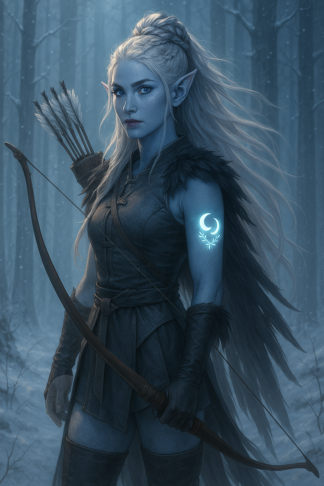

# Eirwen

|    |
| ------------------------------------------------------------------------------------------------------------------------------- |

| Português | English |
| --------- | ------- |
| **Jogadora:** Aylin Mendes | **Player:** Aylin Mendes |
| **Idade:** 26 | **Age:** 26 |
| **Género:** Feminino | **Gender:** Female |
| **Espécie:** Eladrin (Inverno) | **Species:** Eladrin (Winter) |
| **Olhos:** — | **Eyes:** — |
| **Cabelo:** — | **Hair:** — |
| **Pele:** — | **Skin:** — |
| **Tamanho:** Médio | **Size:** Medium |
| **Altura:** — | **Height:** — |
| **Classe:** Ranger (Fey Wanderer) | **Class:** Ranger (Fey Wanderer) |
| **Antecedente:** Desconhecido | **Background:** Unknown |
| **Alinhamento:** — | **Alignment:** — |
| **Nível:** 4 | **Level:** 4 |
| **Ficha D&D Beyond:** [Link](https://www.dndbeyond.com/characters/147371208) | **D&D Beyond Sheet:** [Link](https://www.dndbeyond.com/characters/147371208) |
| **Contacto:** +351 961 762 194 | **Contact:** +351 961 762 194 |
| **⚔️ Itens** **Armadura/Escudo:** Studded leather **Armas:** Longbow; Shortsword; Scimitar **Items mágicos:** Nenhum **Items não mágicos:** Nenhum **Ouro:** 822 | **⚔️ Items** **Armor/Shield:** Studded leather **Weapons:** Longbow; Shortsword; Scimitar **Magical Items:** None **Non-magical Items:** None **Gold:** 822 |
| **📖 História – Antes da Taberna** - Filha de **Egalar**, paladino e escolhido de Titânia. - Criada em isolamento na floresta da Corte do Inverno, longe das pressões Fey. - Durante um eclipse lunar, participou num ritual misterioso na Corte das Estrelas, presidido por Titânia; memórias fragmentadas e a marca de duas luas entrelaçadas por frostvines. - Enviada ao Plano Material como emissária, mas sem memória clara da sua missão. - Eladrin de Inverno: aparência, emoções e poderes mudam com as estações, mas o Inverno domina, trazendo-lhe melancolia. | **📖 Story – Before the Tavern** - Daughter of **Egalar**, paladin and chosen of Titania. - Raised in isolation in the Winter Court forest, away from Fey pressures. - During a lunar eclipse, drawn into a mysterious ritual at the Court of Stars led by Titania; memories fragmented and marked with two moons entwined by frostvines. - Sent to the Material Plane as an emissary, though with no memory of why. - Winter Eladrin: appearance, emotions and powers shift with seasons, but Winter dominates, bringing melancholy. |
| **📖 História – Depois da Taberna** - Recorda-se de estar ao lado de **Titânia** e ver um eladrin de cabelo branco com armadura decorada com ossos. - Reconheceu o **bastão de Grix** como artefacto de Titânia, trazendo memórias da infância com o pai. - Um corno de unicórnio despertou-lhe recordações de aprender técnicas de orientação com o eladrin de armadura óssea. | **📖 Story – After the Tavern** - Remembers standing by **Titania** and seeing a white-haired eladrin in bone-decorated armor. - Recognized **Grix’s staff** as Titania’s artifact, recalling childhood memories with her father. - A unicorn horn triggered memories of learning orientation techniques from the eladrin with bone armor. |
| **🭠Dramatis Persona** **NPCs de influência direta:** - **Titania** – Archfey, Queen of the Seelie Court. - **Egalar** – Father, paladin, white-haired eladrin in bone-decorated armor. **Antagonistas:** ? **Aliados:** ? | **🭠Dramatis Persona** **Direct Influence NPCs:** - **Titania** – Archfey, Queen of the Seelie Court. - **Egalar** – Father, paladin, white-haired eladrin in bone-decorated armor. **Antagonists:** ? **Allies:** ? |
| **🔮 OBS** - **Estações (Eladrin):** mudam aparência, humor e poderes. - **Fey Step (bónus, 30 ft):** recarrega em short/long rest, efeito adicional consoante a estação: Outono – até 2 criaturas ficam *charmed*. Inverno – 1 criatura fica *frightened* até final do turno. Primavera – podes teleportar uma criatura em teu lugar. Verão – criaturas até 5 ft sofrem dano de fogo = mod. Carisma. | **🔮 Notes** - **Seasons (Eladrin):** change appearance, mood, and powers. - **Fey Step (bonus, 30 ft):** recharges on short/long rest, with seasonal effect: Autumn – up to 2 creatures *charmed*. Winter – 1 creature *frightened* until end of turn. Spring – teleport a creature instead of yourself. Summer – chosen creatures within 5 ft take fire damage = Charisma mod. |
