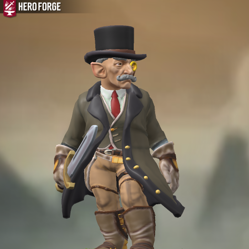

## Frederick "Freddy" Junsi ([S10A](s10a_intriga_high_ery.md), [S14B](s14b_dandan_e_os_40_kobolds.md), [S15B](s15b_a_crianca_perdida.md))

| { width=200 } | { width=200 } |
| ---------------------------------------------------------------------- | ---------------------------------------------------------------------- |

---

**[DM-ONLY – Não incluir na Wiki]**

### 🎲 Jogador / 🎲 Player

| 🎲 Jogador | 🎲 Player |
| ---------------------------------------------------------------------------- | ----------------------------------------------------------------------------- |
| **Jogador:** Alexandre Júlio | **Player:** Alexandre Júlio |
| **Idade:** [por preencher] | **Age:** [to be filled] |
| **Contacto:** +351 910 367 002 | **Contact:** +351 910 367 002 |
| **Instagram:** [por preencher] | **Instagram:** [to be filled] |
| **Discord:** [por preencher] | **Discord:** [to be filled] |
| **Ficha D&D Beyond:** [Link](https://www.dndbeyond.com/characters/140697485) | **D&D Beyond Sheet:** [Link](https://www.dndbeyond.com/characters/140697485) |

**[DM-ONLY – Não incluir na Wiki]**

---

### 🧙 Personagem / 🧙 Character

| **🧙 Personagem** | **🧙 Character** |
| ------------------------------ | ------------------------------- |
| Nome: [Frederick "Freddy" Junsi](pc_frederick_junsi.md) | Name: [Frederick "Freddy" Junsi](pc_frederick_junsi.md) |
| Espécie: [Halfling](https://www.dndbeyond.com/races/halfling) | Species: [Halfling](https://www.dndbeyond.com/races/halfling) |
| Classe: [Ladino](https://www.dndbeyond.com/classes/rogue) | Class: [Rogue](https://www.dndbeyond.com/classes/rogue) |
| Alinhamento: Neutro | Alignment: Neutral |
| Background: Criminoso | Background: Criminal |
| Idade: 272 | Age: 272 |
| Altura: [por preencher] | Height: [to be filled] |
| Olhos: [por preencher] | Eyes: [to be filled] |
| Cabelo: [por preencher] | Hair: [to be filled] |
| Pele: [por preencher] | Skin: [to be filled] |
| Tamanho: [por preencher] | Size: [to be filled] |

---

### 📜 Descrição Física / 📜 Physical Description

| **📜 Descrição Física** | **📜 Physical Description** |
| ----------------------- | --------------------------- |
| Freddy é um [halfling](https://www.dndbeyond.com/races/halfling) idoso, de estatura baixa mas presença marcante. O cabelo e o bigode grisalhos estão sempre bem tratados, destacando-se no rosto enrugado de quem já viveu muito mais do que aparenta. Os olhos são vivazes e astutos, transmitindo tanto humor quanto malícia, reflexo da sua vida dupla entre apicultor e criminoso. Nas imagens surge bem vestido: casaco de corte clássico, lenço ao pescoço e o inseparável chapéu de aba larga, que lhe dá um ar de cavalheiro antiquado. Apesar da idade avançada, mantém-se ágil e preparado, empunhando por vezes a [rapieira](https://www.dndbeyond.com/equipment/rapier) com a confiança de quem sabe sobreviver em qualquer rua ou beco. | Freddy is an elderly [halfling](https://www.dndbeyond.com/races/halfling), short in stature but striking in presence. His grey hair and mustache are always well-groomed, standing out against the wrinkled face of someone who has lived far longer than he seems. His eyes are lively and shrewd, showing both humor and mischief, a reflection of his double life as beekeeper and criminal. In the images he appears well-dressed: a tailored coat, neck scarf, and his signature wide-brimmed hat, giving him the air of an old-fashioned gentleman. Despite his advanced age, he remains agile and prepared, at times wielding his [rapier](https://www.dndbeyond.com/equipment/rapier) with the confidence of someone who knows how to survive in any street or alley. |

---

### ⚔️ Itens / ⚔️ Items

| **⚔️ Itens** | **⚔️ Items** |
| ---------------------- | ------------------------------ |
| **Armadura/Escudo:** [Leather Armor](https://www.dndbeyond.com/equipment/leather-armor)  **Armas:** [Rapier](https://www.dndbeyond.com/equipment/rapier), 2 [daggers](https://www.dndbeyond.com/equipment/dagger)  **Items mágicos:** [por preencher]  **Potions:** [por preencher]  **Items não mágicos:** [Backpack](https://www.dndbeyond.com/equipment/backpack), [Herbalism Kit](https://www.dndbeyond.com/equipment/herbalism-kit), Paper and Ink, [Chalk](https://www.dndbeyond.com/equipment/chalk-1-piece), [Candles](https://www.dndbeyond.com/equipment/candle), [Bedroll](https://www.dndbeyond.com/equipment/bedroll), Fine Clothes, Adventurer’s Clothes  **Ouro:** ~200 gp + 5 GP, 5 SP, 30 CP (roubado ao ferreiro em missão) | **Armor/Shield:** [Leather Armor](https://www.dndbeyond.com/equipment/leather-armor)  **Weapons:** [Rapier](https://www.dndbeyond.com/equipment/rapier), 2 [daggers](https://www.dndbeyond.com/equipment/dagger)  **Magical Items:** [to be filled]  **Potions:** [to be filled]  **Non-magical Items:** [Backpack](https://www.dndbeyond.com/equipment/backpack), [Herbalism Kit](https://www.dndbeyond.com/equipment/herbalism-kit), Paper and Ink, [Chalk](https://www.dndbeyond.com/equipment/chalk-1-piece), [Candles](https://www.dndbeyond.com/equipment/candle), [Bedroll](https://www.dndbeyond.com/equipment/bedroll), Fine Clothes, Adventurer’s Clothes  **Gold:** ~200 gp + 5 GP, 5 SP, 30 CP (stolen from blacksmith during mission) |

---

### 📖 História – Antes da Taberna / 📖 Story – Before the Tavern

| **📖 História – Antes da Taberna** | **📖 Story – Before the Tavern** |
| ---------------------------------- | -------------------------------- |
| Friedrick era apicultor nas Montanhas Seawall, em [Zilargo](zilargo.md) (Eberron), até ser amaldiçoado pelos rivais da [Sociedade da Compota](sociedade_da_compota.md). A maldição prolongou a sua vida para cerca de 500 anos e fez com que envelhecesse lentamente, mas levou-o a perder tudo — família, reputação e o seu famoso mel. Com o negócio destruído e apenas dois netos que não vê há anos, jurou vingança e entrou no submundo do crime. Apesar do caminho sombrio, mantém o amor pela apicultura. | Friedrick was a beekeeper in the Seawall Mountains of [Zilargo](zilargo.md) (Eberron) until he was cursed by rivals from the [Compote Society](sociedade_da_compota.md). The curse extended his lifespan to about 500 years and slowed his aging, but cost him everything — family, reputation, and his famous honey. With his business ruined and only two grandchildren he hasn’t seen in years, he swore vengeance and entered the criminal underworld. Despite the dark path, he never lost his love for beekeeping. |

---

### 📖 História – Depois da Taberna / 📖 Story – After the Tavern

| **📖 História – Depois da Taberna** | **📖 Story – After the Tavern** |
| -------------------------------------------------------------------------------------------------------------------------------------------------------------------------------------------------------------------------------------------------------------------------------------------------------------------------------------------------------------------------------------------------------------------------------------------------------------------------------------------------------------------------------------------------------------------------------------------------------------------------------------------------------------------------------------------------------------------------------------------------------------------------------------------------------------------------------------------------------------------------------------------------------------------------------------------------------------------------- | ------------------------------------------------------------------------------------------------------------------------------------------------------------------------------------------------------------------------------------------------------------------------------------------------------------------------------------------------------------------------------------------------------------------------------------------------------------------------------------------------------------------------------------------------------------------------------------------------------------------------------------------------------------------------------------------------------------------------------------------------------------------------------------------------------------------------------------------------------------------------------------------------------------------------------------------------------------------------------ |
| Freddy ([S10A](s06a_intriga_high_ery.md), [S14B](s14b_dandan_e_os_40_kobolds.md), [S15B](s15b_a_crianca_perdida.md)) participou em várias missões com destaque para **“Dandan e os 40 Kobolds”** ([S14B](s14b_dandan_e_os_40_kobolds.md)), onde se infiltrou desajeitadamente com [Gauthak](pc_gauthak_vunakamune.md) para enganar os [kobolds](kobolds_infectados.md), tendo descoberto pistas sobre a espada de Viltrix, o Justo, roubada em [Bernagrade](bernagrade.md). | Freddy ([S10A](s06a_intriga_high_ery.md), [S14B](s14b_dandan_e_os_40_kobolds.md), [S15B](s15b_a_crianca_perdida.md)) took part in several missions, most notably **“Dandan and the 40 Kobolds”** ([S14B](s14b_dandan_e_os_40_kobolds.md)), where he and [Gauthak](pc_gauthak_vunakamune.md) clumsily attempted to infiltrate [kobolds](kobolds_infectados.md), discovering clues about the stolen sword of Viltrix the Just in [Bernagrade](bernagrade.md). |
| Durante a missão, enfrentou [Dandan](dandan.md), um [kobold](kobolds_infectados.md) alado, e sobreviveu com a ajuda do grupo. | During the mission, he faced [Dandan](dandan.md), a winged [kobold](kobolds_infectados.md), surviving thanks to his party. |
| Foi também chamado por [Kythria](kythria.md) para missões comerciais em [Erybend](eribend.md), estabelecendo contactos com as mercadoras [Myria](myria.md) e [Jeraldina](jeraldina.md). | He was also recruited by [Kythria](kythria.md) for trade missions in [Erybend](eribend.md), establishing contacts with merchants [Myria](myria.md) and [Jeraldina](jeraldina.md). |
| Na missão em Pessegueiro ([S15B](s15b_a_crianca_perdida.md)), destacou-se pela sua astúcia no resgate de Abigail. | In the mission at Pessegueiro ([S15B](s15b_a_crianca_perdida.md)), he stood out for his cunning during Abigail’s rescue. |

---

### 🎭 Dramatis Personae / 🎭 Dramatis Personae

| **🎭 Dramatis Persona** | **🎭 Dramatis Personae** |
| ------------------------------------------------------------------------------------------------------------------------------------------------------------------------------------------------------------------------------------------------------------------------------------------------------------------------------------------------------------ | --------------------------------------------------------------------------------------------------------------------------------------------------------------------------------------------------------------------------------------------------------------------------------------------------------------------------------------------------------- |
| **NPCs de influência direta:**  - [Kythria](kythria.md) (sobrinha do taberneiro, contacto de missões)  - [Myria](myria.md) (mercadora anã)  - [Jeraldina](jeraldina.md) (mercadora meio-orc)  - Eliria de [Bernagrade](bernagrade.md) (apresentou o roubo da espada)  - Abigail (resgatada em Pessegueiro) | **Direct Influence NPCs:**  - [Kythria](kythria.md) (innkeeper’s niece, mission contact)  - [Myria](myria.md) (dwarf merchant)  - [Jeraldina](jeraldina.md) (half-orc merchant)  - Eliria of [Bernagrade](bernagrade.md) (reported the sword theft)  - Abigail (rescued in Pessegueiro) |
| **Antagonistas:**  - [Sociedade da Compota](sociedade_da_compota.md) (responsáveis pela sua maldição)  - [Kobolds](kobolds_infectados.md) liderados por [Dandan](dandan.md) | **Antagonists:**  - [Compote Society](sociedade_da_compota.md) (responsible for his curse)  - [Kobolds](kobolds_infectados.md) led by [Dandan](dandan.md) |
| **Aliados:**  - [Grix’Molah](pc_grix_molah.md)  - [Vaunia](pc_vaunia_kolakiala.md)  - [Gauthak](pc_gauthak_vunakamune.md)  - [Ustrax](pc_ustrax.md)  - Outros membros da [Taberna](taverna.md) | **Allies:**  - [Grix’Molah](pc_grix_molah.md)  - [Vaunia](pc_vaunia_kolakiala.md)  - [Gauthak](pc_gauthak_vunakamune.md)  - [Ustrax](pc_ustrax.md)  - Other [Tavern](taverna.md) members |

---

### 🔮 OBS / 🔮 Notes

| **🔮 OBS** | **🔮 Notes** |
| ---------- | ------------ |
| A maldição da [Sociedade da Compota](sociedade_da_compota.md) prolonga a sua vida em até 500 anos, envelhecendo lentamente.  Apesar de se ter tornado criminoso, mantém práticas de apicultura, sugerindo possível papel futuro ligado a mel mágico. | The curse from the [Compote Society](sociedade_da_compota.md) extends his lifespan up to 500 years, causing slow aging.  Despite turning to crime, he maintains beekeeping practices, hinting at a possible future role tied to magical honey. |

---

## Processing Audit

### Internal Links

| Source File | Linked Files |
| :--- | :--- |
| pc_friedrick_junsi.md | s06a_intriga_high_ery.md, s14b_dandan_e_os_40_kobolds.md, s15b_a_crianca_perdida.md, pc_frederick_junsi.md, zilargo.md, sociedade_da_compota.md, pc_gauthak_vunakamune.md, kobolds_infectados.md, bernagrade.md, dandan.md, kythria.md, eribend.md, myria.md, jeraldina.md, pc_grix_molah.md, pc_vaunia_kolakiala.md, pc_ustrax.md, taverna.md |

### Warnings

| Type | Where | Detail |
| :--- | :--- | :--- |
| Session Mismatch | `📖 História – Depois da Taberna` | Session `S10A` in content is `S06A` in Recap. Corrected to `S06A`. |
| Session Mismatch | `📖 História – Depois da Taberna` | Session `S10A` in content is `S06A` in Recap. Corrected to `S06A`. |

### Missing Files

| Type | Where | Detail |
| :--- | :--- | :--- |
| Entity File | `📖 História – Antes da Taberna` | `zilargo.md` |
| Entity File | `📖 História – Antes da Taberna` | `sociedade_da_compota.md` |
| Entity File | `📖 História – Depois da Taberna` | `pc_gauthak_vunakamune.md` |
| Entity File | `📖 História – Depois da Taberna` | `kobolds_infectados.md` |
| Entity File | `📖 História – Depois da Taberna` | `bernagrade.md` |
| Entity File | `📖 História – Depois da Taberna` | `dandan.md` |
| Entity File | `📖 História – Depois da Taberna` | `kythria.md` |
| Entity File | `📖 História – Depois da Taberna` | `eribend.md` |
| Entity File | `📖 História – Depois da Taberna` | `myria.md` |
| Entity File | `📖 História – Depois da Taberna` | `jeraldina.md` |
| Entity File | `🎭 Dramatis Personae / 🎭 Dramatis Personae` | `pc_grix_molah.md` |
| Entity File | `🎭 Dramatis Personae / 🎭 Dramatis Personae` | `pc_vaunia_kolakiala.md` |
| Entity File | `🎭 Dramatis Personae / 🎭 Dramatis Personae` | `pc_ustrax.md` |
| Entity File | `🎭 Dramatis Personae / 🎭 Dramatis Personae` | `taverna.md` |