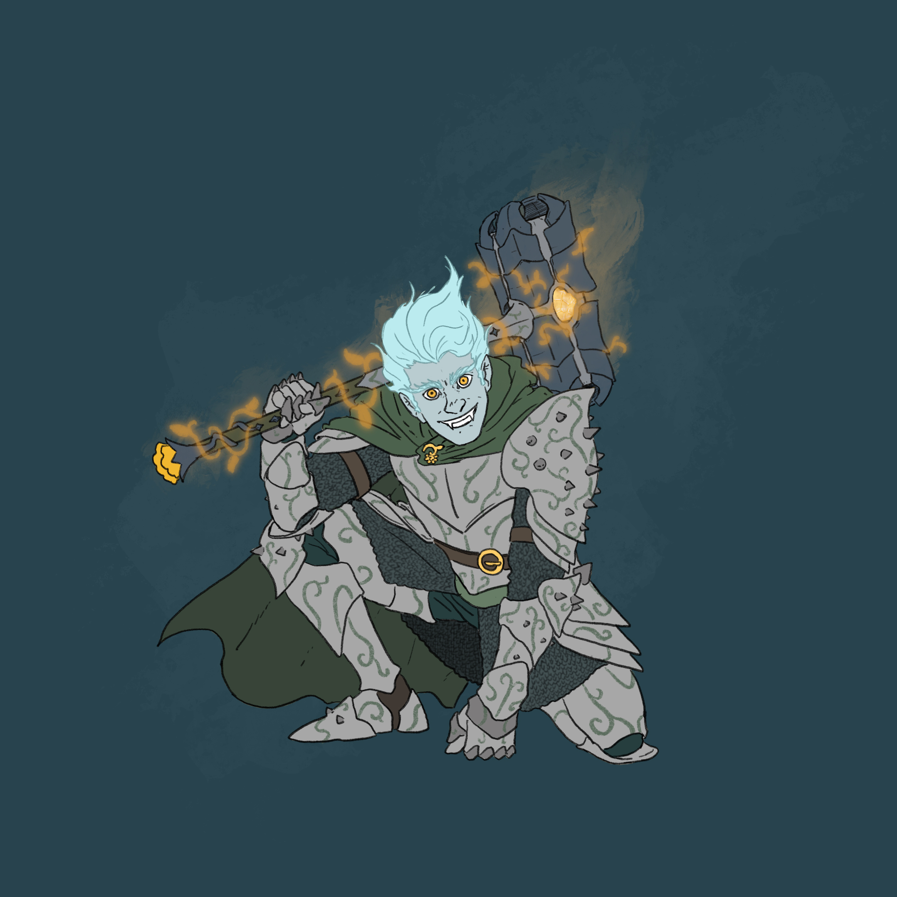

# Grix’molah

| {width=200} |
| :--------------------------: |

| Português | English |
| --------- | ------- |
| **Jogador:** Ricardo Guerra | **Player:** Ricardo Guerra |
| **Idade:** 31 | **Age:** 31 |
| **Espécie:** Goliath (masculino) | **Species:** Male Goliath |
| **Classe:** Bruxo (Pacto) / Guerreiro 1 | **Class:** Warlock / Fighter 1 |
| **Antecedente:** — | **Background:** — |
| **Alinhamento:** — | **Alignment:** — |
| **Nível:** 8 (Warlock 7 / Fighter 1) | **Level:** 8 (Warlock 7 / Fighter 1) |
| **Ficha D&D Beyond:** [Link](https://www.dndbeyond.com/characters/138750238) | **D&D Beyond Sheet:** [Link](https://www.dndbeyond.com/characters/138750238) |
| **Contacto:** +351 914 884 073 | **Contact:** +351 914 884 073 |
| **⚔️ Itens** **Armadura/Escudo:** Splint armor enspelled (shield) **Armas:** Maul +1, Halberd (Vicious Maul em preparação) **Items mágicos:** Staff of Titania; Cloak of Protection; Wand of the Pact Keeper +1; Flower Candle (Egalar); Monocle of Secrets; Potion of Eternal Life; 5 Minor Healing Potions; Pixie Dust; Anel da Taverna; Hat of Vermin; GlimmerWeave (em estudo) **Items não mágicos:** Guilded Flower (300 gp); Cultist robe; 6 Antitoxins; 3 pistols dismantled; Guard Badge; Winter Clothes; Fine Clothes; crowbar, rope, rations; vários objetos para vender **Ouro:** 694.88 gp | **⚔️ Items** **Armor/Shield:** Splint armor enspelled (shield) **Weapons:** Maul +1, Halberd (Vicious Maul in progress) **Magical Items:** Staff of Titania; Cloak of Protection; Wand of the Pact Keeper +1; Flower Candle (Egalar); Monocle of Secrets; Potion of Eternal Life; 5 Minor Healing Potions; Pixie Dust; Tavern Ring; Hat of Vermin; GlimmerWeave (being studied) **Non-magical Items:** Guilded Flower (300 gp); Cultist robe; 6 Antitoxins; 3 dismantled pistols; Guard Badge; Winter Clothes; Fine Clothes; crowbar, rope, rations; several objects to sell **Gold:** 694.88 gp |
| **📖 História – Antes da Taberna** - Filho de Goliath e humana, nasceu com complicações. - Criado para herdar responsabilidades familiares (casamento arranjado, negócios de mercadores). - Revoltou-se contra os pais, foi ameaçado de deserdamento. - Abandonou o nome Olmiki Chryspo e adotou Grix’molah. - Dorsla, ferreiro e amigo, forneceu-lhe o equipamento inicial. - Aventurou-se em busca de artefato mágico numa floresta. - Guiado por um fey elegante, passou por testes estranhos. - Todos os companheiros morreram no “jogo” do fey; Grix sobreviveu ao pedir ajuda a Titania. - Fez contrato com Titania: investigar a Taverna, ser extradimensional misterioso. | **📖 Story – Before the Tavern** - Son of a Goliath and human, born with complications. - Raised to inherit family duties (arranged marriage, merchant business). - Rebelled against parents, threatened with disinheritance. - Abandoned the name Olmiki Chryspo and adopted Grix’molah. - Dorsla, a dwarven smith, gave him his first gear. - Ventured to seek a magical artifact in a forest. - Guided by a refined fey, endured strange trials. - All companions died in the fey’s “game”; Grix survived by calling Titania. - Bound in contract with Titania: investigate the Tavern, a mysterious extradimensional being. |
| **📖 História – Depois da Taberna** - Primeira aventura: ajudou um velho Treant com infeção fúngica; ganhou o *Staff of Flowers*. - Sonhos recorrentes com Titania e Egalar, o paladino. - Purificou altares corrompidos de Nerull, erguendo-os para Titania. - Em High Ery encontrou baús com corpos e fungos amarelos; reclamou o templo para Titania. - Ajudou a aldeia dos ratos, salvando Ratu, aliado rato falante. - Durante o incidente da nave em Greyhawk, recebeu a *Flower Candle* de Ustrax. - Staff transformado em *Staff of Titania*, ganhou novos poderes. - No templo de Titania: enfrentou Karag, recuperou o Coração de Cristal, reconstruiu o templo com Naivara Lys’Fenn. - Libertou caveiras aprisionadas com Triss, recebendo inspiração de Titania. - Desenvolveu relação com Triss, combinando ir ao baile juntos. - Descobriu e usou um *Time Device*, viajando no tempo. - Teve visões de planos e cidades élficas nas Feywilds. - Salvou um unicórnio corrompido, ganhou favor com Titania. - A sua relação com Titania e Egalar aprofunda-se. | **📖 Story – After the Tavern** - First adventure: aided an old Treant with fungal infection; gained *Staff of Flowers*. - Recurrent dreams of Titania and Egalar the paladin. - Purified Nerull’s corrupted altars, reconsecrating them to Titania. - In High Ery, found corpses with yellow fungus; reclaimed the temple. - Helped the rat village, befriending Ratu the talking rat. - During the crashed ship incident in Greyhawk, received *Flower Candle* from Ustrax. - Staff transformed into *Staff of Titania*, gained new powers. - At Titania’s temple: fought Karag, restored the Crystal Heart, rebuilt temple with Naivara Lys’Fenn. - Freed tortured skulls with Triss, earning Titania’s inspiration. - Developed relationship with Triss, arranged to attend the ball. - Discovered and used a *Time Device*, briefly traveling through time. - Glimpsed planes and elven cities in the Feywilds. - Saved a corrupted unicorn, gained Titania’s favor. - His bond with Titania and Egalar deepens. |
| **🎭 Dramatis Persona** **NPCs de influência direta:** - Christid Splitanvil – dwarf from Blackstone Mountains, allied after being saved. - Grav – merchant from High Ery. - Valito – gnome trader, helped recover his shop. - Regalis – innkeeper, informed about Titania/Tiamat. - Kakashin & League of Adventurers – from another world/plane. - Syzzin – dragon, left after kobold leader’s sacrifice. **Antagonistas:** - Fey who killed first group of allies. - Cult of Tiamat; followers of Nerull & Elemental Evil. **Aliados:** - Favor with Titania (3 temples reconsecrated, unicorn saved). - Egalar, Titania’s paladin. - Naivara Lys’Fenn, acolyte of Titania’s temple. - Funguys adventuring party. - Triss, with whom he develops romance. - Bastion & Ratu the rat. | **🎭 Dramatis Persona** **Direct Influence NPCs:** - Christid Splitanvil – dwarf from Blackstone Mountains, allied after being saved. - Grav – merchant from High Ery. - Valito – gnome trader, helped recover his shop. - Regalis – innkeeper, informed about Titania/Tiamat. - Kakashin & League of Adventurers – from another world/plane. - Syzzin – dragon, left after kobold leader’s sacrifice. **Antagonists:** - Fey who killed first group of allies. - Cult of Tiamat; followers of Nerull & Elemental Evil. **Allies:** - Favor with Titania (3 temples reconsecrated, unicorn saved). - Egalar, Titania’s paladin. - Naivara Lys’Fenn, acolyte of Titania’s temple. - Funguys adventuring party. - Triss, budding romance. - Bastion & Ratu the rat. |
| **🔮 OBS** - *Staff of Titania*: destroys evil altars, raises altars to Titania; casts *Entangle* twice/day; calms lycanthropes. - *Monocle of Secrets*: reveals true value of mundane objects, advantage on Investigation. - *Flower Candle*: wish once, with a cost. - *Potion of Eternal Life*: heals demons (2d6), grants that much max HP to mortals. - *Time Device*: bonus action, return to start of turn; formerly full time travel; now drained, kept by Triss. - *Pixie Dust*: invisibility for 1h; worth 100 gp. - *Guard Badge*: deputy of Greyhawk, helps in investigations. | **🔮 Notes** - *Staff of Titania*: destroys evil altars, raises altars to Titania; casts *Entangle* twice/day; calms lycanthropes. - *Monocle of Secrets*: reveals true value of mundane objects, advantage on Investigation. - *Flower Candle*: wish once, with a cost. - *Potion of Eternal Life*: heals demons (2d6), grants that much max HP to mortals. - *Time Device*: bonus action, return to start of turn; formerly full time travel; now drained, kept by Triss. - *Pixie Dust*: invisibility for 1h; worth 100 gp. - *Guard Badge*: deputy of Greyhawk, helps in investigations. |

---

