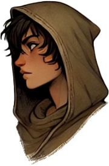

# Kai Vanthir([S07A](s07a_emboscada_erybend.md), [S08A](s08a_intriga_odrak_erybend.md), [S10C](s10c_baile_rainha_caecena.md), [S11A](s11a_sombras_de_iuz.md), [S12](s12_legado_de_krixis.md), [S13A](s13a_resgate_dustin.md), [S17A](s17a_missao_assassinos.md))

| { width=200 } | { width=200 } | { width=200 } | { width=200 } |
| ------------------------------------- | :-----------------------------------: | :-----------------------------------: | ----------------------------------------- |

---

### 🎲 Jogador / 🎲 Player

| 🎲 Jogador | 🎲 Player |
| --------------------------------------------------------- | ---------------------------------------- |
| **Jogador:** Carlos Monteiro | **Player:** Carlos Monteiro |
| **Idade:** 61 | **Age:** 61 |
| **Contacto:** +351 934 669 172 | **Contact:** +351 934 669 172 |
| **Instagram:** @cortonemo | **Instagram:** @cortonemo |
| **Discord:** clawdraconia | **Discord:** clawdraconia |
| **Ficha D&D Beyond:** [Ficha de Kai](https://www.dndbeyond.com/characters/138666572/HccCZp) | **D&D Beyond Sheet:** [Kai’s Sheet](https://www.dndbeyond.com/characters/138666572/HccCZp) |

**[DM-ONLY – Não incluir na Wiki]**

---

### 🧙 Personagem / 🧙 Character

| 🧙 Personagem                                                                                              | 🧙 Character                                                                                             |
| ---------------------------------------------------------------------------------------------------------- | -------------------------------------------------------------------------------------------------------- |
| Nome: **Kai** (identidade secreta: Kaelin / Eltharion Vanthir) **(Inferido com base nas sessões)**         | Name: **Kai** (secret identity: Kaelin / Eltharion Vanthir) **(Inferred from sessions)**                 |
| Espécie: [Humano](https://www.dndbeyond.com/species/1751441-human) (Inferido com base nas sessões)                                                | Species: [Human](https://www.dndbeyond.com/species/1751441-human) (Inferred from sessions)                                                      |
| Classe: [Monge](https://www.dndbeyond.com/classes/monk) / [Rogue](https://www.dndbeyond.com/classes/rogue) | Class: [Monk](https://www.dndbeyond.com/classes/monk) / [Rogue](https://www.dndbeyond.com/classes/rogue) |
| Alinhamento: Caótico Neutro                                                                                | Alignment: Chaotic Neutral                                                                               |
| Background: Criminoso / Nobre impostor (Inferido)                                                          | Background: Criminal / Noble impostor (Inferred)                                                         |
| Idade: 18                                                                                                  | Age: 18                                                                                                  |
| Altura: 1m67                                                                                               | Height: 5'6"                                                                                             |
| Olhos: Cinzentos penetrantes, observadores e intensos                                                      | Eyes: Piercing gray, observant and intense                                                               |
| Cabelo: Curto, escuro, prático, corte irregular                                                            | Hair: Short-cropped dark, practical, uneven cut                                                          |
| Pele: Clara, marcada pela disciplina da vida monástica                                                     | Skin: Light, shaped by the discipline of monastic life                                                   |
| Tamanho: Médio                                                                                             | Size: Medium                                                                                             |
| Aparência: Traços andróginos, expressão calma e neutra, movimentos graciosos e deliberados                 | Appearance: Androgynous features, calm and neutral expression, graceful deliberate movements             |

---

### 📜 Descrição Física / 📜 Physical Description

| 📜 Descrição Física | 📜 Physical Description |
| ----------------------- | --------------------------- |
| Kai é um jovem [humano](https://www.dndbeyond.com/species/1751441-human) de constituição ágil e porte discreto, mas marcado pela disciplina do treino monástico. Tem cerca de 1m67, pele clara e olhos cinzentos penetrantes, que observam o mundo com intensidade e desconfiança. O cabelo é escuro, cortado de forma irregular e prática, reforçando o ar de sobrevivente de rua. As roupas são simples e funcionais, compostas por túnicas em tons de bege e castanho, com ligaduras nos pulsos e pernas que revelam o estilo de luta corpo a corpo. A arma mais comum é o [bastão](quarterstaff.md) ou a [lança curta](spear.md), sempre à mão. Usa um [anel-sinete de madeira](wooden_signet_ring.md) com símbolo solar, vestígio da sua identidade roubada como Eltharion Vanthir. Os traços andróginos e a postura controlada transmitem neutralidade e mistério, enquanto a sua presença evoca tanto humildade como perigo latente. | Kai is a young [human](https://www.dndbeyond.com/species/1751441-human) of agile build and discreet bearing, yet marked by the discipline of monastic training. He stands about 5'6'', with light skin and piercing gray eyes that scrutinize the world with intensity and mistrust. His dark hair is cropped unevenly in a practical cut, reinforcing the look of a street survivor. His clothes are simple and functional, beige and brown robes with wrappings around wrists and legs, showing his preference for unarmed combat. His most common weapon is the [staff](quarterstaff.md) or [short spear](spear.md), always at hand. He wears a [wooden signet ring](wooden_signet_ring.md) with a solar crest, a remnant of his stolen identity as Eltharion Vanthir. His androgynous features and composed posture project both neutrality and mystery, while his presence conveys humility as well as latent danger. |

---

### ⚔️ Itens / ⚔️ Items

| ⚔️ Itens                                                                                                                                                                                                                                                                                                                                                                                                                                                                                                                                                                                                                                                                                                                                                                                                                                                                                                                                                                                                                                                                                                                                                                                                                                                                                                                                                                                                                                                                                                                                                                                                                                           | ⚔️ Items                                                                                                                                                                                                                                                                                                                                                                                                                                                                                                                                                                                                                                                                                                                                                                                                                                                                                                                                                                                                                                                                                                                                                                                                                                                                                                                                                                                                                                                                                                                                                                                                                                   |
| -------------------------------------------------------------------------------------------------------------------------------------------------------------------------------------------------------------------------------------------------------------------------------------------------------------------------------------------------------------------------------------------------------------------------------------------------------------------------------------------------------------------------------------------------------------------------------------------------------------------------------------------------------------------------------------------------------------------------------------------------------------------------------------------------------------------------------------------------------------------------------------------------------------------------------------------------------------------------------------------------------------------------------------------------------------------------------------------------------------------------------------------------------------------------------------------------------------------------------------------------------------------------------------------------------------------------------------------------------------------------------------------------------------------------------------------------------------------------------------------------------------------------------------------------------------------------------------------------------------------------------------------------- | ------------------------------------------------------------------------------------------------------------------------------------------------------------------------------------------------------------------------------------------------------------------------------------------------------------------------------------------------------------------------------------------------------------------------------------------------------------------------------------------------------------------------------------------------------------------------------------------------------------------------------------------------------------------------------------------------------------------------------------------------------------------------------------------------------------------------------------------------------------------------------------------------------------------------------------------------------------------------------------------------------------------------------------------------------------------------------------------------------------------------------------------------------------------------------------------------------------------------------------------------------------------------------------------------------------------------------------------------------------------------------------------------------------------------------------------------------------------------------------------------------------------------------------------------------------------------------------------------------------------------------------------ |
| **Armadura/Escudo:** Nenhuma; [Bracers of Defense](https://www.dndbeyond.com/magic-items/bracers-of-defense)  **Armas:** [Shortsword +1](https://www.dndbeyond.com/magic-items/shortsword-1), [Light Crossbow](https://www.dndbeyond.com/equipment/light-crossbow), Quarterstaff, [Spear](https://www.dndbeyond.com/equipment/spear), 6 [Daggers](https://www.dndbeyond.com/equipment/dagger), Unarmed Strikes  **Items mágicos:** [Shortsword +1](https://www.dndbeyond.com/magic-items/shortsword-1); [Bracers of Defense](https://www.dndbeyond.com/magic-items/bracers-of-defense); [Ring of the Queen’s Kiss](https://www.dndbeyond.com/magic-items/9902684-ring-of-the-queens-kiss) (4/4 cargas); Artefato sombrio não identificado  **Potions:** [Potion of Healing](https://www.dndbeyond.com/magic-items/potion-of-healing) ×1  **Items não mágicos:** Wooden signet ring (solar crest); Gold ring (sun with yellow stone, 10 gp); [Calligrapher’s Supplies](https://www.dndbeyond.com/equipment/calligraphers-supplies); [Fine Clothes](https://www.dndbeyond.com/equipment/fine-clothes); [Disguise Kit](https://www.dndbeyond.com/equipment/disguise-kit); [Flute](https://www.dndbeyond.com/equipment/flute); [Healer’s Kit](https://www.dndbeyond.com/equipment/healers-kit); [Thieves’ Tools](https://www.dndbeyond.com/equipment/thieves-tools); 100 bolts; [Backpack](https://www.dndbeyond.com/equipment/backpack) (bedroll, rope, tinderbox, torches ×10, rations ×10, waterskin, oil ×2); cheese ×2; fangs ×2; liquid vials ×10; Agate  **Ouro:** 3200 gp (inclui 500 gp do Baile da Rainha Caecena – Inferido) | **Armor/Shield:** None; [Bracers of Defense](https://www.dndbeyond.com/magic-items/bracers-of-defense)  **Weapons:** [Shortsword +1](https://www.dndbeyond.com/magic-items/shortsword-1), [Light Crossbow](https://www.dndbeyond.com/equipment/light-crossbow), Quarterstaff, [Spear](https://www.dndbeyond.com/equipment/spear), 6 [Daggers](https://www.dndbeyond.com/equipment/dagger), Unarmed Strikes  **Magical Items:** [Shortsword +1](https://www.dndbeyond.com/magic-items/shortsword-1); [Bracers of Defense](https://www.dndbeyond.com/magic-items/bracers-of-defense); [Ring of the Queen’s Kiss](https://www.dndbeyond.com/magic-items/9902684-ring-of-the-queens-kiss)  (4/4 charges); Unidentified dark artifact  **Potions:** [Potion of Healing](https://www.dndbeyond.com/magic-items/potion-of-healing) ×1  **Non-magical Items:** Wooden signet ring (solar crest); Gold ring (sun with yellow stone, 10 gp); [Calligrapher’s Supplies](https://www.dndbeyond.com/equipment/calligraphers-supplies); [Fine Clothes](https://www.dndbeyond.com/equipment/fine-clothes); [Disguise Kit](https://www.dndbeyond.com/equipment/disguise-kit); [Flute](https://www.dndbeyond.com/equipment/flute); [Healer’s Kit](https://www.dndbeyond.com/equipment/healers-kit); [Thieves’ Tools](https://www.dndbeyond.com/equipment/thieves-tools); 100 bolts; [Backpack](https://www.dndbeyond.com/equipment/backpack) (bedroll, rope, tinderbox, torches ×10, rations ×10, waterskin, oil ×2); cheese ×2; fangs ×2; liquid vials ×10; Agate  **Gold:** 3200 gp (includes 500 gp from Queen Caecena’s Ball – Inferred) |

---

### 📖 História – Antes da Taberna / 📖 Story – Before the Tavern

| 📖 História – Antes da Taberna                                                                                                                                                                                                                                                                                                                                                                                                                                                                            | 📖 Story – Before the Tavern                                                                                                                                                                                                                                                                                                                                                                                                                             |
| --------------------------------------------------------------------------------------------------------------------------------------------------------------------------------------------------------------------------------------------------------------------------------------------------------------------------------------------------------------------------------------------------------------------------------------------------------------------------------------------------------- | -------------------------------------------------------------------------------------------------------------------------------------------------------------------------------------------------------------------------------------------------------------------------------------------------------------------------------------------------------------------------------------------------------------------------------------------------------- |
| Nascido como **Kaelin** em [Dorakaa](dorakaa.md), ficou órfão e juntou-se a uma gangue de ladrões. Após um assalto falhado a uma caravana, acordou junto ao cadáver de um jovem [nobre](noble_houses.md) da [Casa Vanthir](house_vanthir.md). Assumiu a identidade dele, guardando o **anel-sinete de madeira** e uma carta de recomendação a um mosteiro, onde foi acolhido como herdeiro ilegítimo e treinado como  [monge](https://www.dndbeyond.com/classes/monk) **(Inferido com base nas sessões)** | Born as Kaelin in [Dorakaa](dorakaa.md), he was orphaned and joined a thieves’ gang. After a failed caravan raid, he awoke beside the corpse of a young [noble](noble_houses.md) of [House Vanthir](house_vanthir.md). He assumed the boy’s identity, keeping the **wooden signet ring** and a monastery letter, where he was received as an illegitimate heir and trained as a [monk](https://www.dndbeyond.com/classes/monk). (Inferred from sessions) |

---

### 📖 História – Depois da Taberna / 📖 Story – After the Tavern

| 📖 História – Depois da Taberna | 📖 Story – After the Tavern |
| --------------------------------------------------------------------------------------------------------------------------------------------------------------------------------------------------------------------------------------------------------------------------------------------------------------------------------------------------------------------------------------------------------------------------------------------------- | --------------------------------------------------------------------------------------------------------------------------------------------------------------------------------------------------------------------------------------------------------------------------------------------------------------------------------------------------------------------------------------------------------------------------------------------------------- |
| - Em [Erybend](docs/locations/-/regions/eribend.md), descobriu [cultistas de Odrak](culto_odrak.md) e uma lista de sete alvos, com [Dolrea Vas](docs/npc/-/Eribend/npc_dolrea_vas.md) ([S08A](s08a_intriga_odrak_erybend.md)) como próximo. - Confrontou [kobolds](kobold.md) devotos de [Nerull](docs/organizations/-/cults/cult_of_nerull.md), tentando salvar um [Cavaleiro da Luz](knight_of_light.md). - No baile em [Blackfair Manor](blackfair_manor.md), dançou com [Fifaera](fifaera.md) e conquistou a [bênção da Rainha Caecena](blessing_of_queen_caecena.md), além de 500 gp. - Foi **chantageado** por [Raveth Xil’Zyrl](docs/npc/-/unknown/npc_raveth_xil_zyrl.md) ([S11A](s11a_sombras_de_iuz.md)) nas [ruínas da Casa Vanthir](ruinas_do_forte_da_casa_vanthir.md), até a chegada dos [Paladinos de Beltar](paladinos_de_beltar.md), que capturaram [Dustin](pc_dustin_thorne.md) ([S11A](s11a_sombras_de_iuz.md)). - Participou no **resgate de Dustin** ([S13A](s13a_resgate_dustin.md)) em [Castelo Ruína-de-Ébano](castelo_ruina_de_ebano.md). | - In [Erybend](docs/locations/-/regions/eribend.md), uncovered [Odrak cultists](culto_odrak.md) and a list of seven names, with [Dolrea Vas](docs/npc/-/Eribend/npc_dolrea_vas.md) ([S08A](s08a_intriga_odrak_erybend.md)) as next target. - Faced [kobolds](kobold.md) devoted to [Nerull](docs/organizations/-/cults/cult_of_nerull.md), trying to protect a [Knight of Light](knight_of_light.md). - At the ball in [Blackfair Manor](blackfair_manor.md), danced with [Fifaera](fifaera.md) and earned the [blessing of Queen Caecena](blessing_of_queen_caecena.md), plus 500 gp. - **Blackmailed** by [Raveth Xil’Zyrl](docs/npc/-/unknown/npc_raveth_xil_zyrl.md) ([S11A](s11a_sombras_de_iuz.md)) at the [ruins of House Vanthir](ruinas_do_forte_da_casa_vanthir.md), until the arrival of the [Paladins of Beltar](paladinos_de_beltar.md), who captured [Dustin](pc_dustin_thorne.md) ([S11A](s11a_sombras_de_iuz.md)). - Took part in **Dustin’s rescue** ([S13A](s13a_resgate_dustin.md)) at [Ebony-Ruin Castle](castelo_ruina_de_ebano.md). |

---

### 🎭 Dramatis Persona / 🎭 Dramatis Personae

| 🎭 Dramatis Persona                                                                                                                                                                                                                                                                                                                                                                                                                                                                                                                                                                                                                                                                                                                                                                                                                                                                                                                                                                                                                                                                                                                                                                                                                                                                                                                                               | 🎭 Dramatis Personae                                                                                                                                                                                                                                                                                                                                                                                                                                                                                                                                                                                                                                                                                                                                                                                                                                                                                                                                                                                                                                                                                                                                                                                                                                                                                                                                             |
| ----------------------------------------------------------------------------------------------------------------------------------------------------------------------------------------------------------------------------------------------------------------------------------------------------------------------------------------------------------------------------------------------------------------------------------------------------------------------------------------------------------------------------------------------------------------------------------------------------------------------------------------------------------------------------------------------------------------------------------------------------------------------------------------------------------------------------------------------------------------------------------------------------------------------------------------------------------------------------------------------------------------------------------------------------------------------------------------------------------------------------------------------------------------------------------------------------------------------------------------------------------------------------------------------------------------------------------------------------------------- | ---------------------------------------------------------------------------------------------------------------------------------------------------------------------------------------------------------------------------------------------------------------------------------------------------------------------------------------------------------------------------------------------------------------------------------------------------------------------------------------------------------------------------------------------------------------------------------------------------------------------------------------------------------------------------------------------------------------------------------------------------------------------------------------------------------------------------------------------------------------------------------------------------------------------------------------------------------------------------------------------------------------------------------------------------------------------------------------------------------------------------------------------------------------------------------------------------------------------------------------------------------------------------------------------------------------------------------------------------------------- |
| **NPCs de influência direta**: - [Rainha Caecena](queen_caecena.md) ([S10C](s10c_baile_rainha_caecena.md)) - [Raveth Xil’Zyrl](docs/npc/-/unknown/npc_raveth_xil_zyrl.md) ([S11A](s11a_sombras_de_iuz.md)) - [Prysanna](docs/npc/-/Fey/npc_pryssana.md) - [Fifaera](fifaera.md) - [Vareth Lionmane](docs/npc/-/Ruins%20of%20House%20Vanthir/npc_vareth_lionmane.md) - [Dolrea Vas](docs/npc/-/Eribend/npc_dolrea_vas.md) ([S08A](s08a_intriga_odrak_erybend.md))                                                                                                                                                                                                                                                                                                                                                                                                                                                                                                                                                                                                                                                                                                                                                                                                                                                                                                                                                                                             | **Direct Influence NPCs:**  - [Queen Caecena](queen_caecena.md) ([S10C](s10c_baile_rainha_caecena.md)) - [Raveth Xil’Zyrl](docs/npc/-/unknown/npc_raveth_xil_zyrl.md) ([S11A](s11a_sombras_de_iuz.md)) - [Prysanna](docs/npc/-/Fey/npc_pryssana.md) - [Fifaera](fifaera.md) - [Vareth Lionmane](docs/npc/-/Ruins%20of%20House%20Vanthir/npc_vareth_lionmane.md) - [Dolrea Vas](docs/npc/-/Eribend/npc_dolrea_vas.md) ([S08A](s08a_intriga_odrak_erybend.md))                                                                                                                                                                                                                                                                                                                                                                                                                                                                                                                                                                                                                                                                                                                                                                                                                                                                                                                                                                                                |
| **Antagonistas:**  - [Lord Coriver](lord_coriver.md)  - [Paladinos de Beltar](paladinos_de_beltar.md)  - [Cultistas de Odrak](culto_odrak.md)  - [Torzac](torzac.md)                                                                                                                                                                                                                                                                                                                                                                                                                                                                                                                                                                                                                                                                                                                                                                                                                                                                                                                                                                                                                                                                                                                                                                                  | **Antagonists:**  - [Lord Coriver](lord_coriver.md)  - [Paladins of Beltar](paladinos_de_beltar.md)  - [Cultists of Odrak](culto_odrak.md)  - [Torzac](torzac.md)                                                                                                                                                                                                                                                                                                                                                                                                                                                                                                                                                                                                                                                                                                                                                                                                                                                                                                                                                                                                                                                                                                                                                                                    |
| **Aliados:**  - [Dustin](pc_dustin_thorne.md) ([S11A](s11a_sombras_de_iuz.md), [S13A](s13a_resgate_dustin.md)) - [Triss](pc_triss_merril.md) ([S07A](s07a_emboscada_erybend.md), [S08A](s08a_intriga_odrak_erybend.md), [S10C](s10c_baile_rainha_caecena.md), [S11A](s11a_sombras_de_iuz.md), [S12](s12_legado_de_krixis.md), [S13A](s13a_resgate_dustin.md), [S17A](s17a_missao_assassinos.md)) - [Raylahn](pc_raylahn.md) ([S11A](s11a_sombras_de_iuz.md), [S12](s12_legado_de_krixis.md), [S13A](s13a_resgate_dustin.md), [S17A](s17a_missao_assassinos.md), [S17B](s17b_a_crianca_perdida.md)) - [Grix’Molah](pc_grix_molah.md) ([S07A](s07a_emboscada_erybend.md), [S08A](s08a_intriga_odrak_erybend.md), [S10A](s06a_intriga_high_ery.md)) - [Varus / Zeldris](pc_zeldris.md) ([S07A](s07a_emboscada_erybend.md), [S08A](s08a_intriga_odrak_erybend.md), [S10B](s10b_resgate_rolger.md),[S13B](s13b_retorno_nave_illithid.md)) - [Markus Grimm](pc_markus_grimm.md) ([S01](s01_purificacao_riacho.md), [S02](s02_miner_difficulties_ready.md), [S04B](s04b_vale_sombrio_culto_alado.md), [S05A](s05a_mascaras_da_morte.md), [S11A](s11a_sombras_de_iuz.md), [S13A](s13a_resgate_dustin.md), [S17A](s17a_missao_assassinos.md), [S17B](s17b_a_crianca_perdida.md), [S22](s22a_golpe_dados_rubi_p1.md), [S23](s23a_golpe_dados_rubi_p2.md)) | **Allies:**  - [Dustin](pc_dustin_thorne.md) ([S11A](s11a_sombras_de_iuz.md), [S13A](s13a_resgate_dustin.md)) - [Triss](pc_triss_merril.md) ([S07A](s07a_emboscada_erybend.md), [S08A](s08a_intriga_odrak_erybend.md), [S10C](s10c_baile_rainha_caecena.md), [S11A](s11a_sombras_de_iuz.md), [S12](s12_legado_de_krixis.md), [S13A](s13a_resgate_dustin.md), [S17A](s17a_missao_assassinos.md)) - [Raylahn](pc_raylahn.md) ([S11A](s11a_sombras_de_iuz.md), [S12](s12_legado_de_krixis.md), [S13A](s13a_resgate_dustin.md), [S17A](s17a_missao_assassinos.md), [S17B](s17b_a_crianca_perdida.md)) - [Grix’Molah](pc_grix_molah.md) ([S07A](s07a_emboscada_erybend.md), [S08A](s08a_intriga_odrak_erybend.md), [S10A](s06a_intriga_high_ery.md)) - [Varus / Zeldris](pc_zeldris.md) ([S07A](s07a_emboscada_erybend.md), [S08A](s08a_intriga_odrak_erybend.md), [S10B](s10b_resgate_rolger.md),[S13B](s13b_retorno_nave_illithid.md)) - [Markus Grimm](pc_markus_grimm.md) ([S01](s01_purificacao_riacho.md), [S02](s02_miner_difficulties_ready.md), [S04B](s04b_vale_sombrio_culto_alado.md), [S05A](s05a_mascaras_da_morte.md), [S11A](s11a_sombras_de_iuz.md), [S13A](s13a_resgate_dustin.md), [S17A](s17a_missao_assassinos.md), [S17B](s17b_a_crianca_perdida.md), [S22](s22a_golpe_dados_rubi_p1.md), [S23](s23a_golpe_dados_rubi_p2.md)) |

---

## Processing Audit

### Internal Links

| Source File | Linked Files |
| :--- | :--- |
| pc_kai.md | s07a_emboscada_erybend.md, s08a_intriga_odrak_erybend.md, s10c_baile_rainha_caecena.md, s11a_sombras_de_iuz.md, s11b_sombras_sobre_erybend.md, s12_legado_de_krixis.md, s13a_resgate_dustin.md, s17a_missao_assassinos.md, pc_kai_01.png, pc_kai_02.png, pc_kai_00.png, human.md, quarterstaff.md, spear.md, wooden_signet_ring.md, dorakaa.md, thieves_guild.md, noble_houses.md, house_vanthir.md, monk.md, eribend.md, culto_odrak.md, dolrea_vas.md, kobold.md, cult_of_nerull.md, knight_of_light.md, blackfair_manor.md, fifaera.md, blessing_of_queen_caecena.md, raveth_xil_zyrl.md, ruinas_do_forte_da_casa_vanthir.md, paladinos_de_beltar.md, pc_dustin_thorne.md, castelo_ruina_de_ebano.md, queen_caecena.md, pryssana.md, vareth_lionmane.md, lord_coriver.md, torzac.md, pc_triss_merril.md, pc_raylahn.md, pc_grix_molah.md, pc_zeldris.md, pc_markus_grimm.md, s17b_a_crianca_perdida.md, s06a_intriga_high_ery.md, s10b_resgate_rolger.md, s13b_retorno_nave_illithid.md, s01_purificacao_riacho.md, s02_miner_difficulties_ready.md, s04b_vale_sombrio_culto_alado.md, s05a_mascaras_da_morte.md, s22a_golpe_dados_rubi_p1.md, s23a_golpe_dados_rubi_p2.md |

### Warnings

| Type                | Where                                                              | Detail                                                                                       |
| :------------------ | :----------------------------------------------------------------- | :------------------------------------------------------------------------------------------- |
| **D&D Beyond Link** | ⚔️ Itens / ⚔️ Items                                                | Cannot determine unique category for 'Quarterstaff'. Not linking.                            |
| **D&D Beyond Link** | ⚔️ Itens / ⚔️ Items                                                | Cannot determine unique category for 'Ring of the Queen’s Kiss'. Not linking.                |
| **D&D Beyond Link** | ⚔️ Itens / ⚔️ Items                                                | Cannot determine unique category for 'Unarmed Strikes'. Not linking.                         |
| **D&D Beyond Link** | ⚔️ Itens / ⚔️ Items                                                | Cannot determine unique category for 'Ring of the Queen’s Kiss'. Not linking.                |
| **D&D Beyond Link** | ⚔️ Itens / ⚔️ Items                                                | Cannot determine unique category for 'Unidentified dark artifact'. Not linking.              |
| **D&D Beyond Link** | ⚔️ Itens / ⚔️ Items                                                | Cannot determine unique category for 'Quarterstaff'. Not linking.                            |
| **D&D Beyond Link** | ⚔️ Itens / ⚔️ Items                                                | Cannot determine unique category for 'Unarmed Strikes'. Not linking.                         |
| **D&D Beyond Link** | ⚔️ Itens / ⚔️ Items                                                | Cannot determine unique category for 'Unidentified dark artifact'. Not linking.              |
| **D&D Beyond Link** | ⚔️ Itens / ⚔️ Items                                                | Cannot determine unique category for 'Agate'. Not linking.                                   |
| **D&D Beyond Link** | ⚔️ Itens / ⚔️ Items                                                | Cannot determine unique category for 'Agate'. Not linking.                                   |
| **D&D Beyond Link** | 🧙 Personagem / 🧙 Character                                       | Cannot find D&D Beyond link for 'monk', falling back to slug. Replaced with DDB Class link.  |
| **D&D Beyond Link** | 🧙 Personagem / 🧙 Character                                       | Cannot find D&D Beyond link for 'rogue', falling back to slug. Replaced with DDB Class link. |
| **D&D Beyond Link** | 🧙 Personagem / 🧙 Character                                       | Cannot find D&D Beyond link for 'monk', falling back to slug. Replaced with DDB Class link.  |
| **D&D Beyond Link** | 🧙 Personagem / 🧙 Character                                       | Cannot find D&D Beyond link for 'rogue', falling back to slug. Replaced with DDB Class link. |
| **Link Creation**   | 📜 Descrição Física / 📜 Physical Description (PT)                 | Creating link for 'bastão' to quarterstaff.md, as a generic item.                            |
| **Link Creation**   | 📜 Descrição Física / 📜 Physical Description (EN)                 | Creating link for 'staff' to quarterstaff.md, as a generic item.                             |
| **Link Creation**   | 📖 História – Antes da Taberna / 📖 Story – Before the Tavern (PT) | Creating link for 'gangue de ladrões' to thieves_guild.md, based on file structure.          |
| **Link Creation**   | 📖 História – Antes da Taberna / 📖 Story – Before the Tavern (EN) | Creating link for 'thieves’ gang' to thieves_guild.md, based on file structure.              |
| **Link Creation**   | 📖 História – Antes da Taberna / 📖 Story – Before the Tavern (PT) | Creating link for 'nobre' to noble_houses.md, based on file structure.                       |
| **Link Creation**   | 📖 História – Antes da Taberna / 📖 Story – Before the Tavern (EN) | Creating link for 'noble' to noble_houses.md, based on file structure.                       |
| **Link Creation**   | 📖 História – Depois da Taberna / 📖 Story – After the Tavern (PT) | Creating link for 'kobolds' to kobold.md, as generic monster/race.                           |
| **Link Creation**   | 📖 História – Depois da Taberna / 📖 Story – After the Tavern (EN) | Creating link for 'kobolds' to kobold.md, as generic monster/race.                           |
| **Link Creation**   | 📖 História – Depois da Taberna / 📖 Story – After the Tavern (PT) | Creating link for 'Cavaleiro da Luz' to knight_of_light.md, as generic NPC/concept.          |
| **Link Creation**   | 📖 História – Depois da Taberna / 📖 Story – After the Tavern (EN) | Creating link for 'Knight of Light' to knight_of_light.md, as generic NPC/concept.           |

### Missing Files

| Type        | Where                                                         | Detail                                                                                                   |
| :---------- | :------------------------------------------------------------ | :------------------------------------------------------------------------------------------------------- |
| **Session** | 🎭 Dramatis Persona / 🎭 Dramatis Personae: [Markus Grimm]    | Missing file for S17B: s17b_a_crianca_perdida.md, linked to s17b_a_crianca_perdida.md.                   |
| **Session** | 🎭 Dramatis Persona / 🎭 Dramatis Personae: [Raylahn]         | Missing file for S17B: s17b_a_crianca_perdida.md, linked to s17b_a_crianca_perdida.md.                   |
| **Session** | 🎭 Dramatis Persona / 🎭 Dramatis Personae: [Markus Grimm]    | Missing file for S22: s22a_golpe_dados_rubi_p1.md, linked to s22a_golpe_dados_rubi_p1.md.                |
| **Session** | 🎭 Dramatis Persona / 🎭 Dramatis Personae: [Markus Grimm]    | Missing file for S23: s23a_golpe_dados_rubi_p2.md, linked to s23a_golpe_dados_rubi_p2.md.                |
| **Session** | 📖 História – Depois da Taberna / 📖 Story – After the Tavern | Missing file for S13A: s13a_resgate_dustin.md, linked to s13a_resgate_dustin.md.                         |
| **Session** | 🎭 Dramatis Persona / 🎭 Dramatis Personae: [Dustin]          | Missing file for S13A: s13a_resgate_dustin.md, linked to s13a_resgate_dustin.md.                         |
| **Session** | 🎭 Dramatis Persona / 🎭 Dramatis Personae: [Triss]           | Missing file for S13A: s13a_resgate_dustin.md, linked to s13a_resgate_dustin.md.                         |
| **Session** | 🎭 Dramatis Persona / 🎭 Dramatis Personae: [Raylahn]         | Missing file for S13A: s13a_resgate_dustin.md, linked to s13a_resgate_dustin.md.                         |
| **Session** | 🎭 Dramatis Persona / 🎭 Dramatis Personae: [Markus Grimm]    | Missing file for S13A: s13a_resgate_dustin.md, linked to s13a_resgate_dustin.md.                         |
| **File**    | 📜 Descrição Física / 📜 Physical Description                 | Could not find a file for 'wooden_signet_ring' to link from 'anel-sinete de madeira'                     |
| **File**    | 📜 Descrição Física / 📜 Physical Description                 | Could not find a file for 'wooden_signet_ring' to link from 'wooden signet ring'                         |
| **File**    | 📖 História – Depois da Taberna / 📖 Story – After the Tavern | Could not find a file for 'blessing_of_queen_caecena' to link from 'bênção da Rainha Caecena'            |
| **File**    | 📖 História – Depois da Taberna / 📖 Story – After the Tavern | Could not find a file for 'blessing_of_queen_caecena' to link from 'blessing of Queen Caecena'           |
| **File**    | 📖 História – Depois da Taberna / 📖 Story – After the Tavern | Could not find a file for 'knight_of_light' to link from 'Cavaleiro da Luz'                              |
| **File**    | 📖 História – Depois da Taberna / 📖 Story – After the Tavern | Could not find a file for 'knight_of_light' to link from 'Knight of Light'                               |
