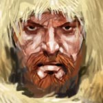

# Leo ([S28A](s28a_museu_sombras_p1.md), [S29A](s29a_museu_sombras_p2.md))

| {width=200} |
| --------------------- |

---

**[DM-ONLY – Não incluir na Wiki]**

### 🎲 Jogador / 🎲 Player

| 🎲 Jogador | 🎲 Player |
| ---------------------------------------------------------------------------- | ----------------------------------------------------------------------------- |
| **Jogador:** Nuno Santos | **Player:** Nuno Santos |
| **Idade:** 33 | **Age:** 33 |
| **Contacto:** +351 916 234 286 | **Contact:** +351 916 234 286 |
| **Instagram:** [@nuno_dr8](https://www.instagram.com/nuno_dr8/) | **Instagram:** [@nuno_dr8](https://www.instagram.com/nuno_dr8/) |
| **Discord:** drpurple_92 | **Discord:** drpurple_92 |
| **Ficha D&D Beyond:** [Link](https://www.dndbeyond.com/characters/145620187) | **D&D Beyond Sheet:** [Link](https://www.dndbeyond.com/characters/145620187) |

**[DM-ONLY – Não incluir na Wiki]**

---

### 🧙 Personagem / 🧙 Character

| **🧙 Personagem** | **🧙 Character** |
| -------------------------------- | ---------------------------------- |
| Nome: **Leo** ([S28A](s28a_museu_sombras_p1.md), [S29A](s29a_museu_sombras_p2.md)) | Name: **Leo** |
| Espécie: [Humano](https://www.dndbeyond.com/races/human) | Species: [Human](https://www.dndbeyond.com/races/human) |
| Classe: [Druida](https://www.dndbeyond.com/classes/druid) ([Círculo da Lua](https://www.dndbeyond.com/classes/druid#CircleoftheMoon)) | Class: [Druid](https://www.dndbeyond.com/classes/druid) ([Circle of the Moon](https://www.dndbeyond.com/classes/druid#CircleoftheMoon)) |
| Alinhamento: [por preencher] | Alignment: [to be filled] |
| Background: [por preencher] | Background: [to be filled] |
| Idade: [por preencher] | Age: [to be filled] |
| Altura: [por preencher] | Height: [to be filled] |
| Olhos: [por preencher] | Eyes: [to be filled] |
| Cabelo: [por preencher] | Hair: [to be filled] |
| Pele: [por preencher] | Skin: [to be filled] |
| Tamanho: [por preencher] | Size: [to be filled] |

---

### 📜 Descrição Física / 📜 Physical Description

| **📜 Descrição Física** | **📜 Physical Description** |
| ----------------------- | --------------------------- |
| Leo é um humano de porte robusto e traços marcados pela vida selvagem. Tem pele bronzeada pelo sol, olhos castanhos intensos e barba cerrada que lhe dá um ar endurecido. O cabelo loiro é desgrenhado, caindo em mechas desordenadas que reforçam a sua aparência indomável. A expressão é austera e selvagem, mas o olhar guarda uma centelha de sabedoria natural, fruto da sua ligação profunda ao Círculo da Lua. Nas vestes simples predominam tons terrosos, práticos para a vida na floresta, onde passa grande parte do tempo. O seu porte transmite a força bruta de um caçador aliado à serenidade de um druida que encontra harmonia em meio à natureza. | Leo is a human of sturdy build, with features hardened by a wild life. His sun-bronzed skin, piercing brown eyes, and thick beard give him a rugged look. His blond hair is unkempt, falling in untamed strands that enhance his feral appearance. His expression is stern and wild, yet his gaze carries a spark of natural wisdom, born of his deep bond with the Circle of the Moon. He wears simple clothing in earthy tones, practical for life in the forest where he spends much of his time. His bearing conveys the raw strength of a hunter blended with the serenity of a druid who finds harmony within nature. |

---

### ⚔️ Itens / ⚔️ Items

| **⚔️ Itens** | **⚔️ Items** |
| ---------------------- | ------------------------------ |
| **Armadura/Escudo:** [Leather Armor](https://www.dndbeyond.com/equipment/leather-armor) & [Shield](https://www.dndbeyond.com/equipment/shield)  **Armas:** [Staff](https://www.dndbeyond.com/equipment/staff)  **Items mágicos:** Tabern Ring  **Potions:** [por preencher]  **Items não mágicos:** [Bedroll](https://www.dndbeyond.com/equipment/bedroll); Dire Wolf Pelt; Emerald; Gard Mission Scroll; [Greyhawk Uniform Rank 2](https://www.dndbeyond.com/equipment/uniform); [Oil (2)](https://www.dndbeyond.com/equipment/oil-flask); Pigeon Talisman; [Rations (9)](https://www.dndbeyond.com/equipment/rations-1-day); [Rope](https://www.dndbeyond.com/equipment/rope-hemp-50-feet); [Tinderbox](https://www.dndbeyond.com/equipment/tinderbox); [Torch (10)](https://www.dndbeyond.com/equipment/torch); [Waterskin](https://www.dndbeyond.com/equipment/waterskin)  **Ouro:** 545 gp | **Armor/Shield:** [Leather Armor](https://www.dndbeyond.com/equipment/leather-armor) & [Shield](https://www.dndbeyond.com/equipment/shield)  **Weapons:** [Staff](https://www.dndbeyond.com/equipment/staff)  **Magical Items:** Tabern Ring  **Potions:** [to be filled]  **Non-magical Items:** [Bedroll](https://www.dndbeyond.com/equipment/bedroll); Dire Wolf Pelt; Emerald; Gard Mission Scroll; [Greyhawk Uniform Rank 2](https://www.dndbeyond.com/equipment/uniform); [Oil (2)](https://www.dndbeyond.com/equipment/oil-flask); Pigeon Talisman; [Rations (9)](https://www.dndbeyond.com/equipment/rations-1-day); [Rope](https://www.dndbeyond.com/equipment/rope-hemp-50-feet); [Tinderbox](https://www.dndbeyond.com/equipment/tinderbox); [Torch (10)](https://www.dndbeyond.com/equipment/torch); [Waterskin](https://www.dndbeyond.com/equipment/waterskin)  **Gold:** 545 gp |

---

### 📖 História – Antes da Taberna / 📖 Story – Before the Tavern

| **📖 História – Antes da Taberna** | **📖 Story – Before the Tavern** |
| ---------------------------------- | -------------------------------- |
| Viveu numa cabana de madeira na floresta, estudando a natureza em solidão e em companhia de animais. | Lived in a wooden shack in the forest, studying nature in solitude and in the company of animals. |

---

### 📖 História – Depois da Taberna / 📖 Story – After the Tavern

| **📖 História – Depois da Taberna** | **📖 Story – After the Tavern** |
| ----------------------------------- | -------------------------------- |
| - Caçou vigilantes (Dr. Russ e Gard), ganhando respeito do **Capitão Greyhawk** ([capitao_greyhawk.md](capitao_greyhawk.md)).  - Participou em dois eventos no Coliseu (dodgeball e tiro ao alvo) – venceu ambos, criando rancor no **Rei dos Ladrões** ([rei_dos_ladroes.md](rei_dos_ladroes.md)).  - Sobreviveu a um **Museu de Horrores** criado pelo **Curador** ([curador.md](curador.md)) e sua esposa; escapou por pouco de se tornar um novo “exhibit”. | - Hunted vigilantes (Dr. Russ and Gard), earning respect from **Captain Greyhawk** ([capitao_greyhawk.md](capitao_greyhawk.md)).  - Competed in two Colosseum events (dodgeball and target shooting) – won both, angering the **King of Thieves** ([rei_dos_ladroes.md](rei_dos_ladroes.md)).  - Helped secure a tavern overrun by talking rats.  - Survived a **Museum of Horrors** built by the **Curator** ([curador.md](curador.md)) and his wife; narrowly escaped becoming the next exhibit. |

---

### 🎭 Dramatis Persona / 🎭 Dramatis Personae

| **🎭 Dramatis Persona** | **🎭 Dramatis Personae** |
| ------------------------------------------------------------------------------------------------------------------------------------------------------------------------------------------------------------------------------------------------------------------------------------------------------------------------------------------------------------------------------------------------------------------------------------------------------------------------------- | ----------------------------------------------------------------------------------------------------------------------------------------------------------------------------------------------------------------------------------------------------------------------------------------------------------------------------------------------------------------------------------------------------------------------------------------------------------------- |
| **NPCs de influência direta:**  - **Capitão Greyhawk** ([capitao_greyhawk.md](capitao_greyhawk.md)) – respeita Leo pelas suas ações.  - **Rei dos Ladrões** ([rei_dos_ladroes.md](rei_dos_ladroes.md)) – guarda rancor após derrotas no Coliseu. | **Direct Influence NPCs:**  - **Captain Greyhawk** ([capitao_greyhawk.md](capitao_greyhawk.md)) – respects Leo for his deeds.  - **King of Thieves** ([rei_dos_ladroes.md](rei_dos_ladroes.md)) – holds grudge after Colosseum defeats. |
| **Antagonistas:**  - Coruja de [Eldric](pc_eldric_silvanos.md) – sabota tentativas de comunicar com pombos. | **Antagonists:**  - [Eldric’s](pc_eldric_silvanos.md) owl – sabotages pigeon communication attempts. |
| **Aliados:**  - [Silfir](pc_silfir.md) ([Druida da Lua](https://www.dndbeyond.com/classes/druid#CircleoftheMoon), mentor e aliado).  - [Eldric](pc_eldric_silvanos.md) (respeitado apesar do conflito com a coruja).  - [Zahel](pc_zahel.md) (Clérigo de J.E.F.F., companheiro de aventuras).  - [Kai](pc_kai.md) (Monge, demasiado agressivo mas fiável).  - [Eirwen](pc_eirwen.md) (Ranger feérica, decisiva no Coliseu).  - [Ulma](pc_ulma.md) (Barbárbara, protetora, partilhou o Museu dos Horrores). | **Allies:**  - [Silfir](pc_silfir.md) ([Moon Druid](https://www.dndbeyond.com/classes/druid#CircleoftheMoon), mentor and ally).  - [Eldric](pc_eldric_silvanos.md) (respected despite owl conflict).  - [Zahel](pc_zahel.md) (Cleric of J.E.F.F., adventuring partner).  - [Kai](pc_kai.md) (Monk, too aggressive but reliable).  - [Eirwen](pc_eirwen.md) (Fey Ranger, key in Colosseum victory).  - [Ulma](pc_ulma.md) (Barbarian, protective, shared Museum of Horrors). |

---

### 🔮 OBS / 🔮 Notes

| **🔮 OBS** | **🔮 Notes** |
| ---------- | ------------ |
| - **Tabern Ring**: conduz o portador à Taberna mais próxima dentro de Greyhawk.  - Rivalidade leve com a coruja de [Eldric](pc_eldric_silvanos.md), que atrapalha as suas magias de comunicação com pombos. | - **Tabern Ring**: leads the wearer to the nearest Tavern within Greyhawk.  - Mild rivalry with [Eldric’s](pc_eldric_silvanos.md) owl, which disrupts his pigeon communication spells. |

---
## Processing Audit

### Internal Links
| Source File | Linked Files |
| :--- | :--- |
| pc_leo.md | s28a_museu_sombras_p1.md, s29a_museu_sombras_p2.md, capitao_greyhawk.md, rei_dos_ladroes.md, curador.md, pc_eldric_silvanos.md, pc_silfir.md, pc_zahel.md, pc_kai.md, pc_eirwen.md, pc_ulma.md |

### Warnings
| Type | Where | Detail |
| :--- | :--- | :--- |
| File Correction | 🎭 Dramatis Persona / 🎭 Dramatis Personae (row 3, col 1) | Original link `pc_ulma_old.md` changed to `pc_ulma.md` for PC `Ulma` based on file structure. |
| File Correction | 🎭 Dramatis Persona / 🎭 Dramatis Personae (row 3, col 2) | Original link `pc_ulma_old.md` changed to `pc_ulma.md` for PC `Ulma` based on file structure. |
| File Correction | 🎭 Dramatis Persona / 🎭 Dramatis Personae (row 3, col 1) | Original link `pc_zaheel.md` changed to `pc_zahel.md` for PC `Zahel` based on file structure. |
| File Correction | 🎭 Dramatis Persona / 🎭 Dramatis Personae (row 3, col 2) | Original link `pc_zaheel.md` changed to `pc_zahel.md` for PC `Zahel` based on file structure. |

### Missing Files
| Type | Where | Detail |
| :--- | :--- | :--- |
| Linked File | 📖 História – Depois da Taberna / 📖 Story – After the Tavern (row 1, col 1) | File `capitao_greyhawk.md` not found for text `Capitão Greyhawk`. Used underscore rule: `capitao_greyhawk.md`. |
| Linked File | 📖 História – Depois da Taberna / 📖 Story – After the Tavern (row 1, col 1) | File `rei_dos_ladroes.md` not found for text `Rei dos Ladrões`. Used underscore rule: `rei_dos_ladroes.md`. |
| Linked File | 📖 História – Depois da Taberna / 📖 Story – After the Tavern (row 1, col 1) | File `curador.md` not found for text `Curador`. Used underscore rule: `curador.md`. |
| Linked File | 📖 História – Depois da Taberna / 📖 Story – After the Tavern (row 1, col 2) | File `capitao_greyhawk.md` not found for text `Captain Greyhawk`. Used underscore rule: `capitao_greyhawk.md`. |
| Linked File | 📖 História – Depois da Taberna / 📖 Story – After the Tavern (row 1, col 2) | File `rei_dos_ladroes.md` not found for text `King of Thieves`. Used underscore rule: `rei_dos_ladroes.md`. |
| Linked File | 📖 História – Depois da Taberna / 📖 Story – After the Tavern (row 1, col 2) | File `curador.md` not found for text `Curator`. Used underscore rule: `curador.md`. |
| Linked File | 🎭 Dramatis Persona / 🎭 Dramatis Personae (row 1, col 1) | File `capitao_greyhawk.md` not found for text `Capitão Greyhawk`. Used underscore rule: `capitao_greyhawk.md`. |
| Linked File | 🎭 Dramatis Persona / 🎭 Dramatis Personae (row 1, col 1) | File `rei_dos_ladroes.md` not found for text `Rei dos Ladrões`. Used underscore rule: `rei_dos_ladroes.md`. |
| Linked File | 🎭 Dramatis Persona / 🎭 Dramatis Personae (row 1, col 2) | File `capitao_greyhawk.md` not found for text `Captain Greyhawk`. Used underscore rule: `capitao_greyhawk.md`. |
| Linked File | 🎭 Dramatis Persona / 🎭 Dramatis Personae (row 1, col 2) | File `rei_dos_ladroes.md` not found for text `King of Thieves`. Used underscore rule: `rei_dos_ladroes.md`. |
| Linked File | 🎭 Dramatis Persona / 🎭 Dramatis Personae (row 3, col 1) | File `pc_silfir.md` not found for text `Silfir`. Used underscore rule: `pc_silfir.md`. |
| Linked File | 🎭 Dramatis Persona / 🎭 Dramatis Personae (row 3, col 2) | File `pc_silfir.md` not found for text `Silfir`. Used underscore rule: `pc_silfir.md`. |