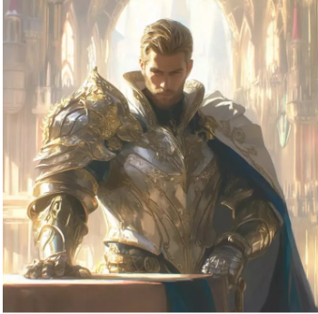
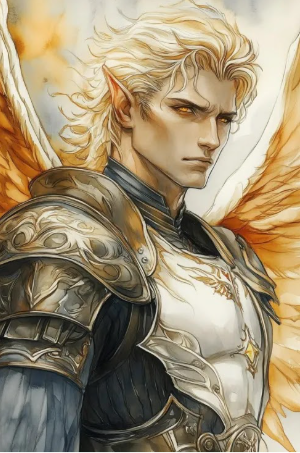

# Lucien, o Imperador Renascido

| **Português (PT-PT)**                                                        | **English (EN-US)**                                                          |
| ---------------------------------------------------------------------------- | ---------------------------------------------------------------------------- |
| **Jogador:** Eduardo Verdete                                                 | **Player:** Eduardo Verdete                                                  |
| **Raça:** Humano                                                             | **Race:** Human                                                              |
| **Classe:** Paladino (juramento próprio) / Guerreiro                         | **Class:** Paladin (custom oath) / Fighter                                   |
| **Antecedente:** Nobre                                                       | **Background:** Noble                                                        |
| **Alinhamento:** Neutro Legal                                                | **Alignment:** Lawful Neutral                                                |
| **Género:** Masculino (ele/dele)                                             | **Gender:** Male (he/him)                                                    |
| **Olhos:** Castanho-dourados                                                 | **Eyes:** Golden-brown                                                       |
| **Tamanho:** Médio                                                           | **Size:** Medium                                                             |
| **Altura:** 1,88 m                                                           | **Height:** 1.88 m                                                           |
| **Cabelo:** Preto, ligeiramente ondulado                                     | **Hair:** Black, slightly wavy                                               |
| **Pele:** Morena clara                                                       | **Skin:** Light tan                                                          |
| **Idade:** 22                                                                | **Age:** 22                                                                  |
| **Nível:** 3                                                                 | **Level:** 3                                                                 |
| **Sessões:** a confirmar                                                     | **Sessions:** to confirm                                                     |
| **Presenças:** 1                                                             | **Attendance:** 1                                                            |
| **Ficha DnD Beyond:** [Link](https://www.dndbeyond.com/characters/143427817) | **DnD Beyond Sheet:** [Link](https://www.dndbeyond.com/characters/143427817) |
| **Contacto:** +351 969 820 809                                               | **Contact:** +351 969 820 809                                                |

---

| **Português (PT-PT)**                                                                                                                                                                                                                                     | **English (EN-US)**                                                                                                                                                                                                                         |
| --------------------------------------------------------------------------------------------------------------------------------------------------------------------------------------------------------------------------------------------------------- | ------------------------------------------------------------------------------------------------------------------------------------------------------------------------------------------------------------------------------------------- |
| **Traços de Personalidade:** Determinado, carismático, imponente na presença e na palavra. Prefere ganhar respeito pela força e pela autoridade, mas sabe quando mostrar clemência.                                                                       | **Personality Traits:** Determined, charismatic, imposing in both presence and speech. Prefers to earn respect through strength and authority but knows when to show mercy.                                                                 |
| **Ideais:** A justiça deve ser definida por quem detém o poder e a coragem de aplicá-la. Reformar um sistema corrupto exige mais que discursos — exige domínio absoluto.                                                                                  | **Ideals:** Justice must be defined by those with the power and will to enforce it. Reforming a corrupt system requires more than words — it requires absolute dominance.                                                                   |
| **Vínculos:** Lealdade à Casa Drakonis apesar da traição. Respeito pelo seu mestre, o Ermitão das Sombras, como única figura que acreditou no seu potencial.                                                                                              | **Bonds:** Loyalty to House Drakonis despite their betrayal. Deep respect for his master, the Hermit of Shadows, the only figure who believed in his potential.                                                                             |
| **Defeitos:** Orgulho desmedido. Desconfiança crónica dos outros, especialmente da nobreza. Pouca paciência para fraqueza ou hesitação.                                                                                                                   | **Flaws:** Overbearing pride. Chronic distrust of others, especially nobility. Little patience for weakness or hesitation.                                                                                                                  |
| História                                                                                                                                                                                                                                                  | Backstory                                                                                                                                                                                                                                   |
| **A Ascensão e a Queda:** Nascido herdeiro da Casa Drakonis e prodígio da Ordem Sagrada, Lucien perdeu aos 10 anos a sua ligação à Luz devido a um ritual proibido realizado pela própria família. Foi desonrado, abandonado e exilado.                   | **Rise and Fall:** Born heir to House Drakonis and prodigy of the Sacred Order, Lucien lost his connection to the Light at age 10 due to a forbidden ritual cast by his own family. He was disgraced, abandoned, and exiled.                |
| **O Exílio e o Mestre Oculto:** Vagou pelo mundo até encontrar o Ermitão das Sombras, um ex-paladino que dominava luz e trevas. Sob treino severo, Lucien fortaleceu corpo e espírito, aguardando o momento de quebrar o selo que o prendia.              | **Exile and the Hidden Master:** Wandered the world until meeting the Hermit of Shadows, a former paladin who mastered both light and darkness. Under harsh training, Lucien honed body and mind, awaiting the day he would break his seal. |
| **O Caminho da Conquista:** Ao libertar-se, tornou-se mais poderoso do que nunca. Regressou, derrotou os seus rivais e obrigou-os a reconhecer a sua autoridade. Agora, viaja para impor uma nova ordem e redefinir a justiça pelos seus próprios termos. | **The Path of Conquest:** Upon breaking free, he became stronger than ever. Returned, defeated his rivals, and forced them to acknowledge his authority. Now travels to impose a new order and redefine justice on his own terms.           |
| NPCs Relevantes                                                                                                                                                                                                                                           | Notable NPCs                                                                                                                                                                                                                                |
| Ermitão das Sombras — Mestre e mentor.                                                                                                                                                                                                                    | Hermit of Shadows — Mentor.                                                                                                                                                                                                                 |
| Anciãos da Casa Drakonis — Traidores e alvo de reforma política.                                                                                                                                                                                          | Elders of House Drakonis — Betrayers and targets for political reform.                                                                                                                                                                      |
| Noiva perdida — Figura do passado que o abandonou após a queda.                                                                                                                                                                                           | Lost fiancée — Left him after his fall.                                                                                                                                                                                                     |
