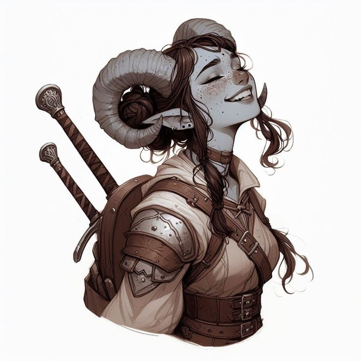

## Orianna ([S03](s03_ataque_rio_neem.md), [S04A](s04a_culto_two_fords.md))

| { width=200 } |
| ------------------------------------------ |

---

**[DM-ONLY – Não incluir na Wiki]**

### 🎲 Jogador / 🎲 Player

| 🎲 Jogador | 🎲 Player |
| ---------------------------- | ---------------------------- |
| **Jogador:** [por preencher] | **Player:** [to be filled] |
| **Idade:** [por preencher] | **Age:** [to be filled] |
| **Contacto:** [por preencher] | **Contact:** [to be filled] |
| **Instagram:** [por preencher] | **Instagram:** [to be filled] |
| **Discord:** [por preencher] | **Discord:** [to be filled] |
| **Ficha D&D Beyond:** [por preencher] | **D&D Beyond Sheet:** [to be filled] |

**[DM-ONLY – Não incluir na Wiki]**

---

### 🧙 Personagem / 🧙 Character

| **🧙 Personagem**                                                        | **🧙 Character**                                                     |
| ------------------------------------------------------------------------ | -------------------------------------------------------------------- |
| Nome: **Orianna**                                                        | Name: **Orianna**                                                    |
| Espécie: [Tiefling](https://www.dndbeyond.com/races/tiefling)            | Species: [Tiefling](https://www.dndbeyond.com/races/tiefling)        |
| Classe: [Ranger](https://www.dndbeyond.com/classes/ranger) (Exploradora) | Class: [Ranger](https://www.dndbeyond.com/classes/ranger) (Explorer) |
| Alinhamento: [por preencher]                                             | Alignment: [to be filled]                                            |
| Background: [Agricultora](agricultora.md), aventureira relutante         | Background: [Farmer](agricultora.md), reluctant adventurer           |
| Idade: [por preencher]                                                   | Age: [to be filled]                                                  |
| Altura: [por preencher]                                                  | Height: [to be filled]                                               |
| Olhos: [por preencher]                                                   | Eyes: [to be filled]                                                 |
| Cabelo: [por preencher]                                                  | Hair: [to be filled]                                                 |
| Pele: [por preencher]                                                    | Skin: [to be filled]                                                 |
| Género: Feminino                                                         | Gender: Female                                                       |
| Tamanho: Médio                                                           | Size: Medium                                                         |

---

### 📜 Descrição Física / 📜 Physical Description

| **📜 Descrição Física** | **📜 Physical Description** |
| ----------------------- | --------------------------- |
| Orianna é uma **tiefling** de aparência marcante e jovial. A pele azul-acinzentada contrasta com as sardas escuras que cobrem o rosto, reforçando o seu ar expressivo. Os olhos são claros e brilhantes, irradiando energia e entusiasmo. Os cabelos são longos e castanhos, geralmente apanhados de forma prática, mas com algumas madeixas soltas que emolduram o rosto. Os chifres curvados, robustos e bem formados, acentuam a sua herança infernal sem lhe retirar charme. Usa armadura leve de couro, adornada com pequenas placas metálicas, e carrega duas [espadas longas](https://www.dndbeyond.com/equipment/longsword) cruzadas nas costas, sinal da sua perícia marcial. O sorriso aberto e a postura descontraída revelam tanto coragem como otimismo, transmitindo a sensação de alguém que encara o mundo com confiança e alegria. | Orianna is a **tiefling** of striking and youthful appearance. Her bluish-gray skin contrasts with the dark freckles scattered across her face, enhancing her expressive look. Her eyes are bright and clear, radiating energy and cheerfulness. She has long brown hair, usually tied back in a practical way, though some loose strands frame her face. Her horns are curved, sturdy, and well-formed, emphasizing her infernal heritage without diminishing her charm. She wears light [leather armor](https://www.dndbeyond.com/equipment/leather-armor) adorned with small metal plates and carries two [longswords](https://www.dndbeyond.com/equipment/longsword) crossed on her back, showcasing her martial skill. Her open smile and relaxed posture convey both bravery and optimism, giving the impression of someone who faces the world with confidence and joy. |

---

### ⚔️ Itens / ⚔️ Items

| **⚔️ Itens** | **⚔️ Items** |
| ---------------------------- | ---------------------------- |
| **Armadura/Escudo:** [por preencher]  **Armas:** [por preencher]  **Items mágicos:** [por preencher]  **Potions:** [por preencher]  **Items não mágicos:** [por preencher]  **Ouro:** [por preencher] | **Armor/Shield:** [to be filled]  **Weapons:** [to be filled]  **Magical Items:** [to be filled]  **Potions:** [to be filled]  **Non-magical Items:** [to be filled]  **Gold:** [to be filled] |

---

### 📖 História – Antes da Taberna / 📖 Story – Before the Tavern

| **📖 História – Antes da Taberna** | **📖 Story – Before the Tavern** |
| ---------------------------------- | -------------------------------- |
| Orianna cresceu numa pequena aldeia agrícola com os pais, levando uma vida simples até se juntar ao amigo de infância [Arkos Vasell](pc_arkos_vasell.md). Ambos decidiram abandonar a rotina rural para procurar sustento e propósito no caminho dos aventureiros. | Orianna grew up in a small farming village with her parents, living a simple life until joining her childhood friend [Arkos Vasell](pc_arkos_vasell.md). Both chose to leave behind their rural routine in search of purpose and a living through adventuring. |

---

### 📖 História – Depois da Taberna / 📖 Story – After the Tavern

| **📖 História – Depois da Taberna** | **📖 Story – After the Tavern** |
| ----------------------------------- | -------------------------------- |
| Participou em missões de reconhecimento e investigação, incluindo a emboscada junto ao [Rio Neen](rio_neen.md) e a investigação da doença em [Two Fords](two_fords.md). Demonstrou forte instinto protetor pelos inocentes, apoiando mercadores como [Kaldros Veynor](kaldros_veynor.md) e ajudando a salvar a filha do taberneiro [Geralt](geralt.md). | Took part in reconnaissance and investigation missions, including the ambush near the [Neen River](rio_neen.md) and the disease mystery in [Two Fords](two_fords.md). Showed strong protective instincts for innocents, supporting merchants like [Kaldros Veynor](kaldros_veynor.md) and helping save the daughter of innkeeper [Geralt](geralt.md). |

---

### 🎭 Dramatis Persona / 🎭 Dramatis Personae

| **🎭 Dramatis Persona** | **🎭 Dramatis Personae** |
| --------------------------------------------------------------------------------------------------------------------------------------- | --------------------------------------------------------------------------------------------------------------------------------- |
| **NPCs de influência direta:**  - [Arkos Vasell](pc_arkos_vasell.md) – amigo de infância, parceiro inseparável. - [Kaldros Veynor](kaldros_veynor.md) – mercador resgatado no [Rio Neen](rio_neen.md). - [Geralt](geralt.md) – taberneiro de [Two Fords](two_fords.md). - Lila – filha de [Geralt](geralt.md), vítima da doença. | **Direct Influence NPCs:**  - [Arkos Vasell](pc_arkos_vasell.md) – childhood friend, inseparable partner. - [Kaldros Veynor](kaldros_veynor.md) – merchant rescued at the [Neen River](rio_neen.md). - [Geralt](geralt.md) – innkeeper of [Two Fords](two_fords.md). - Lila – [Geralt’s](geralt.md) daughter, victim of the disease. |
| **Antagonistas:**  - Cultistas e agentes do [Culto do Mal Elemental](cult_of_elemental_evil.md). | **Antagonists:**  - Cultists and agents of the [Cult of Elemental Evil](cult_of_elemental_evil.md). |
| **Aliados:**  - Companheiros de missão em [Rio Neen](rio_neen.md) e [Two Fords](two_fords.md): Arkos, [Endouven Bomsossego](pc_endouven_bomsossego.md), [Gauthak](pc_gauthak_vunakamune.md), [Lone Straw](pc_lone_straw.md), [Wandering Sage](pc_wandering_sage.md), Endor, Gaulutax. | **Allies:**  - Fellow adventurers in [Neen River](rio_neen.md) and [Two Fords](two_fords.md): [Arkos](pc_arkos_vasell.md), [Endouven Bomsossego](pc_endouven_bomsossego.md), [Gauthak](pc_gauthak_vunakamune.md), [Lone Straw](pc_lone_straw.md), [Wandering Sage](pc_wandering_sage.md), Endor, Gaulutax. |

---

### 🔮 OBS / 🔮 Notes

| **🔮 OBS** | **🔮 Notes** |
| ---------- | ------------ |
| - Orianna funciona como **espelho moral de [Arkos Vasell](pc_arkos_vasell.md)**: menos ligada à fé, mais à proteção da vida e das pessoas comuns. - Tem laços fortes ao passado simples da aldeia e guarda nostalgia de casa. | - Orianna acts as **moral mirror to [Arkos Vasell](pc_arkos_vasell.md)**: less tied to faith, more to protecting life and common folk. - Holds strong ties to her simple village past and keeps a sense of homesickness. |

---

## Processing Audit

### Internal Links

| Source File | Linked Files |
| :--- | :--- |
| pc_orianna.md | agricultora.md, pc_arkos_vasell.md, rio_neen.md, two_fords.md, kaldros_veynor.md, geralt.md, cult_of_elemental_evil.md, pc_endouven_bomsossego.md, pc_gauthak_vunakamune.md, pc_lone_straw.md, pc_wandering_sage.md |

### Warnings

| Type | Where | Detail |
| :--- | :--- | :--- |
| **Race/Species Corrected** | Character Table | Corrected species from 'Humana' to **Tiefling** based on physical description in source. |
| **Link Simplification** | Story After Table (PT) | Simplified relative path `../adventures/s03_emboscada_nas_margens_do_rio_neem_resumo.md` to basename `s03_emboscada_nas_margens_do_rio_neem_resumo.md`. |
| **Link Simplification** | Story After Table (PT) | Simplified relative path `../adventures/s04_two_fords_doenca_moinho_summary.md` to basename `s04_two_fords_doenca_moinho_summary.md`. |
| **Link Simplification** | Story After Table (EN) | Simplified relative path `../adventures/s03_emboscada_nas_margens_do_rio_neem_resumo.md` to basename `s03_emboscada_nas_margens_do_rio_neem_resumo.md`. |
| **Link Simplification** | Story After Table (EN) | Simplified relative path `../adventures/s04_two_fords_doenca_moinho_summary.md` to basename `s04_two_fords_doenca_moinho_summary.md`. |
| **Link Simplification** | Dramatis Persona Table (PT) | Simplified relative path `docs/dm/-/pc/pc_arkos_vasell.md` to basename `pc_arkos_vasell.md`. |
| **Link Simplification** | Dramatis Persona Table (EN) | Simplified relative path `docs/dm/-/pc/pc_arkos_vasell.md` to basename `pc_arkos_vasell.md`. |
| **Link Simplification** | Allies List (PT) | Simplified relative path `../adventures/s03_emboscada_nas_margens_do_rio_neem_resumo.md` to basename `s03_emboscada_nas_margens_do_rio_neem_resumo.md`. |
| **Link Simplification** | Allies List (PT) | Simplified relative path `../adventures/s04_two_fords_doenca_moinho_summary.md` to basename `s04_two_fords_doenca_moinho_summary.md`. |
| **Link Simplification** | Allies List (EN) | Simplified relative path `../adventures/s03_emboscada_nas_margens_do_rio_neem_resumo.md` to basename `s03_emboscada_nas_margens_do_rio_neem_resumo.md`. |
| **Link Simplification** | Allies List (EN) | Simplified relative path `../adventures/s04_two_fords_doenca_moinho_summary.md` to basename `s04_two_fords_doenca_moinho_summary.md`. |
| **Link Simplification** | Notes Table (PT) | Simplified relative path `docs/dm/-/pc/pc_arkos_vasell.md` to basename `pc_arkos_vasell.md`. |
| **Link Simplification** | Notes Table (EN) | Simplified relative path `docs/dm/-/pc/pc_arkos_vasell.md` to basename `pc_arkos_vasell.md`. |
| **Link Validation** | Image Source | Image file `pc_orianna.jpg` not found in KB. |
| **Missing Session File** | Story After Table (PT) | Linked session file `s03_emboscada_nas_margens_do_rio_neem_resumo.md` not found in KB/Input. |
| **Missing Session File** | Story After Table (PT) | Linked session file `s04_two_fords_doenca_moinho_summary.md` not found in KB/Input. |
| **Missing Session File** | Story After Table (EN) | Linked session file `s03_emboscada_nas_margens_do_rio_neem_resumo.md` not found in KB/Input. |
| **Missing Session File** | Story After Table (EN) | Linked session file `s04_two_fords_doenca_moinho_summary.md` not found in KB/Input. |
| **Missing Session File** | Allies List (PT) | Linked session file `s03_emboscada_nas_margens_do_rio_neem_resumo.md` not found in KB/Input. |
| **Missing Session File** | Allies List (PT) | Linked session file `s04_two_fords_doenca_moinho_summary.md` not found in KB/Input. |
| **Missing Session File** | Allies List (EN) | Linked session file `s03_emboscada_nas_margens_do_rio_neem_resumo.md` not found in KB/Input. |
| **Missing Session File** | Allies List (EN) | Linked session file `s04_two_fords_doenca_moinho_summary.md` not found in KB/Input. |

### Missing Files

| Type             | Where                                | Detail                                                            |
| :--------------- | :----------------------------------- | :---------------------------------------------------------------- |
| **Concept**      | Character Table                      | `agricultora.md` (Linked for "Agricultora")                       |
| **PC/NPC**       | Story/Dramatis Persona/Notes Tables  | `pc_arkos_vasell.md` (Linked for "Arkos Vasell")                  |
| **Location**     | Story/Dramatis Persona/Allies Tables | `rio_neen.md` (Linked for "Rio Neen")                             |
| **Location**     | Story/Dramatis Persona/Allies Tables | `two_fords.md` (Linked for "Two Fords")                           |
| **NPC**          | Story/Dramatis Persona Tables        | `kaldros_veynor.md` (Linked for "Kaldros Veynor")                 |
| **NPC**          | Story/Dramatis Persona Tables        | `geralt.md` (Linked for "Geralt")                                 |
| **Organization** | Dramatis Persona Table               | `cult_of_elemental_evil.md` (Linked for "Culto do Mal Elemental") |
| **PC/NPC**       | Allies List                          | `pc_endouven_bomsossego.md` (Linked for "Endouven Bomsossego")    |
| **PC/NPC**       | Allies List                          | `pc_gauthak_vunakamune.md` (Linked for "Gauthak")                 |
| **PC/NPC**       | Allies List                          | `pc_lone_straw.md` (Linked for "Lone Straw")                      |
| **PC/NPC**       | Allies List                          | `pc_wandering_sage.md` (Linked for "Wandering Sage")              |