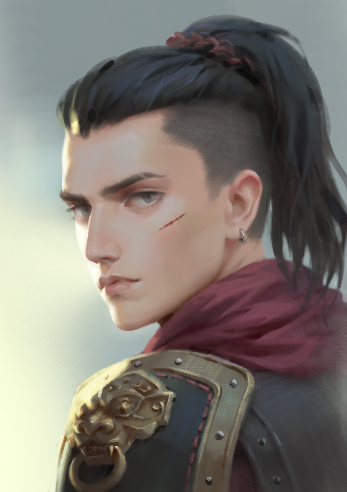

## Raylahn ([S10B](s10b_resgate_rolger.md), [S11A](s11a_sombras_de_iuz.md), [S12](s12_legado_de_krixis.md), [S13A](s13a_resgate_dustin.md), [S17A](s17a_missao_assassinos.md), [S17B](s17b_a_crianca_perdida.md))

| {width=300} |
| ---------------------------------------- |

---

**[DM-ONLY – Não incluir na Wiki]**

### 🎲 Jogador / 🎲 Player

| 🎲 Jogador | 🎲 Player |
| :--- | :--- |
| **Jogador:** [Fábio Oliveira](fabio_oliveira.md) | **Player:** [Fábio Oliveira](fabio_oliveira.md) |
| **Idade:** 31 | **Age:** 31 |
| **Contacto:** 913410619 | **Contact:** 913410619 |
| **Instagram:** fabio__._oliveira | **Instagram:** fabio__._oliveira |
| **Discord:** le_fabino | **Discord:** le_fabino |
| **Ficha D&D Beyond:** [Link](https://www.dndbeyond.com/characters/107560343) | **D&D Beyond Sheet:** [Link](https://www.dndbeyond.com/characters/107560343) |

**[DM-ONLY – Não incluir na Wiki]**

---

### 🧙 Personagem / 🧙 Character

| **🧙 Personagem** | **🧙 Character** |
| :--- | :--- |
| Nome: **Raylahn** | Name: **Raylahn** |
| Espécie: [Humano](https://www.dndbeyond.com/races/human) | Species: [Human](https://www.dndbeyond.com/races/human) |
| Classe: [Guerreiro](https://www.dndbeyond.com/classes/fighter) / [Paladino](https://www.dndbeyond.com/classes/paladin) (treino inicial) | Class: [Fighter](https://www.dndbeyond.com/classes/fighter) / [Paladin](https://www.dndbeyond.com/classes/paladin) (initial training) |
| Alinhamento: Leal Neutro | Alignment: Lawful Neutral |
| Background: [Soldado](https://www.dndbeyond.com/backgrounds/soldier) | Background: [Soldier](https://www.dndbeyond.com/backgrounds/soldier) |
| Idade: 24 (Inferido) | Age: 24 (Inferred) |
| Altura: 1,80 m | Height: 5'11" |
| Olhos: Azuis-acinzentados, intensos, marcados por disciplina | Eyes: Grayish-blue, intense, disciplined |
| Cabelo: Preto, liso, frequentemente rapado nas laterais e preso num rabo-de-cavalo alto | Hair: Black, straight, often shaved at the sides and tied back in a high ponytail |
| Pele: Morena clara, endurecida pelo treino físico e pela vida de mercenário | Skin: Light tan, toughened by physical training and mercenary life |
| Género: Masculino (transformado em feminino na juventude por maldição) | Gender: Male (cursed to live as female in youth) |
| Tamanho: Médio | Size: Medium |
| Aparência: Postura marcial e disciplinada, olhar severo e vigilante. Costuma trajar armadura leve com detalhes metálicos e um manto vermelho, transmitindo distinção e autoridade. | Appearance: Martial and disciplined bearing, stern and watchful gaze. Usually wears light armor with metallic details and a red mantle, conveying distinction and authority. |

---

### 📜 Descrição Física / 📜 Physical Description

| **📜 Descrição Física** | **📜 Physical Description** |
| :--- | :--- |
| Raylahn é um humano jovem de presença marcial e disciplinada. O corpo atlético reflete anos de treino militar e vida de mercenário. O rosto carrega feições austeras, olhos azuis-acinzentados intensos e uma cicatriz discreta na face esquerda, lembrança de combates passados. O cabelo negro é mantido comprido, mas prático: rapado nas laterais e preso num rabo-de-cavalo alto. A pele morena clara mostra sinais de esforço físico constante e cicatrizes discretas. Veste [armadura leve](https://www.dndbeyond.com/equipment/splint-armor) reforçada por detalhes metálicos ornamentais, acompanhada de um manto vermelho que lhe confere distinção. A sua postura transmite respeito imediato e a sua aura é de severidade controlada. | Raylahn is a young human with a martial and disciplined presence. His athletic build reflects years of military training and mercenary life. His face bears austere features, grayish-blue intense eyes, and a faint scar across his left cheek, a reminder of past battles. His black hair is long yet practical: shaved at the sides and tied back in a high ponytail. His light tan skin shows the signs of constant physical strain and faint scars. He wears [light armor](https://www.dndbeyond.com/equipment/splint-armor) reinforced with ornamental metallic details, along with a red mantle that lends him distinction. His stance commands immediate respect, and his aura radiates controlled severity. |

---

### ⚔️ Itens / ⚔️ Items

| **⚔️ Itens** | **⚔️ Items** |
| :--- | :--- |
| **Armadura/Escudo:** [Splint +1](splint_plus_1.md)  **Armas:** [Spear +1](spear_plus_1.md); 6 [Handaxes](https://www.dndbeyond.com/equipment/handaxe); [Flail](https://www.dndbeyond.com/equipment/flail); 2 [Javelins](https://www.dndbeyond.com/equipment/javelin); [Trident](https://www.dndbeyond.com/equipment/trident); [Warhammer](https://www.dndbeyond.com/equipment/warhammer); 4 [Daggers](https://www.dndbeyond.com/equipment/dagger)  **Items mágicos:** [Splint +1](splint_plus_1.md); [Spear +1](spear_plus_1.md); [Horn of Silent Alarm](horn_of_silent_alarm.md); [Ring of Jumping](https://www.dndbeyond.com/magic-items/ring-of-jumping); [Poison Stone “Pokeball”](poison_stone_pokeball.md); [Anel da Taberna](anel_da_taberna.md)  **Potions:** 1 [Greater Healing](https://www.dndbeyond.com/magic-items/potion-of-superior-healing); 3 [Healing](https://www.dndbeyond.com/magic-items/potion-of-healing); [Holy Water](https://www.dndbeyond.com/equipment/holy-water); 6 [Antitoxins](https://www.dndbeyond.com/equipment/antitoxin); Bastion: 1 Healing, [Boneca de Mudança de Género (ilusão)](boneca_de_mudanca_de_genero_ilusao.md)  **Scrolls:** [Absorb Elements](https://www.dndbeyond.com/spells/absorb-elements); [Shield](https://www.dndbeyond.com/spells/shield)  **Items não mágicos:** Traveler’s clothes; [Healer’s Kit](https://www.dndbeyond.com/equipment/healers-kit); [Calligrapher’s Supplies](https://www.dndbeyond.com/equipment/calligraphers-supplies); [Crystal](https://www.dndbeyond.com/equipment/crystal); [Jeweler’s Tools](https://www.dndbeyond.com/equipment/jewelers-tools); Mirror; Oil; Perfume; Playing Cards; [Tinderbox](https://www.dndbeyond.com/equipment/tinderbox); Incense; [Caltrops](https://www.dndbeyond.com/equipment/caltrops); [Crowbar](https://www.dndbeyond.com/equipment/crowbar); Rope; 4 Torches; Bastion: Empty Book, [Tinker’s Tools](https://www.dndbeyond.com/equipment/tinkers-tools), Torch  **Ouro:** 471 gp | **Armor/Shield:** [Splint +1](splint_plus_1.md)  **Weapons:** [Spear +1](spear_plus_1.md); 6 [Handaxes](https://www.dndbeyond.com/equipment/handaxe); [Flail](https://www.dndbeyond.com/equipment/flail); 2 [Javelins](https://www.dndbeyond.com/equipment/javelin); [Trident](https://www.dndbeyond.com/equipment/trident); [Warhammer](https://www.dndbeyond.com/equipment/warhammer); 4 [Daggers](https://www.dndbeyond.com/equipment/dagger)  **Magical Items:** [Splint +1](splint_plus_1.md); [Spear +1](spear_plus_1.md); [Horn of Silent Alarm](horn_of_silent_alarm.md); [Ring of Jumping](https://www.dndbeyond.com/magic-items/ring-of-jumping); [Poison Stone “Pokeball”](poison_stone_pokeball.md); [Tavern’s Ring](anel_da_taberna.md)  **Potions:** 1 [Greater Healing](https://www.dndbeyond.com/magic-items/potion-of-superior-healing); 3 [Healing](https://www.dndbeyond.com/magic-items/potion-of-healing); [Holy Water](https://www.dndbeyond.com/equipment/holy-water); 6 [Antitoxins](https://www.dndbeyond.com/equipment/antitoxin); Bastion: 1 Healing, [Gender Change Doll (illusion)](boneca_de_mudanca_de_genero_ilusao.md)  **Scrolls:** [Absorb Elements](https://www.dndbeyond.com/spells/absorb-elements); [Shield](https://www.dndbeyond.com/spells/shield)  **Non-magical Items:** Traveler’s clothes; [Healer’s Kit](https://www.dndbeyond.com/equipment/healers-kit); [Calligrapher’s Supplies](https://www.dndbeyond.com/equipment/calligraphers-supplies); [Crystal](https://www.dndbeyond.com/equipment/crystal); [Jeweler’s Tools](https://www.dndbeyond.com/equipment/jewelers-tools); Mirror; Oil; Perfume; Playing Cards; [Tinderbox](https://www.dndbeyond.com/equipment/tinderbox); Incense; [Caltrops](https://www.dndbeyond.com/equipment/caltrops); [Crowbar](https://www.dndbeyond.com/equipment/crowbar); Rope; 4 Torches; Bastion: Empty Book, [Tinker’s Tools](https://www.dndbeyond.com/equipment/tinkers-tools), Torch  **Gold:** 471 gp |

---

### 📖 História – Antes da Taberna / 📖 Story – Before the Tavern

| **📖 História – Antes da Taberna** | **📖 Story – Before the Tavern** |
| :--- | :--- |
| - Nascido em segredo numa sociedade matriarcal, filho de [Occera](occera.md), alta paladina de [Thalos](thalos.md). - Amaldiçoado para viver como mulher (Raylah) e integrar o [Clã Zaraleth](cla_zaraleth.md). - Cresceu afastado da religião, mas curioso pela magia gnómica. - Ao atingir a idade adulta, descobriu a verdade: homens eram marcados e vendidos como escravos. - Fugiu, dividido entre vingança contra o clã e a busca de propósito. - Tornou-se mercenário para sobreviver, mas procurava sempre conhecimento arcano. | - Born in secret within a matriarchal society, son of [Occera](occera.md), high paladin of [Thalos](thalos.md). - Cursed to live as a woman (Raylah) to integrate the [Zaraleth Clan](cla_zaraleth.md). - Grew up estranged from religion, curious about gnome magic. - As an adult, discovered the truth: males were marked and sold into slavery. - Fled, torn between vengeance against the clan and search for purpose. - Worked as a mercenary to survive, but increasingly drawn to arcane knowledge. |

---

### 📖 História – Depois da Taberna / 📖 Story – After the Tavern

| **📖 História – Depois da Taberna** | **📖 Story – After the Tavern** |
| :--- | :--- |
| - Acordou numa estalagem, juntou-se a um grupo e ganhou o respeito de [Wagner](pc_wagner.md), um feiticeiro Dragonborn. - Liderou a exploração de uma mansão assombrada, usando rituais em segredo. - Ajudou [Uteluk](uteluk.md), druida do Círculo da Lua, a encontrar [Rolger](rolger.md), o hobgoblin. - Aliou-se a [Kai](pc_kai.md) e ao grupo para enfrentar os [Paladinos de Beltar](paladinos_de_beltar.md); lutou contra [Brandon Brayn](brandon_brayn.md) e resgatou [Dustin](pc_dustin_thorne.md). - Convencido por [Dustin](pc_dustin_thorne.md) e [Pryssana](docs/npc/-/Fey/npc_pryssana.md), enfrentou o [Grande Inquisidor](grande_inquisidor.md) ao lado do grupo. - Estranhos tornaram-se aliados. | - Awoke at an inn, joined a group, and earned the respect of [Wagner](pc_wagner.md), a Dragonborn sorcerer. - Led the exploration of a haunted mansion, secretly using rituals. - Helped [Uteluk](uteluk.md), Circle of the Moon druid, to find [Rolger](rolger.md) the hobgoblin. - Allied with [Kai](pc_kai.md)’s group against the [Paladins of Beltar](paladinos_de_beltar.md); fought [Brandon Brayn](brandon_brayn.md) and rescued [Dustin](pc_dustin_thorne.md). - Persuaded by [Dustin](pc_dustin_thorne.md) and [Pryssana](docs/npc/-/Fey/npc_pryssana.md), joined the group to face the [Grand Inquisitor](grande_inquisidor.md). - Strangers became allies. |

---

### 🎭 Dramatis Persona / 🎭 Dramatis Personae

| **🎭 Dramatis Persona** | **🎭 Dramatis Personae** |
| :--- | :--- |
| **NPCs de influência direta:** - [Occera](occera.md) (Alta Paladina de [Thalos](thalos.md), mãe de Raylahn). | **Direct Influence NPCs:** - [Occera](occera.md) (High Paladin of [Thalos](thalos.md), Raylahn’s mother). |
| **Antagonistas:** - [Clã Zaraleth](cla_zaraleth.md). - [Brandon Brayn](brandon_brayn.md). - [Grande Inquisidor](grande_inquisidor.md). - [Paladinos de Beltar](paladinos_de_beltar.md). | **Antagonists:** - [Zaraleth Clan](cla_zaraleth.md). - [Brandon Brayn](brandon_brayn.md). - [Grand Inquisitor](grande_inquisidor.md). - [Paladins of Beltar](paladinos_de_beltar.md). |
| **Aliados:** - [Wagner](pc_wagner.md). - [Uteluk](uteluk.md). - [Rolger](rolger.md). - [Kai](pc_kai.md). - [Dustin](pc_dustin_thorne.md). - [Pryssana](docs/npc/-/Fey/npc_pryssana.md). | **Allies:** - [Wagner](pc_wagner.md). - [Uteluk](uteluk.md). - [Rolger](rolger.md). - [Kai](pc_kai.md). - [Dustin](pc_dustin_thorne.md). - [Pryssana](docs/npc/-/Fey/npc_pryssana.md). |

---

### 🔮 OBS / 🔮 Notes

| **🔮 OBS** | **🔮 Notes** |
| :--- | :--- |
| - *[Splint +1](splint_plus_1.md)*: +1 AC. - *[Spear +1](spear_plus_1.md)*: +1 ataque e dano. - *[Horn of Silent Alarm](horn_of_silent_alarm.md)*: alerta silencioso a 600 ft. - *[Ring of Jumping](https://www.dndbeyond.com/magic-items/ring-of-jumping)*: triplica distância de salto. - *[Poison Stone “Pokeball”](poison_stone_pokeball.md)*: item narrativo, detalhes por definir. - *[Anel da Taberna](anel_da_taberna.md)*: conduz à Taberna mais próxima. - *[Boneca de Mudança de Género (ilusão)](boneca_de_mudanca_de_genero_ilusao.md)*: item de Bastion, cria ilusão temporária de mudança de género. - *Pergaminhos ([Absorb Elements](https://www.dndbeyond.com/spells/absorb-elements), [Shield](https://www.dndbeyond.com/spells/shield))*: feitiços de uso único. | - *[Splint +1](splint_plus_1.md)*: +1 AC. - *[Spear +1](spear_plus_1.md)*: +1 attack and damage. - *[Horn of Silent Alarm](horn_of_silent_alarm.md)*: silent alert up to 600 ft. - *[Ring of Jumping](https://www.dndbeyond.com/magic-items/ring-of-jumping)*: triples jump distance. - *[Poison Stone “Pokeball”](poison_stone_pokeball.md)*: narrative item, details TBD. - *[Tavern’s Ring](anel_da_taberna.md)*: leads to nearest Tavern. - *[Gender Change Doll (illusion)](boneca_de_mudanca_de_genero_ilusao.md)*: Bastion’s item, temporary gender illusion. - *Scrolls ([Absorb Elements](https://www.dndbeyond.com/spells/absorb-elements), [Shield](https://www.dndbeyond.com/spells/shield))*: single-use spells. |

---

## Processing Audit

### Internal Links

| Source File | Linked Files |
| :--- | :--- |
| pc_raylahn.md | fabio_oliveira.md, splint_plus_1.md, spear_plus_1.md, horn_of_silent_alarm.md, poison_stone_pokeball.md, anel_da_taberna.md, boneca_de_mudanca_de_genero_ilusao.md, occera.md, thalos.md, cla_zaraleth.md, pc_wagner.md, uteluk.md, rolger.md, pc_kai.md, paladinos_de_beltar.md, brandon_brayn.md, pc_dustin_thorne.md, pryssana.md, grande_inquisidor.md |

### Warnings

| Type | Where | Detail |
| :--- | :--- | :--- |
| **Link Validation** | Image Source | Image file `pc_raylahn.jpg` not found in KB. |
| **DDB Link** | Items Table | Replaced "1 Greater Healing" with "Potion of Superior Healing" slug for DDB matching. |
| **Link Simplification** | Story After Table (PT) | Simplified relative path `docs/dm/-/pc/pc_wagner.md` to basename `pc_wagner.md`. |
| **Link Simplification** | Story After Table (PT) | Simplified relative path `docs/dm/-/pc/pc_kai.md` to basename `pc_kai.md`. |
| **Link Simplification** | Story After Table (PT) | Simplified relative path `docs/dm/-/pc/pc_dustin_thorne.md` to basename `pc_dustin_thorne.md`. |
| **Link Simplification** | Story After Table (PT) | Simplified relative path `docs/dm/-/pc/pc_dustin_thorne.md` to basename `pc_dustin_thorne.md`. |
| **Link Simplification** | Story After Table (EN) | Simplified relative path `docs/dm/-/pc/pc_wagner.md` to basename `pc_wagner.md`. |
| **Link Simplification** | Story After Table (EN) | Simplified relative path `docs/dm/-/pc/pc_kai.md` to basename `pc_kai.md`. |
| **Link Simplification** | Story After Table (EN) | Simplified relative path `docs/dm/-/pc/pc_dustin_thorne.md` to basename `pc_dustin_thorne.md`. |
| **Link Simplification** | Story After Table (EN) | Simplified relative path `docs/dm/-/pc/pc_dustin_thorne.md` to basename `pc_dustin_thorne.md`. |
| **Link Simplification** | Dramatis Persona Table (PT) | Simplified relative path `docs/dm/-/pc/pc_wagner.md` to basename `pc_wagner.md`. |
| **Link Simplification** | Dramatis Persona Table (PT) | Simplified relative path `docs/dm/-/pc/pc_kai.md` to basename `pc_kai.md`. |
| **Link Simplification** | Dramatis Persona Table (PT) | Simplified relative path `docs/dm/-/pc/pc_dustin_thorne.md` to basename `pc_dustin_thorne.md`. |
| **Link Simplification** | Dramatis Persona Table (EN) | Simplified relative path `docs/dm/-/pc/pc_wagner.md` to basename `pc_wagner.md`. |
| **Link Simplification** | Dramatis Persona Table (EN) | Simplified relative path `docs/dm/-/pc/pc_kai.md` to basename `pc_kai.md`. |
| **Link Simplification** | Dramatis Persona Table (EN) | Simplified relative path `docs/dm/-/pc/pc_dustin_thorne.md` to basename `pc_dustin_thorne.md`. |

### Missing Files

| Type | Where | Detail |
| :--- | :--- | :--- |
| **PC/NPC** | Jogador/Player Table | `fabio_oliveira.md` (Linked for "Fábio Oliveira") |
| **Item** | Items Table/Notes Table | `splint_plus_1.md` (Linked for "Splint +1") |
| **Item** | Items Table/Notes Table | `spear_plus_1.md` (Linked for "Spear +1") |
| **Item** | Items Table/Notes Table | `horn_of_silent_alarm.md` (Linked for "Horn of Silent Alarm") |
| **Item** | Items Table/Notes Table | `poison_stone_pokeball.md` (Linked for "Poison Stone “Pokeball”") |
| **Item** | Items Table/Notes Table | `anel_da_taberna.md` (Linked for "Anel da Taberna") |
| **Item** | Items Table/Notes Table | `boneca_de_mudanca_de_genero_ilusao.md` (Linked for "Boneca de Mudança de Género (ilusão)") |
| **NPC** | Story/Dramatis Persona Tables | `occera.md` (Linked for "Occera") |
| **Concept/Location** | Story/Dramatis Persona Tables | `thalos.md` (Linked for "Thalos") |
| **Organization** | Story/Dramatis Persona Tables | `cla_zaraleth.md` (Linked for "Clã Zaraleth") |
| **PC/NPC** | Story/Dramatis Persona Tables | `pc_wagner.md` (Linked for "Wagner") |
| **NPC** | Story/Dramatis Persona Tables | `uteluk.md` (Linked for "Uteluk") |
| **NPC** | Story/Dramatis Persona Tables | `rolger.md` (Linked for "Rolger") |
| **PC/NPC** | Story/Dramatis Persona Tables | `pc_kai.md` (Linked for "Kai") |
| **Organization** | Story/Dramatis Persona Tables | `paladinos_de_beltar.md` (Linked for "Paladinos de Beltar") |
| **NPC** | Story/Dramatis Persona Tables | `brandon_brayn.md` (Linked for "Brandon Brayn") |
| **PC/NPC** | Story/Dramatis Persona Tables | `pc_dustin_thorne.md` (Linked for "Dustin") |
| **NPC** | Story/Dramatis Persona Tables | `pryssana.md` (Linked for "Pryssana") |
| **NPC** | Story/Dramatis Persona Tables | `grande_inquisidor.md` (Linked for "Grande Inquisidor") |