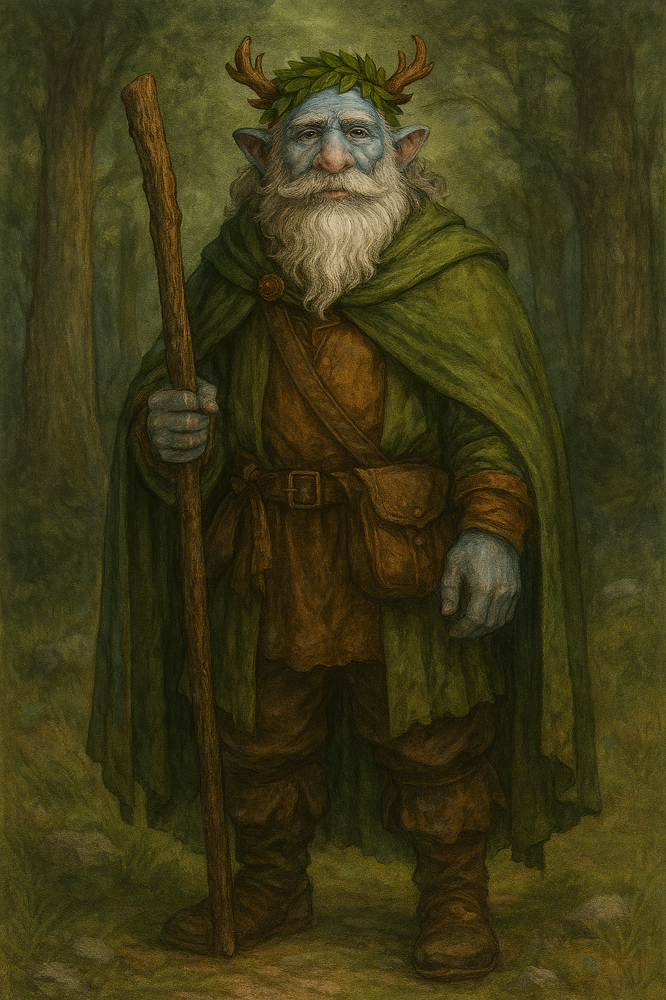

# Silfir

| **Português (PT-PT)** | **English (EN-US)** |
|---|---|
| **Jogador:** Leonel Pereira | **Player:** Leonel Pereira |
| **Espécie:** Firbolg | **Species:** Firbolg |
| **Classe:** Druida | **Class:** Druid |
| **Nível:** 6 | **Level:** 6 |
| **Sessões:** 14 | **Sessions:** 14 |
| **Presenças:** 3 | **Attendance:** 3 |
| **Fonte:** s14_-_2025-04-10.txt | **Source:** s14_-_2025-04-10.txt |
| **Ficha DnD Beyond:** [Link](https://www.dndbeyond.com/characters/142668827) | **DnD Beyond Sheet:** [Link](https://www.dndbeyond.com/characters/142668827) |
| **Contacto:** +351 961 829 607 | **Contact:** +351 961 829 607 |

---

| **Português (PT-PT)** | **English (EN-US)** |
|---|---|
| **Resumo rápido:** Druida com ligação à natureza, contribui com magia e cura durante os perigos de Pessegueiro. | **Quick synopsis:** Druid connected to nature, provides magic and healing during the dangers of Pessegueiro. |
