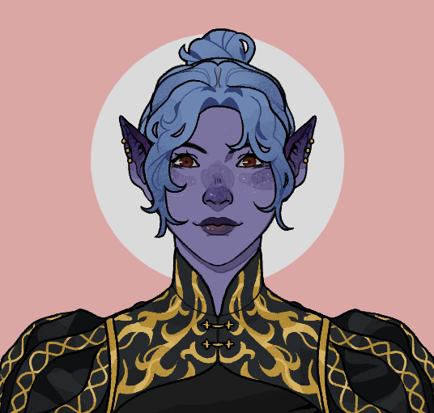
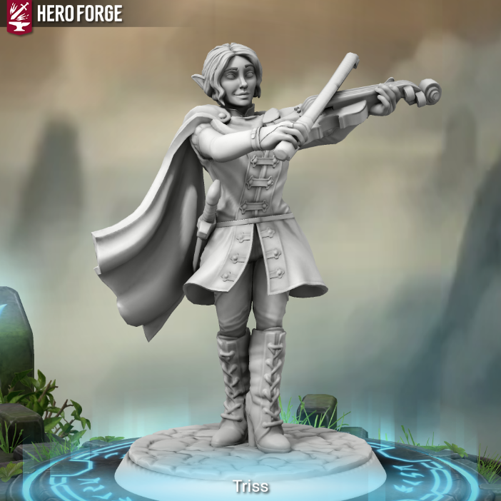

## Triss Merril ([S01](s01_purificacao_riacho.md), [S02](s02_miner_difficulties.md), [S04B](s04b_vale_sombrio_culto_alado.md), [S07A](s07a_emboscada_erybend.md), [S08A](s08a_intriga_odrak_erybend.md), [S10C](s10c_baile_rainha_caecena.md), [S11A](s11a_sombras_de_iuz.md), [S11B](s11b_sombras_sobre_erybend.md), [S12](s12_legado_de_krixis.md), [S13A](s13a_resgate_dustin.md), [S15A](s15a_ceptro_de_zan.md))

| {width=200} | {width=200} | {width=200} |
| ---------------------------------------------- | ---------------------------------------------- | ---------------------------------------------- |

---

**[DM-ONLY – Não incluir na Wiki]**

### 🎲 Jogador / 🎲 Player

| 🎲 Jogador | 🎲 Player |
| :--- | :--- |
| **Jogadora:** [por preencher] | **Player:** [to be filled] |
| **Idade:** [por preencher] | **Age:** [to be filled] |
| **Contacto:** [por preencher] | **Contact:** [to be filled] |
| **Instagram:** [por preencher] | **Instagram:** [to be filled] |
| **Discord:** [por preencher] | **Discord:** [to be filled] |
| **Ficha D&D Beyond:** [Link](https://www.dndbeyond.com/characters/138906172) | **D&D Beyond Sheet:** [Link](https://www.dndbeyond.com/characters/138906172) |

**[DM-ONLY – Não incluir na Wiki]**

---

### 🧙 Personagem / 🧙 Character

| **🧙 Personagem** | **🧙 Character** |
| :--- | :--- |
| **Nome**: **Triss Merrill** | **Name**: **Triss Merrill** |
| **Espécie**: [Humana](https://www.dndbeyond.com/races/human) | **Species**: [Human](https://www.dndbeyond.com/races/human) |
| **Classe**: [Feiticeira](https://www.dndbeyond.com/classes/sorcerer) (Linagem Dracónica) | **Class**: [Sorcerer](https://www.dndbeyond.com/classes/sorcerer) (Draconic Bloodline) |
| **Alinhamento**: [por preencher] | **Alignment**: [to be filled] |
| **Background**: Filha ilegítima de mercador em [Greyhawk](free_city_of_greyhawk.md) | **Background**: Illegitimate daughter of a merchant in [Greyhawk](free_city_of_greyhawk.md) |
| **Idade**: [por preencher] | **Age**: [to be filled] |
| **Altura**: [por preencher] | **Height**: [to be filled] |
| **Olhos**: Azul-claros brilhantes [**(Inferido da imagem)**] | **Eyes**: Bright light blue [**(Inferred from image)**] |
| **Cabelo**: Azul-escuro, preso em trança [**(Inferido da imagem)**] | **Hair**: Dark blue, braided [**(Inferred from image)**] |
| **Pele**: Violeta-acinzentada [**(Inferido da imagem)**] | **Skin**: Violet-gray [**(Inferred from image)**] |
| **Tamanho**: Médio | **Size**: Medium |

---

### 📜 Descrição Física / 📜 Physical Description

| **📜 Descrição Física** | **📜 Physical Description** |
| :--- | :--- |
| **Triss** é uma jovem humana de pele violeta-acinzentada e traços elegantes, que evocam tanto beleza etérea quanto a força latente da sua linhagem dracónica. O cabelo azul-escuro é geralmente preso em tranças elaboradas, realçando as suas orelhas delicadas e o olhar penetrante dos olhos azul-claros que parecem brilhar com magia interior. Nas imagens conhecidas surge com roupas bordadas de dourado e armaduras leves, acompanhada de um [violino](https://www.dndbeyond.com/equipment/viol) que domina com destreza. A miniatura de HeroForge mostra-a numa postura altiva, capa esvoaçante e gesto teatral de quem tanto inspira quanto intimida. | **Triss** is a young human with violet-gray skin and elegant features, evoking both ethereal beauty and the latent strength of her draconic bloodline. Her dark blue hair is often braided, highlighting delicate ears and the piercing glow of her light-blue eyes, which seem to shimmer with inner magic. In artwork she appears clad in golden-embroidered clothes and light armor, wielding her [violin](https://www.dndbeyond.com/equipment/viol) with mastery. The HeroForge miniature portrays her in an imposing stance, cape flowing, and a theatrical gesture that both inspires and intimidates. |

---

### ⚔️ Itens / ⚔️ Items

| **⚔️ Itens** | **⚔️ Items** |
| :--- | :--- |
| **Armadura/Escudo:** [por preencher] | **Armor/Shield:** [to be filled] |
| **Armas:** [por preencher] | **Weapons:** [to be filled] |
| **Items mágicos:** [Ring of Spell Storing](https://www.dndbeyond.com/magic-items/ring-of-spell-storing); [Staff of Flowers](staff_of_flowers.md); [Feywild Brooch](feywild_brooch.md); [Anel da Taberna](anel_da_taberna.md) | **Magical Items:** [Ring of Spell Storing](https://www.dndbeyond.com/magic-items/ring-of-spell-storing); [Staff of Flowers](staff_of_flowers.md); [Feywild Brooch](feywild_brooch.md); [Tavern Ring](anel_da_taberna.md) |
| **Poções:** [por preencher] | **Potions:** [to be filled] |
| **Items não mágicos:** [Spellbook](spellbook.md); [Clothes](clothes.md); [Adventuring Gear](adventuring_gear.md) | **Non-magical Items:** [Spellbook](spellbook.md); [Clothes](clothes.md); [Adventuring Gear](adventuring_gear.md) |
| **Ouro:** [por preencher] | **Gold:** [to be filled] |

---

### 📖 História – Antes da Taberna / 📖 Story – Before the Tavern

| **📖 História – Antes da Taberna** | **📖 Story – Before the Tavern** |
| :--- | :--- |
| - Nascida em [Greyhawk](free_city_of_greyhawk.md), filha ilegítima de um mercador. - Cresceu com pouco apoio, mas cedo mostrou talento para a magia. - A sua linhagem dracónica revelou-se através do poder elemental. - Procurou independência, viajando em busca de conhecimento e reconhecimento. - O destino levou-a até à [Taverna](taverna.md). | - Born in [Greyhawk](free_city_of_greyhawk.md), illegitimate child of a merchant. - Grew up with little support, but showed magical talent early. - Her draconic bloodline manifested through elemental power. - Sought independence, traveling for knowledge and recognition. - Fate brought her to the [Tavern](taverna.md). |

---

### 📖 História – Depois da Taberna / 📖 Story – After the Tavern

| **📖 História – Depois da Taberna** | **📖 Story – After the Tavern** |
| :--- | :--- |
| - Ajudou a libertar templos corrompidos de [Nerull](nerull.md) com [Grix’Molah](pc_grix_molah.md). - Fez contacto com entidades feéricas durante missões no [Feywild](feywild.md). - Desenvolveu uma relação próxima com [Grix](pc_grix_molah.md), com quem planeia ir a um baile. - Ganhou inspiração de [Titania](titania.md) após purificar caveiras atormentadas. - Tornou-se uma das vozes de equilíbrio no grupo dos **[Funguys](funguys.md)**. | - Helped cleanse [Nerull](nerull.md)-corrupted temples with [Grix’Molah](pc_grix_molah.md). - Encountered fey entities during missions in the [Feywild](feywild.md). - Developed a close bond with [Grix](pc_grix_molah.md), with whom she plans to attend a ball. - Gained [Titania’s](titania.md) inspiration after freeing tortured skulls. - Became one of the balancing voices of the **[Funguys](funguys.md)** party. |

---

### 🎭 Dramatis Persona / 🎭 Dramatis Personae

| **🎭 Dramatis Persona** | **🎭 Dramatis Personae** |
| :--- | :--- |
| **NPCs de influência direta:**  - [Grix’Molah](pc_grix_molah.md) – aliado, companheiro próximo. - [Titania](titania.md) – Archfey, concedeu inspiração. | **Direct Influence NPCs:**  - [Grix’Molah](pc_grix_molah.md) – ally, close companion. - [Titania](titania.md) – Archfey, granted inspiration. |
| **Antagonistas:**  - [por preencher]  | **Antagonists:**  -[to be filled] |
| **Aliados:**  - Companheiros **[Funguys](funguys.md)**: [Kai](pc_kai.md), [Dustin](pc_dustin_thorne.md), [Conan](pc_conan_barbaro_ra.md), [Raylahn](pc_raylahn.md), [Eirwen](pc_eirwen.md), [Leo](pc_leo.md), [Sarvian](pc_sarvian_midlor.md) | **Allies:**  - **[Funguys](funguys.md)** companions: [Kai](pc_kai.md), [Dustin](pc_dustin_thorne.md), [Conan](pc_conan_barbaro_ra.md), [Raylahn](pc_raylahn.md), [Eirwen](pc_eirwen.md), [Leo](pc_leo.md), [Sarvian](pc_sarvian_midlor.md) |

---

### 🔮 OBS / 🔮 Notes

| **🔮 OBS** | **🔮 Notes** |
| :--- | :--- |
| - *[Ring of Spell Storing](https://www.dndbeyond.com/magic-items/ring-of-spell-storing)*: pode guardar até 5 níveis de magias. - *[Staff of Flowers](staff_of_flowers.md)*: faz brotar flores à vontade. - *[Feywild Brooch](feywild_brooch.md)*: foco arcano, afinidade com planos feéricos. - *[Anel da Taberna](anel_da_taberna.md)*: conduz à [Taverna](taverna.md) mais próxima. | - *[Ring of Spell Storing](https://www.dndbeyond.com/magic-items/ring-of-spell-storing)*: can store up to 5 levels of spells. - *[Staff of Flowers](staff_of_flowers.md)*: creates flowers at will. - *[Feywild Brooch](feywild_brooch.md)*: arcane focus, feywild attunement. - *[Tavern Ring](anel_da_taberna.md)*: leads to the nearest [Tavern](taverna.md). |

---

## Processing Audit

### Internal Links

| Source File | Linked Files |
| :--- | :--- |
| pc_triss_merril.md | free_city_of_greyhawk.md, staff_of_flowers.md, feywild_brooch.md, anel_da_taberna.md, spellbook.md, clothes.md, adventuring_gear.md, nerull.md, pc_grix_molah.md, feywild.md, titania.md, funguys.md, pc_kai.md, pc_dustin_thorne.md, pc_conan_barbaro_ra.md, pc_raylahn.md, pc_eirwen.md, pc_leo.md, pc_sarvian_midlor.md, taverna.md |

### Warnings

| Type | Where | Detail |
| :--- | :--- | :--- |
| **Link Validation** | Image Source | Image file `pc_triss_merrill_01.png` not found in KB. |
| **Link Validation** | Image Source | Image file `pc_triss_merrill_02.png` not found in KB. |
| **Link Validation** | Image Source | Image file `pc_triss_merrill_03.png` not found in KB. |
| **DDB Link** | Description Table | Used DDB slug `viol` to link "violino" to equipment. |
| **Link Simplification** | Story After Table (PT) | Simplified relative path `docs/dm/-/pc/pc_grix_molah.md` to basename `pc_grix_molah.md`. |
| **Link Simplification** | Story After Table (PT) | Simplified relative path `../realms/feywild.md` to basename `feywild.md`. |
| **Link Simplification** | Story After Table (EN) | Simplified relative path `docs/dm/-/pc/pc_grix_molah.md` to basename `pc_grix_molah.md`. |
| **Link Simplification** | Story After Table (EN) | Simplified relative path `../realms/feywild.md` to basename `feywild.md`. |
| **Link Simplification** | Dramatis Persona Table (PT) | Simplified relative path `docs/dm/-/pc/pc_grix_molah.md` to basename `pc_grix_molah.md`. |
| **Link Simplification** | Dramatis Persona Table (EN) | Simplified relative path `docs/dm/-/pc/pc_grix_molah.md` to basename `pc_grix_molah.md`. |
| **Link Simplification** | Allies List (PT) | Simplified relative path `docs/dm/-/pc/pc_kai.md` to basename `pc_kai.md`. |
| **Link Simplification** | Allies List (PT) | Simplified relative path `docs/dm/-/pc/pc_dustin_thorne.md` to basename `pc_dustin_thorne.md`. |
| **Link Simplification** | Allies List (PT) | Simplified relative path `docs/dm/-/pc/pc_conan_barbaro_ra.md` to basename `pc_conan_barbaro_ra.md`. |
| **Link Simplification** | Allies List (PT) | Simplified relative path `docs/dm/-/pc/pc_raylahn.md` to basename `pc_raylahn.md`. |
| **Link Simplification** | Allies List (PT) | Simplified relative path `docs/dm/-/pc/pc_eirwen.md` to basename `pc_eirwen.md`. |
| **Link Simplification** | Allies List (PT) | Simplified relative path `docs/dm/-/pc/pc_leo.md` to basename `pc_leo.md`. |
| **Link Simplification** | Allies List (PT) | Simplified relative path `docs/dm/-/pc/pc_sarvian_midlor.md` to basename `pc_sarvian_midlor.md`. |
| **Link Simplification** | Allies List (EN) | Simplified relative path `docs/dm/-/pc/pc_kai.md` to basename `pc_kai.md`. |
| **Link Simplification** | Allies List (EN) | Simplified relative path `docs/dm/-/pc/pc_dustin_thorne.md` to basename `pc_dustin_thorne.md`. |
| **Link Simplification** | Allies List (EN) | Simplified relative path `docs/dm/-/pc/pc_conan_barbaro_ra.md` to basename `pc_conan_barbaro_ra.md`. |
| **Link Simplification** | Allies List (EN) | Simplified relative path `docs/dm/-/pc/pc_raylahn.md` to basename `pc_raylahn.md`. |
| **Link Simplification** | Allies List (EN) | Simplified relative path `docs/dm/-/pc/pc_eirwen.md` to basename `pc_eirwen.md`. |
| **Link Simplification** | Allies List (EN) | Simplified relative path `docs/dm/-/pc/pc_leo.md` to basename `pc_leo.md`. |
| **Link Simplification** | Allies List (EN) | Simplified relative path `docs/dm/-/pc/pc_sarvian_midlor.md` to basename `pc_sarvian_midlor.md`. |

### Missing Files

| Type | Where | Detail |
| :--- | :--- | :--- |
| **Location** | Character/Story Tables | `free_city_of_greyhawk.md` (Linked for "Greyhawk") |
| **Item** | Items Table/Notes Table | `staff_of_flowers.md` (Linked for "Staff of Flowers") |
| **Item** | Items Table/Notes Table | `feywild_brooch.md` (Linked for "Feywild Brooch") |
| **Item** | Items Table/Notes Table | `anel_da_taberna.md` (Linked for "Tavern Ring") |
| **Item** | Items Table | `spellbook.md` (Linked for "Spellbook") |
| **Item** | Items Table | `clothes.md` (Linked for "Clothes") |
| **Item** | Items Table | `adventuring_gear.md` (Linked for "Adventuring Gear") |
| **Location** | Story/Notes Tables | `taverna.md` (Linked for "Taverna") |
| **Deity** | Story Table | `nerull.md` (Linked for "Nerull") |
| **PC/NPC** | Story/Dramatis Persona Tables | `pc_grix_molah.md` (Linked for "Grix’Molah") |
| **Location** | Story Table | `feywild.md` (Linked for "Feywild") |
| **NPC** | Story/Dramatis Persona Tables | `titania.md` (Linked for "Titania") |
| **Organization** | Story/Dramatis Persona Tables | `funguys.md` (Linked for "Funguys") |
| **PC/NPC** | Allies List | `pc_kai.md` (Linked for "Kai") |
| **PC/NPC** | Allies List | `pc_dustin_thorne.md` (Linked for "Dustin") |
| **PC/NPC** | Allies List | `pc_conan_barbaro_ra.md` (Linked for "Conan") |
| **PC/NPC** | Allies List | `pc_raylahn.md` (Linked for "Raylahn") |
| **PC/NPC** | Allies List | `pc_eirwen.md` (Linked for "Eirwen") |
| **PC/NPC** | Allies List | `pc_leo.md` (Linked for "Leo") |
| **PC/NPC** | Allies List | `pc_sarvian_midlor.md` (Linked for "Sarvian") |