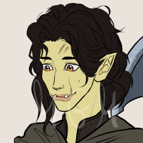

# Ulma

| {width=200} | {width=200} |
| ------------------------------- | --------------------------------------- |

---

**[DM-ONLY – Não incluir na Wiki]**

|Português|English|
|---|---|
|**Jogadora:** Margarida Moreira|**Player:** Margarida Moreira|
|**Idade:** 24|**Age:** 24|
|**Contacto:** +351 961 601 285|**Contact:** +351 961 601 285|
|**Instagram:** [@elavar_m](https://www.instagram.com/elavar_m)|**Instagram:** [@elavar_m](https://www.instagram.com/elavar_m)|
|**Discord:** _elavar_|**Discord:** _elavar_|
|**Ficha D&D Beyond:** [Link](https://www.dndbeyond.com/characters/146573550/FHB3rQ)|**D&D Beyond Sheet:** [Link](https://www.dndbeyond.com/characters/146573550/FHB3rQ)|

**[DM-ONLY – Não incluir na Wiki]**

---

|**🧙 Personagem**|**🧙 Character**|
|---|---|
|**Nome**: Ulma|**Name**: Ulma|
|**Espécie**: Meio-Orc|**Species**: Half-Orc|
|**Classe**: Bárbara (Caminho do Coração Selvagem); **Barda** _(subclasse a definir)_|**Class**: Barbarian (Path of the Wild Heart); **Bard** _(subclass to be defined)_|
|**Alinhamento**: Caótico Bom|**Alignment**: Chaotic Good|
|**Background**: Criminosa|**Background**: Criminal|
|**Idade**: 24|**Age**: 24|
|**Altura**: 1,70 m|**Height**: 1.70 m|
|**Olhos**: Ambarinos vivos|**Eyes**: Lively amber|
|**Cabelo**: Preto, longo e ondulado|**Hair**: Black, long and wavy|
|**Pele**: Verde-oliva clara|**Skin**: Light olive-green|
|**Tamanho**: Médio|**Size**: Medium|

---

|**📜 Descrição Física**|**📜 Physical Description**|
|---|---|
|Ulma é uma meio-orc de presença marcante, com pele verde-oliva clara, presas inferiores salientes mas suavizadas por um sorriso quase constante, e olhos âmbar que brilham de vitalidade. O cabelo negro e ondulado cai-lhe pelos ombros em madeixas desalinhadas, refletindo a sua vida de rua e rebeldia natural. Apesar da aparência intimidatora, a expressão calorosa e curiosa denuncia o seu coração empático e protetor. Na batalha, ergue o seu machado pesado com a confiança de quem cresceu a sobreviver em Greyhawk.|Ulma is a striking half-orc with light olive-green skin, prominent lower tusks softened by an almost constant smile, and amber eyes glowing with vitality. Her long, wavy black hair falls loosely over her shoulders, reflecting her street-raised life and innate rebelliousness. Despite her intimidating look, her warm, curious expression reveals an empathetic, protective heart. In battle, she wields her greataxe with the confidence of one who survived Greyhawk’s streets.|

---

| **⚔️ Itens** | **⚔️ Items** |
|---|---|
| **Armadura/Escudo:** [Shield (+2 AC)](https://www.dndbeyond.com/equipment/shield) | **Armor/Shield:** [Shield (+2 AC)](https://www.dndbeyond.com/equipment/shield) |
| **Armas:** [Greataxe](https://www.dndbeyond.com/equipment/greataxe); [Maul](https://www.dndbeyond.com/equipment/maul); [Handaxes ×4](https://www.dndbeyond.com/equipment/handaxe); [Daggers ×2](https://www.dndbeyond.com/equipment/dagger); [Maul](https://www.dndbeyond.com/equipment/maul); [Maul +1](https://www.dndbeyond.com/magic-items/weapon-1) | **Weapons:** [Greataxe](https://www.dndbeyond.com/equipment/greataxe); [Maul](https://www.dndbeyond.com/equipment/maul); [Handaxes ×4](https://www.dndbeyond.com/equipment/handaxe); [Daggers ×2](https://www.dndbeyond.com/equipment/dagger); [Maul](https://www.dndbeyond.com/equipment/maul); [Maul +1](https://www.dndbeyond.com/magic-items/weapon-1) |
| **Items mágicos:** Anel da Taberna; Talismã de [**Zahel**](pc_zahel.md) (com bússola que aponta para a igreja de [**Zahel**](pc_zahel.md)) | **Magical Items:** Tavern Ring; [**Zahel**](pc_zahel.md) talisman (with a compass that points to [**Zahel**](pc_zahel.md)’s church) |
| **Poções:** [Antitoxina ×2](https://www.dndbeyond.com/equipment/antitoxin-vial) | **Potions:** [Antitoxin ×2](https://www.dndbeyond.com/equipment/antitoxin-vial) |
| **Items não mágicos:** [Backpack](https://www.dndbeyond.com/equipment/backpack); Pouches ×2; Clothes; [Bedroll](https://www.dndbeyond.com/equipment/bedroll); [Oil ×2](https://www.dndbeyond.com/equipment/oil-flask); Gem (30 gp); _Vampiric Cloak_; [Rations ×6](https://www.dndbeyond.com/equipment/rations-1-day); [Tinderbox](https://www.dndbeyond.com/equipment/tinderbox); [Healer’s Kit ×2](https://www.dndbeyond.com/equipment/healers-kit); Pirate Costume; [Thieves’ Tools](https://www.dndbeyond.com/equipment/thieves-tools); [Grappling Hook](https://www.dndbeyond.com/equipment/grappling-hook); [Chain](https://www.dndbeyond.com/equipment/chain); [Rope](https://www.dndbeyond.com/equipment/hempen-rope); [Pole (10 ft)](https://www.dndbeyond.com/equipment/pole-10-foot); [Ball Bearings ×5000](https://www.dndbeyond.com/equipment/ball-bearings-bag-of-1-000); Strong Alcohol (95%); [Caltrops ×200](https://www.dndbeyond.com/equipment/caltrops-bag-of-20); [Crowbar](https://www.dndbeyond.com/equipment/crowbar); [Torches ×10](https://www.dndbeyond.com/equipment/torch); [Waterskin](https://www.dndbeyond.com/equipment/waterskin); [Hunting Trap ×2](https://www.dndbeyond.com/equipment/hunters-trap); [Signal Whistle](https://www.dndbeyond.com/equipment/signal-whistle); protótipo de talismã de Zahel; Strong Alcohol de **Blackfair Manor** | **Non-magical Items:** [Backpack](https://www.dndbeyond.com/equipment/backpack); Pouches ×2; Clothes; [Bedroll](https://www.dndbeyond.com/equipment/bedroll); [Oil ×2](https://www.dndbeyond.com/equipment/oil-flask); Gem (30 gp); _Vampiric Cloak_; [Rations ×6](https://www.dndbeyond.com/equipment/rations-1-day); [Tinderbox](https://www.dndbeyond.com/equipment/tinderbox); [Healer’s Kit ×2](https://www.dndbeyond.com/equipment/healers-kit); Pirate Costume; [Thieves’ Tools](https://www.dndbeyond.com/equipment/thieves-tools); [Grappling Hook](https://www.dndbeyond.com/equipment/grappling-hook); [Chain](https://www.dndbeyond.com/equipment/chain); [Rope](https://www.dndbeyond.com/equipment/hempen-rope); [Pole (10 ft)](https://www.dndbeyond.com/equipment/pole-10-foot); [Ball Bearings ×5000](https://www.dndbeyond.com/equipment/ball-bearings-bag-of-1-000); Strong Alcohol (95%); [Caltrops ×200](https://www.dndbeyond.com/equipment/caltrops-bag-of-20); [Crowbar](https://www.dndbeyond.com/equipment/crowbar); [Torches ×10](https://www.dndbeyond.com/equipment/torch); [Hunting Trap ×2](https://www.dndbeyond.com/equipment/hunters-trap); [Signal Whistle](https://www.dndbeyond.com/equipment/signal-whistle); Zahel prototype talisman; Strong Alcohol from **Blackfair Manor** |
| **Ouro:** 2131 gp, 7 sp | **Gold:** 2131 gp, 7 sp |

---

| **📖 História – Antes da Taberna** | **📖 Story – Before the Tavern** |
|---|---|
| - Cresceu nas ruas da Cidade Livre de Greyhawk, órfã desde os 3 anos.| - Grew up in the Free City of Greyhawk, orphan since age 3.|
| - Delinquente infame, violenta mas em defesa dos injustiçados.| - Infamous delinquent, violent but defending the oppressed.|
| - Filha de **Varfu** (orc da montanha) e **Amelia** (humana), mortos por vingança dos orcs da tribo do pai.| - Daughter of **Varfu** (mountain orc) and **Amelia** (human), both killed by vengeful orcs from her father’s tribe.|
| - Ulma escapou após morder o nariz de um orc e fugir.| - Ulma escaped after biting an orc’s nose and fleeing.|
| - Poucas memórias dos pais; flashes despertados por violência ou felicidade.| - Few memories of her parents; triggered by joy or violence.|
| - Numa missão com [**Liwana**](liwana.md) (tiefling amiga), foram atacadas por cultistas de **Loviatar**.| - With [**Liwana**](liwana.md) (tiefling friend), was ambushed by **Loviatar** cultists.|
| - Ulma caiu de um penhasco; Liwana salvou-a com _Feather Fall_ antes de ser capturada.| - Ulma fell from a cliff; Liwana saved her with _Feather Fall_ before being captured.|
| - Ulma perdeu quase todas as memórias.| - Ulma lost nearly all memories.|

---

| **📖 História – Depois da Taberna**                                                                                                                                                                                                                                                                                                                                                                | **📖 Story – After the Tavern**                                                                                                                                                                                                                                                                                                                                            |
| -------------------------------------------------------------------------------------------------------------------------------------------------------------------------------------------------------------------------------------------------------------------------------------------------------------------------------------------------------------------------------------------------- | -------------------------------------------------------------------------------------------------------------------------------------------------------------------------------------------------------------------------------------------------------------------------------------------------------------------------------------------------------------------------- |
| - Combateu uma planta carnívora com [Kythria](kythria).                                                                                                                                                                                                                                                                                                                                            | - Fought a carnivorous plant with  [Kythria](kythria).                                                                                                                                                                                                                                                                                                                     |
| - Participou na catástrofe do “**Sundering Moment**”, viajando no tempo para impedir desastre.                                                                                                                                                                                                                                                                                                     | - Took part in the “**Sundering Moment**” catastrophe, time-traveling to avert disaster.                                                                                                                                                                                                                                                                                   |
| - Sobreviveu ao Museu das Maravilhas de Greyhawk, descobrindo **Darsen** e os seus horrores taxidérmicos.                                                                                                                                                                                                                                                                                          | - Survived Greyhawk’s Museum of Wonders, uncovering **Darsen**’s taxidermy horrors.                                                                                                                                                                                                                                                                                        |
| - Explorou esgotos de Greyhawk, enfrentando piratas **Orquídeas Negras**, revelando **Ralph**, filho de nobre enlouquecido.                                                                                                                                                                                                                                                                        | - Explored Greyhawk’s sewers facing **Black Orchid** pirates, exposing **Ralph**, a mad noble’s son.                                                                                                                                                                                                                                                                       |
| - Missões com [**Triss**](docs/dm/-/pc/pc_triss_merril.md), [**Dustin**](pc_dustin_thorne.md), [**Eirwen**](pc_eirwen.md), [**Leo**](pc_leo.md), [**Grix’Molah**](docs/dm/-/pc/pc_grix_molah.md), Ket e outros.                                                                                                                                                                                                             | - Missions with [**Triss**](docs/dm/-/pc/pc_triss_merril.md), [**Dustin**](pc_dustin_thorne.md), [**Eirwen**](pc_eirwen.md), [**Leo**](pc_leo.md), [**Grix’Molah**](docs/dm/-/pc/pc_grix_molah.md), Ket and others.                                                                                                                                                                                 |
| - Foi ao **Baile de Blackfair Manor** com [**Zahel**](pc_zahel.md), [**Leo**](pc_leo.md), [**Lucien**](pc_lucien.md), Klaia, [**Eirwen**](pc_eirwen.md), **Ugus Bugus** e [**Drayl**](pc_drayl_bharash.md); encontrou **Liwana** prisioneira em Blackfair Manor. O coração de Liwana fora removido e substituído por um coração falso enfeitiçado que criava um campo anti-magia em toda a mansão. | - Attended the **Ball at Blackfair Manor** with [**Zahel**](pc_zahel.md), [**Leo**](pc_leo.md), [**Lucien**](pc_lucien.md), Klaia, [**Eirwen**](pc_eirwen.md), **Ugus Bugus**, and [**Drayl**](pc_drayl_bharash.md); found **Liwana** trapped there. Her heart had been removed and replaced with a fake heart enchanted to create an anti-magic field across the mansion. |
| - Ulma e os seus companheiros salvaram Liwana depois de um diabo sacrificar o coração de outra prisioneira, a halfling **Leine Cann**, estabilizando o de Liwana e quebrando o feitiço.                                                                                                                                                                                                            | - Ulma and companions saved Liwana after a devil sacrificed another prisoner, the halfling **Leine Cann**, to stabilize Liwana’s heart and break the spell.                                                                                                                                                                                                                |
| - Ulma levou Liwana de volta a Greyhawk, onde cuida dela na **Igreja de [Zahel](pc_zahel.md)**, que ofereceu ajuda e esconderijo, e organizou o funeral de **Leine Cann**.                                                                                                                                                                                                                         | - Ulma brought Liwana back to Greyhawk, caring for her at the **Church of [Zahel](pc_zahel.md)**, which offered shelter and held **Leine Cann**’s funeral.                                                                                                                                                                                                                 |
| - Com ajuda de [**Zahel**](pc_zahel.md), recuperou memórias dos pais, da casa onde viveram e do seu **javali-gigante** de estimação.                                                                                                                                                                                                                                                               | - With [**Zahel**](pc_zahel.md)’s help, recovered memories of her parents, their home, and her **dire-boar** pet.                                                                                                                                                                                                                                                          |
| - [**Eirwen**](pc_eirwen.md) juntou-se a Ulma na procura de um local seguro para esconder Liwana até o mistério dos raptores ser resolvido.                                                                                                                                                                                                                                                        | - [**Eirwen**](pc_eirwen.md) joined Ulma to find a safer hideout for Liwana, until the kidnappers are dealt with.                                                                                                                                                                                                                                                          |
| - Lutou contra celestiais e demónios invocados pelo [**Instituto da Luz Velada**](institute_of_the_veiled_light.md), que atacaram as ruas de [**Clerkburg**](clerkburg.md) e quase transformaram Liwana num demónio. Ajudou a salvar **Sarafina**, amiga de infância de [**Eldric**](pc_eldric_silvanos.md), de membros do Instituto.                                                              | - Fought celestials and demons summoned by the [**Institute of the Veiled Light**](institute_of_the_veiled_light.md), who assaulted [**Clerkburg**](clerkburg.md) and nearly turned Liwana into a demon. Helped save **Sarafina**, [**Eldric**](pc_eldric_silvanos.md)’s childhood friend, from the Institute’s agents.                                                    |

---

| **🎭 Dramatis Persona**                                                                                                                                                                                                                                                                                                 | **🎭 Dramatis Persona**                                                                                                                                                                                                                                                                                                 |
| ----------------------------------------------------------------------------------------------------------------------------------------------------------------------------------------------------------------------------------------------------------------------------------------------------------------------- | ----------------------------------------------------------------------------------------------------------------------------------------------------------------------------------------------------------------------------------------------------------------------------------------------------------------------- |
| **NPCs de influência direta:**                                                                                                                                                                                                                                                                                          | **Direct Influence NPCs:**                                                                                                                                                                                                                                                                                              |
| - **Liwana** (amiga tiefling desaparecida e resgatada).                                                                                                                                                                                                                                                                 | - **Liwana** (missing tiefling friend, rescued).                                                                                                                                                                                                                                                                        |
| - [**Zahel**](pc_zahel.md) (clérigo/mentor na Igreja de [**Zahel**](pc_zahel.md)).                                                                                                                                                                                                                                      | - [**Zahel**](pc_zahel.md) (cleric/mentor at [**Zahel**](pc_zahel.md)’s Church).                                                                                                                                                                                                                                        |
| - **Zael** (gnomo encontrado no museu).                                                                                                                                                                                                                                                                                 | - **Zael** (gnome met at the museum).                                                                                                                                                                                                                                                                                   |
| - **Mimic** (aliado neutro, morto por **Darsen**).                                                                                                                                                                                                                                                                      | - **Mimic** (neutral ally, slain by **Darsen**).                                                                                                                                                                                                                                                                        |
| **Antagonistas:**                                                                                                                                                                                                                                                                                                       | **Antagonists:**                                                                                                                                                                                                                                                                                                        |
| - Cultistas de **Loviatar**.                                                                                                                                                                                                                                                                                            | - **Loviatar** cultists.                                                                                                                                                                                                                                                                                                |
| - **Darsen** e esposa (taxidermistas enlouquecidos).                                                                                                                                                                                                                                                                    | - **Darsen** and wife (deranged taxidermists).                                                                                                                                                                                                                                                                          |
| - Diabo que manipulou Darsen.                                                                                                                                                                                                                                                                                           | - Devil who manipulated Darsen.                                                                                                                                                                                                                                                                                         |
| - [**Instituto da Luz Velada**](institute_of_the_veiled_light.md) (agressores de Clerkburg).                                                                                                                                                                                                                            | - [**Institute of the Veiled Light**](institute_of_the_veiled_light.md) (Clerkburg attackers).                                                                                                                                                                                                                          |
| **Aliados:**                                                                                                                                                                                                                                                                                                            | **Allies:**                                                                                                                                                                                                                                                                                                             |
| - [**Triss**](docs/dm/-/pc/pc_triss_merril.md), [**Dustin**](pc_dustin_thorne.md), **Nina**,  [Kythria](kythria), [**Eirwen**](pc_eirwen.md), [**Grix’Molah**](docs/dm/-/pc/pc_grix_molah.md), **Ket**, [**Leo**](pc_leo.md), [**Lucien**](pc_lucien.md), **Klaia**, **Ugus Bugus**, [**Drayl**](pc_drayl_bharash.md), [**Zahel**](pc_zahel.md). | - [**Triss**](docs/dm/-/pc/pc_triss_merril.md), [**Dustin**](pc_dustin_thorne.md), **Nina**,  [Kythria](kythria), [**Eirwen**](pc_eirwen.md), [**Grix’Molah**](docs/dm/-/pc/pc_grix_molah.md), **Ket**, [**Leo**](pc_leo.md), [**Lucien**](pc_lucien.md), **Klaia**, **Ugus Bugus**, [**Drayl**](pc_drayl_bharash.md), [**Zahel**](pc_zahel.md). |

---

| **🔮 OBS** | **🔮 Notes** |
|---|---|
| Porta o **Anel da Taberna**, permitindo interação segura com defesas e segredos da Taberna. Parte das memórias permanece fragmentada; a bússola do talismã de [**Zahel**](pc_zahel.md) aponta sempre à Igreja de [**Zahel**](pc_zahel.md) como “porto seguro”. | Wears the **Tavern Ring**; some memories remain fractured. The [**Zahel**](pc_zahel.md) talisman’s compass always points to [**Zahel**](pc_zahel.md)’s Church as a “safe harbor.” |