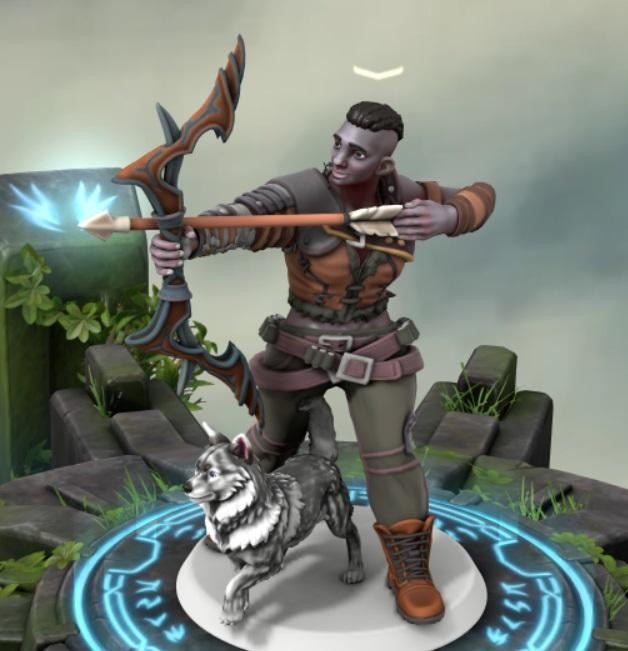

# Vaunia Kolakiala

Sessões: 8 | Datas: a confirmar | Fontes: (logs de sessões) | Tags: pc, ranger | Jogadora: Macarena Galego

| Português                                                                                                                                                                                                | English                                                                                                                                                                                                   |
| -------------------------------------------------------------------------------------------------------------------------------------------------------------------------------------------------------- | --------------------------------------------------------------------------------------------------------------------------------------------------------------------------------------------------------- |
| **Descrição:** Antiga caçadora da tribo Kolakiala, Vaunia ressuscitou na Taberna sem memórias da sua vida anterior. Lembranças fragmentadas de dois nomes - Manvea e Aurkan - guiam a sua jornada atual. | **Description:** Former hunter of the Kolakiala tribe, Vaunia awoke at the Tavern with no memories of her past life. Fragmented recollections of two names - Manvea and Aurkan - drive her current quest. |

| Português | English |
|-----------|---------|
| **Jogadora:** Macarena Galego | **Player:** Macarena Galego |
| **Espécie:** Golias (Gigante de Pedra) | **Species:** Goliath (Stone Giant) |
| **Classe:** Ranger | **Class:** Ranger |
| **Nível:** 8 | **Level:** 8 |
| **Origem:** Desconhecida | **Background:** Unknown |
| **Alinhamento:** Caótico Neutro | **Alignment:** Chaotic Neutral |
| **Género:** Feminino | **Gender:** Female |
| **Idade:** 29 | **Age:** 29 |
| **Sessões jogadas:** 8 | **Sessions played:** 8 |
| **Sessões como DM:** 0 | **DM Sessions:** 0 |
| **Contacto:** +351 935 084 016 | **Contact:** +351 935 084 016 |
| **Ficha D&D Beyond:** [Link](https://www.dndbeyond.com/characters/138365220) | **D&D Beyond Sheet:** [Link](https://www.dndbeyond.com/characters/138365220) |

## História / Backstory

| Português | English |
|-----------|---------|
| **História:** Vaunia nasceu na tribo de Coal, nas Montanhas Corusk, onde coexistiam os clãs Kolakiala (descendentes de gigantes de pedra) e Muthalavi (descendentes de gigantes de fogo). Desde cedo treinada como caçadora pelo pai, viveu uma infância entre a dureza do ambiente vulcânico e as aventuras com os amigos Aurkan e Manvea. Aos 23 anos, Vaunia perdeu-se numa caçada e encontrou um misterioso homem que acredita ser Thor, deixando-lhe uma pulseira mágica. Anos depois, envolveu-se na tentativa de fuga de Aurkan e Manvea, apaixonados de clãs rivais. Ao tentar protegê-los de um ataque do seu próprio clã, foi mortalmente ferida. Ressuscitou misteriosamente na Taberna, sem memórias do passado, apenas guiada pelos nomes "Aurkan" e "Manvea". | **Backstory:** Vaunia was born in the Coal tribe, located in the Corusk Mountains, home to two clans: the Kolakiala (stone giant descendants) and the Muthalavi (fire giant descendants). Trained as a hunter from an early age, she balanced a harsh volcanic upbringing with secret adventures alongside her friends Aurkan and Manvea. At 23, she got lost during a hunt and encountered a mysterious man she believes to be Thor, who left her a magical bracelet. Years later, she aided Aurkan and Manvea—lovers from rival clans—in their attempted escape. In a confrontation with her own clan, Vaunia was fatally wounded while trying to protect them. She later awoke at the Tavern with no memory of her past, guided only by the names "Aurkan" and "Manvea". |

[(Voltar a PCs / Back to PCs)](pcs.md)  
