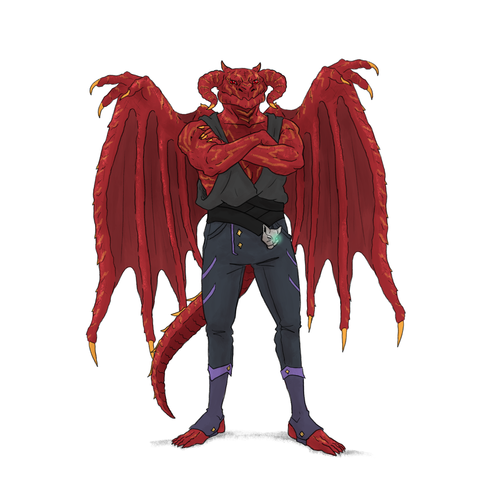

## Wagner ([S17B](s17b_a_crianca_perdida.md))

| {width=300} |
| ------------------------ |

---

**[DM-ONLY – Não incluir na Wiki]**

### 🎲 Jogador / 🎲 Player

| 🎲 Jogador | 🎲 Player |
| :--- | :--- |
| **Jogador:** [Vasco Amorim de Almeida](vasco_amorim_de_almeida.md) | **Player:** [Vasco Amorim de Almeida](vasco_amorim_de_almeida.md) |
| **Idade:** 27 | **Age:** 27 |
| **Contacto:** +351 961 228 813 | **Contact:** +351 961 228 813 |
| **Instagram:** [vasco_goes_insta](https://www.instagram.com/vasco_goes_insta/) | **Instagram:** [vasco_goes_insta](https://www.instagram.com/vasco_goes_insta/) |
| **Discord:** vasooooo | **Discord:** vasooooo |
| **Ficha D&D Beyond:** [Link](https://www.dndbeyond.com/characters/140233506) | **D&D Beyond Sheet:** [Link](https://www.dndbeyond.com/characters/140233506) |

**[DM-ONLY – Não incluir na Wiki]**

---

### 🧙 Personagem / 🧙 Character

| **🧙 Personagem** | **🧙 Character** |
| :--- | :--- |
| **Nome**: **Wagner** | **Name**: **Wagner** |
| **Espécie**: [Dragonborn](https://www.dndbeyond.com/races/dragonborn) (escamas vermelhas com algumas amarelas) | **Species**: [Dragonborn](https://www.dndbeyond.com/races/dragonborn) (red scales with some yellow) |
| **Classe**: [Feiticeiro](https://www.dndbeyond.com/classes/sorcerer) | **Class**: [Sorcerer](https://www.dndbeyond.com/classes/sorcerer) |
| **Alinhamento**: Caótico Neutro | **Alignment**: Chaotic Neutral |
| **Background**: [por preencher] | **Background**: [to be filled] |
| **Idade**: [por preencher] | **Age**: [to be filled] |
| **Altura**: 1,90 m **(Inferido do lore)** | **Height**: 1.90 m **(Inferred from lore)** |
| **Olhos**: Laranja | **Eyes**: Orange |
| **Cabelo**: — | **Hair**: — |
| **Pele/Escamas**: Vermelhas com algumas amarelas | **Skin/Scales**: Red with some yellow |
| **Tamanho**: Médio | **Size**: Medium |

---

### 📜 Descrição Física / 📜 Physical Description

| **📜 Descrição Física** | **📜 Physical Description** |
| :--- | :--- |
| **Wagner** é um [Dragonborn](https://www.dndbeyond.com/races/dragonborn) imponente, de 1,90 m, coberto por escamas vermelhas com manchas amarelas incomuns entre os da sua estirpe. Os olhos laranja brilham com intensidade arcana. A imagem mostra-o com asas membranosas vermelhas, garras afiadas e uma postura de confiança com os braços cruzados. Usa roupas modernas de viajante — calças reforçadas, colete sem mangas —, sugerindo alguém pragmático mas confiante na sua presença imponente. | **Wagner** is an imposing [Dragonborn](https://www.dndbeyond.com/races/dragonborn), standing 1.90 m tall, his body covered in red scales mottled with rare yellow patches. His orange eyes glow with arcane intensity. The image depicts him with wide membranous wings, sharp claws, and a confident stance, arms crossed. He wears practical traveler’s clothing — fitted trousers and a sleeveless vest — suggesting a pragmatic yet commanding adventurer. |

---

### ⚔️ Itens / ⚔️ Items

| **⚔️ Itens** | **⚔️ Items** |
| :--- | :--- |
| **Armadura/Escudo:** — | **Armor/Shield:** — |
| **Armas:** [Adaga](https://www.dndbeyond.com/equipment/dagger) | **Weapons:** [Dagger](https://www.dndbeyond.com/equipment/dagger) |
| **Items mágicos:** [Headband of Intellect](https://www.dndbeyond.com/magic-items/headband-of-intellect); [Stone of Good Luck](https://www.dndbeyond.com/magic-items/stone-of-good-luck); [Wand of the War Mage +1](https://www.dndbeyond.com/magic-items/wand-of-the-war-mage-1); [Potion of Greater Healing](https://www.dndbeyond.com/magic-items/potion-of-superior-healing); [Potion of Poison Resistance](https://www.dndbeyond.com/magic-items/potion-of-poison-resistance) | **Magical Items:** [Headband of Intellect](https://www.dndbeyond.com/magic-items/headband-of-intellect); [Stone of Good Luck](https://www.dndbeyond.com/magic-items/stone-of-good-luck); [Wand of the War Mage +1](https://www.dndbeyond.com/magic-items/wand-of-the-war-mage-1); [Potion of Greater Healing](https://www.dndbeyond.com/magic-items/potion-of-superior-healing); [Potion of Poison Resistance](https://www.dndbeyond.com/magic-items/potion-of-poison-resistance) |
| **Poções:** [Potion of Greater Healing](https://www.dndbeyond.com/magic-items/potion-of-superior-healing); [Potion of Poison Resistance](https://www.dndbeyond.com/magic-items/potion-of-poison-resistance) | **Potions:** [Potion of Greater Healing](https://www.dndbeyond.com/magic-items/potion-of-superior-healing); [Potion of Poison Resistance](https://www.dndbeyond.com/magic-items/potion-of-poison-resistance) |
| **Items não mágicos:** [Adventuring Gear](adventuring_gear.md) ([caltrops](https://www.dndbeyond.com/equipment/caltrops-bag-of-20), [crowbar](https://www.dndbeyond.com/equipment/crowbar), [oil](https://www.dndbeyond.com/equipment/oil-flask), 10 [rations](https://www.dndbeyond.com/equipment/rations-1-day), [rope](https://www.dndbeyond.com/equipment/hempen-rope), [tinderbox](https://www.dndbeyond.com/equipment/tinderbox), 10 [torches](https://www.dndbeyond.com/equipment/torch), [waterskin](https://www.dndbeyond.com/equipment/waterskin)); 1 [adaga](https://www.dndbeyond.com/equipment/dagger) | **Non-magical Items:** [Adventuring Gear](adventuring_gear.md) ([caltrops](https://www.dndbeyond.com/equipment/caltrops-bag-of-20), [crowbar](https://www.dndbeyond.com/equipment/crowbar), [oil](https://www.dndbeyond.com/equipment/oil-flask), 10 [rations](https://www.dndbeyond.com/equipment/rations-1-day), [rope](https://www.dndbeyond.com/equipment/hempen-rope), [tinderbox](https://www.dndbeyond.com/equipment/tinderbox), 10 [torches](https://www.dndbeyond.com/equipment/torch), [waterskin](https://www.dndbeyond.com/equipment/waterskin)); 1 [dagger](https://www.dndbeyond.com/equipment/dagger) |
| **Ouro:** 2050 gp, 7 sp, 5 cp | **Gold:** 2050 gp, 7 sp, 5 cp |

---

### 📖 História – Antes da Taberna / 📖 Story – Before the Tavern

| **📖 História – Antes da Taberna** | **📖 Story – Before the Tavern** |
| :--- | :--- |
| **Wagner** iniciou a vida de aventureiro para se descobrir, pois pouco sabia sobre si mesmo. Na infância, surgiram-lhe escamas amarelas pelo corpo, algo único entre [dragonborn](https://www.dndbeyond.com/races/dragonborn) vermelhos. Viajou para testar capacidades e compreender a sua origem. | **Wagner** began adventuring to learn more about himself, knowing little of his past. As a child, yellow scales appeared across his body, unique among red [dragonborn](https://www.dndbeyond.com/races/dragonborn). He traveled to test his abilities and understand his origins. |

---

### 📖 História – Depois da Taberna / 📖 Story – After the Tavern

| **📖 História – Depois da Taberna** | **📖 Story – After the Tavern** |
| :--- | :--- |
| - As escamas amarelas tornaram-se mais numerosas com o tempo, aumentando a dúvida sobre a sua origem. - Ao chegar a [Greyhawk](free_city_of_greyhawk.md), fundou um **[Bastion](bastion.md)** com [Drayl Bharash](pc_drayl_bharash.md) e [Raylahn](pc_raylahn.md): **[Dragon Arcana Co.](dragon_arcana_co.md)**. - Encontrou um ovo idêntico ao que acreditava ser o seu, embora fosse ilusão, reforçando as questões sobre o seu nascimento. - Participou em missões nas [Ruínas das Sombras](ruinas_das_sombras.md), onde ajudou a resgatar **[Aria Greenbottle](aria_greenbottle.md)**. - Hoje busca melhorar continuamente as suas capacidades, descobrir limites e origem. | - Yellow scales spread further, deepening the mystery of his origins. - Upon arriving in [Greyhawk](free_city_of_greyhawk.md), co-founded a **[Bastion](bastion.md)** with [Drayl Bharash](pc_drayl_bharash.md) and [Raylahn](pc_raylahn.md): **[Dragon Arcana Co.](dragon_arcana_co.md)**. - Found an egg that seemed like his own, though an illusion, it fueled his doubts about birth. - Took part in missions in the [Shadow Ruins](ruinas_das_sombras.md), where he helped rescue **[Aria Greenbottle](aria_greenbottle.md)**. - Now seeks to hone his skills, test his limits, and uncover his true origin. |

---

### 🎭 Dramatis Persona / 🎭 Dramatis Personae

| **🎭 Dramatis Persona** | **🎭 Dramatis Personae** |
| :--- | :--- |
| **NPCs de influência direta:** - [**Taberneiro**](taverneiro.md) (mentor e gestor da [Taverna](taverna.md)) - [**Aria Greenbottle**](aria_greenbottle.md) (gnoma resgatada nas [Ruínas das Sombras](ruinas_das_sombras.md)) | **Direct Influence NPCs:** - [**Innkeeper**](taverneiro.md) (mentor and [Tavern](taverna.md) manager) - [**Aria Greenbottle**](aria_greenbottle.md) (gnome rescued in the [Shadow Ruins](ruinas_das_sombras.md)) |
| **Antagonistas:** - Mortos-vivos e necromantes das [Ruínas das Sombras](ruinas_das_sombras.md) - Facções sombrias em [Greyhawk](free_city_of_greyhawk.md), como o [Culto de Vecna](culto_vecna.md) e a [Scarlet Brotherhood](scarlet_brotherhood.md) | **Antagonists:** - Undead and necromancers of the [Shadow Ruins](ruinas_das_sombras.md) - Dark factions in [Greyhawk](free_city_of_greyhawk.md), such as the [Cult of Vecna](culto_vecna.md) and the [Scarlet Brotherhood](scarlet_brotherhood.md) |
| **Aliados:** - [**Raylahn**](pc_raylahn.md) (cofundador da [Dragon Arcana Co.](dragon_arcana_co.md)) - [**Drayl Bharash**](pc_drayl_bharash.md) (cofundador da [Dragon Arcana Co.](dragon_arcana_co.md)) - [**Markus Grimm**](pc_markus_grimm.md) (companheiro de aventuras) - [**Bok Thunderfist**](pc_bok_thunderfist.md) (companheiro de expedição a [Greyhawk](free_city_of_greyhawk.md)) - Restantes membros da [Taverna](taverna.md) | **Allies:** - [**Raylahn**](pc_raylahn.md) (co-founder of [Dragon Arcana Co.](dragon_arcana_co.md)) - [**Drayl Bharash**](pc_drayl_bharash.md) (co-founder of [Dragon Arcana Co.](dragon_arcana_co.md)) - [**Markus Grimm**](pc_markus_grimm.md) (adventuring companion) - [**Bok Thunderfist**](pc_bok_thunderfist.md) (companion in [Greyhawk](free_city_of_greyhawk.md) expedition) - Other members of the [Tavern](taverna.md) |

---

### 🔮 OBS / 🔮 Notes

| **🔮 OBS** | **🔮 Notes** |
| :--- | :--- |
| - *[Headband of Intellect](https://www.dndbeyond.com/magic-items/headband-of-intellect)*: INT = 19 enquanto usado. - *[Stone of Good Luck](https://www.dndbeyond.com/magic-items/stone-of-good-luck)*: +1 a ataques, saves e checks. - *[Wand of the War Mage +1](https://www.dndbeyond.com/magic-items/wand-of-the-war-mage-1)*: +1 a ataques de magia; ignora cobertura parcial. - *Charm do **[Bastion](bastion.md)***: após Long Rest, ganha encanto mágico que permite lançar *Identify* sem gastar slot ou componentes; dura 7 dias ou até usado. - *[Potion of Greater Healing](https://www.dndbeyond.com/magic-items/potion-of-superior-healing)*: cura 4d4 + 4. - *[Potion of Poison Resistance](https://www.dndbeyond.com/magic-items/potion-of-poison-resistance)*: resistência a veneno por 1h. | - *[Headband of Intellect](https://www.dndbeyond.com/magic-items/headband-of-intellect)*: INT = 19 while worn. - *[Stone of Good Luck](https://www.dndbeyond.com/magic-items/stone-of-good-luck)*: +1 to attacks, saves, and checks. - *[Wand of the War Mage +1](https://www.dndbeyond.com/magic-items/wand-of-the-war-mage-1)*: +1 to spell attacks; ignore half cover. - *[Bastion](bastion.md) Charm*: after Long Rest, gain magical charm that lets you cast *Identify* without slot/components; lasts 7 days or until used. - *[Potion of Greater Healing](https://www.dndbeyond.com/magic-items/potion-of-superior-healing)*: heals 4d4 + 4. - *[Potion of Poison Resistance](https://www.dndbeyond.com/magic-items/potion-of-poison-resistance)*: resistance to poison for 1h. |

---

## Processing Audit

### Internal Links

| Source File | Linked Files |
| :--- | :--- |
| pc_wagner.md | vasco_amorim_de_almeida.md, adventuring_gear.md, free_city_of_greyhawk.md, bastion.md, pc_drayl_bharash.md, pc_raylahn.md, dragon_arcana_co.md, ruinas_das_sombras.md, aria_greenbottle.md, taverneiro.md, taverna.md, culto_vecna.md, scarlet_brotherhood.md, pc_markus_grimm.md, pc_bok_thunderfist.md |

### Warnings

| Type | Where | Detail |
| :--- | :--- | :--- |
| **Link Validation** | Image Source | Image file `pc_wagner.png` not found in KB. |
| **DDB Link** | Items Table | Replaced "Potion of Greater Healing" with "Potion of Superior Healing" slug for DDB matching. |
| **DDB Link** | Items Table | Replaced "Potion of Greater Healing" with "Potion of Superior Healing" slug for DDB matching. |
| **DDB Link** | Notes Table | Replaced "Potion of Greater Healing" with "Potion of Superior Healing" slug for DDB matching. |
| **Link Simplification** | Story After Table (PT) | Simplified relative path `docs/dm/-/pc/pc_drayl_bharash.md` to basename `pc_drayl_bharash.md`. |
| **Link Simplification** | Story After Table (PT) | Simplified relative path `docs/dm/-/pc/pc_raylahn.md` to basename `pc_raylahn.md`. |
| **Link Simplification** | Story After Table (EN) | Simplified relative path `docs/dm/-/pc/pc_drayl_bharash.md` to basename `pc_drayl_bharash.md`. |
| **Link Simplification** | Story After Table (EN) | Simplified relative path `docs/dm/-/pc/pc_raylahn.md` to basename `pc_raylahn.md`. |
| **Link Simplification** | Dramatis Persona Table (PT) | Simplified relative path `taverneiro.d` to basename `taverneiro.md`. |
| **Link Simplification** | Dramatis Persona Table (EN) | Simplified relative path `taverneiro.d` to basename `taverneiro.md`. |
| **Link Simplification** | Allies List (PT) | Simplified relative path `docs/dm/-/pc/pc_raylahn.md` to basename `pc_raylahn.md`. |
| **Link Simplification** | Allies List (PT) | Simplified relative path `docs/dm/-/pc/pc_drayl_bharash.md` to basename `pc_drayl_bharash.md`. |
| **Link Simplification** | Allies List (PT) | Simplified relative path `docs/dm/-/pc/pc_markus_grimm.md` to basename `pc_markus_grimm.md`. |
| **Link Simplification** | Allies List (PT) | Simplified relative path `docs/dm/-/pc/pc_bok_thunderfist.md` to basename `pc_bok_thunderfist.md`. |
| **Link Simplification** | Allies List (EN) | Simplified relative path `docs/dm/-/pc/pc_raylahn.md` to basename `pc_raylahn.md`. |
| **Link Simplification** | Allies List (EN) | Simplified relative path `docs/dm/-/pc/pc_drayl_bharash.md` to basename `pc_drayl_bharash.md`. |
| **Link Simplification** | Allies List (EN) | Simplified relative path `docs/dm/-/pc/pc_markus_grimm.md` to basename `pc_markus_grimm.md`. |
| **Link Simplification** | Allies List (EN) | Simplified relative path `docs/dm/-/pc/pc_bok_thunderfist.md` to basename `pc_bok_thunderfist.md`. |

### Missing Files

| Type | Where | Detail |
| :--- | :--- | :--- |
| **PC/NPC** | Jogador/Player Table | `vasco_amorim_de_almeida.md` (Linked for "Vasco Amorim de Almeida") |
| **Item** | Items Table | `adventuring_gear.md` (Linked for "Adventuring Gear") |
| **Location** | Story/Dramatis Persona Tables | `free_city_of_greyhawk.md` (Linked for "Greyhawk") |
| **Location/Concept** | Story/Notes Tables | `bastion.md` (Linked for "Bastion") |
| **PC/NPC** | Story/Allies Tables | `pc_drayl_bharash.md` (Linked for "Drayl Bharash") |
| **PC/NPC** | Story/Allies Tables | `pc_raylahn.md` (Linked for "Raylahn") |
| **Organization** | Story/Allies Tables | `dragon_arcana_co.md` (Linked for "Dragon Arcana Co.") |
| **Location** | Story/Dramatis Persona Tables | `ruinas_das_sombras.md` (Linked for "Ruínas das Sombras") |
| **NPC** | Story/Dramatis Persona Tables | `aria_greenbottle.md` (Linked for "Aria Greenbottle") |
| **NPC** | Dramatis Persona Table | `taverneiro.md` (Linked for "Taberneiro") |
| **Location** | Dramatis Persona/Allies Tables | `taverna.md` (Linked for "Taverna") |
| **Organization/Cult** | Dramatis Persona Table | `culto_vecna.md` (Linked for "Culto de Vecna") |
| **Organization** | Dramatis Persona Table | `scarlet_brotherhood.md` (Linked for "Scarlet Brotherhood") |
| **PC/NPC** | Allies List | `pc_markus_grimm.md` (Linked for "Markus Grimm") |
| **PC/NPC** | Allies List | `pc_bok_thunderfist.md` (Linked for "Bok Thunderfist") |