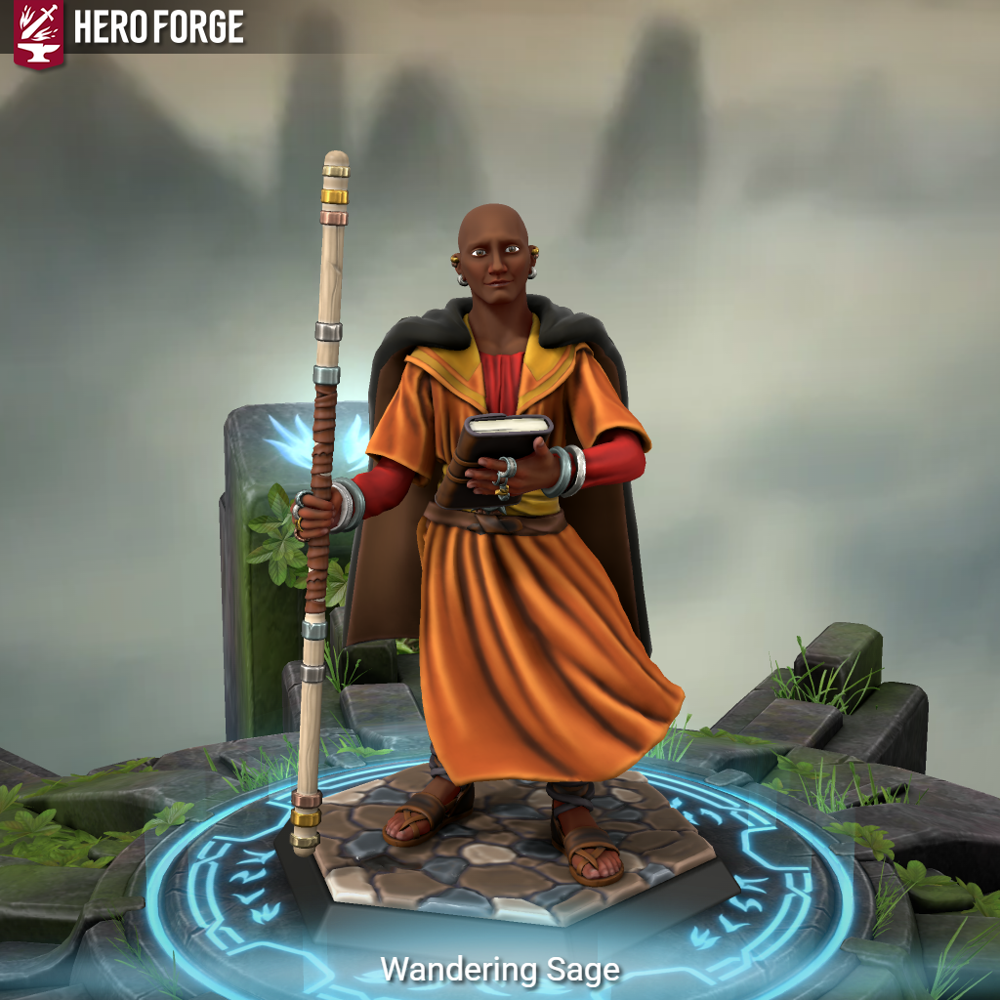

## Wandering Sage ([S04A](s04a_culto_two_fords.md), [S05B](s05b_campo_goblin_nerull.md), [S10B](s10b_resgate_rolger.md), [S15B](s15b_a_crianca_perdida.md), [S22](s22a_golpe_dados_rubi_p1.md), [S23](s23a_golpe_dados_rubi_p2.md), [S30B](s30b_idolo_lady_scale_p2.md))

| {width=300} |
| ---------------------------------------------------------------- |

---

**[DM-ONLY – Não incluir na Wiki]**

### 🎲 Jogador / 🎲 Player

| 🎲 Jogador | 🎲 Player |
| ------------------------------------- | ------------------------------------ |
| **Jogador:** Hugo Ferreira | **Player:** Hugo Ferreira |
| **Idade:** [por preencher] | **Age:** [to be filled] |
| **Contacto:** +351 912 605 149 | **Contact:** +351 912 605 149 |
| **Instagram:** [por preencher] | **Instagram:** [to be filled] |
| **Discord:** [por preencher] | **Discord:** [to be filled] |
| **Ficha D&D Beyond:** [por preencher] | **D&D Beyond Sheet:** [to be filled] |

**[DM-ONLY – Não incluir na Wiki]**

---

### 🧙 Personagem / 🧙 Character

| **🧙 Personagem** | **🧙 Character** |
| ----------------- | ---------------- |
| **Nome**: [Wandering Sage](pc_wandering_sage.md) | **Name**: [Wandering Sage](pc_wandering_sage.md) |
| **Espécie**: [por preencher] | **Species**: [to be filled] |
| **Classe**: [por preencher] | **Class**: [to be filled] |
| **Alinhamento**: [por preencher] | **Alignment**: [to be filled] |
| **Background**: Keeper of Knowledge ([Ordem dos Guardiões](ordem_dos_guardioes.md)) | **Background**: Keeper of Knowledge ([Order of the Keepers](ordem_dos_guardioes.md)) |
| **Idade**: [por preencher] | **Age**: [to be filled] |
| **Altura**: [por preencher] | **Height**: [to be filled] |
| **Olhos**: [por preencher] | **Eyes**: [to be filled] |
| **Cabelo**: Careca **(Inferido da imagem HeroForge)** | **Hair**: Bald **(Inferred from HeroForge image)** |
| **Pele**: Escura **(Inferido da imagem HeroForge)** | **Skin**: Dark **(Inferred from HeroForge image)** |
| **Tamanho**: Médio | **Size**: Medium |

---

### 📜 Descrição Física / 📜 Physical Description

| **📜 Descrição Física** | **📜 Physical Description** |
| ------------------------ | --------------------------- |
| Sage é um homem alto, magro, de pele escura, com a cabeça rapada. Veste túnica alaranjada com cinto largo, adornada com braceletes prateadas, e usa um manto escuro sobre os ombros. Empunha um [cajado](https://www.dndbeyond.com/equipment/staff) simples de madeira com entalhes dourados e carrega sempre um livro aberto, sinal do seu foco no conhecimento. O seu ar sereno, disciplinado e contemplativo transmite a imagem de um sábio errante que equilibra corpo e mente. | Sage is a tall, lean man with dark skin and a shaved head. He wears an orange robe with a wide belt, silver armbands, and a dark cloak over his shoulders. He carries a simple wooden [staff](https://www.dndbeyond.com/equipment/staff) with golden carvings and always holds an open book, symbolizing his devotion to knowledge. His serene, disciplined, and contemplative demeanor conveys the image of a wandering sage who balances body and mind. |

---

### ⚔️ Itens / ⚔️ Items

| **⚔️ Itens** | **⚔️ Items** |
|--------------|--------------|
| **Armadura/Escudo:** [por preencher] | **Armor/Shield:** [to be filled] |
| **Armas:** [Cajado (bastão)](https://www.dndbeyond.com/equipment/quarterstaff) **(Inferido da imagem HeroForge)** | **Weapons:** [Staff (quarterstaff)](https://www.dndbeyond.com/equipment/quarterstaff) **(Inferred from HeroForge image)** |
| **Items mágicos:** [por preencher] | **Magical Items:** [to be filled] |
| **Poções:** [por preencher] | **Potions:** [to be filled] |
| **Items não mágicos:** Livro de estudos **(Inferido da imagem HeroForge)** | **Non-magical Items:** Study book **(Inferred from HeroForge image)** |
| **Ouro:** Algumas moedas recebidas em troca cultural com Lizardfolk (Sessão 29) | **Gold:** A few coins received in cultural exchange with Lizardfolk (Session 29) |

---

### 📖 História – Antes da Taberna / 📖 Story – Before the Tavern

| **📖 História – Antes da Taberna** | **📖 Story – Before the Tavern** |
| ---------------------------------- | -------------------------------- |
| Desde criança, Sage mergulhou em pergaminhos antigos e nas histórias de estudiosos e sacerdotes viajantes. Após ter memorizado todos os pergaminhos do seu tutor, aprendeu artes marciais e meditação com os anciãos da aldeia. Na juventude, enfrentou um desastre: mists letais invadiram o vale, levando-o a propor o êxodo. Durante a viagem, muitos adoeceram e morreram, mas alguns sobreviveram. Ao chegar ao destino, Sage continuou a sua jornada, recolhendo saber de cada aldeia. Eventualmente encontrou a **[Ordem dos Guardiões](ordem_dos_guardioes.md)**, onde se tornou Guardião do Conhecimento, dedicando-se a preservar histórias esquecidas e religiões antigas, e aperfeiçoando as suas habilidades marciais. | As a child, Sage immersed himself in ancient scrolls and the stories of traveling scholars and priests. After memorizing every scroll his caretaker owned, he learned martial arts and meditation from village elders. In his youth, disaster struck: deadly mists invaded the valley, leading him to propose an exodus. During the journey, many fell sick and died, though some recovered. Upon reaching their new home, Sage continued wandering, collecting knowledge from each village he passed. Eventually, he found the **[Order of the Keepers](ordem_dos_guardioes.md)**, becoming a Keeper of Knowledge, devoted to preserving forgotten histories and ancient religions, while honing his martial skills. |

---

### 📖 História – Depois da Taberna / 📖 Story – After the Tavern

| **📖 História – Depois da Taberna** | **📖 Story – After the Tavern** |
| ----------------------------------- | -------------------------------- |
| **999 CY, 06 Flocktime ([S29B](s29b_idolo_lady_scale_p1.md)):** Sage junta-se a outros aventureiros na expedição às **Ruínas Submersas**, onde encontra uma sacerdotisa Lizardfolk e enfrenta esqueletos animados. Participa numa troca cultural, recebendo **adagas rituais** e algumas moedas de ouro. | **999 CY, 06 Flocktime ([S29B](s29b_idolo_lady_scale_p1.md)):** Sage joins other adventurers in an expedition to the **Sunken Ruins**, where he encounters a Lizardfolk priestess and battles animated skeletons. He engages in a cultural exchange, receiving **ritual daggers** and some gold coins. |
| **999 CY, 07 Flocktime ([S30B](s30b_idolo_lady_scale_p2.md)):** Explora as profundezas ligadas ao culto da dracónica **[Lady Scale](lady_scale.md) (Fantasma)**, interagindo com o sacerdote [kobold](kobolds_infectados.md) **[Snert/Pufftail](snert.md)** e os acólitos dos Kobolds Cromáticos no seu spa. Ganha conhecimento sobre a espiritualidade dracónica e os conflitos entre facções reptilianas. | **999 CY, 07 Flocktime ([S30B](s30b_idolo_lady_scale_p2.md)):** Delves into places tied to the ghostly dragon cult of **[Lady Scale](lady_scale.md)**, interacting with the [kobold](kobolds_infectados.md) priest **[Snert/Pufftail](snert.md)** and the acolytes of the Chromatic Kobolds in their spa. Gains insights into draconic spirituality and conflicts among reptilian factions. |

---

### 🎭 Dramatis Personae / 🎭 Dramatis Personae

| **🎭 Dramatis Persona** | **🎭 Dramatis Personae** |
|--------------------------|-------------------------|
| **Traços de Personalidade:** - Curioso, disciplinado, guiado por um desejo insaciável de compreender os deuses e forças antigas. - Valoriza o corpo e a mente treinados como caminho para a sabedoria. | **Personality Traits:** - Curious, disciplined, driven by an insatiable desire to understand gods and ancient forces. - Values trained body and mind as the path to wisdom. |
| **Ideais:** - Preservar e partilhar o conhecimento antigo para guiar o mundo a um futuro mais luminoso. | **Ideals:** - Preserve and share ancient knowledge to guide the world toward a brighter future. |
| **Vínculos:** - Membro da [Ordem dos Guardiões](ordem_dos_guardioes.md), sociedade secreta dedicada a proteger e transmitir o saber antigo. - Ligação espiritual crescente com os rituais reptilianos ([Lady Scale](lady_scale.md) e Lizardfolk). | **Bonds:** - Member of the [Order of the Keepers](ordem_dos_guardioes.md), a secret society dedicated to safeguarding and transmitting ancient knowledge. - Growing spiritual link with reptilian rituals ([Lady Scale](lady_scale.md) and Lizardfolk). |
| **Defeitos:** - Tendência a continuar a sua jornada em vez de permanecer em comunidades, afastando-se de laços pessoais duradouros. | **Flaws:** - Tends to keep moving instead of settling in communities, distancing himself from lasting bonds. |
| **NPCs de influência direta:** - Sacerdotisa Lizardfolk das Ruínas Submersas - [Snert/Pufftail](snert.md), sacerdote [kobold](kobolds_infectados.md) cromático - [Lady Scale](lady_scale.md) (Fantasma dracónica) | **Direct Influence NPCs:** - Lizardfolk priestess of the Sunken Ruins - [Snert/Pufftail](snert.md), chromatic [kobold](kobolds_infectados.md) priest - [Lady Scale](lady_scale.md) (Ghostly dragon) |
| **Antagonistas:** - Esqueletos animados das Ruínas Submersas - Facções reptilianas rivais à [Lady Scale](lady_scale.md) | **Antagonists:** - Animated skeletons of the Sunken Ruins - Reptilian factions opposed to [Lady Scale](lady_scale.md) |
| **Aliados:** - Companheiros anónimos da expedição às Ruínas Submersas - Outros aventureiros da [Taberna](taverna.md) | **Allies:** - Fellow adventurers of the Sunken Ruins expedition - Other adventurers of the [Tavern](taverna.md) |

---

### 🔮 OBS / 🔮 Notes

| **🔮 OBS** | **🔮 Notes** |
|------------|--------------|
| - É membro ativo da [Ordem dos Guardiões](ordem_dos_guardioes.md). - Teve contacto direto com espiritualidade reptiliana ([Lady Scale](lady_scale.md), [kobolds](kobolds_infectados.md) cromáticos). - Os **rituais Lizardfolk** podem influenciar a sua jornada de conhecimento. - O título “Wandering” reflete a sua tendência em não se fixar e procurar sempre novos centros de saber. | - Active member of the [Order of the Keepers](ordem_dos_guardioes.md). - Had direct contact with reptilian spirituality ([Lady Scale](lady_scale.md), [chromatic kobolds](kobolds_infectados.md)). - **Lizardfolk rituals** may shape his knowledge quest. - The title “Wandering” reflects his tendency not to settle, always seeking new centers of wisdom. |

---

## Processing Audit

### Internal Links

| Source File | Linked Files |
| :--- | :--- |
| pc_wandering_sage.md | s04a_culto_two_fords.md, s05b_campo_goblin_nerull.md, s10b_resgate_rolger.md, s15b_a_crianca_perdida.md, s22a_golpe_dados_rubi_p1.md, s23a_golpe_dados_rubi_p2.md, s30b_idolo_lady_scale_p2.md, pc_wandering_sage.md, ordem_dos_guardioes.md, s29b_idolo_lady_scale_p1.md, lady_scale.md, kobolds_infectados.md, snert.md, taverna.md |

### Warnings

| Type | Where | Detail |
| :--- | :--- | :--- |
| Session Mismatch | `📖 História – Depois da Taberna` | Session `Sessão 29` in source is `S29B` in Recap. Corrected to `S29B`. |
| Session Mismatch | `📖 História – Depois da Taberna` | Session `Sessão 30` in source is `S30B` in Recap. Corrected to `S30B`. |

### Missing Files

| Type | Where | Detail |
| :--- | :--- | :--- |
| Entity File | `🧙 Personagem / 🧙 Character` | `ordem_dos_guardioes.md` |
| Entity File | `📖 História – Antes da Taberna` | `ordem_dos_guardioes.md` |
| Entity File | `📖 História – Depois da Taberna` | `lady_scale.md` |
| Entity File | `📖 História – Depois da Taberna` | `kobolds_infectados.md` |
| Entity File | `📖 História – Depois da Taberna` | `snert.md` |
| Entity File | `🎭 Dramatis Personae / 🎭 Dramatis Personae` | `taverna.md` |