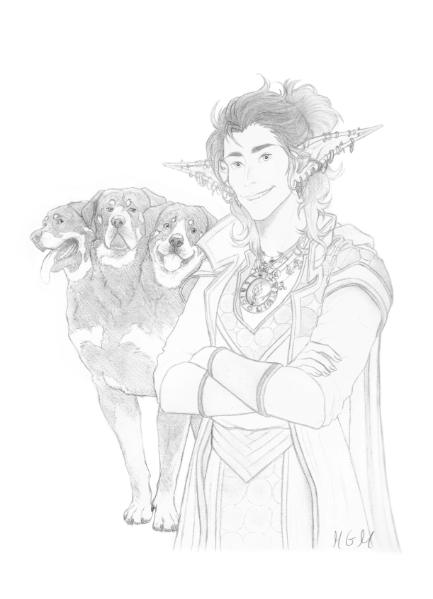

## Zahel ([S28A](s28a_museu_sombras_p1.md), [S29A](s29a_museu_sombras_p2.md))

| {width=300} |
| ---------------------------------------------- |

---
**[DM-ONLY – Não incluir na Wiki]**

### 🎲 Jogador / 🎲 Player

| 🎲 Jogador | 🎲 Player |
| --------------------------------------------------------------------------------------------------------- | --------------------------------------------------------------------------------------------------------- |
| **Jogador:** Rodrigo Carvalho | **Player:** Rodrigo Carvalho |
| **Idade:** 28 | **Age:** 28 |
| **Contacto:** 915202132 | **Contact:** 915202132 |
| **Instagram:** [rodrigojscarvalho](https://www.instagram.com/rodrigojscarvalho?igsh=MXM1NXZrcjQzMGg3Nw==) | **Instagram:** [rodrigojscarvalho](https://www.instagram.com/rodrigojscarvalho?igsh=MXM1NXZrcjQzMGg3Nw==) |
| **Discord:** Ludhriqc | **Discord:** Ludhriqc |
| **Ficha D&D Beyond:** [Link](https://www.dndbeyond.com/characters/145801675/Ctv1cd) | **D&D Beyond Sheet:** [Link](https://www.dndbeyond.com/characters/145801675/Ctv1cd) |

**[DM-ONLY – Não incluir na Wiki]**

---

### 🧙 Personagem / 🧙 Character

| **🧙 Personagem**                                               | **🧙 Character**                                              |
| --------------------------------------------------------------- | ------------------------------------------------------------- |
| **Nome**: [Zahel](pc_zahel.md)                                  | **Name**: [Zahel](pc_zahel.md)                                |
| **Espécie**: [Verdan](https://www.dndbeyond.com/races/verdan)   | **Species**: [Verdan](https://www.dndbeyond.com/races/verdan) |
| **Classe**: [Clérigo](https://www.dndbeyond.com/classes/cleric) | **Class**: [Cleric](https://www.dndbeyond.com/classes/cleric) |
| **Alinhamento**: [por preencher]                                | **Alignment**: [to be filled]                                 |
| **Background**: [por preencher]                                 | **Background**: [to be filled]                                |
| **Idade**: [por preencher]                                      | **Age**: [to be filled]                                       |
| **Altura**: [por preencher]                                     | **Height**: [to be filled]                                    |
| **Olhos**: [por preencher]                                      | **Eyes**: [to be filled]                                      |
| **Cabelo**: [por preencher]                                     | **Hair**: [to be filled]                                      |
| **Pele**: [por preencher]                                       | **Skin**: [to be filled]                                      |
| **Tamanho**: Médio                                              | **Size**: Medium                                              |

---

### 📜 Descrição Física / 📜 Physical Description

| **📜 Descrição Física** | **📜 Physical Description** |
| ------------------------ | --------------------------- |
| [Zahel](pc_zahel.md) apresenta feições joviais e traços invulgares de [verdan](https://www.dndbeyond.com/races/verdan), de corpo médio e postura firme. Usa elmos, colares e símbolos sagrados criados por si, refletindo a sua devoção peculiar a “Jeff” (That Which Endures). O seu olhar transmite uma mistura de ingenuidade e fervor religioso, e é frequentemente visto na companhia de um cão de três cabeças. | [Zahel](pc_zahel.md) has youthful features and unusual [verdan](https://www.dndbeyond.com/races/verdan) traits, with a medium build and firm posture. He wears helmets, necklaces, and sacred symbols of his own making, reflecting his peculiar devotion to “Jeff” (That Which Endures). His gaze combines naivety with religious fervor, and he is often seen accompanied by a three-headed dog. |

---

### ⚔️ Itens / ⚔️ Items

| **⚔️ Itens** | **⚔️ Items** |
|--------------|--------------|
| **Armadura/Escudo:** [Chain Shirt](https://www.dndbeyond.com/equipment/chain-shirt); Capacete +1; [Escudo](https://www.dndbeyond.com/equipment/shield) | **Armor/Shield:** [Chain Shirt](https://www.dndbeyond.com/equipment/chain-shirt); Helmet +1; [Shield](https://www.dndbeyond.com/equipment/shield) |
| **Armas:** [Lança](https://www.dndbeyond.com/equipment/spear); 2 Pact Blades ([Scarlet Order](scarlet_order.md)) | **Weapons:** [Spear](https://www.dndbeyond.com/equipment/spear); 2 Pact Blades ([Scarlet Order](scarlet_order.md)) |
| **Items mágicos:** [Tavern Ring](anel_da_taberna.md); 2 [Potions of Healing](https://www.dndbeyond.com/magic-items/potion-of-healing); 1 [Potion of Fire Breath](https://www.dndbeyond.com/magic-items/potion-of-fire-breath); 1 [Potion of Invisibility](https://www.dndbeyond.com/magic-items/potion-of-invisibility); 2 [Scrolls of Command](https://www.dndbeyond.com/spells/command); 1 [Scroll of Revivify](https://www.dndbeyond.com/spells/revivify); “Pokébola” de chumbo com pedra radioativa verde | **Magical Items:** [Tavern Ring](anel_da_taberna.md); 2 [Potions of Healing](https://www.dndbeyond.com/magic-items/potion-of-healing); 1 [Potion of Fire Breath](https://www.dndbeyond.com/magic-items/potion-of-fire-breath); 1 [Potion of Invisibility](https://www.dndbeyond.com/magic-items/potion-of-invisibility); 2 [Scrolls of Command](https://www.dndbeyond.com/spells/command); 1 [Scroll of Revivify](https://www.dndbeyond.com/spells/revivify); “Pokéball” of lead with green radioactive stone |
| **Poções:** Incluídas acima | **Potions:** Included above |
| **Items não mágicos:** Owlsa Delta; [Calligrapher’s Supplies](https://www.dndbeyond.com/equipment/calligraphers-supplies); [Holy Water](https://www.dndbeyond.com/equipment/holy-water-flask); [Holy Symbol](https://www.dndbeyond.com/equipment/holy-symbol); [Lamp](https://www.dndbeyond.com/equipment/lamp); [Rations](https://www.dndbeyond.com/equipment/rations-1-day); [Tinderbox](https://www.dndbeyond.com/equipment/tinderbox); Greyhawk Police Honorary Badge; 40 Scrolls | **Non-magical Items:** Owlsa Delta; [Calligrapher’s Supplies](https://www.dndbeyond.com/equipment/calligraphers-supplies); [Holy Water](https://www.dndbeyond.com/equipment/holy-water-flask); [Holy Symbol](https://www.dndbeyond.com/equipment/holy-symbol); [Lamp](https://www.dndbeyond.com/equipment/lamp); [Rations](https://www.dndbeyond.com/equipment/rations-1-day); [Tinderbox](https://www.dndbeyond.com/equipment/tinderbox); Greyhawk Police Honorary Badge; 40 Scrolls |
| **Ouro:** 515 gp | **Gold:** 515 gp |

---

### 📖 História – Antes da Taberna / 📖 Story – Before the Tavern

| **📖 História – Antes da Taberna** | **📖 Story – Before the Tavern** |
| ---------------------------------- | -------------------------------- |
| - Criado por “That Which Endures”. - Decide tornar-se [Clérigo](https://www.dndbeyond.com/classes/cleric) e fundar religião em torno do seu criador. - Ao sair da aldeia natal, é teletransportado para a [Taberna](taverna.md). - Não sabe como ser [clérigo](https://www.dndbeyond.com/classes/cleric) e tenta de tudo para agradar ao seu deus (apelidado Jeff). | - Created by “That Which Endures.” - Chose to become a [Cleric](https://www.dndbeyond.com/classes/cleric) and found a religion around his creator. - Upon leaving his village, was teleported to the [Tavern](taverna.md). - Unsure how to be a [cleric](https://www.dndbeyond.com/classes/cleric), tried many things to please his god (nicknamed Jeff). |

---

### 📖 História – Depois da Taberna / 📖 Story – After the Tavern

| **📖 História – Depois da Taberna** | **📖 Story – After the Tavern** |
| ----------------------------------- | -------------------------------- |
| - Procura agradar a Jeff através de símbolos criados ou de outros deuses. - Lutou contra vigilantes como [Owlman](owlman.md) (ganhou Owlsa Delta) e enfrentou Bruno Bandeira e Pedro do Parque. - Investigou peste causada por pedras radioativas. - Participou nos Jogos do Coliseu. - Investigou desaparecimentos numa mina anã de cobre. - Sobreviveu a um [museu](museu_das_maravilhas.md) que tentava embalsamar visitantes. - Investigou aldeia ilusória, fruto de um último sobrevivente e monstro florestal. - Eliminou ratos sanguinários em cavernas. - Procurou criança raptada ([Anabela](anabela.md)), usada em ritual da [Scarlet Order](scarlet_order.md). - [Anabela](anabela.md) foi possuída por [Zann](zann.md); falhou ao salvá-la, resultando na sua morte. - [Zahel](pc_zahel.md) matou os pais cultistas; [Zann](zann.md) desapareceu com a criança. - Domesticou um cão de três cabeças. - Desarmou 2 cultistas da [Scarlet Order](scarlet_order.md), guardando as Pact Blades. - Fundou a *Church of the Guiding Flame*, prometendo vingança contra a [Scarlet Order](scarlet_order.md) e trazer [Anabela](anabela.md) de volta. | - Sought to please Jeff through symbols or deeds. - Fought vigilantes like [Owlman](owlman.md) (won Owlsa Delta) and faced Bruno Bandeira and Pedro do Parque. - Investigated plague from radioactive stones. - Took part in Coliseum Games. - Investigated disappearances in a dwarven copper mine. - Survived a [museum](museu_das_maravilhas.md) that embalmed visitors. - Investigated illusory village created by last survivor and forest monster. - Cleared bloodthirsty rats from caves. - Searched for kidnapped child ([Anabela](anabela.md)), used in [Scarlet Order](scarlet_order.md) ritual. - [Anabela](anabela.md) possessed by [Zann](zann.md); failed to save her, leading to death. - [Zahel](pc_zahel.md) slew cultist parents; [Zann](zann.md) vanished with child’s body. - Tamed a three-headed dog. - Disarmed 2 Scarlet cultists, keeping their Pact Blades. - Founded the *Church of the Guiding Flame*, vowing vengeance on the [Scarlet Order](scarlet_order.md) and to restore [Anabela](anabela.md)’s soul. |

---

### 🎭 Dramatis Personae / 🎭 Dramatis Personae

| **🎭 Dramatis Persona** | **🎭 Dramatis Personae** |
|--------------------------|-------------------------|
| **Traços de Personalidade:** - Ingénuo mas devoto. - Criativo, criando símbolos e rituais para agradar a Jeff. - Determinado em guiar outros pela fé. | **Personality Traits:** - Naïve yet devoted. - Creative, crafting symbols and rituals to please Jeff. - Determined to guide others through faith. |
| **Ideais:** - A fé deve ser partilhada e transformar dor em esperança. - A vingança contra a [Scarlet Order](scarlet_order.md) é também justiça. | **Ideals:** - Faith must be shared and turn pain into hope. - Vengeance against the [Scarlet Order](scarlet_order.md) is also justice. |
| **Vínculos:** - Criado por “That Which Endures” (Jeff), sua divindade única. - Fundador da *Church of the Guiding Flame*. - Ligado espiritualmente a [Anabela](anabela.md), mártir da sua fé. - Companheiro inseparável do cão de três cabeças. | **Bonds:** - Created by “That Which Endures” (Jeff), his unique deity. - Founder of the *Church of the Guiding Flame*. - Spiritually tied to [Anabela](anabela.md), martyr of his faith. - Inseparable companion of the three-headed dog. |
| **Defeitos:** - Ingenuidade em confiar em símbolos e rituais improváveis. - Obsessão pela vingança pode cegar a sua fé. - Falha em aceitar perdas pode levá-lo à imprudência. | **Flaws:** - Naïve in trusting unlikely symbols and rituals. - Obsession with vengeance may blind his faith. - Failure to accept loss may lead him to recklessness. |
| **NPCs de influência direta:** - [Anabela](anabela.md), filha de cultistas da [Scarlet Order](scarlet_order.md); morreu e tornou-se base da sua fé. - [Owlman](owlman.md), vigilante; tecnologia obtida dele. | **Direct Influence NPCs:** - [Anabela](anabela.md), daughter of Scarlet cultists; died and became foundation of his faith. - [Owlman](owlman.md), vigilante; technology gained from him. |
| **Antagonistas:** - [Scarlet Order](scarlet_order.md) - [Zann](zann.md), demónio que possuiu [Anabela](anabela.md). | **Antagonists:** - [Scarlet Order](scarlet_order.md) - [Zann](zann.md), demon who possessed [Anabela](anabela.md). |
| **Aliados:** - [Dustin](pc_dustin_thorne.md) (companheiro e alvo de [Zann](zann.md)). - Taberneiros e aventureiros da [Taberna](taverna.md). | **Allies:** - [Dustin](pc_dustin_thorne.md) (companion and [Zann](zann.md)’s target). - Tavernkeepers and adventurers of the [Tavern](taverna.md). |

---

### 🔮 OBS / 🔮 Notes

| **🔮 OBS** | **🔮 Notes** |
|------------|--------------|
| - *Owlsa Delta*: planador que se transforma em bastão; permite voo quando ativado. - *Pact Blades ([Scarlet Order](scarlet_order.md))*: 1d6 cortante + 1d4 necrótico; utilizador sofre 1 de dano por ataque, acumulando até Long Rest. - *Capacete +1*: encontrado no [museu](museu_das_maravilhas.md); +1 AC. - *Sacred Symbols*: criados por [Zahel](pc_zahel.md), apontam sempre para a sua Igreja. - *Pokébola / Plague Sphere*: esfera de chumbo com pedra radioativa verde, armazenada em segurança. | - *Owlsa Delta*: hang glider transforming into staff; allows flight when activated. - *Pact Blades ([Scarlet Order](scarlet_order.md))*: 1d6 slashing + 1d4 necrotic; user suffers 1 damage per attack, stacking until Long Rest. - *Helmet +1*: found in [museum](museu_das_maravilhas.md); +1 AC. - *Sacred Symbols*: crafted by [Zahel](pc_zahel.md), always point toward his Church. - *Pokéball / Plague Sphere*: lead orb containing green radioactive stone, safely stored. |

---

## Processing Audit

### Internal Links

| Source File | Linked Files |
| :--- | :--- |
| pc_zahel.md | s28a_museu_sombras_p1.md, s29a_museu_sombras_p2.md, pc_zahel.md, scarlet_order.md, anel_da_taberna.md, taverna.md, owlman.md, museu_das_maravilhas.md, anabela.md, zann.md, pc_dustin_thorne.md |

### Warnings

| Type | Where | Detail |
| :--- | :--- | :--- |
| Missing File - No DDB Link | `⚔️ Itens / ⚔️ Items` | Magical Item `Capacete +1` is not a known DDB item; kept as plain text. |
| Missing File - No DDB Link | `⚔️ Itens / ⚔️ Items` | Magical Item `“Pokébola” de chumbo com pedra radioativa verde` is not a known DDB item; kept as plain text. |
| Missing File - No DDB Link | `⚔️ Itens / ⚔️ Items` | Non-Magical Item `Owlsa Delta` is not a known DDB equipment; kept as plain text. |
| Missing File - No DDB Link | `⚔️ Itens / ⚔️ Items` | Non-Magical Item `Greyhawk Police Honorary Badge` is not a known DDB equipment; kept as plain text. |
| Missing File - No DDB Link | `🔮 OBS / 🔮 Notes` | Magical Item `Owlsa Delta` is not a known DDB item; kept as plain text. |
| Missing File - No DDB Link | `🔮 OBS / 🔮 Notes` | Magical Item `Capacete +1` is not a known DDB item; kept as plain text. |
| Missing File - No DDB Link | `🔮 OBS / 🔮 Notes` | Magical Item `Pokébola / Plague Sphere` is not a known DDB item; kept as plain text. |

### Missing Files

| Type | Where | Detail |
| :--- | :--- | :--- |
| Entity File | `⚔️ Itens / ⚔️ Items` | `scarlet_order.md` |
| Entity File | `⚔️ Itens / ⚔️ Items` | `anel_da_taberna.md` |
| Entity File | `📖 História – Antes da Taberna` | `taverna.md` |
| Entity File | `📖 História – Depois da Taberna` | `owlman.md` |
| Entity File | `📖 História – Depois da Taberna` | `museu_das_maravilhas.md` |
| Entity File | `📖 História – Depois da Taberna` | `anabela.md` |
| Entity File | `📖 História – Depois da Taberna` | `zann.md` |
| Entity File | `🎭 Dramatis Personae / 🎭 Dramatis Personae` | `pc_dustin_thorne.md` |