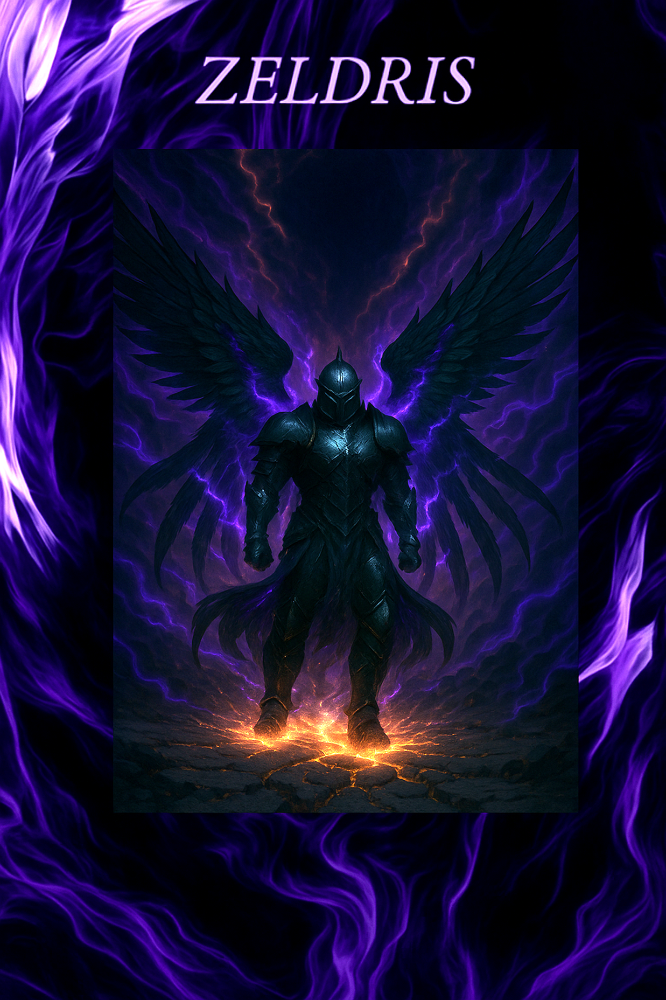

# Zeldris (anteriormente Varus)

| {width=300} |
| ------------------------ |

| Português | English |
| --------- | ------- |
| **Jogador:** Ricardo Oliveira Ribeiro | **Player:** Ricardo Oliveira Ribeiro |
| **Idade:** 24 | **Age:** 24 |
| **Género:** Masculino | **Gender:** Male |
| **Espécie:** Humano (corpo alterado com traços demoníacos e aquáticos) | **Species:** Human (body altered with demonic and aquatic traits) |
| **Olhos:** — | **Eyes:** — |
| **Cabelo:** — | **Hair:** — |
| **Pele:** Endurecida como escamas, com guelras e barbatanas | **Skin:** Hardened like scales, with gills and fins |
| **Tamanho:** Médio | **Size:** Medium |
| **Altura:** — | **Height:** — |
| **Classe:** Guerreiro / Paladino caído (pacto demoníaco) | **Class:** Fighter / Fallen Paladin (demonic pact) |
| **Antecedente:** Artesão / Assassino errante | **Background:** Craftsman / Wandering assassin |
| **Alinhamento:** — | **Alignment:** — |
| **Nível:** — | **Level:** — |
| **Ficha D&D Beyond:** [Link](https://www.dndbeyond.com/characters/143891578/GTjlb2) | **D&D Beyond Sheet:** [Link](https://www.dndbeyond.com/characters/143891578/GTjlb2) |
| **Contacto:** +351 925 717 520 | **Contact:** +351 925 717 520 |
| **Instagram:** [@ricky_ribeiroo](https://www.instagram.com/ricky_ribeiroo) | **Instagram:** [@ricky_ribeiroo](https://www.instagram.com/ricky_ribeiroo) |
| **Discord:** _bigrick | **Discord:** _bigrick |
| **⚔️ Itens** **Armadura/Escudo:** Plate + Shield **Armas:** Longsword **Items mágicos:** Cloak of Protection **Items não mágicos:** (TBF) **Ouro:** (TBF) | **⚔️ Items** **Armor/Shield:** Plate + Shield **Weapons:** Longsword **Magical Items:** Cloak of Protection **Non-magical Items:** (TBF) **Gold:** (TBF) |
| **📖 História – Antes da Taberna** - Varus era um artesão tiefling, com esposa e três filhos numa aldeia isolada. - Roubou para alimentar a família durante um inverno cruel. - A sua casa foi incendiada e esposa + filhas assassinadas por homens que o julgaram. - Ao regressar, matou o próprio filho por engano, pensando ser um inimigo. - Quebrado, tornou-se assassino errante em busca de vingança. - Fez pacto com a Taberna: memória apagada em troca de vingança e promessa de trazer o filho de volta. | **📖 Story – Before the Tavern** - Varus was a tiefling craftsman, with wife and three children in a remote village. - Stole to feed family during harsh winter. - Home burned, wife and daughters murdered by men who judged him. - Upon returning, accidentally killed his son, mistaking him for an enemy. - Broken, became a wandering assassin seeking revenge. - Made pact with the Tavern: memory erased in exchange for vengeance and promise of bringing his son back. |
| **📖 História – Depois da Taberna** - Varus aliou-se a várias parties em missões. - Numa delas, morreu e os colegas colocaram-no numa máquina illithid criadora de guardas. - Ressuscitou como Zeldris, envolvido numa armadura mágica que nunca pode remover, incapaz de atacar mind flayers. - Recebeu o nome de uma entidade desconhecida: “Z̸͂̋̿̉̋́̀̑̚͘… Zeldris”. - Continuou a servir o pacto com a Taberna. - Conheceu um demónio que lhe mostrou rostos dos assassinos da família; corpo deformou-se ainda mais, ganhando guelras e barbatanas. - Perdeu parte da inteligência (TBF). | **📖 Story – After the Tavern** - Varus allied with parties on missions. - In one, he died; comrades placed him in an illithid guard-making machine. - Resurrected as Zeldris, bound to armor he can never remove, unable to attack mind flayers. - Was given a new name by unknown entity: “Z̸͂̋̿̉̋́̀̑̚͘… Zeldris.” - Continued to serve Tavern’s pact. - Met a demon who revealed the faces of his family’s murderers; body warped further, gaining gills and fins. - Lost some intelligence (TBF). |
| **🎭 Dramatis Persona** **NPCs de influência direta:** — **Antagonistas:** 3 homens que destruíram a família (identidade revelada pelo demónio). **Aliados:** — | **🎭 Dramatis Persona** **Direct Influence NPCs:** — **Antagonists:** 3 men who destroyed his family (revealed by demon). **Allies:** — |
| **🔮 OBS** - *Cloak of Protection*: +1 AC & saves. - Armadura illithid fundida ao corpo, não pode ser removida. - Ordem mental impede-o de atacar mind flayers. - Corpo deformado com guelras e barbatanas. - (Mais efeitos TBF) | **🔮 Notes** - *Cloak of Protection*: +1 AC & saves. - Illithid armor fused to body, cannot be removed. - Mental order prevents harming mind flayers. - Body warped with gills and fins. - (Further effects TBF) |

| |
| --------------------------------------------------------------------------------------------------------------------------------------------------- |

---

