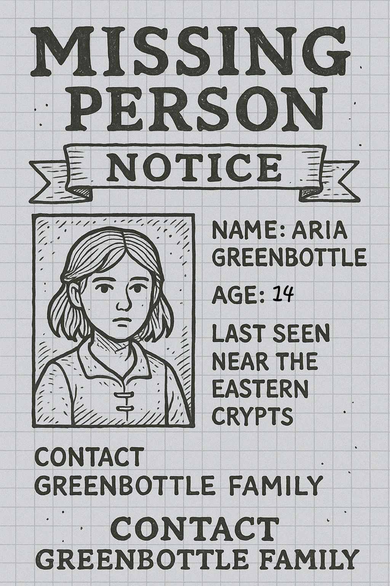
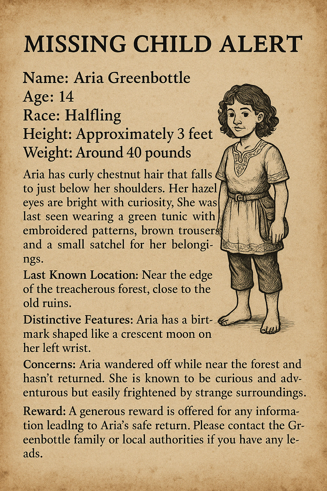
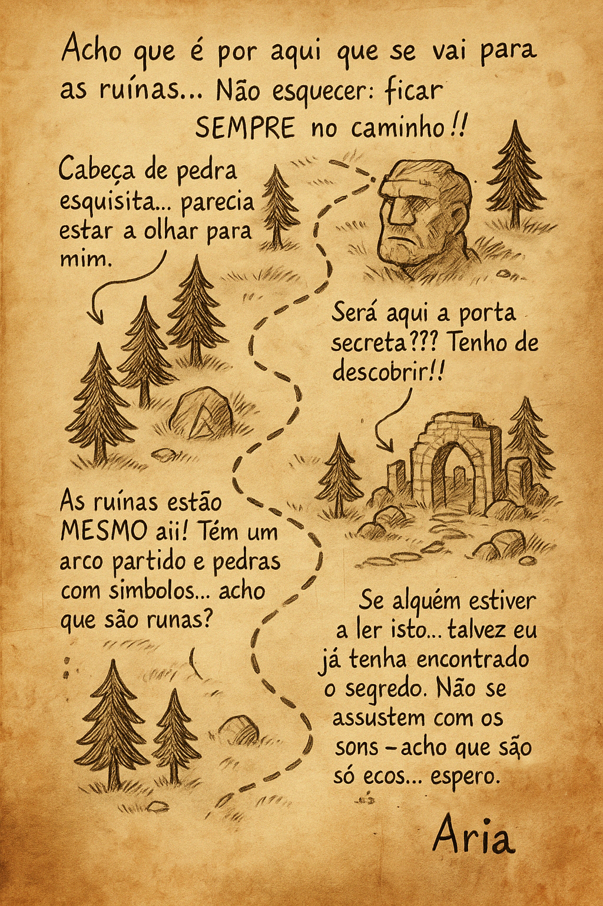
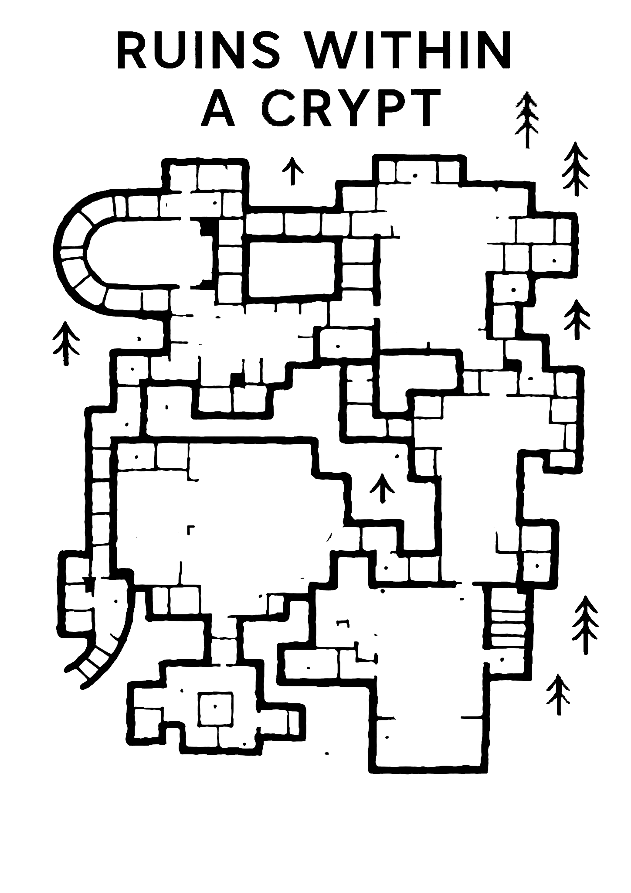
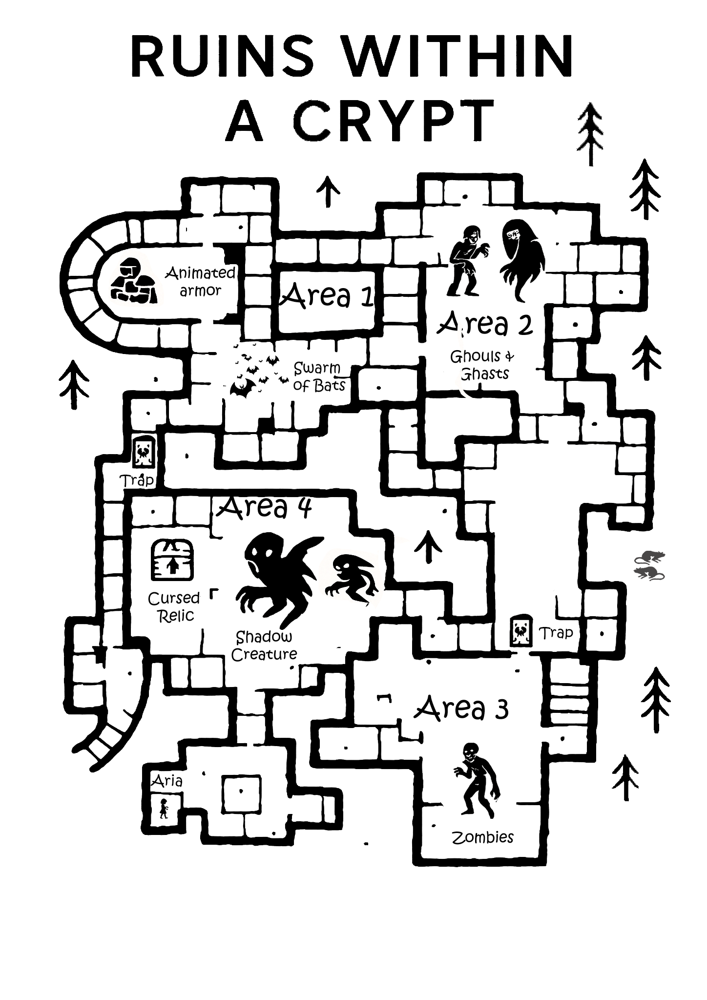

# Sessão 16  A Criança Perdida: Ready to Play

| Português                                                                                                                                                                                                                                                                                                                                                                                                                                                                                                                                                                                                                                                                  | English                                                                                                                                                                                                                                                                                                                                                                                                                                                                                                                                                                                                                          |
| -------------------------------------------------------------------------------------------------------------------------------------------------------------------------------------------------------------------------------------------------------------------------------------------------------------------------------------------------------------------------------------------------------------------------------------------------------------------------------------------------------------------------------------------------------------------------------------------------------------------------------------------------------------------------- | -------------------------------------------------------------------------------------------------------------------------------------------------------------------------------------------------------------------------------------------------------------------------------------------------------------------------------------------------------------------------------------------------------------------------------------------------------------------------------------------------------------------------------------------------------------------------------------------------------------------------------- |
| **Introdução:** Grupo é chamado a investigar desaparecimento de Aria, halfling de 14 anos. param($m) "<" + ($m.Groups[1].Value -replace '\\','/') + ">"  param($m) "<" + ($m.Groups[1].Value -replace '\\','/') + ">" **Cena 1: Mercado de Greyhawk** param($m) "<" + ($m.Groups[1].Value -replace '\\','/') + ">" - Conversa com Tobias, Eliza e Finn Greenbottle. param($m) "<" + ($m.Groups[1].Value -replace '\\','/') + ">" - Pistas: diário secreto, mapa desenhado à mão, advertências sobre o caminho. param($m) "<" + ($m.Groups[1].Value -replace '\\','/') + ">"  param($m) "<" + ($m.Groups[1].Value -replace '\\','/') + ">" **Cena 2: Ruínas Antigas** param($m) "<" + ($m.Groups[1].Value -replace '\\','/') + ">" - Entrada armadilhada. param($m) "<" + ($m.Groups[1].Value -replace '\\','/') + ">" - Exploração da cripta: animated armor, bats, armadilha de dardos. param($m) "<" + ($m.Groups[1].Value -replace '\\','/') + ">"  param($m) "<" + ($m.Groups[1].Value -replace '\\','/') + ">" **Cena 3: Desafio dos Mortos-vivos** param($m) "<" + ($m.Groups[1].Value -replace '\\','/') + ">" - Ghast, ghouls, zombies, shadow creatures, rats. param($m) "<" + ($m.Groups[1].Value -replace '\\','/') + ">"  param($m) "<" + ($m.Groups[1].Value -replace '\\','/') + ">" **Cena 4: Boss e Resgate** param($m) "<" + ($m.Groups[1].Value -replace '\\','/') + ">" - Confronto final com Spectral Wraith e shadow boss. param($m) "<" + ($m.Groups[1].Value -replace '\\','/') + ">" - Libertação de Aria, entrega da gema misteriosa ao taberneiro. param($m) "<" + ($m.Groups[1].Value -replace '\\','/') + ">"  | **Introduction:** Group is summoned to investigate the disappearance of 14-year-old halfling Aria. param($m) "<" + ($m.Groups[1].Value -replace '\\','/') + ">"  param($m) "<" + ($m.Groups[1].Value -replace '\\','/') + ">" **Scene 1: Greyhawk Market** param($m) "<" + ($m.Groups[1].Value -replace '\\','/') + ">" - Talk with Tobias, Eliza and Finn Greenbottle. param($m) "<" + ($m.Groups[1].Value -replace '\\','/') + ">" - Clues: secret diary, hand-drawn map, warnings about the path. param($m) "<" + ($m.Groups[1].Value -replace '\\','/') + ">"  param($m) "<" + ($m.Groups[1].Value -replace '\\','/') + ">" **Scene 2: Ancient Ruins** param($m) "<" + ($m.Groups[1].Value -replace '\\','/') + ">" - Trapped entrance. param($m) "<" + ($m.Groups[1].Value -replace '\\','/') + ">" - Crypt exploration: animated armor, bats, dart trap. param($m) "<" + ($m.Groups[1].Value -replace '\\','/') + ">"  param($m) "<" + ($m.Groups[1].Value -replace '\\','/') + ">" **Scene 3: Undead Challenge** param($m) "<" + ($m.Groups[1].Value -replace '\\','/') + ">" - Ghast, ghouls, zombies, shadow creatures, rats. param($m) "<" + ($m.Groups[1].Value -replace '\\','/') + ">"  param($m) "<" + ($m.Groups[1].Value -replace '\\','/') + ">" **Scene 4: Boss and Rescue** param($m) "<" + ($m.Groups[1].Value -replace '\\','/') + ">" - Final battle with Spectral Wraith and shadow boss. param($m) "<" + ($m.Groups[1].Value -replace '\\','/') + ">" - Aria freed, mysterious gem delivered to barkeeper. param($m) "<" + ($m.Groups[1].Value -replace '\\','/') + ">"  |
| **NPCs:** Aria, Tobias, Eliza, Finn Greenbottle, guarda da cidade, taberneiro                                                                                                                                                                                                                                                                                                                                                                                                                                                                                                                                                                                              | **NPCs:** Aria, Tobias, Eliza, Finn Greenbottle, city guard, barkeeper                                                                                                                                                                                                                                                                                                                                                                                                                                                                                                                                                           |
| **Loot:** 100 PO, poções, Gema das Cinco Vozes (misteriosa), diário, gratidão da família                                                                                                                                                                                                                                                                                                                                                                                                                                                                                                                                                                                   | **Loot:** 100 GP, potions, Five Voices Gem (mysterious), diary, familys gratitude                                                                                                                                                                                                                                                                                                                                                                                                                                                                                                                                                |
| **Data:** 2025-04-24                                                                                                                                                                                                                                                                                                                                                                                                                                                                                                                                                                                                                                                       | **Date:** 2025-04-24                                                                                                                                                                                                                                                                                                                                                                                                                                                                                                                                                                                                             |
| **Ficheiros de origem:** s16_a_crianca_perdida.md, s16_a_crianca_perdida.txt                                                                                                                                                                                                                                                                                                                                                                                                                                                                                                                                                                                               |                                                                                                                                                                                                                                                                                                                                                                                                                                                                                                                                                                                                                                  |

