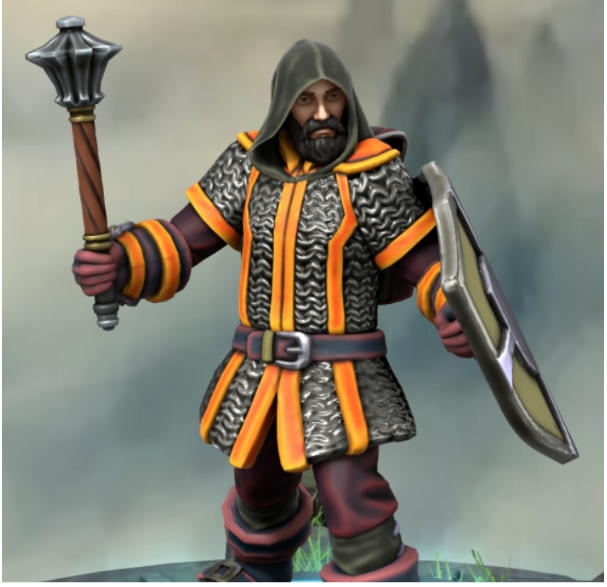

# Arkos Vasell

| 

| Português | English |
|-----------|---------|
| **Jogador:** Luís Faria | **Player:** Luís Faria |
| **Espécie:** desconhecido | **Species:** unknown |
| **Classe:** Clérigo (em formação) / ex-guarda | **Class:** Cleric (in training) / former guard |
| **Nível:** 3 | **Level:** 3 |
| **Ficha D&D Beyond:** [Link](https://www.dndbeyond.com/characters/139712043) | **D&D Beyond Sheet:** [Link](https://www.dndbeyond.com/characters/139712043) |
| **Sessões jogadas:** 1 | **Sessions played:** 1 |
| **Sessões DM:** desconhecido | **DM Sessions:** unknown |
| **Contacto:** +351 912 455 898 | **Contact:** +351 912 455 898 |

|

| Português | English |
|-----------|---------|
| **Resumo rápido:** Arkos, antigo guarda de uma terra pacífica, procura aprender mais sobre o mundo e os deuses, viajando com a amiga de infância Orianna. | **Quick synopsis:** Arkos, a former guard from a peaceful land, seeks to learn more about the world and the gods, traveling with his childhood friend Orianna. |
| **História cuidadosamente fabricada (o que Arkos conta aos outros):** Viveu sempre como guarda na sua terra natal, treinando e aprendendo sempre que possível. Tentou estudar magia com um elfo mago viajante, mas sem grande sucesso. Recentemente encontrou vocação para clérigo e passou a estudar os deuses no templo local. | **Carefully Crafted Story (what Arkos tells others):** He always lived as a guard in his homeland, training and learning whenever possible. Tried to study magic with a traveling elven wizard, but with little success. Recently found a calling for cleric work and began studying the gods at the local temple. |
| **Verdadeira história — Origens:** Igual à história que conta: ex-guarda insatisfeito que procura conhecimento e vocação, agora em jornada com Orianna para explorar e compreender mais. | **True Backstory — Origins:** Same as the story he tells: a dissatisfied former guard seeking knowledge and purpose, now journeying with Orianna to explore and understand more. |
