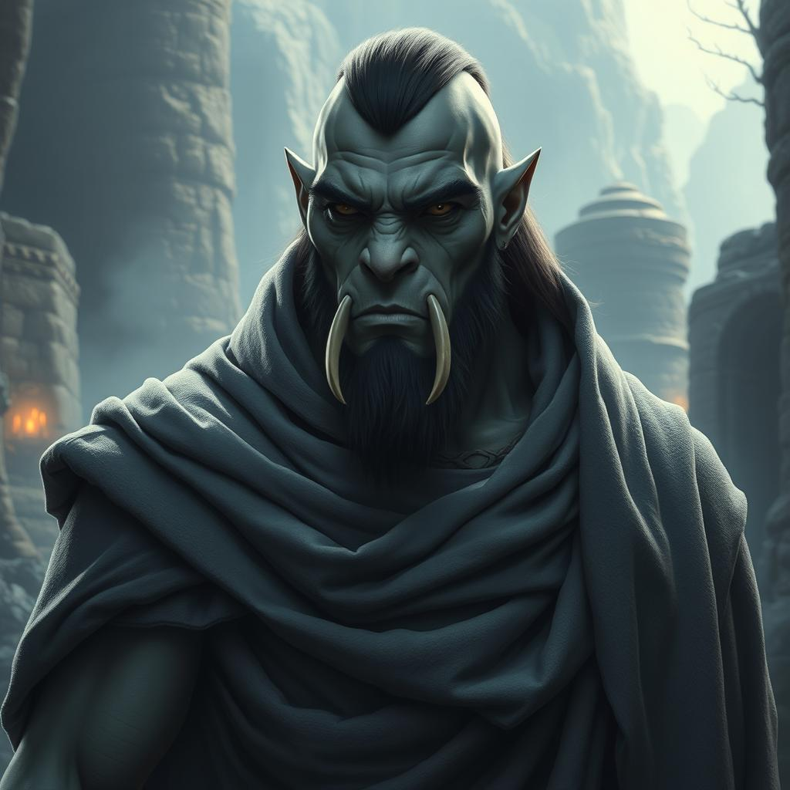

# B# Bok Thunderfist

| Português | English |
|-----------|---------|
| **Jogador:** Luis | **Player:** Luis |
| **Espécie:** Meio-Orc | **Species:** Half-Orc |
| **Classe:** Monge (Way of the Open Hand) | **Class:** Monk (Way of the Open Hand) |
| **Ficha D&D Beyond:** [Link](https://www.dndbeyond.com/characters/138745784) | [D&D Beyond Sheet](https://www.dndbeyond.com/characters/138745784) |
| **Sessões jogadas:** 6 | **Sessions played:** 6 |
| **Sessões DM:** 4 | **DM Sessions:** 4 |
| **Contacto:** +351 915 495 031 | **Contact:** +351 915 495 031 |

| Português | English |
|-----------|---------|
| Criado por monges do Mosteiro dos Picos Sussurrantes após ser encontrado num campo de batalha em bebé, Bok lutou para controlar o seu temperamento orc e aprender o caminho da disciplina. Agora parte para o seu ritual de iniciação: a Peregrinação da Harmonia  descobrir se a filosofia do mosteiro resiste ao mundo real. | Raised by monks of the Whispering Peaks Monastery after being found as a baby on a battlefield, Bok struggled to master his orcish temper and learn the path of discipline. Now he embarks on his initiation rite: the Pilgrimage of Harmony  to see if the monastery's philosophy holds up in the real world. |

[[Personagens Jogadoras]]

