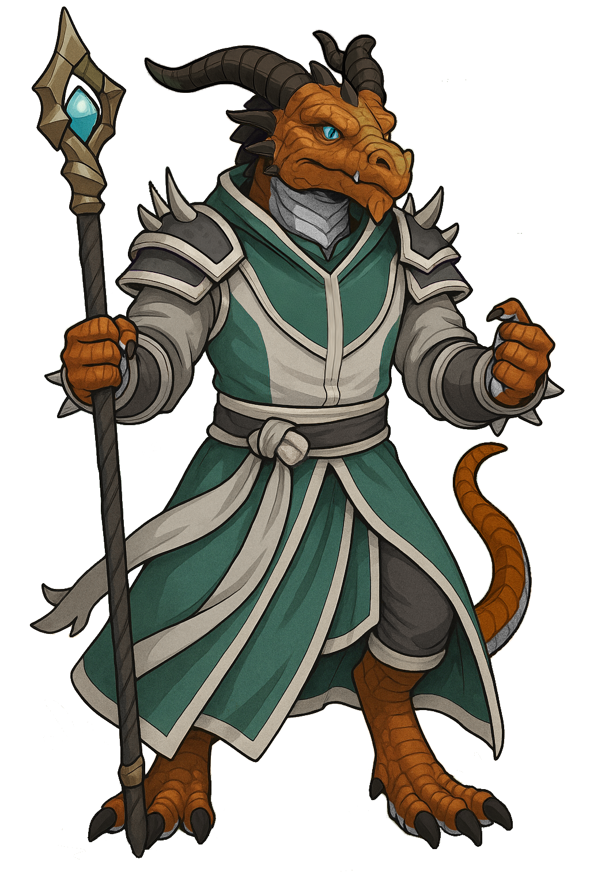

# Drayl Bharash

|

| Português | English |
|-----------|---------|
| **Jogador:** Rafael Mesquita | **Player:** Rafael Mesquita |
| **Idade:** 26 | **Age:** 26 |
| **Género:** Masculino | **Gender:** Male |
| **Espécie:** Dragonborn (Escamas de Bronze) | **Species:** Bronze Dragonborn |
| **Olhos:** Azuis | **Eyes:** Blue |
| **Tamanho:** Médio (1,82 m) | **Size:** Medium (6 ft) |
| **Classe:** Mago (Adivinhação) | **Class:** Wizard (Divination) |
| **Alinhamento:** Neutro Bom | **Alignment:** Neutral Good |
| **Nível:** 7 | **Level:** 7 |
| **Ficha D&D Beyond:** [Link](https://www.dndbeyond.com/characters/139926806) | **D&D Beyond Sheet:** [Link](https://www.dndbeyond.com/characters/139926806) |
| **Sessões jogadas:** 7 | **Sessions played:** 7 |
| **Sessões DM:** 3 | **DM Sessions:** 3 |
| **Contacto:** +351 966 964 325 | **Contact:** +351 966 964 325 |
| **Aparência:** Escamas de bronze, olhos azuis penetrantes, altura média. | **Appearance:** Bronze scales, piercing blue eyes, medium height. |
| **Personalidade:** Contemplativo, muitas vezes perdido nos próprios pensamentos, observa e reflete antes de agir. Não resiste a uma piada, mesmo em situações perigosas. | **Personality:** Contemplative, often lost in thought, prefers to observe and reflect before acting. Cant resist a joke, even in dangerous situations. |
| **Elos:** Carrega o peso do legado do seu clã de sabedoria e erudição, esforçando-se por honrar os seus ensinamentos mesmo ao trilhar um caminho diferente. Dedicado a desvendar o significado da profecia do seu sonho. | **Bonds:** Bears the weight of his clans legacy of wisdom and learning, striving to honor their teachings even as he forges his own path. Committed to unraveling the meaning of his dreams prophecy. |
| **Ideais:** O conhecimento é a chave para compreender o mundo e moldar o futuro. Acredita que o destino não está definido, mas é uma rede de probabilidades decididas por escolhas. | **Ideals:** Knowledge is the key to understanding the world and shaping the future. Believes destiny isnt set, but a network of probabilities shaped by choices. |
| **Defeitos:** Ignora soluções óbvias, preferindo resolver problemas de forma excessivamente complicada. | **Flaws:** Ignores obvious solutions in favor of complicated ones. |

| Português | English |
|-----------|---------|
| **Resumo rápido:** Dragonborn de escamas de bronze que segue o caminho da magia e da adivinhação, perseguido por visões de um labirinto impossível e de um artefacto ancestral. | **Quick synopsis:** Bronze-scaled dragonborn who follows the path of magic and divination, haunted by visions of an impossible labyrinth and an ancient artifact. |
| **História cuidadosamente fabricada (o que Drayl conta aos outros):** Fala do seu treino arcano e do mentor Rhogar, explicando que viaja para aprender e compreender sinais antigos, mas omite o peso e o medo provocados pela sua visão. | **Carefully Crafted Story (what Drayl tells others):** Speaks of his arcane training and mentor Rhogar, saying he travels to learn and understand ancient signs, but omits the weight and fear caused by his vision. |
| **Verdadeira história  Origens:** Nascido numa comunidade dragonborn costeira protetora dos mares, sempre preferiu os estudos arcanos à vida marcial. Uma noite teve uma visão perturbadora de um labirinto impossível, símbolos vivos e um artefacto antigo que deixou marcas psíquicas. Desde então persegue pistas desse sonho no mundo real, encontrando símbolos e presságios que o ligam a algo muito mais sombrio. | **True Backstory  Origins:** Born in a coastal dragonborn community that guarded the seas, he always preferred arcane study to martial life. One night he had a disturbing vision of an impossible labyrinth, living symbols, and an ancient artifact that left psychic scars. Since then he has pursued traces of that dream in the real world, finding symbols and omens linking him to something far darker. |
| **Eventos-chave:** Tornou estradas seguras contra goblins; limpou minas infestadas; participou em resgates e eventos no Feywild; destruiu portais demoníacos; enfrentou Yuan-ti nos esgotos de Greyhawk; salvou um dragão num castelo-circo e ficou com três furões. | **Key events:** Made roads safer from goblins; cleared monster-infested mines; joined rescues and Feywild events; destroyed demon portals; fought Yuan-ti in Greyhawk sewers; saved a dragon in a circus-castle and adopted three ferrets. |

