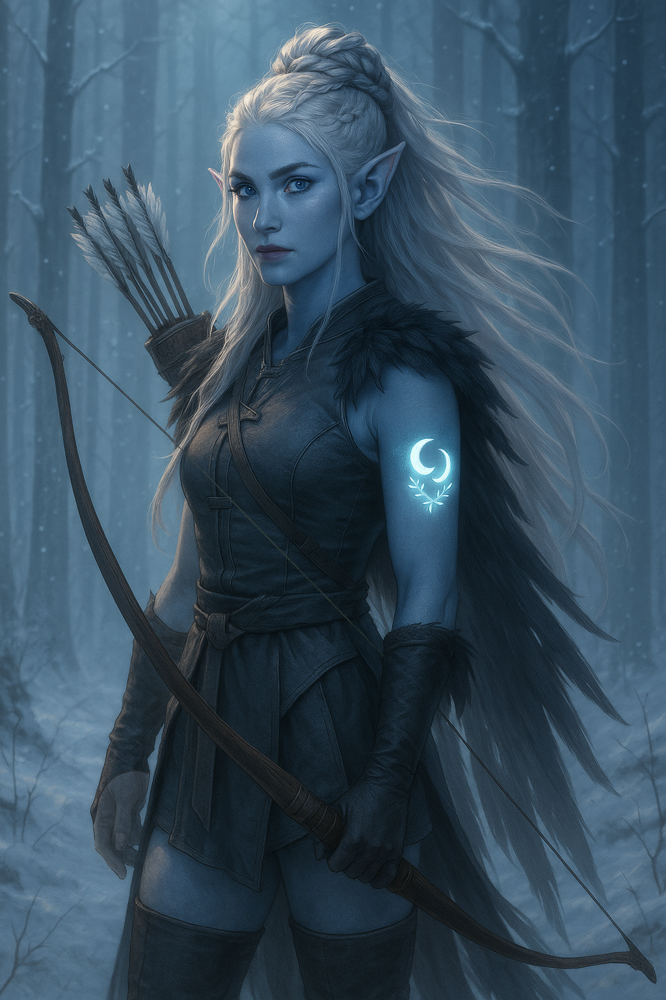

# Eirwen

| 

| Português | English |
|-----------|---------|
| **Jogadora:** Aylin Mendes | **Player:** Aylin Mendes |
| **Espécie:** Eladrin (Inverno) | **Species:** Eladrin (Winter) |
| **Classe:** Ranger | **Class:** Ranger |
| **Origem:** desconhecido | **Background:** unknown |
| **Nível:** 4 | **Level:** 4 |
| **Ficha D&D Beyond:** [Link](https://www.dndbeyond.com/characters/147371208) | **D&D Beyond Sheet:** [Link](https://www.dndbeyond.com/characters/147371208) |
| **Sessões jogadas:** 4 | **Sessions played:** 4 |
| **Sessões DM:** 1 | **DM Sessions:** 1 |
| **Contacto:** +351 961 762 194 | **Contact:** +351 961 762 194 |

| Português | English |
|-----------|---------|
| **Resumo rápido:** Nascida numa clareira eterna de Inverno e filha do paladino Egalar, Eirwen foi marcada por um ritual fey que a enviou para o mundo mortal. Procura compreender a missão que lhe foi imposta. | **Quick synopsis:** Born in an eternal Winter glade and daughter of paladin Egalar, Eirwen was marked by a fey ritual that sent her to the mortal world. She seeks to understand the mission imposed upon her. |
| **História cuidadosamente fabricada (o que Eirwen conta aos outros):** Criada longe das intrigas da Corte das Estrelas, foi treinada pela própria natureza, guiada por instintos e por uma ligação profunda ao frio. Viaja como batedora e guardiã, sem revelar totalmente a marca que carrega. | **Carefully Crafted Story (what Eirwen tells others):** Raised far from the intrigues of the Court of Stars, trained by nature itself, guided by instincts and a deep bond with the cold. Travels as a scout and protector, never fully revealing the mark she bears. |
| **Verdadeira história  Origens:** Protegida pelo pai de um destino político, foi reclamada pela Corte das Estrelas num ritual inevitável. Recebeu no ombro a marca de duas luas entrelaçadas por frostvine, âncora mágica que despertou nela dons de arqueirismo e magia gelada. Desde então, fragmentos de memórias surgem  encontros com Titânia, um eladrin de armadura óssea e o bastão sagrado de Grix  revelando um passado mais profundo que a sua missão atual. | **True Backstory  Origins:** Shielded by her father from a political fate, she was claimed by the Court of Stars in an unavoidable ritual. Received on her shoulder the mark of two moons entwined with frostvine, a magical anchor that awakened archery skill and cold magic within her. Since then, memory fragments emerge  meetings with Titania, an eladrin in bone-decorated armor, and Grixs sacred staff  revealing a past deeper than her current mission. |
| **Eventos-chave:** Marca de duas luas e frostvine dada pela Corte das Estrelas; memórias recuperadas envolvendo Titânia, o eladrin de armadura óssea e o bastão de Grix; ligação com um corno de unicórnio que lhe trouxe recordações de infância. | **Key events:** Mark of two moons and frostvine given by the Court of Stars; recovered memories involving Titania, the eladrin in bone-decorated armor, and Grixs staff; connection to a unicorn horn that brought back childhood memories. |

