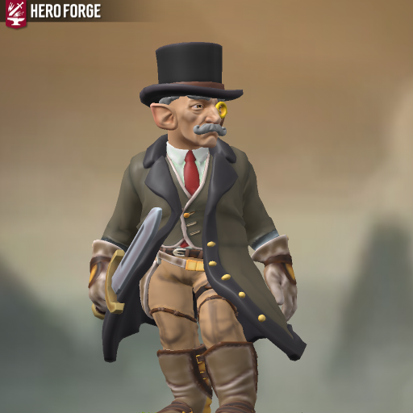

# Frederick "Freddy" Junsi

| Português | English |
|-----------|---------|
| **Jogador:** Alexandre Júlio | **Player:** Alexandre Júlio |
| **Espécie:** Halfling | **Species:** Halfling |
| **Classe:** Ladino | **Class:** Rogue |
| **Origem:** Criminoso | **Background:** Criminal |
| **Alinhamento:** Neutro | **Alignment:** Neutral |
| **Género:** Masculino (ele/dele) | **Gender:** Male (he/him) |
| **Olhos:** Castanhos | **Eyes:** Brown |
| **Cabelo:** Cinzento | **Hair:** Grey |
| **Pele:** Caucasiana | **Skin:** Caucasian |
| **Tamanho:** Pequeno (1,05m) | **Size:** Small (3 ft 5 in) |
| **Idade:** 272 | **Age:** 272 |
| **Ficha D&D Beyond:** [Link](https://www.dndbeyond.com/characters/140697485) | **D&D Beyond Sheet:** [Link](https://www.dndbeyond.com/characters/140697485) |
| **Sessões jogadas:** 4 | **Sessions played:** 4 |
| **Sessões DM:** 3 | **DM Sessions:** 3 |
| **Contacto:** +351 910 367 002 | **Contact:** +351 910 367 002 |

| Português | English |
|-----------|---------|
| **Descrição:** Ladino astuto, mestre em infiltração e desarme de armadilhas, participou no resgate de Abigail em Pessegueiro. | **Description:** Clever rogue, master of infiltration and trap disarming, took part in Abigails rescue in Pessegueiro. |
| **Backstory:** Friedrick era apicultor nas Montanhas Seawall, em Zilargo (Eberron), até ser amaldiçoado pelos rivais da Sociedade da Compota. A maldição prolongou a sua vida para cerca de 500 anos e fez com que envelhecesse lentamente, mas levou-o a perder tudo  família, reputação e o seu famoso mel. Com o negócio destruído e apenas dois netos que não vê há anos, jurou vingança e entrou no submundo do crime. Apesar do caminho sombrio, mantém o amor pela apicultura. | **Backstory:** Friedrick was a beekeeper in the Seawall Mountains of Zilargo (Eberron) until he was cursed by rivals from the Compote Society. The curse extended his lifespan to about 500 years and slowed his aging, but cost him everything  family, reputation, and his famous honey. With his business ruined and only two grandchildren he hasnt seen in years, he swore vengeance and entered the criminal underworld. Despite the dark path, he never lost his love for beekeeping. |

