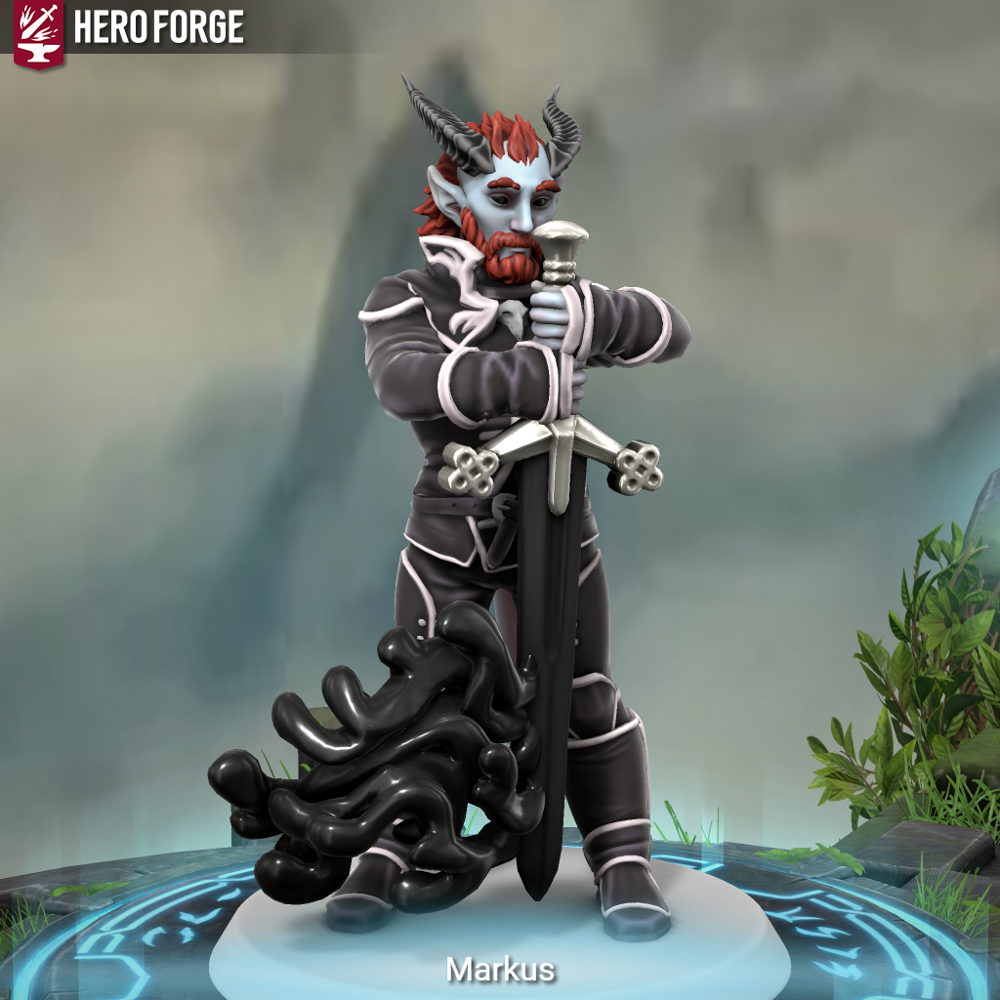
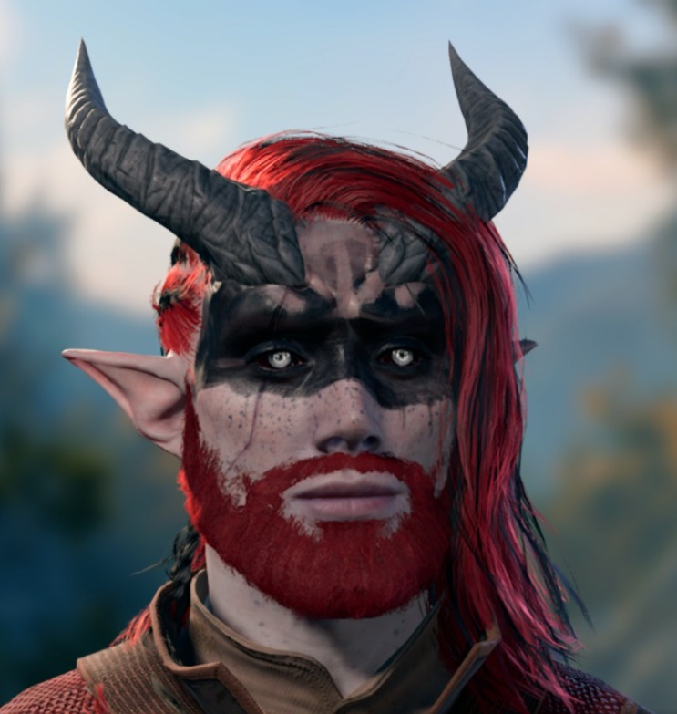

# Markus Grimm

| Português | English |
|-----------|---------|
| **Jogador:** Daniel França | **Player:** Daniel França |
| **Espécie:** Tiefling | **Species:** Tiefling |
| **Classe:** Warlock | **Class:** Warlock |
| **Ficha D&D Beyond:** [Link](https://www.dndbeyond.com/characters/138364785) | **D&D Beyond Sheet:** [Link](https://www.dndbeyond.com/characters/138364785) |
| **Sessões jogadas:** 7 | **Sessions played:** 7 |
| **Sessões DM:** 3 | **DM Sessions:** 3 |
| **Contacto:** +351 937 844 002 | **Contact:** +351 937 844 002 |

| Português | English |
|-----------|---------|
| **Resumo rápido:** Guerreiro e artista renascido por intervenção divina, determinado a recuperar a adaga de Wee Jas e vingar os inocentes sacrificados no ritual de Nerull. | **Quick synopsis:** Warrior and performer reborn by divine intervention, determined to reclaim Wee Jass dagger and avenge the innocents sacrificed in the Nerull ritual. |
| **História cuidadosamente fabricada (o que Markus Grimm conta aos outros):** Artista errante com um passado nebuloso, viajando para entreter e ajudar, enquanto procura compreender a estranha ligação que sente com uma deusa. | **Carefully Crafted Story (what Markus Grimm tells others):** Wandering performer with a hazy past, traveling to entertain and help others while seeking to understand the strange bond he feels with a goddess. |
| **Verdadeira história  Origens:** Ligado à música e às artes desde jovem, Markus juntou-se a uma trupe e atuou por sete anos. Num baile oferecido pelo nobre Asdrobal Blackfair, este iniciou um ritual macabro para Nerull usando a adaga mágica de Wee Jas que havia roubado, sacrificando todos os presentes. Ofendida, Wee Jas devolveu Markus à vida para recuperar a relíquia e vingar os mortos. Despertou numa taberna com memórias fragmentadas e uma ligação intensa à deusa, que agora molda o seu destino. | **True Backstory  Origins:** Connected to music and the arts from a young age, Markus joined a troupe and performed for seven years. At a masquerade hosted by noble Asdrobal Blackfair, he began a macabre ritual to Nerull using the stolen magic dagger of Wee Jas, sacrificing everyone present. Offended, Wee Jas restored Markus to life to reclaim the relic and avenge the slain. He awoke in a tavern with fractured memories and a deep connection to the goddess, which now shapes his destiny. |

