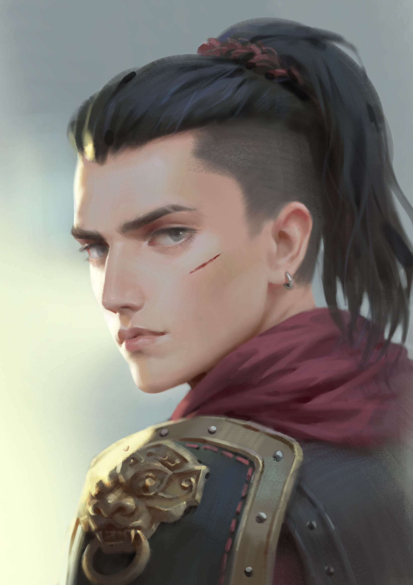

# Raylahn

| Português | English |
|-----------|---------|
| **Jogador:** Fábio Oliveira | **Player:** Fábio Oliveira |
| **Espécie:** Humano | **Species:** Human |
| **Classe:** Guerreiro | **Class:** Fighter |
| **Antecedente:** Soldado | **Background:** Soldier |
| **Alinhamento:** Leal e Neutro | **Alignment:** Lawful Neutral |
| **Nível:** 6 | **Level:** 6 |
| **Ficha D&D Beyond:** [Link](https://www.dndbeyond.com/characters/107560343) | **D&D Beyond Sheet:** [Link](https://www.dndbeyond.com/characters/107560343) |
| **Sessões jogadas:** 5 | **Sessions played:** 5 |
| **Sessões DM:** desconhecido | **DM Sessions:** unknown |
| **Contacto:** +351 913 410 619 | **Contact:** +351 913 410 619 |
| **Idade:** 25 anos | **Age:** 25 years |
| **Altura:** 1,70 m | **Height:** 1.70 m |
| **Género:** Masculino (ele/dele) | **Gender:** Male (he/him) |

| Português                                                                                                                                                                                                                                                                                                                                                                                                                                                                                                                                                                                                                                     | English                                                                                                                                                                                                                                                                                                                                                                                                                                                                                                                                                                         |
| --------------------------------------------------------------------------------------------------------------------------------------------------------------------------------------------------------------------------------------------------------------------------------------------------------------------------------------------------------------------------------------------------------------------------------------------------------------------------------------------------------------------------------------------------------------------------------------------------------------------------------------------- | ------------------------------------------------------------------------------------------------------------------------------------------------------------------------------------------------------------------------------------------------------------------------------------------------------------------------------------------------------------------------------------------------------------------------------------------------------------------------------------------------------------------------------------------------------------------------------- |
| **Resumo rápido:** Guerreiro humano forjado numa sociedade matriarcal opressiva, que viveu disfarçado como mulher até à adolescência. Fugiu para escapar ao exílio e combina agora habilidades marciais e arcanas como mercenário.                                                                                                                                                                                                                                                                                                                                                                                                            | **Quick synopsis:** Human fighter forged in an oppressive matriarchal society, who lived disguised as a woman until adolescence. Fled to escape exile and now blends martial and arcane skills as a mercenary.                                                                                                                                                                                                                                                                                                                                                                  |
| **História cuidadosamente fabricada (o que Raylahn conta aos outros):** Guerreiro errante com treino militar, viajando para ganhar a vida e esquecer um passado que prefere manter oculto.                                                                                                                                                                                                                                                                                                                                                                                                                                                    | **Carefully Crafted Story (what Raylahn tells others):** Wandering warrior with military training, traveling to make a living and forget a past he prefers to keep hidden.                                                                                                                                                                                                                                                                                                                                                                                                      |
| **Verdadeira história  Origens:** Filho de Oceera, uma guerreira de elite Zaraleth, Raylahn nasceu homem  algo proibido na sociedade matriarcal de Thalos, que exila todos os rapazes. Para o proteger, a mãe lançou um ritual de maldição que o fez parecer mulher até aos 16 anos, permitindo-lhe treinar como guerreira. Fascinado pela magia gnómica, aprendeu artes arcanas em segredo. Ao atingir a idade adulta, a maldição dissipou-se e a verdade veio à tona. Fugiu para evitar o exílio e possível escravidão, tornando-se mercenário e dividindo-se entre esquecer o passado ou expor e destruir a ordem que tentou eliminá-lo. | **True Backstory  Origins:** Born to Oceera, an elite Zaraleth warrior, Raylahn was male  forbidden in the matriarchal society of Thalos, which exiles all boys. To protect him, his mother cast a curse making him appear female until age 16, allowing him to train as a warrior. Fascinated by gnomish magic, he secretly learned arcane arts. Upon adulthood, the curse faded and the truth emerged. He fled to avoid exile and possible slavery, becoming a mercenary torn between forgetting the past or exposing and dismantling the order that sought to destroy him. |
| **Descrição:** Caçador com ligação especial à natureza e animais, presença constante em todas as grandes aventuras do grupo. Destacou-se como rastreador na missão **A Criança Perdida**, localizando pistas de [Aria Greenbottle](aria_greenbottle.md) nas [Ruínas das Sombras](ruinas_das_sombras.md). Relevante também nos resgates de Dustin, explorações em Greyhawk, e confrontos com cultos e monstros.                                                                                                                                                                                                                                | **Description:** Hunter with a special bond to nature and animals, a constant presence in all major party quests. Excelled as the tracker in **A Criança Perdida**, finding clues to [Aria Greenbottle](aria_greenbottle.md) in the [Ruins of Shadows](ruinas_das_sombras.md). Also vital in Dustins rescues, explorations in Greyhawk, and battles against cults and monsters.                                                                                                                                                                                                 |

