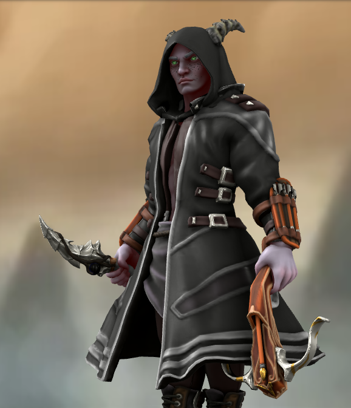
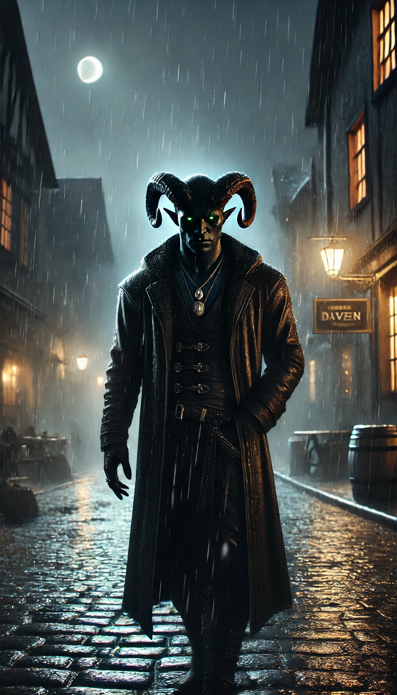

## Zeldris (anteriormente Varus)

| Português                                                                    | English                                                            |
| ---------------------------------------------------------------------------- | ------------------------------------------------------------------ |
| **Jogador:** Ricardo Oliveira Ribeiro                                        | **Player:** Ricardo Oliveira Ribeiro                               |
| **Ficha D&D Beyond:** [Link](https://www.dndbeyond.com/characters/143891578) | [D&D Beyond Sheet](https://www.dndbeyond.com/characters/143891578) |
| **Sessões jogadas:** 7                                                       | **Sessions played:** 7                                             |
| **Sessões DM:** 1                                                            | **DM Sessions:** 1                                                 |
| **Contacto:** +351 925 717 520                                               | **Contact:** +351 925 717 520                                      |

| Português | English |
|-----------|---------|
| **Nome:** Zeldris (anteriormente Varus) | **Name:** Zeldris (formerly Varus) |
| **Raça / Classe:** Não especificado (corpo alterado com traços demoníacos e aquáticos) | **Race / Class:** Not specified (body altered with demonic and aquatic traits) |
| **Alinhamento:** Ético próprio, focado no equilíbrio entre bem e mal | **Alignment:** Self-imposed ethics, focused on balancing good and evil |
| **Origem:** Vila remota cercada por floresta densa | **Origin:** Remote village surrounded by dense forest |
| **Aparência:** Armadura que oculta corpo deformado, pele rija como escamas, guelras no pescoço, quilhas orgânicas nos braços | **Appearance:** Armor concealing deformed body, tough scale-like skin, gills on neck, organic fins on arms |
| **Personalidade:** Protege os colegas a todo o custo, procura equilíbrio, busca imortalidade, tendência para o esquecimento pela bebida | **Personality:** Protects comrades at all costs, seeks balance, pursues immortality, tendency to drink to forget |
| **Traços Notáveis:** Conflito interno entre sede de vingança e incapacidade de ferir mind flayers | **Notable Traits:** Inner conflict between thirst for vengeance and inability to harm mind flayers |
| **Vínculos:** A taverna é a sua casa, sem mais ninguém a quem se voltar | **Bonds:** The tavern is his home, with no one else to turn to |
| **Defeitos:** Busca constante de defesa e sobrevivência acima de riqueza | **Flaws:** Constantly seeks defense and survival over wealth |
| **História (Zeldris):** Após a sua morte como Varus, renasceu num corpo alterado, perdeu fé em deuses e passou a viver pelo seu próprio julgamento. Conheceu um demónio e fez um acordo para saber a verdade, recuperando memórias da esposa e filha assassinadas. A transformação física tornou-o mais lento de raciocínio. | **Story (Zeldris):** After his death as Varus, he was reborn in an altered body, lost faith in gods, and began living by his own judgment. Met a demon and made a pact to learn the truth, regaining memories of his murdered wife and daughter. His physical transformation made him slower in thought. |
| **História (Varus):** Nascido numa família modesta, era artesão. Casado e com três filhos, recorreu a pequenos furtos para alimentar a família num inverno severo. Um grupo de homens atacou a sua casa, matando esposa e duas filhas. Matou acidentalmente o filho sobrevivente, pensando ser um inimigo. A tragédia transformou-o num assassino errante em busca de vingança contra a milícia responsável. | **Story (Varus):** Born into a modest family, he was a craftsman. Married with three children, he resorted to petty theft to feed them during a harsh winter. A group of men attacked his home, killing his wife and two daughters. He accidentally killed his surviving son, mistaking him for an enemy. The tragedy turned him into a wandering assassin seeking revenge against the militia responsible. |
| **Link HeroForge:** [Visualização 3D](https://www.heroforge.com/load_config%3D524043482/index.md) | **HeroForge Link:** [3D View](https://www.heroforge.com/load_config%3D524043482/index.md) |

| Português                                                                                                                                                                                                                                                           | English                                                                                                                                                                                                                                                          |
| ------------------------------------------------------------------------------------------------------------------------------------------------------------------------------------------------------------------------------------------------------------------- | ---------------------------------------------------------------------------------------------------------------------------------------------------------------------------------------------------------------------------------------------------------------- |
| Depois de uma morte trágica e um novo corpo, Zeldris perdeu a fé e busca agora o equilíbrio entre o bem e o mal. Leal à Taberna, tem um conflito profundo: uma ordem embutida de não magoar mind flayers e uma sede de vingança contra quem destruiu a sua família. | After a tragic death and a new body, Zeldris lost his faith and now seeks balance between good and evil. Loyal to the Tavern, he’s torn: bound by an order never to harm mind flayers, and by a burning need for revenge against those who destroyed his family. |
| **Descrição:** Antigo aventureiro ressuscitado, agora com o alter ego Zeldris, envolvido em magias Illithid e mistérios espaciais.                                                                                                                                  | **Description:** Former adventurer resurrected, now with the alter ego Zeldris, involved in Illithid magics and space mysteries.                                                                                                                                 |

[[Personagens Jogadoras]]

