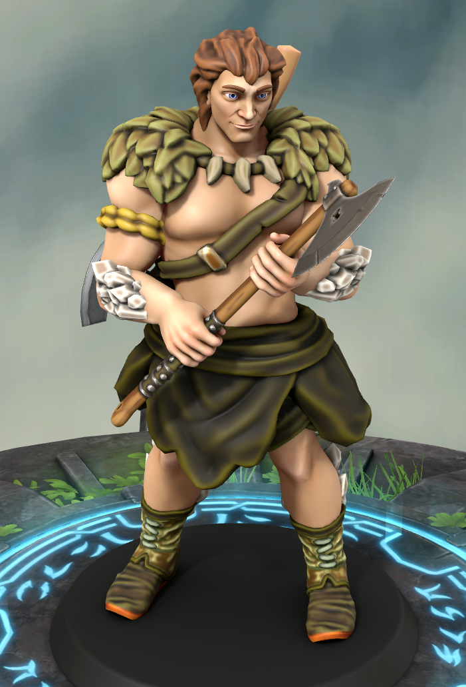

# Conan, o Bárbaro-Rã

| 

| Português | English |
|-----------|---------|
| **Jogador:** Luis Parente | **Player:** Luis Parente |
| **Espécie:** Goliath | **Species:** Goliath |
| **Classe:** Bárbaro | **Class:** Barbarian |
| **Antecedente:** Soldado | **Background:** Soldier |
| **Alinhamento:** Neutro Bom | **Alignment:** Neutral Good |
| **Género:** Masculino | **Gender:** Male |
| **Tamanho:** Médio | **Size:** Medium |
| **Idade:** 30 | **Age:** 30 |
| **Nível:** 8 | **Level:** 8 |
| **Ficha D&D Beyond:** desconhecido | **D&D Beyond Sheet:** unknown |
| **Sessões jogadas:** 5 | **Sessions played:** 5 |
| **Sessões DM:** desconhecido | **DM Sessions:** unknown |
| **Contacto:** +351 935 415 105 | **Contact:** +351 935 415 105 |

| Português | English |
|-----------|---------|
| **Resumo rápido:** Guerreiro goliath criado por uma tribo de sapos numa floresta mágica, parte para salvar o pai adotivo e enfrentar a corrupção do Culto do Mal Elemental. | **Quick synopsis:** Goliath warrior raised by a frog tribe in a magical forest, sets out to save his adoptive father and confront the corruption of the Cult of Elemental Evil. |
| **História cuidadosamente fabricada (o que Conan conta aos outros):** Fala com orgulho da tribo de sapos que o criou e do machado feito do coração da árvore mais antiga da floresta, mas raramente revela os detalhes dolorosos sobre a perda da tribo natal e a traição de quem amou. | **Carefully Crafted Story (what Conan tells others):** Speaks proudly of the frog tribe who raised him and the greataxe made from the heart of the forest’s oldest tree, but rarely shares the painful details of losing his birth tribe and being betrayed by someone he once loved. |
| **Verdadeira história — Origens:** Nascido numa tribo bárbara em harmonia com um pântano, foi levado por uma tempestade causada pelo culto e criado por sapos sábios. Ao saber do ataque e do rapto do pai adotivo — e da traição da antiga amiga e primeiro amor — partiu armado com o machado sagrado e um amuleto de vinha e âmbar para enfrentar o culto, libertar o pai e descobrir as suas origens. | **True Backstory — Origins:** Born to a barbarian tribe living in harmony with a swamp, he was swept away by a cult-made storm and raised by wise frogs. Upon learning of the attack and his adoptive father’s abduction — and the betrayal by his childhood friend and first love — he set out armed with the sacred greataxe and a vine-and-amber amulet to face the cult, free his father, and uncover his origins. |

