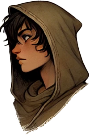
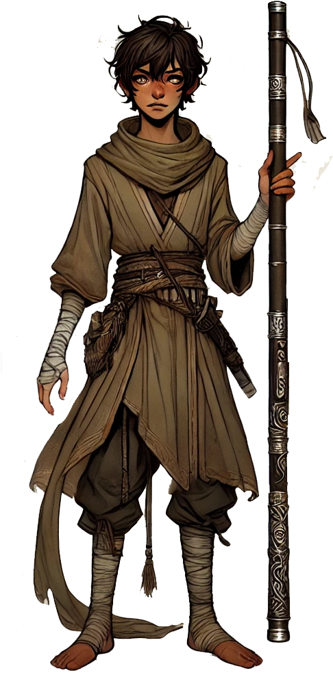
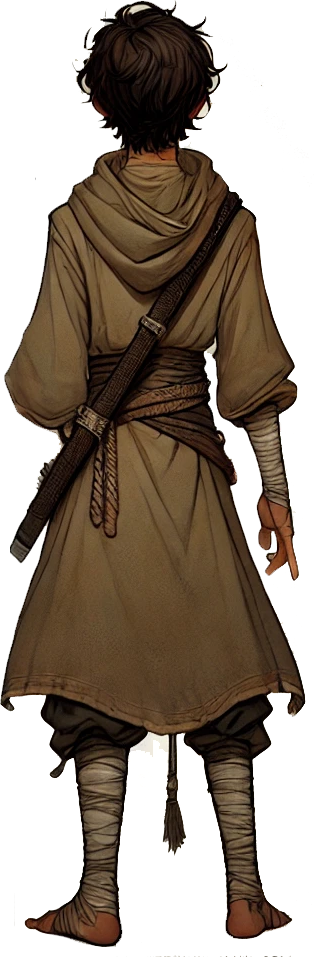

# Kai

| 

| Português | English |
|-----------|---------|
| **Jogador:** Carlos | **Player:** Carlos |
| **Espécie:** Humano | **Species:** Human |
| **Classe:** Monge / Ladino | **Class:** Monk / Rogue |
| **Ficha D&D Beyond:** [Link](https://www.dndbeyond.com/characters/138666572) | **D&D Beyond Sheet:** [Link](https://www.dndbeyond.com/characters/138666572) |
| **Sessões jogadas:** 9 | **Sessions played:** 9 |
| **Sessões DM:** 2 | **DM Sessions:** 2 |
| **Contacto:** +351 934 669 172 | **Contact:** +351 934 669 172 |

 

| Português | English |
|-----------|---------|
| **Resumo rápido:** Kai (nascido Kaelin) é um sobrevivente de Dorakaa (Iuz) que vive entre duas vidas: a história pública de um órfão ligado à nobreza e a verdade sombria de um ex-ladrão que tomou o lugar de um rapaz morto. Mistura disciplina monástica com astúcia de ladino, fugindo de um gangue vingativo e de intrigas nobres. | **Quick synopsis:** Kai (born Kaelin) is a survivor from Dorakaa (Iuz) living between two lives: the public story of an orphan with noble ties and the darker truth of a former thief who took a dead boy’s place. Blends monastic discipline with rogue cunning while dodging a vengeful gang and noble intrigue. |
| **História cuidadosamente fabricada (o que Kai conta aos outros):** Sou de Dorakaa, no reino de Iuz. Passei a vida em movimento, os meus pais sempre a fugir. Acabei num mosteiro — paz, disciplina, propósito. Há rumores sobre o meu nome e herança; sim, existe uma ligação a uma família nobre, mas isso traz expectativas e inimigos. Não quero títulos nem riqueza, só seguir em frente e manter o passado no sítio. | **Carefully Crafted Story (what Kai tells others):** I’m from Dorakaa, in the kingdom of Iuz. I’ve spent my life moving, my parents always running. I ended up at a monastery — peace, discipline, purpose. There are rumors about my name and heritage; yes, there’s a noble connection, but it brings expectations and enemies. I don’t want titles or wealth, just to keep moving and keep my past contained. |
| **Verdadeira história — Origens:** Kai, de nome de nascença *Kaelin*, cresceu nas ruas de Dorakaa integrado num gangue de ladrões. O desconforto com a violência crescente culminou num assalto a uma caravana que degenerou em massacre. Durante o ataque, foi atingido e perdeu os sentidos, acordando junto ao corpo de um rapaz bem vestido. Num impulso, trocou de roupa com ele, guardou um **anel de madeira com brasão** e uma **sacola** com uma carta destinada a um mosteiro. Foi acolhido como herdeiro órfão e passou a viver sob essa identidade. | **True Backstory — Origins:** Kai, birth name *Kaelin*, grew up on the streets of Dorakaa as part of a thieves’ gang. Unease with the group’s growing brutality peaked during a caravan raid that turned into a massacre. During the attack, he was struck and lost consciousness, waking beside a well-dressed boy’s corpse. In a moment of survival instinct, he swapped clothes, pocketed a **wooden ring with a crest**, and took a **satchel** containing a letter bound for a monastery. Welcomed as the orphaned heir, he began living under this new identity. |
| **O Caos do Resgate:** Resgatado por um grupo que dispersou os assaltantes, Kai fingiu ser o sobrevivente legítimo. | **The Chaos of the Rescue:** Rescued by a group that scattered the attackers, Kai pretended to be the rightful survivor. |
| **Identidade Assumida:** A carta mencionava treino e proteção pagos por uma casa nobre decadente. No mosteiro, Kai consolidou a sua nova identidade e manteve o **anel** escondido. | **Assumed Identity:** The letter mentioned training and protection funded by a faded noble house. At the monastery, Kai solidified his new identity and kept the **ring** hidden. |
| **O Segredo Nobre:** O rapaz era filho ilegítimo de uma família outrora poderosa. O seu desaparecimento gerou rumores e atraiu espiões e caçadores de recompensas. | **The Noble Secret:** The boy was the illegitimate son of a once-powerful family. His disappearance sparked rumors and drew spies and bounty hunters. |
| **O Peso das Escolhas:** Caçado pelo antigo gangue e por interesses políticos, Kai mistura técnicas monásticas com instintos de ladino. O **anel de madeira** é um lembrete constante da vida que tomou. | **The Weight of Their Choices:** Hunted by his former gang and political interests, Kai blends monastic technique with rogue instincts. The **wooden ring** is a constant reminder of the life he took. |
| **Caminho em Frente:** Vive num equilíbrio frágil entre o passado criminoso e o papel nobre, procurando redenção enquanto navega por teias de poder e intriga. | **Journey Forward:** Lives in a fragile balance between his criminal past and noble role, seeking redemption while navigating webs of power and intrigue. |

