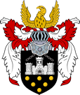

# Free City of Greyhawk | Cidade Livre de Greyhawk  
*"A Jóia da Flanaess" | "The Gem of the Flanaess"*

---

| **Português (PT-PT)** | **English (EN-US)** |
|---|---|
| **📠Localização:**  - Região: Flanaess Central, Domínio de Greyhawk  - Referência no mapa: Perto da costa norte da Baía de Woolly  - Posição: Sul do Nyr Dyv, nas margens do Rio Selintan | **📠Location:**  - Region: Central Flanaess, Domain of Greyhawk  - Map Reference: Near the north shore of Woolly Bay  - Position: South of the Nyr Dyv, on the banks of the Selintan River |
| **📠Descrição:**  - Cidade-estado vasta e cosmopolita  - Centro de comércio, magia e aventuras  - Originalmente posto militar do Grande Reino  - Famosa por masmorras profundas, guildas poderosas, intrigas e aventureiros lendários | **📠Description:**  - Vast and cosmopolitan city-state  - Hub of trade, magic, and adventuring  - Originally a military outpost of the Great Kingdom  - Famous for deep dungeons, powerful guilds, intrigue, and legendary adventurers |
| **🌦 Clima:**  - Tipo: Continental temperado  - Invernos frios (neve ligeira)  - Verões quentes e húmidos  - Tempestades na primavera e outono  - Ventos de oeste moderados pelo Nyr Dyv | **🌦 Climate:**  - Type: Temperate continental  - Cold winters (light snow)  - Hot, humid summers  - Spring and autumn storms  - Westerly winds moderated by the Nyr Dyv |
| **👥 População:**  - ~75.000 (cidade), até 150.000 com subúrbios e afluxo sazonal  - 68% Humanos (Oeridianos, Suel, Flan)  - 10% Halflings (Lightfoot)  - 8% Elfos (Altos e Cinzentos)  - 6% Anões (Colinas)  - 3% Gnomos (Floresta e Rocha)  - 2% Meio-Orcs  - 3% Outros | **👥 Population:**  - ~75,000 (city), up to 150,000 with suburbs & seasonal influx  - 68% Human (Oeridian, Suel, Flan)  - 10% Halfling (Lightfoot)  - 8% Elf (High & Grey)  - 6% Dwarf (Hill)  - 3% Gnome (Forest & Rock)  - 2% Half-Orc  - 3% Other |
| **🛠Estrutura Social:**  - **Alta:** Nobres, mercadores ricos, arcanos poderosos, mestres de guilda, altos sacerdotes  - **Média:** Artesãos, aventureiros, diplomatas, mercenários reformados  - **Baixa:** Trabalhadores, estivadores, aventureiros sem licença, imigrantes  - **Marginalizados:** Contrabandistas, ladrões, cultistas, escravos fugitivos | **🛠Social Structure:**  - **Upper:** Nobles, wealthy merchants, archmages, guildmasters, high priests  - **Middle:** Artisans, adventurers, diplomats, retired mercenaries  - **Lower:** Laborers, dockworkers, unlicensed adventurers, immigrants  - **Underclass:** Smugglers, thieves, cultists, escaped slaves |
| **⚖ Governo:**  - Sistema: Oligarquia plutocrática  - Oligarquia Diretiva (12 assentos incluindo Lorde-Prefeito)  - Guarda da Cidade, Vigias Noturnos, Black Watch  - Leis liberais mas rigorosas contra homicídio, magia ilegal e escravatura | **⚖ Government:**  - System: Plutocratic oligarchy  - Directing Oligarchy (12 seats including Lord Mayor)  - City Watch, Nightwatchmen, Black Watch  - Liberal laws but strict on murder, unlicensed magic, and slavery |
| **🙠Locais Notáveis:**  - [Universidade de Artes Mágicas](universidade_arcana.md)  - [Salão das Guildas de Magos](guildhall_of_wizardry.md)  - [Grande Biblioteca](great_library.md)  - [Distrito do Bazar](bazaar_district.md)  - [Cidadela Antiga](old_citadel.md)  - [Rua dos Templos](temple_row.md)  - [Bairro de Lata](slum_quarter.md) e [Os Becos](the_narrows.md)  - [Ruínas do Castelo de Greyhawk](castle_greyhawk_ruins.md) | **🙠Notable Locations:**  - [University of Magical Arts](universidade_arcana.md)  - [Guildhall of Wizardry](guildhall_of_wizardry.md)  - [Great Library](great_library.md)  - [Bazaar District](bazaar_district.md)  - [Old Citadel](old_citadel.md)  - [Temple Row](temple_row.md)  - [Slum Quarter](slum_quarter.md) & [The Narrows](the_narrows.md)  - [Castle Greyhawk Ruins](castle_greyhawk_ruins.md) |
| **🕵 Fações & Poderes:**  - Círculo dos Oito  - Guilda dos Ladrões  - Guilda dos Assassinos  - Consórcio dos Mercadores  - Templos (Boccob, St. Cuthbert, Zilchus, Rao)  - Espiões estrangeiros | **🕵 Factions & Power Groups:**  - Circle of Eight  - Guild of Thieves  - Assassins Guild  - Merchants Consortium  - Temples (Boccob, St. Cuthbert, Zilchus, Rao)  - Foreign spies |
| **🗠Ganchos & Rumores:**  - Novo nível do Castelo descoberto  - Nobre procura herança perdida na Cidade Subterrânea  - Licenças de guilda falsificadas  - Culto Flan nos esgotos da Rua dos Templos | **🗠Hooks & Rumors:**  - Newly uncovered Castle level  - Noble seeks lost heirloom in the Undercity  - Forged Guild Licenses  - Flan cult in sewers beneath Temple Row |
| **🗺 Distritos:**  - [Bairro dos Artesãos](artisans_quarter.md)  - [Mercado da Cidade](city_market.md)  - [Clerksburg](clerksburg.md)  - [Bairro Estrangeiro](foreign_quarter.md)  - [Bairro dos Jardins](docs/locations/cities/free_city_of_greyhawk/garden_quarter/garden_quarter.md)  - [Bairro Alto](high_quarter.md)  - [Bairro do Rio](river_quarter.md)  - [Bairro de Lata](slum_quarter.md)  - [Bairro dos Ladrões](thieves_quarter.md)  - [Bairro Universitário](university_quarter.md) | **🗺 Districts:**  - [Artisan Quarter](artisans_quarter.md)  - [City Market](city_market.md)  - [Clerksburg](clerksburg.md)  - [Foreign Quarter](foreign_quarter.md)  - [Garden Quarter](docs/locations/cities/free_city_of_greyhawk/garden_quarter/garden_quarter.md)  - [High Quarter](high_quarter.md)  - [River Quarter](river_quarter.md)  - [Slum Quarter](slum_quarter.md)  - [Thieves' Quarter](thieves_quarter.md)  - [University Quarter](university_quarter.md) |
| **🚠Ruínas & Arredores:**  - [Cidadela Antiga](old_citadel.md)  - [Ruínas do Castelo de Greyhawk](castle_greyhawk_ruins.md) | **🚠Ruins & Outskirts:**  - [Old Citadel](old_citadel.md)  - [Castle Greyhawk Ruins](castle_greyhawk_ruins.md) |
| **💠 Coração da Campanha:**  - Coração pulsante da *West Marches*  - Localização estratégica entre colinas, rio e rotas comerciais  - Cidade de contrastes: conhecimento e crime, glória e perigo lado a lado | **💠 Campaign Heart:**  - Beating heart of the *West Marches*  - Strategic location between hills, river, and trade routes  - City of contrasts: knowledge and crime, glory and danger side by side |
| **🗠Mapa & Estrutura:**  - [High Quarter](high_quarter.md): Bairro nobre, sede do governo e famílias poderosas  - [Garden Quarter](docs/locations/cities/free_city_of_greyhawk/garden_quarter/garden_quarter.md): Residencial, embaixadas, jardins e palacetes  - [University Quarter](university_quarter.md): Conhecimento, magia e a [Grande Biblioteca](great_library.md)  - [River Quarter](river_quarter.md): Portos, tavernas, mercados e crime organizado  - [Thieves Quarter](thieves_quarter.md): Becos, antros e rumores sombrios  - [Artisans Quarter](artisans_quarter.md): Oficinas, ferreiros, alfaiates e comércio especializado  - [Foreign Quarter](foreign_quarter.md): Estrangeiros vivem, negociam e espiam  - [City Market](city_market.md): Centro económico, gritos, ouro e truques  - [Slum Quarter](slum_quarter.md): Zonas esquecidas e perigosas | **🗠Map & Structure:**  - [High Quarter](high_quarter.md): Noble district, seat of government and powerful families  - [Garden Quarter](docs/locations/cities/free_city_of_greyhawk/garden_quarter/garden_quarter.md): Residential, embassies, gardens, and mansions  - [University Quarter](university_quarter.md): Knowledge, magic, and the [Great Library](great_library.md)  - [River Quarter](river_quarter.md): Ports, taverns, markets, and organized crime  - [Thieves Quarter](thieves_quarter.md): Alleys, dens, and dark rumors  - [Artisans Quarter](artisans_quarter.md): Workshops, smiths, tailors, and specialized trade  - [Foreign Quarter](foreign_quarter.md): Foreigners live, trade, and spy  - [City Market](city_market.md): Economic hub, shouting, gold, and tricks  - [Slum Quarter](slum_quarter.md): Forgotten and dangerous zones |
| **🢠Instituições de Poder:**  - [Guildas de Greyhawk](guildas_de_greyhawk.md)  - [Templo de Oghma](temple_of_oghma.md)  - [Universidade Arcana](universidade_arcana.md)  - [Guarda da Cidade](guarda_da_Cidade.md) | **🢠Power Institutions:**  - [Greyhawk Guilds](guildas_de_greyhawk.md)  - [Temple of Oghma](temple_of_oghma.md)  - [Arcane University](universidade_arcana.md)  - [City Guard](guarda_da_Cidade.md) |
| **👤 Figuras Importantes:**  - [Lord Aleister Devraine](lord_aleister_devraine.md)  - [Sister Blathine](sister_blathine.md)  - [Mistress Lyra Quil](mistress_lyra_quil.md)  - [O Taberneiro](docs/npc/-/o_taberneiro.md) | **👤 Key Figures:**  - [Lord Aleister Devraine](lord_aleister_devraine.md)  - [Sister Blathine](sister_blathine.md)  - [Mistress Lyra Quil](mistress_lyra_quil.md)  - [The Innkeeper](docs/npc/-/o_taberneiro.md) |
| **🚪 Ponto de Partida:**  - Todos os aventureiros começam na [Estalagem da Companhia](estalagem_da_companhia.md)  - Refúgio móvel que aparece em locais diferentes | **🚪 Starting Point:**  - All adventurers start at [The Company’s Inn](estalagem_da_companhia.md)  - Mobile refuge appearing in different locations |
