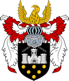

# Free City of Greyhawk | Cidade Livre de Greyhawk

| **Português (PT-PT)**                                                                                                                                                                                                                                                                                                                                                                                                                                                                                                                                                                                                                                                                                                                                                                                                                                                                                                                                                              | **English (EN-US)**                                                                                                                                                                                                                                                                                                                                                                                                                                                                                                                                                                                                                                                                                                                                                                                                                                                                                                             |
| ---------------------------------------------------------------------------------------------------------------------------------------------------------------------------------------------------------------------------------------------------------------------------------------------------------------------------------------------------------------------------------------------------------------------------------------------------------------------------------------------------------------------------------------------------------------------------------------------------------------------------------------------------------------------------------------------------------------------------------------------------------------------------------------------------------------------------------------------------------------------------------------------------------------------------------------------------------------------------------- | ------------------------------------------------------------------------------------------------------------------------------------------------------------------------------------------------------------------------------------------------------------------------------------------------------------------------------------------------------------------------------------------------------------------------------------------------------------------------------------------------------------------------------------------------------------------------------------------------------------------------------------------------------------------------------------------------------------------------------------------------------------------------------------------------------------------------------------------------------------------------------------------------------------------------------- |
| ** Descrição:**  - Coração pulsante da campanha *West Marches*  - Localização estratégica entre colinas, rio e antigas rotas comerciais  - Cidade de contrastes: conhecimento e crime, glória e perigo lado a lado                                                                                                                                                                                                                                                                                                                                                                                                                                                                                                                                                                                                                                                                                                                                                        | ** Description:**  - Beating heart of the *West Marches* campaign  - Strategically located between hills, river, and ancient trade routes  - City of contrasts: knowledge and crime, glory and danger side by side                                                                                                                                                                                                                                                                                                                                                                                                                                                                                                                                                                                                                                                                                                     |
| ** Mapa e Estrutura / Map & Structure:**  - [High Quarter](high_quarter.md): Bairro nobre, sede do governo e famílias poderosas  - [Garden Quarter](garden_quarter.md): Residencial, embaixadas, jardins e palacetes  - [University Quarter](university_quarter.md): Conhecimento, magia e a [Grande Biblioteca](great_library.md)  - [River Quarter](river_quarter.md): Portos, tavernas, mercados e crime organizado  - [Thieves Quarter](thieves_quarter.md): Becos, antros e rumores sombrios  - [Artisans Quarter](artisans_quarter.md): Oficinas, ferreiros, alfaiates e comércio especializado  - [Foreign Quarter](foreign_quarter.md): Estrangeiros vivem, negociam e espiam  - [City Market](city_market.md): Centro económico, gritos, ouro e truques  - [Slum Quarter](slum_quarter.md): Zonas esquecidas, perigosas e por vezes amaldiçoadas  - Ver [Mapa da Cidade de Greyhawk](mapa_cidade_de_greyhawk.md) para localização detalhada | ** Map & Structure:**  - [High Quarter](high_quarter.md): Noble district, seat of government and powerful families  - [Garden Quarter](garden_quarter.md): Residential, embassies, gardens, and mansions  - [University Quarter](university_quarter.md): Knowledge, magic, and the [Great Library](great_library.md)  - [River Quarter](river_quarter.md): Ports, taverns, markets, and organized crime  - [Thieves Quarter](thieves_quarter.md): Alleys, dens, and dark rumors  - [Artisans Quarter](artisans_quarter.md): Workshops, smiths, tailors, and specialized trade  - [Foreign Quarter](foreign_quarter.md): Foreigners live, trade, and spy  - [City Market](city_market.md): Economic hub, shouting, gold, and tricks  - [Slum Quarter](slum_quarter.md): Forgotten, dangerous, sometimes cursed areas  - See [Greyhawk City Map](mapa_cidade_de_greyhawk.md) for detailed locations |
| ** Instituições de Poder / Power Institutions:**  - [Guildas de Greyhawk](guildas_de_greyhawk.md): controlam comércio, espionagem e contratos  - [Templo de Oghma](temple_of_oghma.md): centro espiritual e académico mais antigo  - [Universidade Arcana](universidade_arcana.md): forma magos e eruditos  - [Guarda da Cidade](guarda_da_Cidade.md): mantém a ordem ou finge manter                                                                                                                                                                                                                                                                                                                                                                                                                                                                                                                                                                                  | ** Power Institutions:**  - [Greyhawk Guilds](guildas_de_greyhawk.md): control trade, espionage, and contracts  - [Temple of Oghma](temple_of_oghma.md): oldest spiritual and academic center  - [Arcane University](universidade_arcana.md): trains mages and scholars  - [City Guard](guarda_da_Cidade.md): maintains order or pretends to                                                                                                                                                                                                                                                                                                                                                                                                                                                                                                                                                                        |
| ** Figuras Importantes / Key Figures:**  - [Lord Aleister Devraine](lord_aleister_devraine.md): aristocrata sábio com ligações obscuras  - [Sister Blathine](sister_blathine.md): arquivista do [Templo de Oghma](temple_of_oghma.md)  - [Mistress Lyra Quil](mistress_lyra_quil.md): académica excêntrica da Universidade  - [O Taberneiro](o_taberneiro.md): proprietário da [Estalagem da Companhia](estalagem_da_companhia.md), origem desconhecida                                                                                                                                                                                                                                                                                                                                                                                                                                                                                                                | * Key Figures:**  - [Lord Aleister Devraine](lord_aleister_devraine.md): wise aristocrat with dark ties  - [Sister Blathine](sister_blathine.md): archivist of the [Temple of Oghma](temple_of_oghma.md)  - [Mistress Lyra Quil](mistress_lyra_quil.md): eccentric academic of the University  - [The Innkeeper](o_taberneiro.md): owner of [The Companys Inn](estalagem_da_companhia.md), origins unknown                                                                                                                                                                                                                                                                                                                                                                                                                                                                                                          |
| ** Ponto de Partida / Starting Point:**  - Todos os aventureiros registados começam na [Estalagem da Companhia](estalagem_da_companhia.md)  - Refúgio móvel que aparece em locais diferentes na cidade e estradas                                                                                                                                                                                                                                                                                                                                                                                                                                                                                                                                                                                                                                                                                                                                                            | ** Starting Point:**  - All registered adventurers start at [The Companys Inn](estalagem_da_companhia.md)  - Mobile refuge that appears in different places in the city and on the roads                                                                                                                                                                                                                                                                                                                                                                                                                                                                                                                                                                                                                                                                                                                                  |

