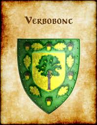
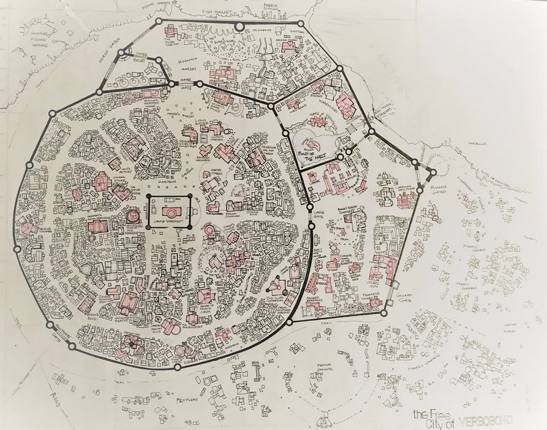

# Verbobonc

| Português                                                                                                                                                                                                                                                                                              | English                                                                                                                                                                                                                                                                                                                   |
| ------------------------------------------------------------------------------------------------------------------------------------------------------------------------------------------------------------------------------------------------------------------------------------------------------ | ------------------------------------------------------------------------------------------------------------------------------------------------------------------------------------------------------------------------------------------------------------------------------------------------------------------------- |
| **📠Localização** - Confluência dos rios **Velverdyva** e **Imeryds Run** - Fronteira da **Floresta Gnarley** e das **Colinas Kron** - **Região:** Viconde de Verbobonc (vassalo de Veluna) - **Mapa:** Sudoeste de Dyvers, noroeste das Colinas Kron, na orla da floresta                | **📠Location** - At the confluence of the **Velverdyva River** and **Imeryds Run** - Bordering the **Gnarley Forest** and **Kron Hills** - **Region:** Viscounty of Verbobonc (vassal to Veluna) - **Map Reference:** Southwest of Dyvers, northwest of the Kron Hills, at the forest's edge                 |
| **🏙️ Descrição** - Cidade fortificada à beira-rio - Equilibra ordem Velunana, autonomia rural e vigilância arcana - Centro de tradição heroica e resistência ao Templo do Mal Elemental - Política entre Veluna, Furyondy e Greyhawk - Leis firmes, história recente e povo resiliente | **🏙️ Description** - Fortified riverside city - Balances Velunan order, rural autonomy, and arcane vigilance - Hub of heroic tradition and resistance against the Temple of Elemental Evil - Political interplay between Veluna, Furyondy, and Greyhawk - Firm laws, recent history, and resilient people |
| **🌦️ Clima** - Tipo: Fluvial temperado - Verões chuvosos e amenos - Invernos frios com neve moderada - Primaveras com inundações e rituais - Umidade constante da floresta próxima - Céu limpo com aves druidas                                                                     | **🌦️ Climate** - Type: Temperate Riverine - Mild summers with heavy rains - Cold winters, snowfall common - Spring floods and ceremonial renewals - Persistent forest humidity - Clean skies with druidic birds                                                                                        |
| **👥 População** - ~22.000 habitantes (cidade e arredores) - 60% Humanos (Velunanos, Oeridiano-Flan) - 15% Anões (Colinas Kron) - 10% Elfos e Meio-Elfos (Floresta Gnarley) - 7% Gnomos (subsolo) - 5% Halflings - 3% Outros (planários, aventureiros, feéricos)                  | **👥 Population** - ~22,000 inhabitants (city and surroundings) - 60% Human (Velunan, Oeridian-Flan mix) - 15% Dwarf (Kron Hills) - 10% Elf & Half-Elf (Gnarley Forest) - 7% Gnome (underground) - 5% Halfling - 3% Other (planetouched, adventurers, fae-blooded)                                   |
| **🏛️ Estrutura Social** - Estrutura semi-feudal - Mérito heroico valorizado - Altos: Visconde, nobres, arquimagos, clérigos - Médios: Artesãos, clérigos, aventureiros aposentados - Baixos: Agricultores, mineradores, aprendizes - Druidas: Respeitados, sem terras               | **🏛️ Social Structure** - Semi-feudal system - Heroic merit prized - Upper: Viscount, nobles, archmages, clergy - Middle: Guilds, clergy, retired adventurers - Lower: Farmers, miners, apprentices - Druids: Respected, landless                                                                      |
| **⚖️ Governo** - Viconde hereditário + conselho - Governante: Visconde Wilfrick - Conselho: Clérigos, mestres, druida - Patrulha: Guarda, Ordem do Coração, aventureiros - Justiça: Orais públicas e juramentos rituais                                                                 | **⚖️ Government** - Hereditary Viscount + council - Ruler: Viscount Wilfrick - Council: Clerics, guildmasters, druid - Enforcement: Watch, Order of the Hart, adventurers - Justice: Public oaths and trials                                                                                               |
