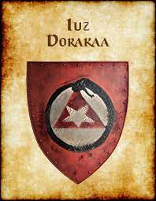
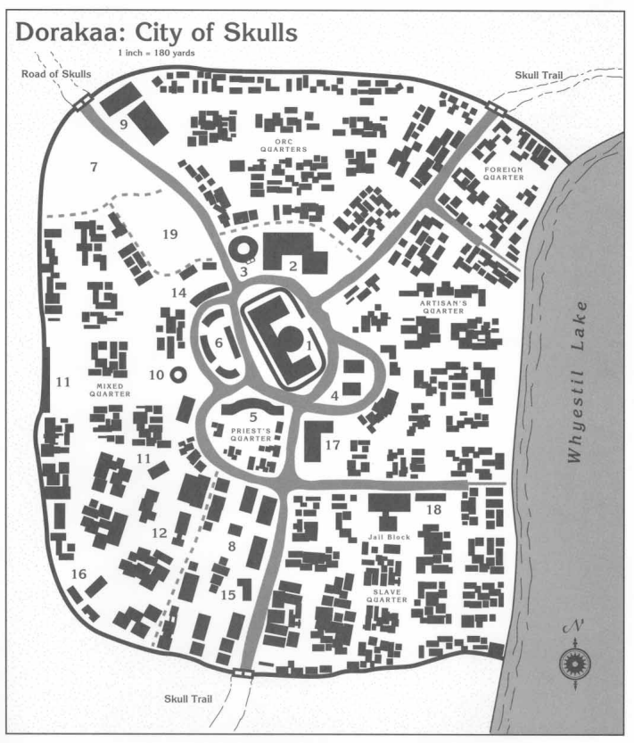

# Dorakaa  "A Cidade das Caveiras" | "The City of Skulls"

*

*

| **Português (PT-PT)** | **English (EN-US)** |
| --- | --- |
| ** Localização:**  - Região: Império de Iuz  - Posição: Extremo noroeste da Flanaess, próximo das Colinas Uivantes  - Margem ocidental do Rio Veng  - Referência no mapa: Norte do Lago Whyestil, oeste dos Desfiladeiros do Rift | ** Location:**  - Region: Empire of Iuz  - Position: Far northwestern Flanaess, near the Howling Hills  - Western banks of the Veng River  - Map Reference: North of Whyestil Lake, west of the Rift Barrens |
| ** Descrição:**  - Cidade erguida no ódio, governada pelo medo e mergulhada em sangue  - Transformada por Iuz de um posto fronteiriço numa capital infernal  - Máquinas infernais, necromantes, demónios e tirania absoluta  - Coração de uma teocracia e trono da tirania | ** Description:**  - City raised in hate, ruled by fear, steeped in blood  - Once a frontier settlement, reshaped by Iuz into a nightmarish capital  - Infernal engines, necromancers, devils, and absolute tyranny  - Heart of a theocracy and seat of tyranny |
| ** Clima:**  - Tipo: Continental subártico  - Invernos severos (>6 meses)  - Verões frescos e tempestuosos, sempre nublados  - Atmosfera: Névoas densas e ventos acres das Colinas Uivantes  - Visibilidade: Má, escurecida por fuligem e medo | ** Climate:**  - Type: Subarctic continental  - Harsh winters (>6 months)  - Cool, stormy summers under constant cloud cover  - Atmosphere: Thick mists, acrid winds from the Howling Hills  - Visibility: Poor, darkened by soot and dread |
| ** População:**  - ~26.000 (cidade), mais em campos militares e necrópoles  - 48% Humanos (corrompidos ou escravizados)  - 20% Orcs e Meio-Orcs  - 10% Goblinoides (Hobgoblins, Goblins)  - 8% Mortos-vivos  - 5% Fiendish (demónios, yugoloths, diabos)  - 5% Outros (Tieflings, cambions, aasimar caídos, elfos ou anões capturados)  - 4% Criaturas construídas ou mágicas | ** Population:**  - ~26,000 (city proper), more in military camps and necropoli  - 48% Human (corrupted or enslaved)  - 20% Orc & Half-Orc  - 10% Goblinoid (Hobgoblins, Goblins)  - 8% Undead  - 5% Fiendish (demons, yugoloths, devils)  - 5% Other (Tieflings, cambions, fallen aasimar, captured elves or dwarves)  - 4% Constructed or magically created |
| ** Estrutura Social:**  - **Overclasse:** Iuz, emissários demoníacos, sumo sacerdotes, cavaleiros da morte  - **Executores:** Clérigos de túnica negra, magos Boneheart, fiends de elite  - **Camada Média:** Senhores da guerra, torturadores, administradores  - **Classe Subjugada:** Camponeses, escravos, conscritos, mortos-vivos vinculados, mercadores vigiados  - **Submundo:** Cultos secretos, rebeldes, necromantes renegados, tieflings proscritos | ** Social Structure:**  - **Overclass:** Iuz, demonic emissaries, high priests, death knights  - **Enforcers:** Black-robed clergy, Boneheart mages, elite fiends  - **Middle Tier:** Warlords, torturers, administrators  - **Subjugated Class:** Peasants, slaves, conscripts, bound undead, merchants under watch  - **Undercity:** Secret cults, rebels, rogue necromancers, outcast tieflings |
| ** Governo:**  - Sistema: Teocracia tirânica sob Iuz  - Governante: _Iuz, o Velho_  - Proxies: Greater Boneheart  - Força: Juízes do Medo, Feiticeiras da Corte Interna, patrulhas demoníacas  - Lei: Arbitrária, cruel e imposta pelo terror | ** Government:**  - System: Theocratic tyranny under Iuz  - Ruler: _Iuz the Old_  - Proxies: Greater Boneheart  - Enforcement: Dread Judges, Hags of the Inner Court, fiendish patrols  - Law: Arbitrary, cruel, enforced by terror |
| ** Locais Notáveis:**  - Palácio do Medo de Iuz  - Portão da Caveira  - Templo Negro  - Mercado Sangrento  - Poços de Ossos  - Salas do Grito  - Cidadela Witchlight  - Sino Rachado  - Bairro da Forca | ** Notable Locations:**  - Dread Palace of Iuz  - Skull Gate  - Black Temple  - Bleeding Market  - Bone Pits  - Screaming Halls  - Witchlight Citadel  - Cracked Bell  - Gallows Ward |
| ** Fações & Poderes:**  - Greater Boneheart  - Lesser Boneheart  - Culto do Pai dos Fiends  - Guardiões do Rito  - Emissários Demoníacos  - Correntes Vermelhas  - Chama Partida | ** Factions & Power Groups:**  - Greater Boneheart  - Lesser Boneheart  - Cult of the Fiendfather  - Ritekeepers  - Fiendish Envoys  - Red Chains  - Broken Flame |
| ** Ganchos & Rumores:**  - Membro do Boneheart desapareceu e os gritos cessaram  - Alguém está a profanar altares para os purificar  - Um prisioneiro levado às Salas do Grito estava a rir  - Portal demoníaco sob o Palácio do Medo vibra com energia  - Novo vendedor do Mercado Sangrento é demasiado limpo | ** Hooks & Rumors:**  - Boneheart member has vanished and the screams stopped  - Someone is defiling sacrificial sites to cleanse them  - Prisoner dragged into the Screaming Halls was laughing  - Demon gate beneath the Dread Palace hums with unearthly resonance  - Bleeding Markets newest vendor is too clean |
| ** Ameaças / Threats:**  - Cultistas da morte, necromantes, cavaleiros fiendish (CR 712)  - Patrulhas: 1d4 orcs, 1 Guarda de Ossos, 1 bruxo de Iuz  - Eventos aleatórios: Desfiles de tortura, horrores soltos, presságios divinos  - Vigia noturna: diabos espinhosos, cães-sombra à caça de almas | ** Threats:**  - Death cultists, necromancers, fiendish knights (CR 712)  - Patrols: 1d4 orcs, 1 Bone Guard, 1 warlock of Iuz  - Random Events: Torture parades, summoned horrors loose, divine omens  - Nightwatch: Spined devils, shadow hounds hunting unmarked souls |

