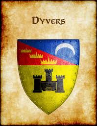
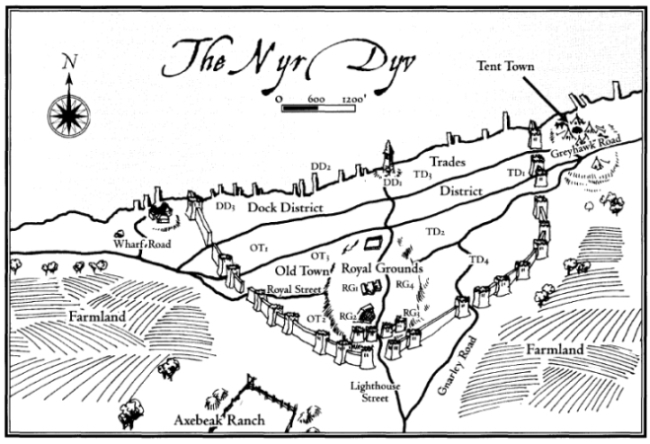

# Dyvers  "Cidade dos Cem Portos" | "City of a Hundred Harbors"
*
*

| **Português (PT-PT)** | **English (EN-US)** |
| --- | --- |
| ** Localização:**  - Região: Vice-Reino de Ferrond (antiga cidade-estado independente)  - Margem ocidental do Nyr Dyv, na foz do Rio Velverdyva  - Referência no mapa: Oeste da Cidade Livre de Greyhawk, costa noroeste do Nyr Dyv | ** Location:**  - Region: Viceroyalty of Ferrond (formerly independent city-state)  - Western shore of Nyr Dyv, near the mouth of the Velverdyva River  - Map Reference: West of the Free City of Greyhawk, along the northwestern shore of Nyr Dyv |
| ** Descrição:**  - Antiga rival de Greyhawk, agora marcada pelo declínio mas com independência teimosa  - Porto mercantil e naval estratégico no Nyr Dyv  - Natureza caótica, governo livre-espírito e mercados vibrantes  - Ruas cheias de cor, tensão e moeda, sempre à beira de um motim | ** Description:**  - Once a proud rival to Greyhawk, now marked by decline yet stubborn independence  - Key mercantile and naval port on the Nyr Dyv  - Chaotic nature, free-spirited governance, vibrant markets  - Streets full of color, tension, and coin, always one misstep from a riot |
| ** Clima:**  - Tipo: Continental temperado  - Primavera/Verão: Quente, húmido, comércio fluvial intenso  - Outono: Nebuloso, com agitação política e contrabando  - Inverno: Nevoso mas navegável  - Ventos: Efeitos de lago trazem tempestades e odores do Nyr Dyv  - Qualidade do ar: Varia entre cheiro a peixe, fumo de forjas e perfumes dos bairros nobres | ** Climate:**  - Type: Temperate continental  - Spring/Summer: Warm, humid, with booming river trade  - Autumn: Foggy, political unrest, smuggling activity  - Winter: Snowy but navigable  - Winds: Lake-effect winds bring storms and stench  - Air Quality: Varies from fishy docks to smoky forges to perfumed noble gardens |
| ** População:**  - ~42.000 (mais 10.000 comerciantes/sailors sazonais)  - 70% Humanos (descendência Oeridiana e Baklunish)  - 10% Halflings (fluviais e contrabandistas)  - 8% Anões (artesãos, cervejeiros, pedreiros)  - 5% Elfos e Meio-Elfos (nobres e eruditos)  - 5% Gnomos (inventores, magos)  - 2% Outros (tieflings, dragonborn, orcs, homens-lagarto do Nyr Dyv) | ** Population:**  - ~42,000 (plus 10,000 seasonal traders/sailors)  - 70% Human (Oeridian and Baklunish descent)  - 10% Halfling (riverfolk, smugglers)  - 8% Dwarf (craftsmen, brewers, masons)  - 5% Elf & Half-Elf (nobles, loremasters)  - 5% Gnome (tinkerers, mages)  - 2% Other (tieflings, dragonborn, orcs, lizardfolk from Nyr Dyv shore tribes) |
| ** Estrutura Social:**  - Sem nobreza formal, mas ouro e influência criam castas  - **Alta:** Comerciantes ricos, construtores navais, chefes do comércio ilícito, famílias antigas  - **Média:** Artesãos de guilda, magos, capitães, ex-aventureiros  - **Baixa:** Estivadores, rebocadores de barcaças, criminosos, marinheiros, criados  - **Oculta:** Cultos, magos exilados, espiões de Greyhawk e Furyondy | ** Social Structure:**  - No formal nobility, but wealth and influence form castes  - **Upper:** Wealthy merchants, shipwrights, illicit trade kings, old money  - **Middle:** Guild artisans, mages, captains, former adventurers  - **Lower:** Dockhands, barge-pullers, criminals, sailors, servants  - **Hidden:** Cults, exiled mages, spy cells from Greyhawk and Furyondy |
| ** Governo:**  - Sistema: República oligárquica com toque de anarquia  - Governante: _Lord Mayor Margus Sandus_ (impopular)  - Corpo governativo: Assembleia de Comerciantes (16 assentos, na maioria simbólicos)  - Forças da lei: Guarda da Cidade (mal paga), seguranças privados, sindicatos criminosos  - Particularidades legais: Suborno esperado, duelos ilegais mas tolerados, magia regulada por nível de ameaça | ** Government:**  - System: Oligarchic republic with a touch of anarchy  - Ruler: _Lord Mayor Margus Sandus_ (unpopular)  - Governing Body: Merchant Assembly (16 mostly symbolic seats)  - Law Enforcement: City Watch (underpaid), private enforcers, criminal syndicates  - Legal Quirks: Bribery expected, dueling technically illegal but tolerated, magic regulated by threat level |
| ** Locais Notáveis:**  - Fórum dos Mercadores  - The Ditch (bairro de lata numa antiga vala seca)  - Sable Row (estalagens, bordéis, antros alquímicos)  - Tarn House (salão do conselho, decadente)  - The Mouth (distrito das docas, tavernas, culto marítimo)  - Red Haven (clube privado e cofre de famílias ricas)  - Brass Cup (ponto neutro para espiões e mercenários)  - Old Gauntlet Fort (torre abandonada, assombrada) | ** Notable Locations:**  - Merchants Forum  - The Ditch (slum in old dry moat)  - Sable Row (inns, brothels, alchemical dens)  - Tarn House (council hall, crumbling)  - The Mouth (dock district, taverns, sea cults)  - Red Haven (private club and vault for richest families)  - Brass Cup (neutral meeting ground for spies, mercs)  - Old Gauntlet Fort (abandoned, haunted) |
| ** Fações & Poderes:**  - Guilda dos Construtores Navais  - Ditch Rats (sindicato de contrabandistas)  - Juramento Carmesim (companhia mercenária com ambições políticas)  - Culto da Estrela Afogada  - Espiões de Greyhawk  - Agentes de Furyondy  - Shiverglass Lodge (magos de contrabando planar) | ** Factions & Power Groups:**  - Sailwrights' Guild  - Ditch Rats (smugglers syndicate)  - Crimson Oath (mercenary company with political aims)  - Cult of the Drowned Star  - Greyhawk Spies  - Furyondian Agents  - Shiverglass Lodge (mages dabbling in planar contraband) |
| ** Ganchos & Rumores:**  - Moedas pré-fundação de Dyvers usadas para subornar Ditch Rats  - Criatura invisível ronda as docas, visível apenas em óleo  - Cofres do Red Haven contêm um pedaço do coração do Nyr Dyv  - Assassinato em Sable Row deixou sigilo em forma de espinha partida  - Tarn House está a afundar-se numa fenda antiga | ** Hooks & Rumors:**  - Coins stamped before Dyvers founding bribe Ditch Rats  - Invisible creature stalks docks, seen only in oil  - Red Haven vault rumored to hold a piece of Nyr Dyvs heart  - Murder in Sable Row left sigil like broken fishbone  - Tarn House sinking into ancient pit |
| ** Ameaças / Threats:**  - Riscos diários: brigas, burlas, envenenamentos, moedas e espelhos amaldiçoados  - Perigos ativos: piratas, assassinos ou mercenários mágicos (CR 58)  - Emboscadas de contrabandistas com runas de teletransporte  - Guardas corruptos com equipamento alquímico ilegal  - Relíquia demoníaca perdida sob o distrito Mouth | ** Threats:**  - Daily risks: brawls, cons, poisonings, cursed coins and mirrors  - Active dangers: pirates, assassins, magical mercenaries (CR 58)  - Smuggler ambushes using teleport runes  - Corrupt guards with illegal alchemical gear  - Rumored demonic relic lost under Mouth district |

