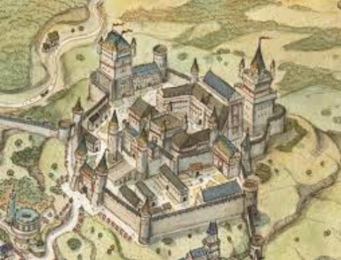

# Cidadela Antiga | Old Citadel

| **Português (PT-PT)**                                                                                                                              | **English (EN-US)**                                                                                                                    |
| -------------------------------------------------------------------------------------------------------------------------------------------------- | -------------------------------------------------------------------------------------------------------------------------------------- |
| **📝 Descrição:**  - Estrutura militar em ruínas no coração da cidade  - Rumores de ser assombrada e conter túneis secretos                  | **📝 Description:**  - Crumbling military structure in the heart of the city  - Rumored to be haunted and to hold secret tunnels |
| **📜 História:**  - Construída como defesa original da cidade  - Abandonada após a expansão para o sul                                       | **📜 History:**  - Built as the city’s original defense  - Abandoned after southward expansion                                   |
| **🏛 Função / Papel:**  - Ponto de encontro para cultos e criminosos  - Atração para exploradores urbanos                                    | **🏛 Role / Function:**  - Meeting place for cults and criminals  - Draw for urban explorers                                     |
| **👤 NPCs Notáveis:**  - “Capitão Sem Nome” — espírito inquieto  - Harlan Vey — historiador obcecado pela cidadela                           | **👤 Notable NPCs:**  - “Nameless Captain” — restless spirit  - Harlan Vey — historian obsessed with the citadel                 |
| **🗝 Ganchos / Rumores:**  - Entrada oculta para a [Cidade Subterrânea](undercity.md)  - Cofre selado intacto encontrado por contrabandistas | **🗝 Hooks / Rumors:**  - Hidden entrance to the [Undercity](undercity.md)  - Sealed vault found intact by smugglers             |

