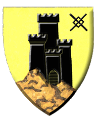

# Irongate "City of Stairs"  
*Irongate — “Cidade das Escadas”*  

{width=150}
  

| Português                                                                                                                                                                                                                                                                                                                                                   | English                                                                                                                                                                                                                                                                                                                                           |
| ----------------------------------------------------------------------------------------------------------------------------------------------------------------------------------------------------------------------------------------------------------------------------------------------------------------------------------------------------------- | ------------------------------------------------------------------------------------------------------------------------------------------------------------------------------------------------------------------------------------------------------------------------------------------------------------------------------------------------- |
| **📠Localização** - Península costeira oriental do **Mar de Rel Astra** - Entre os **Montes Hollow Highlands** e o **Mar Azure** - **Região:** Liga de Ferro (membro fundador) - **Mapa:** Sudeste de Onnwal, sul de Idee, costa oriental da Flanaess                                                                                         | **📠Location** - Coastal peninsula on the eastern **Rel Astra Sea** - Between the **Hollow Highlands** and the **Azure Sea** - **Region:** Iron League (founding member) - **Map Reference:** Southeast of Onnwal, south of Idee, eastern Flanaess coast                                                                                 |
| **🏙️ Descrição** - Porto fortificado em penhasco - Cidade vertical com inúmeros degraus e terraços - Centro naval e comercial da Liga de Ferro - Tradicionalmente resistente à influência do Grande Reino - Conhecida pela engenharia naval, metalurgia e defesas mágicas                                                                    | **🏙️ Description** - Fortress port on a cliffside - Vertical city with numerous stairways and terraces - Naval and trade hub of the Iron League - Historically resistant to Great Kingdom influence - Known for shipbuilding, metalwork, and magical defenses                                                                       |
| **🌦️ Clima** - Tipo: Marítimo temperado - Invernos suaves, chuvas frequentes - Verões amenos e ventosos - Neblina costeira matinal - Temporais ocasionais no outono                                                                                                                                                                           | **🌦️ Climate** - Type: Temperate maritime - Mild winters, frequent rainfall - Cool, breezy summers - Morning coastal fog - Occasional autumn storms                                                                                                                                                                               |
| **👥 População** - ~28.000 habitantes (cidade e arredores) - 70% Humanos (Oeridianos e Suel) - 12% Anões (ligados à mineração costeira) - 8% Elfos e Meio-Elfos - 5% Halflings - 5% Outros (mercadores estrangeiros, aventureiros, genasi aquáticos)                                                                                         | **👥 Population** - ~28,000 inhabitants (city and surroundings) - 70% Human (Oeridian and Suel) - 12% Dwarf (coastal mining) - 8% Elf & Half-Elf - 5% Halfling - 5% Other (foreign merchants, adventurers, water genasi)                                                                                                           |
| **🏛️ Estrutura Social** - Forte presença mercantil e naval - Altos: Lorde Prefeito, almirantes, mestres das guildas - Médios: Capitães mercantes, artesãos qualificados, oficiais navais - Baixos: Marinheiros, estivadores, pescadores - Magos e artífices possuem prestígio especial                                                       | **🏛️ Social Structure** - Strong mercantile and naval presence - Upper: Lord Mayor, admirals, guildmasters - Middle: Merchant captains, skilled artisans, naval officers - Lower: Sailors, dockworkers, fishermen - Wizards and artificers hold special prestige                                                                   |
| **⚖️ Governo** - Lorde Prefeito eleito pelo Conselho das Guildas e oficiais da marinha - Conselho composto por líderes de guildas, almirantes e representantes religiosos - Defesa garantida pela Marinha de Irongate e muralhas mágicas - Justiça marítima rigorosa, com leis severas para pirataria e sabotagem naval                         | **⚖️ Government** - Lord Mayor elected by the Guild Council and naval officers - Council includes guild leaders, admirals, and religious representatives - Defense maintained by Irongate Navy and magical fortifications - Strict maritime law, with severe penalties for piracy and naval sabotage                                  |
