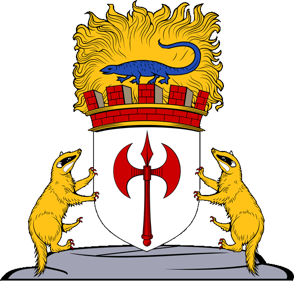

#  Duchy of Ulek "The Elven Duchy"
*Duchado de Ulek "o Ducado Elvo"*
{width=150}

| **Português (PT-PT)** | **English (EN-US)** |
|----------------------|---------------------|
| ** Descrição:**  - Estado feudal independente, governado por elfos :contentReference[oaicite:24]{index=24}  - Harmonia racial entre elfos, meio-elfos e humanos :contentReference[oaicite:25]{index=25} | ** Description:**  - Independent feudal state ruled by elves :contentReference[oaicite:26]{index=26}  - Racial harmony among elves, half-elves, and humans :contentReference[oaicite:27]{index=27} |
| ** Geografia & Comércio:**  - Entre os rios Kewl e Sheldomar, fronteira com Marcha Grande :contentReference[oaicite:28]{index=28}  - Comércio próspero com Veluna, Celene, Kron Hills e Keoland :contentReference[oaicite:29]{index=29} | ** Geography & Trade:**  - Lies between Kewl and Sheldomar Rivers, borders the Gran March :contentReference[oaicite:30]{index=30}  - Flourishing trade with Veluna, Celene, Kron Hills, and Keoland :contentReference[oaicite:31]{index=31} |
| ** Governo & Sociedade:**  - Monarquia feudal hereditária, casas nobres élficas dominantes :contentReference[oaicite:32]{index=32}  - Clãs mercantes meio-élficos respeitados pela sua integridade :contentReference[oaicite:33]{index=33} | ** Government & Society:**  - Hereditary feudal monarchy with elven noble houses :contentReference[oaicite:34]{index=34}  - Half-elven merchant clans known for their honesty and resourcefulness :contentReference[oaicite:35]{index=35} |
| ** Militar & Defesa:**  - Forças equilibradas entre cavalaria, infantaria e arqueiros élficos :contentReference[oaicite:36]{index=36}  - Apoio à causa do Principado de Ulek contra Pomarj :contentReference[oaicite:37]{index=37} | ** Military & Defense:**  - Balanced army: cavalry, infantry, elven archers :contentReference[oaicite:38]{index=38}  - Supports Principality of Uleks efforts against Pomarj :contentReference[oaicite:39]{index=39} |
| ** População & Cultura:**  - População de cerca de 392.200  - Diversidade: Human 43%, Half-elf 32%, Elf 19%, Gnome 3%, Halfling 2% :contentReference[oaicite:40]{index=40}  - Religiões incluem panteões élficos e deadora de natureza :contentReference[oaicite:41]{index=41} | ** Population & Culture:**  - Population around 392,200  - Diverse: Human 43%, Half-elf 32%, Elf 19%, Gnome 3%, Halfling 2% :contentReference[oaicite:42]{index=42}  - Religious observance includes elven and nature pantheons :contentReference[oaicite:43]{index=43} |
| ** História & Política:**  - Antigo domínio sujeito a Keoland, conquistou autonomia após rebelião :contentReference[oaicite:44]{index=44}  - Participou das Guerras Odiosas e da defesa contra Iuz sob o Tratado de Niole Dra :contentReference[oaicite:45]{index=45} | ** History & Politics:**  - Former Keoish subject, gained autonomy after rebellion :contentReference[oaicite:46]{index=46}  - Took part in the Hateful Wars and defense against Iuz under Treaty of Niole Dra :contentReference[oaicite:47]{index=47} |

