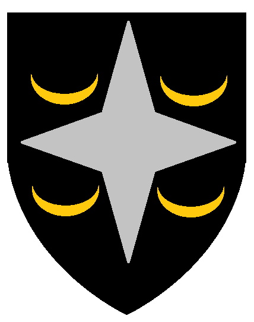

# Veluna "The Archclericy of Veluna"
*Veluna  O Arceclericato de Veluna*
{width=150}

| **Português (PT-PT)** | **English (EN-US)** |
|------------------------|----------------------|
| ** Descrição:**  - Arqueclericado teocrático dedicado ao culto de Rao :contentReference[oaicite:2]{index=2}  - Um bastião de paz, razão e fé na Flanaess :contentReference[oaicite:3]{index=3} | ** Description:**  - A theocratic Archclericy dedicated to Rao :contentReference[oaicite:4]{index=4}  - A bastion of peace, reason, and faith in the Flanaess :contentReference[oaicite:5]{index=5} |
| ** Geografia & Comércio:**  - Rota de comércio pela Velverdyva e pela Grande Estrada Ocidental :contentReference[oaicite:6]{index=6}  - Florestas remanescentes: Ironwood, Dapple Wood, Asnath Copse :contentReference[oaicite:7]{index=7}  - Montes minerais: Lorridges e Lortmils :contentReference[oaicite:8]{index=8} | ** Geography & Trade:**  - Trade along the Velverdyva River and the Great Western Road :contentReference[oaicite:9]{index=9}  - Remaining woods: Ironwood, Dapple Wood, and Asnath Copse :contentReference[oaicite:10]{index=10}  - Mineral-rich Lorridges and Lortmils :contentReference[oaicite:11]{index=11} |
| ** Governo & Sociedade:**  - Governado pelo Cânon de Veluna, aconselhado por nobres e pelo Visconde de Verbobonc :contentReference[oaicite:12]{index=12}  - Alianças com Furyondy, Bissel, Highfolk, Verbobonc, Ulek :contentReference[oaicite:13]{index=13} | ** Government & Society:**  - Ruled by the Canon of Veluna, advised by nobles and the Viscount of Verbobonc :contentReference[oaicite:14]{index=14}  - Allied with Furyondy, Bissel, Highfolk, Verbobonc, Ulek :contentReference[oaicite:15]{index=15} |
| ** Militar & Defesa:**  - Exército composto por cavalaria pesada, arqueiros élficos e engenheiros gnomos :contentReference[oaicite:16]{index=16}  - Tolerância e colaboração com razas não-humanas :contentReference[oaicite:17]{index=17} | ** Military & Defense:**  - Army includes heavy cavalry, elven archers, and gnome sappers :contentReference[oaicite:18]{index=18}  - Notable tolerance and cooperation with non-human races :contentReference[oaicite:19]{index=19} |
| ** População & Cultura:**  - Lar de humanos e elfos vivendo em harmonia sob os preceitos de Rao :contentReference[oaicite:20]{index=20}  - Reputação de centro de sabedoria, erudição e peregrinação :contentReference[oaicite:21]{index=21} | ** Population & Culture:**  - Humans and elves living in harmony under Raos principles :contentReference[oaicite:22]{index=22}  - Renowned as a center of wisdom, scholarship, and pilgrimage :contentReference[oaicite:23]{index=23} |

