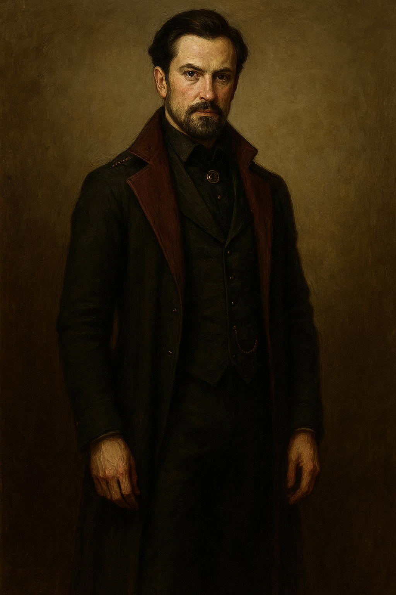

| **Português (PT-PT)**                                                                                                                                                                                                                                                                                                                                                                                                                                                                                                                                                                                                                                                                                                                                                                                                                                                                                                                                                                                                                                                                                                                                                                                                                                                                                                                                                                                                                                                                                                                                                                                                                                                                                                                                                                                                                                                                                                                                                                                                                                                                                                                                                                                                    | **English (EN-US)**                                                                                                                                                                                                                                                                                                                                                                                                                                                                                                                                                                                                                                                                                                                                                                                                                                                                                                                                                                                                                                                                                                                                                                                                                                                                                                                                                                                                                                                                                                                                                                                                                                                                                                                                                                                                                                                                                                                                                                                                                                                                                   |
| ------------------------------------------------------------------------------------------------------------------------------------------------------------------------------------------------------------------------------------------------------------------------------------------------------------------------------------------------------------------------------------------------------------------------------------------------------------------------------------------------------------------------------------------------------------------------------------------------------------------------------------------------------------------------------------------------------------------------------------------------------------------------------------------------------------------------------------------------------------------------------------------------------------------------------------------------------------------------------------------------------------------------------------------------------------------------------------------------------------------------------------------------------------------------------------------------------------------------------------------------------------------------------------------------------------------------------------------------------------------------------------------------------------------------------------------------------------------------------------------------------------------------------------------------------------------------------------------------------------------------------------------------------------------------------------------------------------------------------------------------------------------------------------------------------------------------------------------------------------------------------------------------------------------------------------------------------------------------------------------------------------------------------------------------------------------------------------------------------------------------------------------------------------------------------------------------------------------------ | ----------------------------------------------------------------------------------------------------------------------------------------------------------------------------------------------------------------------------------------------------------------------------------------------------------------------------------------------------------------------------------------------------------------------------------------------------------------------------------------------------------------------------------------------------------------------------------------------------------------------------------------------------------------------------------------------------------------------------------------------------------------------------------------------------------------------------------------------------------------------------------------------------------------------------------------------------------------------------------------------------------------------------------------------------------------------------------------------------------------------------------------------------------------------------------------------------------------------------------------------------------------------------------------------------------------------------------------------------------------------------------------------------------------------------------------------------------------------------------------------------------------------------------------------------------------------------------------------------------------------------------------------------------------------------------------------------------------------------------------------------------------------------------------------------------------------------------------------------------------------------------------------------------------------------------------------------------------------------------------------------------------------------------------------------------------------------------------------------- |
| **Nome:** Lord Aleister Devraine de House Marowind   **Alcunhas:** “O Sigilista Silencioso” (público), “A Víbora de Veludo” (rumor), “O Véu Ressonante” (forma transformada)  **Raça:** Humano → Humano (Alterado pela Ressonância Dracónica)  **Classe:** Warlock (Patrono do Grande Antigo) — Nível 3 / Entidade Lendária (nível equivalente 14)  **Alinhamento:** Neutro Legal (com subtom caótico → cromático na forma transformada)  **Origem:** *Arcano Herdeiro* (Arcane Scion), mistura de antiquário nobre e sigilista; evolui para *Antiquário Proibido*  **Aparência:** Homem de meia-idade com barba bem aparada e cabelo escuro penteado para trás. Traja um casaco comprido de tecido pesado, de lapelas largas e forro borgonha, sobre um colete e camisa negra fechada por alfinete dourado. Mantém postura ereta e olhar penetrante, transmitindo autocontrolo absoluto. Usa correntes e pequenos detalhes que denunciam a sua posição nobre e o seu apreço por subtis símbolos arcanos  **Personalidade:** Polido, eloquente e magnético; fala em meias-verdades, prefere dívidas a ordens, manipula através de sugestões subtis; rival não declarado de Drennar Solace  **Vínculos:** Amigo e aliado de confiança de Lady Silvra  **Motivações:** Reunir e dominar fragmentos da *Gema das Cinco Promessas*; restaurar a influência da Casa Marowind através da ressonância oculta; ultrapassar Drennar Solace  **Habilidades:** Mestre em sigilos, runas e teoria da ressonância; multilingue (Comum, Élfico, Dracónico, e na forma transformada, Fala Profunda)  **Estilo de Combate:** Na forma base, foca-se em controle e magia à distância (Pulso Arcano, Sigilo de Constrição, ilusão); como Véu Ressonante, torna-se uma entidade lendária com resistência mítica, magias de alto nível e ações de covil  **Equipamento Notável:** Bengala lacada (evolui para bengala-lâmina), Robes Glamourosos de Marowind, Cilindro de Safira com profecias codificadas  **Papel na História:** Catalisador narrativo, oferecendo conhecimento, atalhos e acordos de custo simbólico; potencial ameaça caso obtenha poder suficiente para rituais de grande escala | **Name:** Lord Aleister Devraine of House Marowind   **Aliases:** “The Silent Sigilist” (public), “The Velvet Viper” (rumor), “The Resonant Veil” (transformed form)  **Race:** Human → Human (Altered by Draconic Resonance)  **Class:** Warlock (Great Old One Patron) — Level 3 / Legendary Entity (level equivalent 14)  **Alignment:** Lawful Neutral (chaotic undertones → chromatic undertone in transformed state)  **Background:** *Arcane Scion*, a blend of noble antiquarian and sigilist; evolves into *Forbidden Antiquarian*  **Appearance:** Middle-aged man with a neatly trimmed beard and dark hair combed back. Wears a long, heavy coat with wide lapels and deep burgundy lining over a black waistcoat and shirt fastened with a gold pin. Maintains an upright posture and a piercing gaze, exuding total self-control. Subtle chains and fine details hint at his noble standing and fondness for discreet arcane symbols  **Personality:** Polite, eloquent, and magnetic; speaks in layered half-truths, prefers debts over commands, manipulates through subtle suggestion; unspoken rival to Drennar Solace  **Connections:** Trusted friend and ally of Lady Silvra  **Goals:** Gather and master fragments of the *Gem of the Five Promises*; restore House Marowind’s influence via occult resonance; outmaneuver Drennar Solace  **Abilities:** Master of sigils, runes, and resonance theory; multilingual (Common, Elvish, Draconic, and in transformed state, Deep Speech)  **Combat Style:** In base form, focuses on control and ranged magic (Arcane Pulse, Sigil of Binding, illusions); as the Resonant Veil, becomes a legendary entity with mythic resilience, high-level magic, and lair actions  **Notable Equipment:** Lacquered cane (evolves into cane-blade), Glamoured Robes of Marowind, Sapphire Scroll Cylinder with coded prophecies  **Story Role:** Narrative catalyst, offering knowledge, shortcuts, and deals at symbolic cost; potential threat if he amasses enough power for large-scale rituals |

