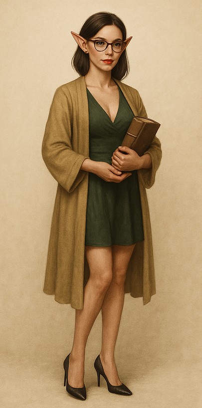

# Mistress Lyra Quil | Alta Curadora Lyra Quil

| **Português (PT-PT)**                                                                                                                                                                                                                                                                                                                                                                                                                                                                                                                                                                                                                                          | **English (EN-US)**                                                                                                                                                                                                                                                                                                                                                                                                                                                                                                                                                                                                                        |
| -------------------------------------------------------------------------------------------------------------------------------------------------------------------------------------------------------------------------------------------------------------------------------------------------------------------------------------------------------------------------------------------------------------------------------------------------------------------------------------------------------------------------------------------------------------------------------------------------------------------------------------------------------------- | ------------------------------------------------------------------------------------------------------------------------------------------------------------------------------------------------------------------------------------------------------------------------------------------------------------------------------------------------------------------------------------------------------------------------------------------------------------------------------------------------------------------------------------------------------------------------------------------------------------------------------------------ |
| **📍 Localização:**  - [Grande Biblioteca](great_library.md), Cidade Livre de Greyhawk                                                                                                                                                                                                                                                                                                                                                                                                                                                                                                                                                                      | **📍 Location:**  - [Great Library](great_library.md), Free City of Greyhawk                                                                                                                                                                                                                                                                                                                                                                                                                                                                                                                                                            |
| **🏛 Papel / Função:**  - Alta Curadora da Grande Biblioteca  - Guardiã dos registos e coleções raras                                                                                                                                                                                                                                                                                                                                                                                                                                                                                                                                                    | **🏛 Role / Function:**  - High Curator of the Great Library  - Guardian of records and rare collections                                                                                                                                                                                                                                                                                                                                                                                                                                                                                                                             |
| **🧬 Raça:**  - Elf                 | **🧬 Race:**  - Elf                                                                                                                                                                                                                                                                                                                                                                                                                                                                                                                                                                                                                   |
| **⚔ Classe:**  - Maga (Sábia)                                                                                                                                                                                                                                                                                                                                                                                                                                                                                                                                                                                                                               | **⚔ Class:**  - Wizard (Sage)                                                                                                                                                                                                                                                                                                                                                                                                                                                                                                                                                                                                           |
| **⚖ Alinhamento:**  - Leal Neutra                                                                                                                                                                                                                                                                                                                                                                                                                                                                                                                                                                                                                           | **⚖ Alignment:**  - Lawful Neutral                                                                                                                                                                                                                                                                                                                                                                                                                                                                                                                                                                                                      |
| **📝 Descrição:**  - Meticulosa e perspicaz, exerce autoridade silenciosa através da precisão das palavras  - Usa túnicas de borgonha com runas prateadas que brilham quando está desagradada  - Dedos manchados de tinta revelam o seu trabalho constante de transcrição  - Porta sempre uma vara de catalogação, que também serve como foco de conjuração  - Protetora feroz dos registos, não gosta de interrupções de aventureiros sem propósito claro  - Chave para mistérios antigos, se abordada com respeito e disciplina académica  - Relação cordial mas distante com o Templo de Oghma; rivalidade notória com a Irmã Blathine | **📝 Description:**  - Meticulous and sharp-minded, exerts quiet authority through precision of speech  - Wears burgundy robes with silver runes that glow faintly when displeased  - Ink-stained fingers reveal her constant transcription work  - Always carries a cataloguing wand that doubles as a spellcasting focus  - Fiercely protective of records, dislikes interruptions from adventurers without clear intent  - Key to unlocking ancient mysteries if approached with respect and scholarly discipline  - Cordial but distant relationship with the Temple of Oghma; noted rivalry with Sister Blathine |
| **❤️ Ligações Pessoais:**  - Vista a flertar com Eldric Silvanus, sob pretexto de lhe ensinar Infernal                                                                                                                                                                                                                                                                                                                                                                                                                                                                                                                                                      | **❤️ Personal Connections:**  - Seen flirting with Eldric Silvanus under the pretext of teaching him Infernal                                                                                                                                                                                                                                                                                                                                                                                                                                                                                                                           |
| **🗝 Ganchos / Notas:**  - Pode oferecer vantagens de investigação a quem trouxer textos raros  - Pode identificar inscrições mágicas por um preço  - Guarda segredos na ala leste selada da biblioteca — acesso apenas por finesse burocrática ou chantagem                                                                                                                                                                                                                                                                                                                                                                                          | **🗝 Hooks / Notes:**  - May offer research advantages to parties bringing rare texts  - Can identify magical inscriptions for a fee  - Holds secrets in the sealed eastern wing of the library — access only through bureaucratic finesse or blackmail                                                                                                                                                                                                                                                                                                                                                                           |

