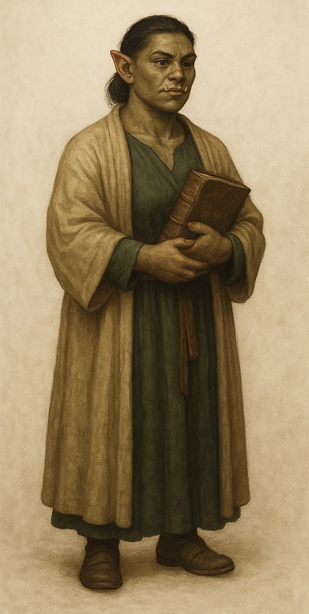

# Sister Blathine – Oghman Archivist

**Location:** [Templo de Oghma](templo_de_oghma.md), [Free City of Greyhawk](mapa_da_cidade_de_greyhawk.md)  
**Role:** Archive Mistress, Clerical Records Division  
**Race:** Half-Orc  
**Class:** Cleric (Oghma), Archivist

---

## Description

Sister Blathine is the stern and quietly formidable half-orc who manages the vast clerical archives of Oghma’s temple. Her heavy brow, quick eyes, and ever-present chain shirt beneath her robe mark her as both scholar and guardian. She is never seen without a large book clutched to her chest—a ledger, a treatise, or a registry of secrets—and is renowned for correcting even high priests if they misquote the archives.

Despite her orcish ancestry, Blathine’s discipline and passion for the written word are legendary. She speaks in clipped, precise sentences, occasionally allowing a trace of dry humor to slip through when dealing with the inept or ill-prepared. Many an apprentice has learned to fear her gaze more than any lecture.

---

## Duties

- Maintains and wards the archive’s most precious records: city histories, legal texts, spell registries, and private correspondences of Oghma’s clergy.
- Handles all requests for access to restricted tomes, always demanding proper paperwork or good reason.
- Ensures that magical wards (and mundane locks) are checked daily—after an infamous incident involving a runaway animated scroll.
- Acts as the temple’s “living index,” recalling the location of almost any volume or secret stored in the library.

---

## Hooks & Rumors

- **Need a Lead?** Blathine can direct the party to lost legal records, ancient prophecies, or forbidden texts—but expects payment in rare information or written accounts.
- **Rival Archivists:** She is on polite but competitive terms with Archivist Pell, occasionally exchanging biting correspondence or clever riddles.
- **Secret Fears:** Whispers claim she dreads the day city politics demand she censor or alter the archives—a fate worse than exile, in her mind.
- **Ghostly Connections:** Some say she once banished a restless spirit from the library with nothing but a stern lecture and a blessed seal.

---

## Notable Quotes

> “If you want to know what happened, read the minutes. If you want to know why it happened, ask the priests. If you want to know the truth, ask me—after I’ve had my tea.”

> “No, you may not take the ledger from this room. Yes, even if you’re a wizard. Especially if you’re a wizard.”

---

## Appearance

A broad-shouldered half-orc in sensible, ink-stained robes, with a battered chain shirt barely hidden beneath. She wears her hair in a severe bun, carries a staff (or ledger), and has a gaze as sharp as any sword. The faint scent of parchment and sealing wax clings to her wherever she goes.

---

## Token & Portrait

*See reference image: Half-orc female archivist, standing with a heavy book and chain shirt under robes, olive-green skin, pointed ears, and stern demeanor.*

---

**DM Notes:**  
Sister Blathine is the gatekeeper of knowledge, the living backbone of the Oghman archive. She can provide lore, access, or even clerical magic to those who earn her trust—or a sharp rebuke to those who waste her time.
